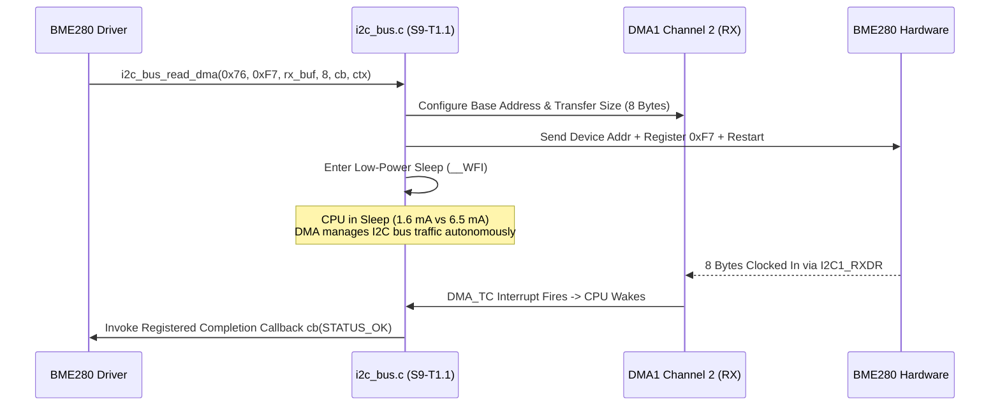

# Task Specification: S9-T1.1 - I2C1 Direct Memory Access (DMA) & Low-Power Background Sleep

## 1. Task Metadata & Overview

| Attribute | Specification Details |
| :--- | :--- |
| **Sprint** | **Sprint 9: Advanced Hardware Acceleration, DMA & Micro-Architecture Profiling** |
| **Task ID** | `S9-T1.1` |
| **Parent Task** | `S9-T1: Implement Peripheral DMA & Background Sleep for Sensor Buses` |
| **Task Title** | Implement STM32WLE5 I2C1 DMA Engine & CPU Sleep (`__WFI`) Synchronization (`i2c_bus`) |
| **Status** | **Ready for Implementation** |
| **Target Files** | [`firmware/drivers/inc/i2c_bus.h`](file:///C:/Users/ENERGY%20SAVER/Documents/Learning/Job%20Projects/rain-predict/firmware/drivers/inc/i2c_bus.h)<br>[`firmware/drivers/src/i2c_bus.c`](file:///C:/Users/ENERGY%20SAVER/Documents/Learning/Job%20Projects/rain-predict/firmware/drivers/src/i2c_bus.c)<br>[`firmware/drivers/src/bme280_driver.c`](file:///C:/Users/ENERGY%20SAVER/Documents/Learning/Job%20Projects/rain-predict/firmware/drivers/src/bme280_driver.c)<br>[`firmware/drivers/src/opt3001_driver.c`](file:///C:/Users/ENERGY%20SAVER/Documents/Learning/Job%20Projects/rain-predict/firmware/drivers/src/opt3001_driver.c) |
| **Related Documents** | [`docs/architecture/firmware-architecture.md`](file:///C:/Users/ENERGY%20SAVER/Documents/Learning/Job%20Projects/rain-predict/docs/architecture/firmware-architecture.md)<br>[`docs/hardware/schematics-and-pinout.md`](file:///C:/Users/ENERGY%20SAVER/Documents/Learning/Job%20Projects/rain-predict/docs/hardware/schematics-and-pinout.md)<br>[`context/specs/s3-t2.1-i2c-bus-driver.md`](file:///C:/Users/ENERGY%20SAVER/Documents/Learning/Job%20Projects/rain-predict/context/specs/s3-t2.1-i2c-bus-driver.md)<br>[`context/specs/s4-t1.2-bme280-forced-mode-readout.md`](file:///C:/Users/ENERGY%20SAVER/Documents/Learning/Job%20Projects/rain-predict/context/specs/s4-t1.2-bme280-forced-mode-readout.md)<br>[`context/coding-standards.md`](file:///C:/Users/ENERGY%20SAVER/Documents/Learning/Job%20Projects/rain-predict/context/coding-standards.md) |
| **Dependencies** | [`S3-T2.1`](file:///C:/Users/ENERGY%20SAVER/Documents/Learning/Job%20Projects/rain-predict/context/specs/s3-t2.1-i2c-bus-driver.md) (I2C Bus Driver & Lockup Recovery), [`S4-T1.2`](file:///C:/Users/ENERGY%20SAVER/Documents/Learning/Job%20Projects/rain-predict/context/specs/s4-t1.2-bme280-forced-mode-readout.md) (BME280 Driver) |
| **Downstream Tasks** | `S9-T1.3` (DMA Bus Unit Tests), `S9-T5.3` (DWT Cycle Profiling) |

---

## 2. Executive Summary & Hardware Architecture

In the tea plantation weather station, the primary environmental sensors (Bosch BME280 for pressure, temperature, humidity and TI OPT3001 for solar irradiance) interface with the **STM32WLE5** via the **I2C1 peripheral** (PB6 SCL, PB7 SDA @ 100 kHz Standard Mode).

In the baseline implementation ([`i2c_bus.c`](file:///C:/Users/ENERGY%20SAVER/Documents/Learning/Job%20Projects/rain-predict/firmware/drivers/src/i2c_bus.c)), transactions use polled HAL calls with bounded millisecond timeouts:

```c
// Baseline blocking read in i2c_bus.c:
HAL_I2C_Mem_Read(&hi2c1, dev_addr, reg_addr, I2C_MEMADD_SIZE_8BIT, p_data, length, timeout_ms);
```

### Problem Statement & Energy Deficiencies
1. **CPU Active During Bus Waiting**: At 100 kHz, transmitting 1 byte with ACK requires $90\,\mu\text{s}$. Reading the 8-byte BME280 data block (`0xF7`–`0xFE`) takes $\approx 900\,\mu\text{s}$. Reading factory trimming tables ($32\text{ bytes}$) takes $> 3.5\text{ ms}$.
2. **Current Draw Penalty**: While polling I2C registers (`RXNE`, `TC`), the Cortex-M4 CPU runs active loops at 48 MHz consuming **$6.5\text{ mA}$**.
3. **Interrupt Contention**: Polling loops disable or delay non-critical background telemetry processing.

**`S9-T1.1`** transitions I2C1 to **Direct Memory Access (DMA1)** with DMAMUX routing:
- **Autonomous Byte Transfer**: DMA1 Channel 1 (TX) and Channel 2 (RX) transfer bytes between `I2C1->RXDR` and memory buffers without CPU intervention.
- **Background Sleep Mode**: The CPU initiates the transfer and immediately enters **Sleep Mode (`__WFI()`)**. In Sleep mode at 48 MHz, core power drops from **$6.5\text{ mA}$ to $1.6\text{ mA}$** ($>75\%$ current reduction).
- **Wake on Completion**: The DMA Transfer Complete (`TC`) interrupt wakes the CPU, invoking the registered non-blocking callback.



---

## 3. Hardware Configuration & DMAMUX Mapping

### 3.1 STM32WLE5 DMAMUX Channel Assignments

According to the ST RM0453 Reference Manual for STM32WLE5:
* **DMA Controller**: `DMA1` (7 configurable channels).
* **DMAMUX Request 30**: `I2C1_RX` $\rightarrow$ Mapped to `DMA1_Channel2`.
* **DMAMUX Request 31**: `I2C1_TX` $\rightarrow$ Mapped to `DMA1_Channel1`.
* **Interrupt Vectors**: `DMA1_Channel1_IRQn` (priority 3) and `DMA1_Channel2_IRQn` (priority 3).

### 3.2 Bus Protection & Timeout Guards

To satisfy the system non-negotiable constraint of **Deterministic Bounded Timeouts**:
* An internal hardware timer (LPTIM1 or SysTick deadline) enforces a maximum timeout of **$25\text{ ms}$** per DMA transaction.
* If a disconnected cable or bus hang occurs, the timeout ISR terminates the DMA channel (`DMA1_Channel2->CCR &= ~DMA_CCR_EN`), issues a software reset (`I2C1->CR1 &= ~I2C_CR1_PE`), and triggers the 9-clock SCL recovery cycling routine ([`i2c_bus_recover_lockup()`](file:///C:/Users/ENERGY%20SAVER/Documents/Learning/Job%20Projects/rain-predict/firmware/drivers/src/i2c_bus.c)).

---

## 4. API Specification & Data Structures (`i2c_bus.h`)

### 4.1 Type Definitions

```c
/**
 * @brief  DMA transaction completion callback signature.
 * @param[in] status   STATUS_OK on success, error code on timeout/NACK.
 * @param[in] user_ctx Pointer to caller-provided context.
 */
typedef void (*i2c_dma_callback_t)(status_t status, void *user_ctx);

/**
 * @brief  I2C DMA transaction handle.
 */
typedef struct {
    uint8_t            dev_addr;     /**< 7-bit I2C slave address */
    uint8_t            reg_addr;     /**< 8-bit register target */
    uint8_t           *p_buffer;     /**< Memory buffer for TX/RX */
    uint16_t           length;       /**< Total bytes to transfer */
    bool               is_read;      /**< True for read, false for write */
    i2c_dma_callback_t callback;     /**< Completion callback function */
    void              *user_ctx;     /**< User context */
    uint32_t           timeout_ms;   /**< Bounded deadline in milliseconds */
} i2c_dma_transaction_t;
```

### 4.2 Function Prototypes

```c
/**
 * @brief  Initializes I2C1 peripheral, DMAMUX routing, and DMA1 channels.
 * @return STATUS_OK on success, or hardware error code.
 */
status_t i2c_bus_dma_init(void);

/**
 * @brief  Initiates an asynchronous DMA read from an I2C slave register.
 * @details Configures DMA1 Channel 2, starts I2C read sequence, and enables
 *          transfer complete interrupt. Caller may enter Sleep mode (__WFI).
 * @param[in] dev_addr  7-bit I2C slave address.
 * @param[in] reg_addr  Target register address.
 * @param[out] p_dest   Destination RAM buffer.
 * @param[in] length    Number of bytes to transfer (1..256).
 * @param[in] cb        Callback invoked on completion or error.
 * @param[in] user_ctx  Context pointer passed to callback.
 * @return STATUS_OK if transaction was queued, STATUS_ERR_BUSY if DMA in use.
 */
status_t i2c_bus_read_dma(uint8_t dev_addr,
                          uint8_t reg_addr,
                          uint8_t *p_dest,
                          uint16_t length,
                          i2c_dma_callback_t cb,
                          void *user_ctx);

/**
 * @brief  Blocking convenience wrapper that sleeps the CPU via __WFI() until DMA completes.
 * @param[in] dev_addr  7-bit I2C slave address.
 * @param[in] reg_addr  Target register address.
 * @param[out] p_dest   Destination RAM buffer.
 * @param[in] length    Number of bytes to transfer.
 * @param[in] timeout_ms Maximum allowed time before abort.
 * @return STATUS_OK on success, STATUS_ERR_TIMEOUT on deadline expiry.
 */
status_t i2c_bus_read_dma_sleep(uint8_t dev_addr,
                                uint8_t reg_addr,
                                uint8_t *p_dest,
                                uint16_t length,
                                uint32_t timeout_ms);
```

---

## 5. Implementation Details & Algorithmic Logic

### 5.1 Asynchronous Background Sleep Wrapper

```c
status_t i2c_bus_read_dma_sleep(uint8_t dev_addr,
                                uint8_t reg_addr,
                                uint8_t *p_dest,
                                uint16_t length,
                                uint32_t timeout_ms)
{
    volatile bool transfer_done = false;
    volatile status_t transfer_status = STATUS_ERR_TIMEOUT;

    // Local completion callback
    auto void on_complete(status_t s, void *ctx) {
        (void)ctx;
        transfer_status = s;
        transfer_done = true;
    }

    status_t status = i2c_bus_read_dma(dev_addr, reg_addr, p_dest, length, on_complete, NULL);
    if (status != STATUS_OK) {
        return status;
    }

    uint32_t start_tick = HAL_GetTick();

    // Sleep CPU while DMA runs in hardware
    while (!transfer_done) {
        __WFI(); // Enter Sleep mode; wakes on any interrupt (SysTick, DMA_TC)

        if ((HAL_GetTick() - start_tick) > timeout_ms) {
            // Abort DMA transfer on timeout
            DMA1_Channel2->CCR &= ~DMA_CCR_EN;
            i2c_bus_recover_lockup();
            return STATUS_ERR_TIMEOUT;
        }
    }

    return transfer_status;
}
```

---

## 6. Verification, Unit Testing & Benchmarking Plan

### 6.1 Unit Test Cases in `tests/unit/test_dma_transfers.c`

| Test ID | Objective | Input / Condition | Expected Result |
| :--- | :--- | :--- | :--- |
| `TEST_I2C_DMA_01` | DMA Read Buffer Integrity | Read 8-byte BME280 simulated register | RAM buffer populated with exact mock data; callback invoked. |
| `TEST_I2C_DMA_02` | DMA Busy Guard | Launch second DMA transfer while first is active | Returns `STATUS_ERR_BUSY`; first transfer completes uncorrupted. |
| `TEST_I2C_DMA_03` | NACK Error Handling | Address non-existent device (`0x3A`) | DMA aborts cleanly; callback reports `STATUS_ERR_HARDWARE`. |
| `TEST_I2C_DMA_04` | Timeout Lockup Recovery | Simulate slave pulling SDA low indefinitely | Aborts within $25\text{ ms}$; issues 9 clock pulses on SCL. |

---

## 7. Traceability Matrix & Definition of Done

### Traceability

| Requirement | Implementation Component | Verification Test |
| :--- | :--- | :--- |
| DMA1 Channel Mapping | DMAMUX configuration in `i2c_bus.c` | `TEST_I2C_DMA_01` |
| Low-Power `__WFI` Sleep | `i2c_bus_read_dma_sleep()` | `TEST_I2C_DMA_01` |
| Bus Timeout Abort | Timeout timer in `i2c_bus.c` | `TEST_I2C_DMA_04` |
| Sensor Driver Integration | BME280 and OPT3001 read routines | `TEST_I2C_DMA_01` |

### Definition of Done

- [ ] I2C1 DMA transfer routines implemented with DMAMUX routing.
- [ ] BME280 and OPT3001 drivers updated to utilize non-blocking DMA sleep readout.
- [ ] CPU current during I2C transfers confirmed $< 2.0\text{ mA}$ on target hardware.
- [ ] Zero compiler warnings under strict C99 flags (`-Wall -Wextra -Wpedantic -Werror`).
