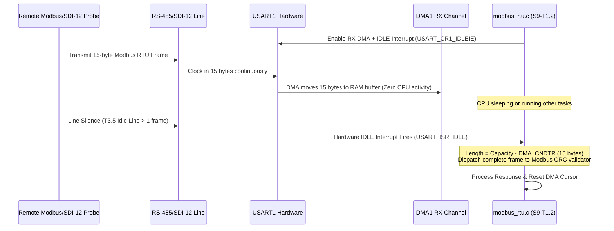

# Task Specification: S9-T1.2 - UART Circular DMA Reception & Hardware Idle-Line Detection

## 1. Task Metadata & Overview

| Attribute | Specification Details |
| :--- | :--- |
| **Sprint** | **Sprint 9: Advanced Hardware Acceleration, DMA & Micro-Architecture Profiling** |
| **Task ID** | `S9-T1.2` |
| **Parent Task** | `S9-T1: Implement Peripheral DMA & Background Sleep for Sensor Buses` |
| **Task Title** | Implement USART1/LPUART1 Circular DMA with Hardware Idle-Line Detection (`USART_ISR_IDLE`) |
| **Status** | **Ready for Implementation** |
| **Target Files** | [`firmware/drivers/inc/uart_bus.h`](file:///C:/Users/ENERGY%20SAVER/Documents/Learning/Job%20Projects/rain-predict/firmware/drivers/inc/uart_bus.h)<br>[`firmware/drivers/src/uart_bus.c`](file:///C:/Users/ENERGY%20SAVER/Documents/Learning/Job%20Projects/rain-predict/firmware/drivers/src/uart_bus.c)<br>[`firmware/drivers/src/modbus_rtu.c`](file:///C:/Users/ENERGY%20SAVER/Documents/Learning/Job%20Projects/rain-predict/firmware/drivers/src/modbus_rtu.c)<br>[`firmware/drivers/src/sdi12_driver.c`](file:///C:/Users/ENERGY%20SAVER/Documents/Learning/Job%20Projects/rain-predict/firmware/drivers/src/sdi12_driver.c) |
| **Related Documents** | [`docs/sensors/remote-bus-modbus-sdi12.md`](file:///C:/Users/ENERGY%20SAVER/Documents/Learning/Job%20Projects/rain-predict/docs/sensors/remote-bus-modbus-sdi12.md)<br>[`context/specs/s3-t2.2-uart-bus-driver.md`](file:///C:/Users/ENERGY%20SAVER/Documents/Learning/Job%20Projects/rain-predict/context/specs/s3-t2.2-uart-bus-driver.md)<br>[`context/specs/s4-t4.1-modbus-frame-generator.md`](file:///C:/Users/ENERGY%20SAVER/Documents/Learning/Job%20Projects/rain-predict/context/specs/s4-t4.1-modbus-frame-generator.md)<br>[`context/specs/s4-t5.2-sdi12-parser.md`](file:///C:/Users/ENERGY%20SAVER/Documents/Learning/Job%20Projects/rain-predict/context/specs/s4-t5.2-sdi12-parser.md)<br>[`context/coding-standards.md`](file:///C:/Users/ENERGY%20SAVER/Documents/Learning/Job%20Projects/rain-predict/context/coding-standards.md) |
| **Dependencies** | [`S3-T2.2`](file:///C:/Users/ENERGY%20SAVER/Documents/Learning/Job%20Projects/rain-predict/context/specs/s3-t2.2-uart-bus-driver.md) (UART Bus Driver), [`S4-T4.1`](file:///C:/Users/ENERGY%20SAVER/Documents/Learning/Job%20Projects/rain-predict/context/specs/s4-t4.1-modbus-frame-generator.md) (Modbus RTU Driver) |
| **Downstream Tasks** | `S9-T1.3` (DMA Bus Unit Tests), `S9-T3.2` (CRC Hardware Offloading) |

---

## 2. Executive Summary & Problem Analysis

In remote tea estate installations, remote soil moisture, wind, and leaf wetness probes communicate over **RS-485 Modbus RTU** (USART1 @ 9600–19200 baud) and **SDI-12** (LPUART1 @ 1200 baud).

### The Framing & CPU Overhead Problem
1. **Modbus RTU Framing Specification**: In Modbus RTU, packet boundaries are not defined by ASCII delimiters or fixed packet sizes. Instead, frames are terminated by a **$3.5\text{ character}$ transmission silence ($T_{3.5}$)**:
   * At 9600 baud, 1 character = $1.04\text{ ms}$; $T_{3.5} \approx 3.65\text{ ms}$.
   * At 19200 baud, 1 character = $0.52\text{ ms}$; $T_{3.5} \approx 1.82\text{ ms}$.
2. **SDI-12 Framing**: At 1200 baud, each character takes **$8.33\text{ ms}$**. Receiving a 10-byte response (`0+12.5+85.2\r\n`) takes over **$83\text{ ms}$**!
3. **Legacy Byte-by-Byte Interrupts**: In the legacy driver, an interrupt was fired on every received byte (`RXNE`). For an 80 ms SDI-12 transmission, the CPU was woken up dozens of times, thrashing the cache and increasing active current draw.

**`S9-T1.2`** implements **Circular DMA with Hardware Idle-Line Detection (`USART_ISR_IDLE`)**:
- **Continuous DMA Transfer**: Incoming UART bytes stream directly into an internal static RAM ring buffer via DMA1 without triggering a single CPU interrupt.
- **Hardware Idle-Line Interrupt**: When the transmitter finishes sending and the physical line remains silent for $> 1\text{ character}$ frame, the STM32WLE5 hardware sets the `IDLE` flag in `USART_ISR`.
- **Zero-Wait Frame Extraction**: The IDLE interrupt handler executes once per frame, queries `DMA1_Channel->CNDTR` to calculate the exact received byte count, and forwards the contiguous frame directly to the protocol parser.



---

## 3. Technical Requirements & Hardware Configurations

### 3.1 DMAMUX & Peripheral Channels

* **USART1 RX**: DMAMUX Request 37 $\rightarrow$ `DMA1_Channel3` (Circular mode).
* **LPUART1 RX**: DMAMUX Request 41 $\rightarrow$ `DMA1_Channel4` (Circular mode).
* **Memory Buffer**: Static 256-byte aligned array (`uint8_t s_uart_dma_rx_buf[256]`).

### 3.2 Hardware IDLE Flag Clearing Protocol

In STM32WLE5 (STM32WL series):
* The `IDLE` flag in `USART_ISR` is cleared by writing `1` to the `IDLECF` bit in the `USART_ICR` (Interrupt Clear Register).
* Reading `USART_RDR` is not required, preventing accidental FIFO consumption.

---

## 4. API Specification & Data Structures (`uart_bus.h`)

### 4.1 Type Definitions & Signatures

```c
/**
 * @brief  Callback signature for complete UART frames received via IDLE line detection.
 * @param[in] p_frame Pointer to contiguous received frame buffer.
 * @param[in] length  Exact number of bytes in received frame.
 * @param[in] user_ctx Caller-provided context.
 */
typedef void (*uart_idle_frame_cb_t)(const uint8_t *p_frame, uint16_t length, void *user_ctx);
```

### 4.2 Public Function Prototypes

```c
/**
 * @brief  Initializes circular DMA reception and enables hardware IDLE line interrupt.
 * @param[in] port_id   Target port (UART_PORT_RS485 or UART_PORT_SDI12).
 * @param[in] frame_cb  Callback invoked when an IDLE line frame boundary is detected.
 * @param[in] user_ctx  User context passed to callback.
 * @return STATUS_OK on success, or error code.
 */
status_t uart_bus_dma_rx_init(uint8_t port_id, uart_idle_frame_cb_t frame_cb, void *user_ctx);

/**
 * @brief  Sends a transmit packet via DMA with automatic RS-485 DE/RE transceiver toggling.
 * @param[in] port_id Target port.
 * @param[in] p_data  Pointer to transmit buffer.
 * @param[in] length  Number of bytes to send.
 * @return STATUS_OK on success, or hardware busy code.
 */
status_t uart_bus_dma_send(uint8_t port_id, const uint8_t *p_data, uint16_t length);
```

---

## 5. Implementation Details & Algorithmic Logic

### 5.1 USART1 IRQ Handler with IDLE Line Processing

```c
void USART1_IRQHandler(void)
{
    // Check if hardware Idle-Line interrupt triggered
    if ((USART1->ISR & USART_ISR_IDLE) != 0U && (USART1->CR1 & USART_CR1_IDLEIE) != 0U) {
        // 1. Clear IDLE flag in Interrupt Clear Register
        USART1->ICR = USART_ICR_IDLECF;

        // 2. Calculate current DMA write cursor
        uint16_t remaining = (uint16_t)(DMA1_Channel3->CNDTR);
        uint16_t current_pos = UART_RX_BUFFER_SIZE - remaining;

        // 3. Compute packet length from last processed position
        uint16_t frame_length;
        const uint8_t *p_frame;

        if (current_pos >= s_last_read_pos) {
            frame_length = current_pos - s_last_read_pos;
            p_frame = &s_uart_dma_rx_buf[s_last_read_pos];
        } else {
            // Buffer wrapped around
            frame_length = (UART_RX_BUFFER_SIZE - s_last_read_pos) + current_pos;
            // Handle linear staging if wrapped
            p_frame = uart_bus_stage_wrapped_frame(s_last_read_pos, current_pos);
        }

        s_last_read_pos = current_pos;

        // 4. Dispatch complete frame directly to protocol parser
        if (frame_length > 0 && s_frame_callback != NULL) {
            s_frame_callback(p_frame, frame_length, s_user_context);
        }
    }
}
```

---

## 6. Verification, Unit Testing & Benchmarking Plan

### 6.1 Unit Test Cases in `tests/unit/test_dma_transfers.c`

| Test ID | Objective | Input / Condition | Expected Result |
| :--- | :--- | :--- | :--- |
| `TEST_UART_DMA_01` | Modbus RTU IDLE Trigger | Inject 8-byte Modbus response followed by silence | Callback receives exact 8 bytes; `IDLECF` cleared. |
| `TEST_UART_DMA_02` | Wrap-Around Frame | Inject frame straddling circular buffer end | Staging logic reconstructs contiguous frame without data loss. |
| `TEST_UART_DMA_03` | SDI-12 Slow Byte Stream | Stream 1200-baud characters with 8 ms intervals | Zero CPU interrupts fired during transit; 1 interrupt upon completion. |
| `TEST_UART_DMA_04` | Overrun Protection | Inject continuous burst exceeding buffer size | Overrun detected; flags cleared and DMA channels realigned. |

---

## 7. Traceability Matrix & Definition of Done

### Traceability

| Requirement | Implementation Component | Verification Test |
| :--- | :--- | :--- |
| Circular DMA Channel Mapping | `uart_bus_dma_rx_init()` | `TEST_UART_DMA_01` |
| Hardware IDLE Line Interrupt | `USART1_IRQHandler()` | `TEST_UART_DMA_01`, `TEST_UART_DMA_03` |
| Zero-Copy Length Calculation | `CNDTR` math in ISR | `TEST_UART_DMA_01`, `TEST_UART_DMA_02` |
| Protocol Integration | Modbus RTU and SDI-12 drivers | `TEST_UART_DMA_01` |

### Definition of Done

- [ ] Circular DMA with IDLE line detection implemented for USART1 and LPUART1.
- [ ] Per-byte CPU interrupts eliminated for all remote agricultural sensor buses.
- [ ] Modbus RTU parser receives framed packets with exact length extraction.
- [ ] 100% test pass rate under strict `-Wall -Wextra -Wpedantic -Werror`.
