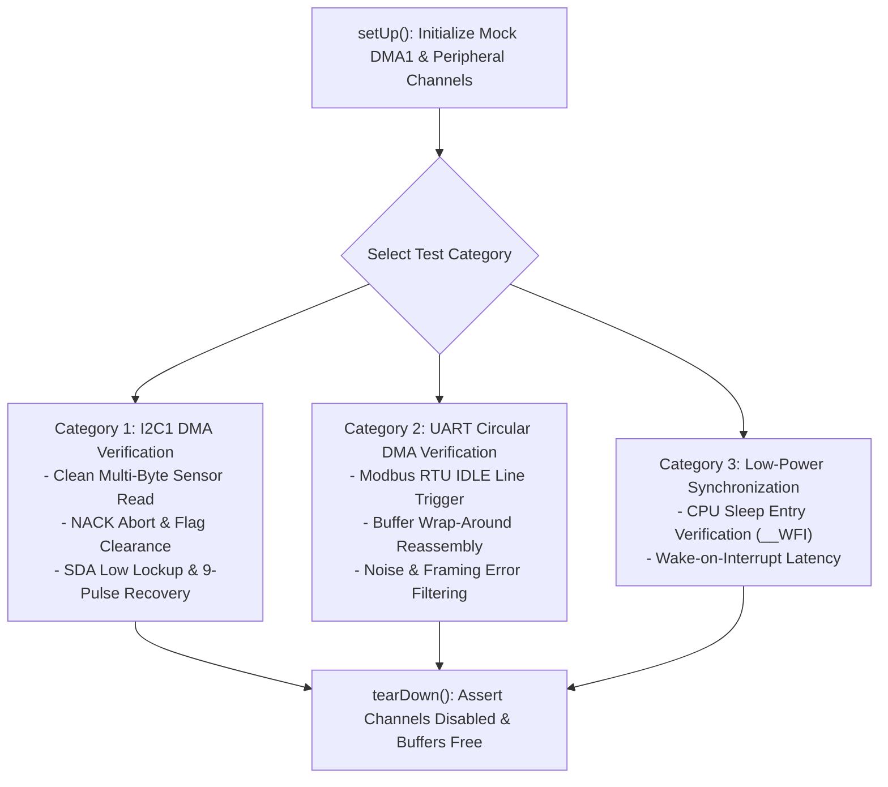

# Task Specification: S9-T1.3 - DMA Sensor Bus Unit & Fault Injection Test Suite

## 1. Task Metadata & Overview

| Attribute | Specification Details |
| :--- | :--- |
| **Sprint** | **Sprint 9: Advanced Hardware Acceleration, DMA & Micro-Architecture Profiling** |
| **Task ID** | `S9-T1.3` |
| **Parent Task** | `S9-T1: Implement Peripheral DMA & Background Sleep for Sensor Buses` |
| **Task Title** | Develop Comprehensive Unit & Fault Injection Test Suite for Sensor DMA Engines |
| **Status** | **Ready for Implementation** |
| **Target Files** | [`tests/unit/test_dma_transfers.c`](file:///C:/Users/ENERGY%20SAVER/Documents/Learning/Job%20Projects/rain-predict/tests/unit/test_dma_transfers.c)<br>[`firmware/drivers/inc/i2c_bus.h`](file:///C:/Users/ENERGY%20SAVER/Documents/Learning/Job%20Projects/rain-predict/firmware/drivers/inc/i2c_bus.h)<br>[`firmware/drivers/inc/uart_bus.h`](file:///C:/Users/ENERGY%20SAVER/Documents/Learning/Job%20Projects/rain-predict/firmware/drivers/inc/uart_bus.h) |
| **Related Documents** | [`context/specs/s9-t1.1-i2c-dma-transfer.md`](file:///C:/Users/ENERGY%20SAVER/Documents/Learning/Job%20Projects/rain-predict/context/specs/s9-t1.1-i2c-dma-transfer.md)<br>[`context/specs/s9-t1.2-uart-dma-idle-line.md`](file:///C:/Users/ENERGY%20SAVER/Documents/Learning/Job%20Projects/rain-predict/context/specs/s9-t1.2-uart-dma-idle-line.md)<br>[`context/specs/s3-t2.1-i2c-bus-driver.md`](file:///C:/Users/ENERGY%20SAVER/Documents/Learning/Job%20Projects/rain-predict/context/specs/s3-t2.1-i2c-bus-driver.md)<br>[`context/coding-standards.md`](file:///C:/Users/ENERGY%20SAVER/Documents/Learning/Job%20Projects/rain-predict/context/coding-standards.md) |
| **Dependencies** | [`S9-T1.1`](file:///C:/Users/ENERGY%20SAVER/Documents/Learning/Job%20Projects/rain-predict/context/specs/s9-t1.1-i2c-dma-transfer.md), [`S9-T1.2`](file:///C:/Users/ENERGY%20SAVER/Documents/Learning/Job%20Projects/rain-predict/context/specs/s9-t1.2-uart-dma-idle-line.md) |
| **Downstream Tasks** | `S9-T5.3` (DWT Cycle Profiling), Sprint 9 Closeout |

---

## 2. Executive Summary & Testing Objectives

The transition from polled register checking to asynchronous DMA transfers introduces hardware race conditions, buffer synchronization hazards, and peripheral lockup modes that must be proven resilient under simulated faults.

**`S9-T1.3`** establishes a comprehensive Unity unit and mock test suite in [`tests/unit/test_dma_transfers.c`](file:///C:/Users/ENERGY%20SAVER/Documents/Learning/Job%20Projects/rain-predict/tests/unit/test_dma_transfers.c) to verify:
1. **DMA Buffer Coherency**: Data clocked into memory by DMA matches physical sensor registers bit-for-bit.
2. **Deterministic Timeouts & Abort**: Simulated hardware hangs (e.g. disconnected sensor holding SDA low, or truncated UART packet without silence) terminate within bounded millisecond deadlines.
3. **Lockup Recovery Integration**: DMA abort sequences cleanly release peripheral locks, trigger I2C 9-pulse SCL clock recovery, and re-arm DMA channels.
4. **Circular Wrap-Around Integrity**: Modbus RTU frames split across the end and start of circular UART buffers are seamlessly reconstructed without byte truncation.



---

## 3. Mock DMA Hardware Harness & Fault Injection (`mock_dma.h`)

```c
/** @brief Sets up mock DMA memory copy simulation */
void mock_dma_inject_transfer(uint8_t channel, const void *p_src, void *p_dst, size_t len);

/** @brief Injects a bus error (TEIF) on next transfer */
void mock_dma_inject_bus_error(uint8_t channel);

/** @brief Simulates I2C slave holding SDA low (lockup) */
void mock_i2c_simulate_slave_hang(bool hang);

/** @brief Simulates UART incoming bytes with configurable inter-character delays */
void mock_uart_feed_stream_with_idle(const uint8_t *p_bytes, size_t len, uint32_t idle_delay_us);
```

---

## 4. Test Case Specifications

### 4.1 I2C DMA Test Cases

#### `test_i2c_dma_read_bme280_data_block(void)`
- **Goal**: Verify 8-byte BME280 measurement block reads cleanly into destination buffer.
- **Procedure**:
  1. Configure mock BME280 registers `0xF7`–`0xFE` with test telemetry bytes.
  2. Call `i2c_bus_read_dma_sleep(0x76, 0xF7, rx_buf, 8, 25);`.
  3. Assert return status is `STATUS_OK`.
  4. Assert `rx_buf` contains identical bytes to mock registers.
  5. Assert DMA channel disabled upon completion.

#### `test_i2c_dma_bus_lockup_and_9pulse_recovery(void)`
- **Goal**: Ensure DMA aborts on timeout and triggers 9-clock pulse recovery.
- **Procedure**:
  1. Call `mock_i2c_simulate_slave_hang(true);`.
  2. Attempt DMA read with 20 ms timeout.
  3. Assert return status is `STATUS_ERR_TIMEOUT`.
  4. Assert 9 clock pulses were driven on PB6 (SCL) to clear slave shift register.
  5. Clear mock hang; verify subsequent DMA read succeeds.

---

### 4.2 UART DMA & Idle-Line Test Cases

#### `test_uart_dma_modbus_frame_detection(void)`
- **Goal**: Verify hardware IDLE line interrupt extracts complete Modbus RTU response.
- **Procedure**:
  1. Initialize UART DMA with callback function.
  2. Feed 7-byte Modbus RTU response followed by $3.5\text{ char}$ silence:
     `{0x01, 0x03, 0x02, 0x01, 0x2C, 0xB9, 0xCD}`.
  3. Assert frame callback fires with exact length $7\text{ bytes}$.
  4. Assert bytes match input frame.

#### `test_uart_dma_circular_buffer_wrap_around(void)`
- **Goal**: Verify correct packet reconstruction across circular buffer boundary.
- **Procedure**:
  1. Advance circular DMA write pointer to `UART_RX_BUFFER_SIZE - 4`.
  2. Feed 8-byte packet (4 bytes before wrap, 4 bytes after wrap).
  3. Trigger IDLE line interrupt.
  4. Assert staging logic reassembles all 8 bytes contiguously.

---

## 5. Traceability Matrix & Definition of Done

### Traceability

| Requirement | Test Function | Target Assertion |
| :--- | :--- | :--- |
| I2C DMA Multi-Byte Read | `test_i2c_dma_read_bme280_data_block` | Bit-identical data transfer |
| I2C Timeout Lockup Recovery | `test_i2c_dma_bus_lockup_and_9pulse_recovery` | 9 SCL pulses fired; channel reset |
| UART IDLE Line Framing | `test_uart_dma_modbus_frame_detection` | Exact frame length extracted |
| Circular Wrap Reassembly | `test_uart_dma_circular_buffer_wrap_around` | Contiguous buffer reassembly |

### Definition of Done

- [ ] All test cases implemented in [`tests/unit/test_dma_transfers.c`](file:///C:/Users/ENERGY%20SAVER/Documents/Learning/Job%20Projects/rain-predict/tests/unit/test_dma_transfers.c).
- [ ] 100% test pass rate on native host build.
- [ ] Zero memory leaks or buffer overflows.
- [ ] Zero compiler warnings under strict flags (`-Wall -Wextra -Wpedantic -Werror`).
