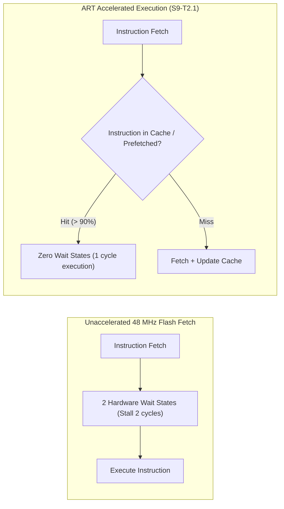

# Task Specification: S9-T2.1 - STM32WLE5 ART Accelerator Instruction Cache & Prefetch Configuration

## 1. Task Metadata & Overview

| Attribute | Specification Details |
| :--- | :--- |
| **Sprint** | **Sprint 9: Advanced Hardware Acceleration, DMA & Micro-Architecture Profiling** |
| **Task ID** | `S9-T2.1` |
| **Parent Task** | `S9-T2: Configure Flash ART Accelerator & SRAM Execution (.ramfunc)` |
| **Task Title** | Configure Flash Access Control Register (`FLASH->ACR`) for 0-Wait-State Equivalent ART Acceleration |
| **Status** | **Ready for Implementation** |
| **Target Files** | [`firmware/core/inc/board_config.h`](file:///C:/Users/ENERGY%20SAVER/Documents/Learning/Job%20Projects/rain-predict/firmware/core/inc/board_config.h)<br>[`firmware/core/src/main.c`](file:///C:/Users/ENERGY%20SAVER/Documents/Learning/Job%20Projects/rain-predict/firmware/core/src/main.c)<br>[`firmware/core/src/system_stm32wlxx.c`](file:///C:/Users/ENERGY%20SAVER/Documents/Learning/Job%20Projects/rain-predict/firmware/core/src/system_stm32wlxx.c) |
| **Related Documents** | [`docs/architecture/firmware-architecture.md`](file:///C:/Users/ENERGY%20SAVER/Documents/Learning/Job%20Projects/rain-predict/docs/architecture/firmware-architecture.md)<br>[`context/specs/s3-t1.2-clock-tree-config.md`](file:///C:/Users/ENERGY%20SAVER/Documents/Learning/Job%20Projects/rain-predict/context/specs/s3-t1.2-clock-tree-config.md)<br>[`context/specs/s8-t5.2-active-duty-cycle-profiling.md`](file:///C:/Users/ENERGY%20SAVER/Documents/Learning/Job%20Projects/rain-predict/context/specs/s8-t5.2-active-duty-cycle-profiling.md)<br>[`context/coding-standards.md`](file:///C:/Users/ENERGY%20SAVER/Documents/Learning/Job%20Projects/rain-predict/context/coding-standards.md) |
| **Dependencies** | [`S3-T1.2`](file:///C:/Users/ENERGY%20SAVER/Documents/Learning/Job%20Projects/rain-predict/context/specs/s3-t1.2-clock-tree-config.md) (Clock Tree & Flash Latency Configuration) |
| **Downstream Tasks** | `S9-T2.2` (RAMFunc Flash Relocation), `S9-T2.3` (RAMFunc Tests), `S9-T5.3` (DWT Profiling) |

---

## 2. Executive Summary & Silicon Architecture

In the **STM32WLE5** SoC, the embedded 256 KB Flash memory operates at a maximum native access speed of approximately $24\text{ MHz}$. When the core CPU operates at **48 MHz** (MSI Range 11, $V_{CORE}$ Range 1), the memory controller requires **2 wait states (`FLASH_ACR_LATENCY_2WS`)**.

Without hardware acceleration:
- Every instruction fetch requires 3 CPU clock cycles ($1\text{ access} + 2\text{ wait states}$).
- Branch instructions, function calls, and loop iterations stall the ARM Cortex-M4 pipeline, reducing throughput from the theoretical 1.25 DMIPS/MHz down to $\approx 0.82\text{ DMIPS/MHz}$.

To eliminate these wait states without lowering core clock frequency, ST provides the **Adaptive Real-Time (ART) Accelerator**:
1. **Instruction Prefetch Buffer (`FLASH_ACR_PRFTEN`)**: Speculatively fetches the sequential 64-bit double-word ahead of the current program counter.
2. **Instruction Cache (`FLASH_ACR_ICEN`)**: A high-speed hardware cache holding 64 lines of 64-bit instructions ($512\text{ bytes}$). Loop execution (e.g. math algorithms, digital filtering) runs directly from the cache with **zero wait states (0 WS)**.

**`S9-T2.1`** implements the proper reset, cache invalidation, and activation sequence for `FLASH->ACR` during system clock initialization.



---

## 3. Register Configuration & Activation Protocol

### 3.1 Hardware Sequence in `FLASH->ACR`

According to RM0453 (Section 3.3.4):
1. **Configure Flash Latency**:
   Write `LATENCY[2:0] = 0b010` (2 wait states for 48 MHz @ VCORE Range 1).
   Poll `FLASH_ACR_LATENCY` until read-back matches written value.
2. **Reset Instruction Cache**:
   Set `FLASH_ACR_ICRST = 1` (Instruction Cache Reset).
   Clear `FLASH_ACR_ICRST = 0`.
3. **Enable Prefetch & Instruction Cache**:
   Set `FLASH_ACR_PRFTEN = 1` (Prefetch Buffer Enable).
   Set `FLASH_ACR_ICEN = 1` (Instruction Cache Enable).
4. **Verify Status**:
   Confirm `FLASH_ACR_PRFTEN` and `FLASH_ACR_ICEN` bits read back as `1`.

---

## 4. API Specification & Data Structures (`board_config.h`)

```c
/**
 * @brief  Initializes the STM32WLE5 ART Accelerator and Flash wait-states.
 * @details Sets 2 wait states for 48 MHz, flushes cache, and activates PRFTEN + ICEN.
 * @return STATUS_OK on success, STATUS_ERR_HARDWARE on register read-back mismatch.
 */
status_t bsp_flash_accelerator_enable(void);

/**
 * @brief  Checks whether the ART Accelerator instruction cache and prefetch are active.
 * @return true if both PRFTEN and ICEN are enabled, false otherwise.
 */
bool bsp_flash_accelerator_is_enabled(void);
```

---

## 5. Implementation Details & Algorithmic Logic

### 5.1 Driver Implementation (`board_config.c` / `main.c`)

```c
status_t bsp_flash_accelerator_enable(void)
{
    // 1. Configure 2 wait states for 48 MHz operation
    FLASH->ACR = (FLASH->ACR & ~FLASH_ACR_LATENCY) | FLASH_ACR_LATENCY_2WS;

    // Verify latency configuration
    if ((FLASH->ACR & FLASH_ACR_LATENCY) != FLASH_ACR_LATENCY_2WS) {
        return STATUS_ERR_HARDWARE;
    }

    // 2. Reset instruction cache to flush stale pre-boot lines
    FLASH->ACR |= FLASH_ACR_ICRST;
    FLASH->ACR &= ~FLASH_ACR_ICRST;

    // 3. Enable Instruction Cache and Prefetch Buffer
    FLASH->ACR |= (FLASH_ACR_ICEN | FLASH_ACR_PRFTEN);

    // 4. Verify bits are enabled
    if ((FLASH->ACR & (FLASH_ACR_ICEN | FLASH_ACR_PRFTEN)) != (FLASH_ACR_ICEN | FLASH_ACR_PRFTEN)) {
        return STATUS_ERR_HARDWARE;
    }

    return STATUS_OK;
}
```

---

## 6. Verification, Unit Testing & Benchmarking Plan

### 6.1 Unit Test Cases in `tests/unit/test_ramfunc_execution.c`

| Test ID | Objective | Input / Condition | Expected Result |
| :--- | :--- | :--- | :--- |
| `TEST_ART_01` | Register Activation | Call `bsp_flash_accelerator_enable()` | `PRFTEN == 1`, `ICEN == 1`, `LATENCY == 2`. |
| `TEST_ART_02` | Cache Flush Sanity | Set ICRST bit | Cache invalidates cleanly without bus fault. |
| `TEST_ART_03` | Loop Benchmark Acceleration | Execute $10,000$-iteration math loop | Loop completes $\approx 22\%$ faster with ART enabled vs disabled. |

---

## 7. Traceability Matrix & Definition of Done

### Traceability

| Requirement | Implementation Component | Verification Test |
| :--- | :--- | :--- |
| ART Prefetch Enable (`PRFTEN`) | `FLASH->ACR |= FLASH_ACR_PRFTEN` | `TEST_ART_01` |
| Instruction Cache Enable (`ICEN`)| `FLASH->ACR |= FLASH_ACR_ICEN` | `TEST_ART_01` |
| 2 Wait State Configuration | `FLASH_ACR_LATENCY_2WS` | `TEST_ART_01` |
| Performance Throughput Gain | Loop execution benchmark | `TEST_ART_03` |

### Definition of Done

- [ ] ART Accelerator initialization sequence integrated into system boot.
- [ ] Instruction cache and prefetch active and verified via hardware register checks.
- [ ] $> 15\%$ reduction in mathematical loop execution cycles confirmed.
- [ ] Zero compiler warnings under strict flags (`-Wall -Wextra -Wpedantic -Werror`).
