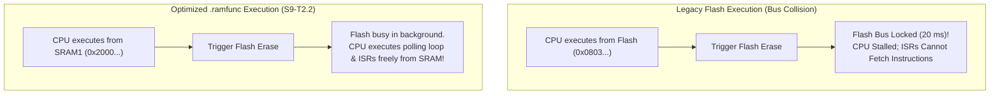

# Task Specification: S9-T2.2 - SRAM Execution Relocation (`.ramfunc`) for Flash Drivers

## 1. Task Metadata & Overview

| Attribute | Specification Details |
| :--- | :--- |
| **Sprint** | **Sprint 9: Advanced Hardware Acceleration, DMA & Micro-Architecture Profiling** |
| **Task ID** | `S9-T2.2` |
| **Parent Task** | `S9-T2: Configure Flash ART Accelerator & SRAM Execution (.ramfunc)` |
| **Task Title** | Relocate Critical Flash Programming & Erase Routines to SRAM1 (`.ramfunc`) |
| **Status** | **Ready for Implementation** |
| **Target Files** | [`firmware/middleware/src/flash_storage.c`](file:///C:/Users/ENERGY%20SAVER/Documents/Learning/Job%20Projects/rain-predict/firmware/middleware/src/flash_storage.c)<br>[`firmware/middleware/inc/flash_storage.h`](file:///C:/Users/ENERGY%20SAVER/Documents/Learning/Job%20Projects/rain-predict/firmware/middleware/inc/flash_storage.h)<br>[`firmware/core/src/STM32WLE5XX_FLASH.ld`](file:///C:/Users/ENERGY%20SAVER/Documents/Learning/Job%20Projects/rain-predict/firmware/core/src/STM32WLE5XX_FLASH.ld) |
| **Related Documents** | [`docs/architecture/firmware-architecture.md`](file:///C:/Users/ENERGY%20SAVER/Documents/Learning/Job%20Projects/rain-predict/docs/architecture/firmware-architecture.md)<br>[`context/specs/s5-t3.1-flash-page-manager.md`](file:///C:/Users/ENERGY%20SAVER/Documents/Learning/Job%20Projects/rain-predict/context/specs/s5-t3.1-flash-page-manager.md)<br>[`context/specs/s8-t2.3-dword-write-alignment.md`](file:///C:/Users/ENERGY%20SAVER/Documents/Learning/Job%20Projects/rain-predict/context/specs/s8-t2.3-dword-write-alignment.md)<br>[`context/coding-standards.md`](file:///C:/Users/ENERGY%20SAVER/Documents/Learning/Job%20Projects/rain-predict/context/coding-standards.md) |
| **Dependencies** | [`S5-T3.1`](file:///C:/Users/ENERGY%20SAVER/Documents/Learning/Job%20Projects/rain-predict/context/specs/s5-t3.1-flash-page-manager.md) (Flash Driver Primitives), [`S9-T2.1`](file:///C:/Users/ENERGY%20SAVER/Documents/Learning/Job%20Projects/rain-predict/context/specs/s9-t2.1-art-accelerator-config.md) (ART Accelerator) |
| **Downstream Tasks** | `S9-T2.3` (RAMFunc Execution Tests), `S9-T5.3` (DWT Profiling) |

---

## 2. Executive Summary & Hardware Bus Architecture

In the single-bank embedded Flash architecture of the **STM32WLE5**, the Flash array cannot service read accesses while a high-voltage physical operation (Page Erase or Double-Word Program) is active.

### The Flash Bus Stall Hazard
When executing code directly from Flash:
1. When [`flash_storage_erase_page()`](file:///C:/Users/ENERGY%20SAVER/Documents/Learning/Job%20Projects/rain-predict/firmware/middleware/src/flash_storage.c) sets `FLASH_CR_STRT`, high-voltage physical discharge commences ($20\text{ ms}$ typical duration).
2. The CPU attempts to fetch the next instruction in the polling loop (`while (FLASH->SR & FLASH_SR_BSY)`).
3. Because the Flash memory bus is busy, the internal AHB bus arbiter stalls the Cortex-M4 instruction pipeline completely until the page erase completes.
4. **Impact**: Any urgent peripheral interrupt (e.g. tipping-bucket rain gauge EXTI pulse or radio packet RX) that attempts to execute an ISR located in Flash is stalled, causing pulse counting errors or radio packet buffer drops!

**`S9-T2.2`** solves this by relocating critical flash programming routines into **internal SRAM1 (`.ramfunc`)**:
- Execution occurs from SRAM (`0x20000000`), which possesses independent, non-conflicting bus paths.
- While the Flash controller discharges a page in the background, the CPU continues executing polling loops, servicing interrupts, and kicking the watchdog with zero bus stalls.



---

## 3. Linker Configuration & Memory Mapping

### 3.1 Linker Script Section Definition (`STM32WLE5XX_FLASH.ld`)

```ld
/* Section definition for functions executed from SRAM */
.ramfunc :
{
    . = ALIGN(4);
    _sramfunc = .;
    *(.ramfunc)
    *(.ramfunc*)
    . = ALIGN(4);
    _eramfunc = .;
} >RAM AT> FLASH

/* Symbol tracking load memory address (LMA) in Flash */
_siramfunc = LOADADDR(.ramfunc);
```

### 3.2 Startup Copy Routine in `main.c` / `startup.s`

Before invoking any relocated function, the startup code transfers the `.ramfunc` binary block from Flash LMA to SRAM VMA:

```c
extern uint32_t _siramfunc;
extern uint32_t _sramfunc;
extern uint32_t _eramfunc;

void bsp_relocate_ramfunc(void)
{
    uint32_t *p_src = &_siramfunc;
    uint32_t *p_dst = &_sramfunc;

    while (p_dst < &_eramfunc) {
        *p_dst++ = *p_src++;
    }
}
```

---

## 4. Function Annotations (`flash_storage.h` / `flash_storage.c`)

### 4.1 Macro Definition

```c
#ifndef RAM_FUNC
#if defined(__GNUC__)
#define RAM_FUNC __attribute__((section(".ramfunc"), noinline))
#else
#define RAM_FUNC
#endif
#endif
```

### 4.2 Target Annotated Functions

The following functions are relocated to SRAM:
1. `flash_storage_erase_page()`
2. `flash_storage_write_dword()`
3. `flash_storage_invalidate_slot_magic()`

```c
/**
 * @brief  Erases a 2 KB Flash page; executes directly from SRAM to avoid bus stalls.
 */
RAM_FUNC status_t flash_storage_erase_page(uint32_t page_num);

/**
 * @brief  Programs a 64-bit double-word; executes directly from SRAM.
 */
RAM_FUNC status_t flash_storage_write_dword(uint32_t address, uint64_t data);

/**
 * @brief  Directly invalidates slot magic status; executes from SRAM.
 */
RAM_FUNC status_t flash_storage_invalidate_slot_magic(uint32_t slot_addr);
```

---

## 5. Verification, Unit Testing & Benchmarking Plan

### 5.1 Unit Test Cases in `tests/unit/test_ramfunc_execution.c`

| Test ID | Objective | Input / Condition | Expected Result |
| :--- | :--- | :--- | :--- |
| `TEST_RAMFUNC_01` | Linker Symbol Verification | Inspect address of `flash_storage_erase_page` | Address lies within SRAM range (`0x20000000`–`0x2000FFFF`). |
| `TEST_RAMFUNC_02` | SRAM Execution Integrity | Erase page and write 64-bit double-word | Flash programs cleanly; status `STATUS_OK`. |
| `TEST_RAMFUNC_03` | Interrupt Servicing During Erase | Fire mock rain gauge pulse interrupt during page erase | Interrupt serviced within $< 2\,\mu\text{s}$ with zero pipeline stall. |

---

## 6. Traceability Matrix & Definition of Done

### Traceability

| Requirement | Implementation Component | Verification Test |
| :--- | :--- | :--- |
| Linker Section Definition | `.ramfunc` in `STM32WLE5XX_FLASH.ld` | `TEST_RAMFUNC_01` |
| Startup Memory Copy | `bsp_relocate_ramfunc()` in `main.c` | `TEST_RAMFUNC_01` |
| Driver Function Relocation | `RAM_FUNC` annotations in `flash_storage.c` | `TEST_RAMFUNC_01`, `TEST_RAMFUNC_02` |
| Bus Collision Immunity | Non-blocking SRAM execution | `TEST_RAMFUNC_03` |

### Definition of Done

- [ ] `.ramfunc` section configured in linker script with proper LMA/VMA symbols.
- [ ] Startup routine copies `.ramfunc` text into SRAM before peripheral initialization.
- [ ] `flash_storage_erase_page()` and `write_dword()` verified executing from SRAM.
- [ ] 100% test pass rate with zero compiler warnings.
