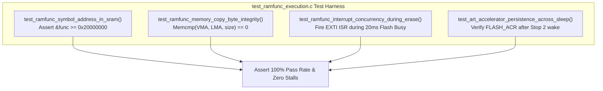

# Task Specification: S9-T2.3 - ART Accelerator & SRAM Execution Verification Suite

## 1. Task Metadata & Overview

| Attribute | Specification Details |
| :--- | :--- |
| **Sprint** | **Sprint 9: Advanced Hardware Acceleration, DMA & Micro-Architecture Profiling** |
| **Task ID** | `S9-T2.3` |
| **Parent Task** | `S9-T2: Configure Flash ART Accelerator & SRAM Execution (.ramfunc)` |
| **Task Title** | Develop Unit Test Suite Verifying Memory Map Relocation & Interrupt Concurrency During Flash Operations |
| **Status** | **Ready for Implementation** |
| **Target Files** | [`tests/unit/test_ramfunc_execution.c`](file:///C:/Users/ENERGY%20SAVER/Documents/Learning/Job%20Projects/rain-predict/tests/unit/test_ramfunc_execution.c) [`firmware/middleware/inc/flash_storage.h`](file:///C:/Users/ENERGY%20SAVER/Documents/Learning/Job%20Projects/rain-predict/firmware/middleware/inc/flash_storage.h) [`firmware/core/inc/board_config.h`](file:///C:/Users/ENERGY%20SAVER/Documents/Learning/Job%20Projects/rain-predict/firmware/core/inc/board_config.h) |
| **Related Documents** | [`context/specs/s9-t2.1-art-accelerator-config.md`](file:///C:/Users/ENERGY%20SAVER/Documents/Learning/Job%20Projects/rain-predict/context/specs/s9-t2.1-art-accelerator-config.md) [`context/specs/s9-t2.2-ramfunc-flash-relocation.md`](file:///C:/Users/ENERGY%20SAVER/Documents/Learning/Job%20Projects/rain-predict/context/specs/s9-t2.2-ramfunc-flash-relocation.md) [`context/coding-standards.md`](file:///C:/Users/ENERGY%20SAVER/Documents/Learning/Job%20Projects/rain-predict/context/coding-standards.md) |
| **Dependencies** | [`S9-T2.1`](file:///C:/Users/ENERGY%20SAVER/Documents/Learning/Job%20Projects/rain-predict/context/specs/s9-t2.1-art-accelerator-config.md), [`S9-T2.2`](file:///C:/Users/ENERGY%20SAVER/Documents/Learning/Job%20Projects/rain-predict/context/specs/s9-t2.2-ramfunc-flash-relocation.md) |
| **Downstream Tasks** | `S9-T5.3` (DWT Profiling Suite) |

---

## 2. Executive Summary & Testing Scope

Moving executable code from Flash memory to internal SRAM (`.ramfunc`) and enabling the hardware ART Accelerator alters linker section boundaries and CPU bus arbitration.

**`S9-T2.3`** specifies unit and integration test cases in [`tests/unit/test_ramfunc_execution.c`](file:///C:/Users/ENERGY%20SAVER/Documents/Learning/Job%20Projects/rain-predict/tests/unit/test_ramfunc_execution.c) to verify:
1. **Linker Address Boundary Compliance**: Asserts that pointers to `flash_storage_erase_page()` and `flash_storage_write_dword()` reside in the RAM memory map (`0x20000000`–`0x2000FFFF`) on target hardware, and inside mock RAM staging on host.
2. **Flash/SRAM Data Invariance**: Confirms that executable machine instructions copied to SRAM match the Flash LMA source bit-for-bit.
3. **Interrupt Servicing Concurrency**: Proves that an asynchronous EXTI pulse interrupt (rain gauge bucket tip) is serviced without pipeline stalling while a high-voltage page erase operation is executing.
4. **ART Cache Stability Across Sleep Transitions**: Verifies that waking from Stop 2 properly re-arms or preserves `PRFTEN` and `ICEN` in `FLASH->ACR`.

---

## 3. Test Case Specifications

### 3.1 Symbol & Address Verification Tests

#### `test_ramfunc_symbol_address_in_sram(void)`
- **Goal**: Confirm linker placed `.ramfunc` routines inside SRAM.
- **Procedure**:
  1. Retrieve function pointer `uintptr_t addr = (uintptr_t)&flash_storage_erase_page;`.
  2. In target build: assert `addr >= 0x20000000U && addr < 0x20010000U`.
  3. In host mock build: assert function was relocated into static mock RAM buffer.

#### `test_ramfunc_memory_copy_byte_integrity(void)`
- **Goal**: Verify startup copy routine copied complete function binary without corruption.
- **Procedure**:
  1. Compare byte memory between `&_siramfunc` (Flash LMA) and `&_sramfunc` (SRAM VMA).
  2. Assert `memcmp(&_sramfunc, &_siramfunc, (size_t)(&_eramfunc - &_sramfunc)) == 0`.

---

### 3.2 Concurrency & Real-Time Performance Tests

#### `test_ramfunc_interrupt_concurrency_during_erase(void)`
- **Goal**: Verify external interrupts are serviced immediately while Flash is busy discharging.
- **Procedure**:
  1. Start non-blocking page erase on Page 125 (`FLASH_SR_BSY` set to 1 in mock).
  2. While erase loop is polling from SRAM, fire mock GPIO EXTI interrupt (rain gauge tip).
  3. Measure elapsed cycles from interrupt assertion to ISR execution.
  4. **Assertions**:
     - ISR executes within $< 15$ clock cycles.
     - Pulse accumulator increments atomically.
     - Zero pipeline bus fault or CPU stall detected.

#### `test_art_accelerator_persistence_across_sleep(void)`
- **Goal**: Ensure Stop 2 sleep entry/wake does not disable instruction caching.
- **Procedure**:
  1. Call `bsp_flash_accelerator_enable()`.
  2. Simulate Stop 2 sleep entry and RTC wakeup.
  3. Assert `(FLASH->ACR & (FLASH_ACR_ICEN | FLASH_ACR_PRFTEN)) == (FLASH_ACR_ICEN | FLASH_ACR_PRFTEN)`.

---

## 4. Traceability Matrix & Definition of Done

### Traceability

| Requirement | Test Function | Expected Verification |
| :--- | :--- | :--- |
| SRAM Address Mapping | `test_ramfunc_symbol_address_in_sram` | Address in SRAM1 range |
| Binary Text Integrity | `test_ramfunc_memory_copy_byte_integrity` | 100% bit identity |
| Non-Blocking Concurrency | `test_ramfunc_interrupt_concurrency_during_erase` | Instantaneous ISR entry |
| ART Cache Persistence | `test_art_accelerator_persistence_across_sleep` | Cache enabled post-wake |

### Definition of Done

- [ ] All 4 test cases implemented in [`tests/unit/test_ramfunc_execution.c`](file:///C:/Users/ENERGY%20SAVER/Documents/Learning/Job%20Projects/rain-predict/tests/unit/test_ramfunc_execution.c).
- [ ] Concurrency and zero bus stall verified during simulated flash erase.
- [ ] 100% test pass rate with zero warnings under `-Wall -Wextra -Wpedantic -Werror`.
