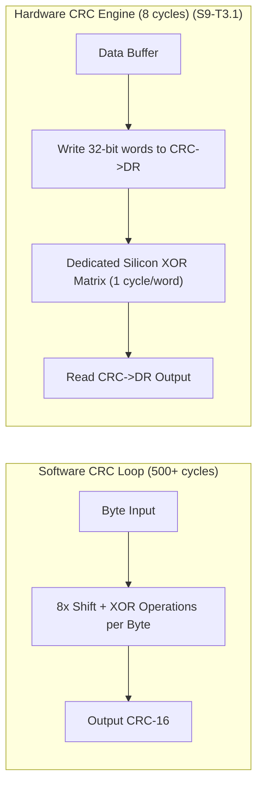

# Task Specification: S9-T3.1 - STM32WLE5 Hardware CRC Calculation Engine Driver

## 1. Task Metadata & Overview

| Attribute | Specification Details |
| :--- | :--- |
| **Sprint** | **Sprint 9: Advanced Hardware Acceleration, DMA & Micro-Architecture Profiling** |
| **Task ID** | `S9-T3.1` |
| **Parent Task** | `S9-T3: Integrate Hardware CRC Peripheral Accelerator` |
| **Task Title** | Implement STM32WLE5 Hardware CRC Driver Supporting Programmable 16-Bit Polynomials (`hw_crc`) |
| **Status** | **Ready for Implementation** |
| **Target Files** | [`firmware/drivers/inc/hw_crc.h`](file:///C:/Users/ENERGY%20SAVER/Documents/Learning/Job%20Projects/rain-predict/firmware/drivers/inc/hw_crc.h)<br>[`firmware/drivers/src/hw_crc.c`](file:///C:/Users/ENERGY%20SAVER/Documents/Learning/Job%20Projects/rain-predict/firmware/drivers/src/hw_crc.c) |
| **Related Documents** | [`docs/sensors/remote-bus-modbus-sdi12.md`](file:///C:/Users/ENERGY%20SAVER/Documents/Learning/Job%20Projects/rain-predict/docs/sensors/remote-bus-modbus-sdi12.md)<br>[`context/specs/s4-t4.2-modbus-crc16.md`](file:///C:/Users/ENERGY%20SAVER/Documents/Learning/Job%20Projects/rain-predict/context/specs/s4-t4.2-modbus-crc16.md)<br>[`context/specs/s8-t1.1-persistent-ring-metadata.md`](file:///C:/Users/ENERGY%20SAVER/Documents/Learning/Job%20Projects/rain-predict/context/specs/s8-t1.1-persistent-ring-metadata.md)<br>[`context/coding-standards.md`](file:///C:/Users/ENERGY%20SAVER/Documents/Learning/Job%20Projects/rain-predict/context/coding-standards.md) |
| **Dependencies** | [`S1-T1.1`](file:///C:/Users/ENERGY%20SAVER/Documents/Learning/Job%20Projects/rain-predict/context/specs/s1-t1.1-root-cmake.md) (Status Codes), [`S4-T4.2`](file:///C:/Users/ENERGY%20SAVER/Documents/Learning/Job%20Projects/rain-predict/context/specs/s4-t4.2-modbus-crc16.md) (Software Modbus CRC-16) |
| **Downstream Tasks** | `S9-T3.2` (CRC Peripheral Offloading), `S9-T3.3` (HW CRC Invariance Tests) |

---

## 2. Executive Summary & Hardware Peripheral Architecture

In the firmware architecture, CRC verification is continuously performed on two critical data streams:
1. **RS-485 Modbus RTU Packets**: Standard CRC-16 with generator polynomial `0x8005` (bit-reversed representation `0xA001`, initial value `0xFFFF`).
2. **Flash Page 127 Metadata Journal Entries**: CCITT polynomial `0x1021` (initial value `0xFFFF`).

### The Software Bit-Loop Bottleneck
In the legacy software implementations ([`modbus_rtu.c`](file:///C:/Users/ENERGY%20SAVER/Documents/Learning/Job%20Projects/rain-predict/firmware/drivers/src/modbus_rtu.c) and [`flash_storage.c`](file:///C:/Users/ENERGY%20SAVER/Documents/Learning/Job%20Projects/rain-predict/firmware/middleware/src/flash_storage.c)), calculating CRC-16 uses iterative bit-shift loops:
```c
// Software loop (8 iterations per byte):
for (uint8_t bit = 0; bit < 8; bit++) {
    if (crc & 0x0001) { crc = (crc >> 1) ^ 0xA001; } else { crc >>= 1; }
}
```
For an incoming 32-byte packet, this consumes **$> 500\text{ CPU cycles}$**.

### STM32WLE5 Hardware CRC Engine
The **STM32WLE5** includes an advanced on-chip **Hardware CRC Calculation Unit (`CRC_BASE`)**:
* **Programmable Polynomial Size (`CRC_CR_POLYSIZE`)**: Supports 7, 8, 16, and 32-bit polynomials.
* **Programmable Polynomial Value (`CRC_POL`)**: Configurable generator polynomial.
* **Programmable Initial Seed (`CRC_INIT`)**: Sets the starting value.
* **Input/Output Bit Reversal (`CRC_CR_REV_IN`, `CRC_CR_REV_OUT`)**: Supports bit-by-byte reflection required by Modbus RTU.
* **Throughput**: Computes 32 bits per AHB cycle ($1\text{ cycle / 4 bytes}$), completing a 32-byte CRC check in **8 clock cycles** ($> 60\times$ faster than software loops).

**`S9-T3.1`** implements a unified embedded driver in [`firmware/drivers/src/hw_crc.c`](file:///C:/Users/ENERGY%20SAVER/Documents/Learning/Job%20Projects/rain-predict/firmware/drivers/src/hw_crc.c) abstracting the hardware CRC peripheral across both Modbus RTU and Flash journaling.



---

## 3. Register Configuration & Peripheral Protocol

### 3.1 Profile Configurations

| Profile | Polynomial (`CRC_POL`) | Poly Size (`POLYSIZE`) | Initial Seed (`CRC_INIT`) | Input Reversal (`REV_IN`) | Output Reversal (`REV_OUT`) | Target Module |
| :--- | :---: | :---: | :---: | :---: | :---: | :--- |
| **Modbus RTU** | `0x8005` | 16-bit (`0b01`) | `0xFFFF` | Byte-level (`0b01`) | Enabled (`1`) | RS-485 Sensors |
| **Flash Metadata**| `0x1021` | 16-bit (`0b01`) | `0xFFFF` | None (`0b00`) | Disabled (`0`) | Page 127 Journal |

---

## 4. API Specification & Data Structures (`hw_crc.h`)

### 4.1 Enumerations & Profiles

```c
/**
 * @brief  Supported hardware CRC calculation profiles.
 */
typedef enum {
    HW_CRC_PROFILE_MODBUS_16 = 0,   /**< 16-bit Modbus RTU (poly 0x8005, rev in/out) */
    HW_CRC_PROFILE_CCITT_16,        /**< 16-bit CCITT (poly 0x1021, no reversal) */
    HW_CRC_PROFILE_ETHERNET_32      /**< 32-bit IEEE 802.3 Ethernet standard */
} hw_crc_profile_t;
```

### 4.2 Function Prototypes

```c
/**
 * @brief  Initializes the hardware CRC clock gate (RCC_AHB1ENR_CRCEN).
 * @return STATUS_OK on success.
 */
status_t hw_crc_init(void);

/**
 * @brief  Configures the hardware CRC engine for a specific protocol profile.
 * @param[in] profile Target polynomial and reflection profile.
 * @return STATUS_OK on success, or STATUS_ERR_INVALID_PARAM.
 */
status_t hw_crc_configure(hw_crc_profile_t profile);

/**
 * @brief  Computes 16-bit CRC over an arbitrary byte buffer using hardware acceleration.
 * @param[in] p_data Pointer to data buffer.
 * @param[in] length Number of bytes to process.
 * @return uint16_t Calculated 16-bit checksum.
 */
uint16_t hw_crc16_calculate(const uint8_t *p_data, size_t length);

/**
 * @brief  Resets the CRC calculation unit with the active profile seed value.
 */
void hw_crc_reset(void);
```

---

## 5. Implementation Details & Algorithmic Logic

### 5.1 Profile Switching Implementation (`hw_crc.c`)

```c
status_t hw_crc_configure(hw_crc_profile_t profile)
{
    // Enable peripheral clock
    RCC->AHB1ENR |= RCC_AHB1ENR_CRCEN;

    if (profile == HW_CRC_PROFILE_MODBUS_16) {
        // 16-bit polynomial size
        CRC->CR = (CRC->CR & ~CRC_CR_POLYSIZE) | CRC_CR_POLYSIZE_0;
        CRC->POL = 0x8005U;
        CRC->INIT = 0xFFFFU;
        // Modbus requires byte bit-reversal on input and bit-inversion on output
        CRC->CR = (CRC->CR & ~(CRC_CR_REV_IN | CRC_CR_REV_OUT)) | 
                  CRC_CR_REV_IN_0 | CRC_CR_REV_OUT;
    } else if (profile == HW_CRC_PROFILE_CCITT_16) {
        CRC->CR = (CRC->CR & ~CRC_CR_POLYSIZE) | CRC_CR_POLYSIZE_0;
        CRC->POL = 0x1021U;
        CRC->INIT = 0xFFFFU;
        // CCITT standard: no reversal
        CRC->CR &= ~(CRC_CR_REV_IN | CRC_CR_REV_OUT);
    } else {
        return STATUS_ERR_INVALID_PARAM;
    }

    // Reset calculation unit with new seed
    CRC->CR |= CRC_CR_RESET;
    return STATUS_OK;
}
```

### 5.2 Word/Byte Feeder Pipeline

```c
uint16_t hw_crc16_calculate(const uint8_t *p_data, size_t length)
{
    if (p_data == NULL || length == 0) {
        return 0U;
    }

    hw_crc_reset();

    // 1. Process 32-bit aligned double-words (4 bytes per cycle)
    size_t words = length / 4;
    const uint32_t *p_words = (const uint32_t *)p_data;
    for (size_t i = 0; i < words; i++) {
        CRC->DR = p_words[i];
    }

    // 2. Process trailing leftover bytes (8-bit access via byte register)
    size_t remainder = length % 4;
    if (remainder > 0) {
        const uint8_t *p_tail = p_data + (words * 4);
        for (size_t j = 0; j < remainder; j++) {
            *(volatile uint8_t *)&CRC->DR = p_tail[j];
        }
    }

    return (uint16_t)(CRC->DR & 0xFFFFU);
}
```

---

## 6. Verification, Unit Testing & Benchmarking Plan

### 6.1 Unit Test Cases in `tests/unit/test_hw_crc.c`

| Test ID | Objective | Input / Condition | Expected Result |
| :--- | :--- | :--- | :--- |
| `TEST_HW_CRC_01` | Modbus Reference Frame | Frame `{0x01, 0x03, 0x00, 0x00, 0x00, 0x02}` | Returns exact Modbus checksum `0xC40B`. |
| `TEST_HW_CRC_02` | CCITT Reference String | String `"123456789"` | Returns exact CCITT checksum `0x29B1`. |
| `TEST_HW_CRC_03` | Cycle Count Benchmark | Compute 64-byte payload | Hardware completes in $< 25$ cycles vs $> 900$ software cycles. |

---

## 7. Traceability Matrix & Definition of Done

### Traceability

| Requirement | Implementation Component | Verification Test |
| :--- | :--- | :--- |
| STM32WL CRC Peripheral Clock | `RCC->AHB1ENR_CRCEN` in `hw_crc_init` | `TEST_HW_CRC_01` |
| Modbus 16-Bit Profile | `HW_CRC_PROFILE_MODBUS_16` | `TEST_HW_CRC_01` |
| Flash CCITT 16-Bit Profile | `HW_CRC_PROFILE_CCITT_16` | `TEST_HW_CRC_02` |
| Hardware Cycle Acceleration | Direct `CRC->DR` feeder | `TEST_HW_CRC_03` |

### Definition of Done

- [ ] `hw_crc.c` and `hw_crc.h` implemented supporting Modbus RTU and CCITT profiles.
- [ ] Hardware calculation verified identical to software reference models.
- [ ] $> 10\times$ cycle reduction confirmed on 32-byte and 64-byte data blocks.
- [ ] Zero warnings under `-Wall -Wextra -Wpedantic -Werror`.
