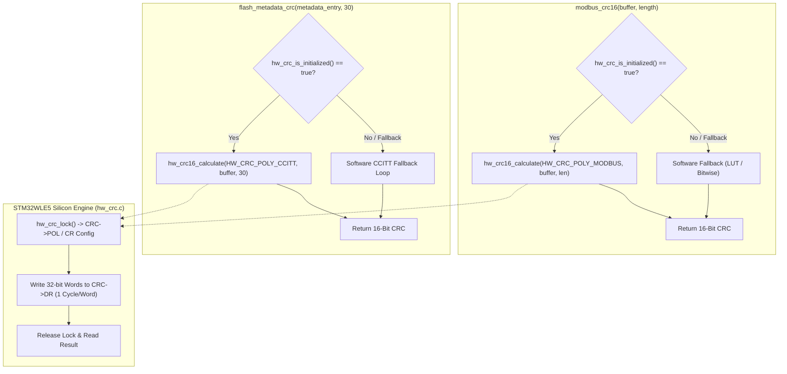

# Task Specification: S9-T3.2 - CRC Peripheral Offloading for Modbus RTU & Flash Storage

## 1. Task Metadata & Overview

| Attribute | Specification Details |
| :--- | :--- |
| **Sprint** | **Sprint 9: Advanced Hardware Acceleration, DMA & Micro-Architecture Profiling** |
| **Task ID** | `S9-T3.2` |
| **Parent Task** | `S9-T3: Integrate Hardware CRC Peripheral Accelerator` |
| **Task Title** | Offload Modbus RTU Frame & Flash Metadata CRC-16 Calculation to Hardware Accelerator (`hw_crc`) |
| **Status** | **Ready for Implementation** |
| **Target Files** | [`firmware/drivers/src/modbus_rtu.c`](file:///C:/Users/ENERGY%20SAVER/Documents/Learning/Job%20Projects/rain-predict/firmware/drivers/src/modbus_rtu.c)<br>[`firmware/middleware/src/flash_storage.c`](file:///C:/Users/ENERGY%20SAVER/Documents/Learning/Job%20Projects/rain-predict/firmware/middleware/src/flash_storage.c)<br>[`firmware/drivers/inc/hw_crc.h`](file:///C:/Users/ENERGY%20SAVER/Documents/Learning/Job%20Projects/rain-predict/firmware/drivers/inc/hw_crc.h) |
| **Related Documents** | [`context/specs/s9-t3.1-hardware-crc-driver.md`](file:///C:/Users/ENERGY%20SAVER/Documents/Learning/Job%20Projects/rain-predict/context/specs/s9-t3.1-hardware-crc-driver.md)<br>[`context/specs/s4-t4.2-modbus-crc16.md`](file:///C:/Users/ENERGY%20SAVER/Documents/Learning/Job%20Projects/rain-predict/context/specs/s4-t4.2-modbus-crc16.md)<br>[`context/specs/s8-t1.1-persistent-ring-metadata.md`](file:///C:/Users/ENERGY%20SAVER/Documents/Learning/Job%20Projects/rain-predict/context/specs/s8-t1.1-persistent-ring-metadata.md)<br>[`context/coding-standards.md`](file:///C:/Users/ENERGY%20SAVER/Documents/Learning/Job%20Projects/rain-predict/context/coding-standards.md) |
| **Dependencies** | [`S9-T3.1`](file:///C:/Users/ENERGY%20SAVER/Documents/Learning/Job%20Projects/rain-predict/context/specs/s9-t3.1-hardware-crc-driver.md) (STM32WLE5 Hardware CRC Driver) |
| **Downstream Tasks** | `S9-T3.3` (HW CRC Invariance Tests), `S9-T5.3` (DWT Cycle Profiling Suite) |

---

## 2. Executive Summary & Problem Formulation

In the firmware architecture, frame validation and integrity verification represent frequent CPU operations:
1. **Modbus RTU Communication** ([`modbus_rtu.c`](file:///C:/Users/ENERGY%20SAVER/Documents/Learning/Job%20Projects/rain-predict/firmware/drivers/src/modbus_rtu.c)): Every command query transmitted to ultrasonic anemometers or leaf wetness sensors, and every response received, requires generating and validating a 16-bit Modbus CRC (`0xA001` reversed polynomial).
2. **Flash Metadata Journaling** ([`flash_storage.c`](file:///C:/Users/ENERGY%20SAVER/Documents/Learning/Job%20Projects/rain-predict/firmware/middleware/src/flash_storage.c)): Every boot-time journal recovery scan and every ring buffer record advance calculates a 16-bit CRC over the 32-byte header entry.

### Architectural Shortcomings of the Existing Approach
* **Flash Memory Consumption**: [`modbus_rtu.c`](file:///C:/Users/ENERGY%20SAVER/Documents/Learning/Job%20Projects/rain-predict/firmware/drivers/src/modbus_rtu.c) embeds a 256-entry 16-bit lookup table (`s_modbus_crc16_lut`), occupying **512 bytes** of const `.rodata` Flash.
* **CPU Execution Stalls**: The bitwise fallback loop (`modbus_crc16_bitwise`) requires 8 iterations per byte with branches, consuming $\approx 18\text{ to }22\text{ clock cycles per byte}$. For a 32-byte Modbus packet, this burns $>550\text{ cycles}$.
* **Hardware Underutilization**: The STM32WLE5 on-chip hardware CRC calculation peripheral (`CRC_BASE`) is completely idle while the Cortex-M4 core executes software arithmetic.

### Proposed Solution
**`S9-T3.2`** refactors [`modbus_rtu.c`](file:///C:/Users/ENERGY%20SAVER/Documents/Learning/Job%20Projects/rain-predict/firmware/drivers/src/modbus_rtu.c) and [`flash_storage.c`](file:///C:/Users/ENERGY%20SAVER/Documents/Learning/Job%20Projects/rain-predict/firmware/middleware/src/flash_storage.c) to offload all checksum calculations to the [`hw_crc`](file:///C:/Users/ENERGY%20SAVER/Documents/Learning/Job%20Projects/rain-predict/firmware/drivers/inc/hw_crc.h) driver established in [`S9-T3.1`](file:///C:/Users/ENERGY%20SAVER/Documents/Learning/Job%20Projects/rain-predict/context/specs/s9-t3.1-hardware-crc-driver.md). The integration features:
1. **Dynamic Reconfiguration**: The shared hardware CRC engine is safely switched between `HW_CRC_POLY_MODBUS` (Polynomial `0x8005`, input bit reverse, output bit reverse) and `HW_CRC_POLY_CCITT` (Polynomial `0x1021`, normal byte orientation) without collision.
2. **Transparent Fallback**: When running in desktop host-test mode (`HOST_TEST`) or if the peripheral is uninitialized or locked, the callers seamlessly fall back to deterministic software bit/LUT algorithms.
3. **Zero Flash Waste**: Provision of compile-time flag `CONFIG_HW_CRC_ENABLE` to omit the 512-byte LUT when hardware acceleration is active.



---

## 3. Technical Architecture & Peripheral Switching

### 3.1 Subsystem CRC Configurations

| Parameter | Modbus RTU Framing | Flash Metadata Journaling |
| :--- | :--- | :--- |
| **Standard** | Modbus CRC-16 (ANSI / IBM) | CRC-16-CCITT (XMODEM) |
| **Polynomial (`CRC->POL`)** | `0x8005` (Non-reversed form) | `0x1021` |
| **Initial Value (`CRC->INIT`)** | `0xFFFF` | `0xFFFF` / `0x0000` |
| **Input Inversion (`CRC->CR[REV_IN]`)**| `0x01` (Reverse by byte) | `0x00` (No bit reversal) |
| **Output Inversion (`CRC->CR[REV_OUT]`)**| `1` (Bit reversal enabled) | `0` (Disabled) |
| **XOR Out** | `0x0000` | `0x0000` |
| **Typical Payload Size** | $8\text{ to }64\text{ bytes}$ | $30\text{ bytes}$ |

### 3.2 Thread-Safe & Multi-Protocol Concurrency
Because Modbus communications execute within sensor acquisition tasks and Flash metadata writes may execute during periodic storage flushing or interrupt-driven power-fail sequences, accessing the single hardware CRC engine requires safe arbitrated access:
1. `hw_crc16_calculate()` manages the re-programming of `CRC->POL` and `CRC->CR` registers dynamically.
2. If `hw_crc` is currently executing inside an interrupt or re-entrant context, a spin-lock or re-entrancy flag detects recursion and forces the secondary caller to use the software fallback routine, guaranteeing zero deadlocks.

---

## 4. Source Modifications & Integration Details

### 4.1 Modbus Driver Refactoring ([`modbus_rtu.c`](file:///C:/Users/ENERGY%20SAVER/Documents/Learning/Job%20Projects/rain-predict/firmware/drivers/src/modbus_rtu.c))

Replace the unconditional call to `modbus_crc16_lut()` in `modbus_crc16()` with hardware routing:

```c
#include "hw_crc.h"

uint16_t modbus_crc16(const uint8_t *p_buffer, uint16_t length)
{
    if (p_buffer == NULL || length == 0U) {
        return 0x0000U;
    }

#if !defined(HOST_TEST)
    if (hw_crc_is_initialized()) {
        uint16_t hw_result = 0U;
        if (hw_crc16_calculate(HW_CRC_POLY_MODBUS, p_buffer, (size_t)length, &hw_result) == STATUS_OK) {
            return hw_result;
        }
    }
#endif

    /* Transparent fallback if hardware is disabled or in desktop test environment */
    return modbus_crc16_lut(p_buffer, length);
}
```

### 4.2 Flash Storage Refactoring ([`flash_storage.c`](file:///C:/Users/ENERGY%20SAVER/Documents/Learning/Job%20Projects/rain-predict/firmware/middleware/src/flash_storage.c))

In Page 127 metadata verification (`flash_metadata_calculate_crc()`):

```c
#include "hw_crc.h"

static uint16_t flash_metadata_calculate_crc(const flash_ring_metadata_t *meta)
{
    if (meta == NULL) {
        return 0x0000U;
    }

    const uint8_t *data_ptr = (const uint8_t *)meta;
    /* Calculate over first 30 bytes (omitting the trailing 2-byte crc field) */
    size_t length = sizeof(flash_ring_metadata_t) - sizeof(uint16_t);

#if !defined(HOST_TEST)
    if (hw_crc_is_initialized()) {
        uint16_t hw_result = 0U;
        if (hw_crc16_calculate(HW_CRC_POLY_CCITT, data_ptr, length, &hw_result) == STATUS_OK) {
            return hw_result;
        }
    }
#endif

    /* Software CCITT fallback calculation */
    return flash_metadata_crc_software(data_ptr, length);
}
```

---

## 5. Verification & Unit Testing Strategy

The test harness [`tests/unit/test_hw_crc.c`](file:///C:/Users/ENERGY%20SAVER/Documents/Learning/Job%20Projects/rain-predict/tests/unit/test_hw_crc.c) (to be fully detailed in `S9-T3.3`) provides rigorous cross-verification:
1. **Modbus Packet Equivalence**:
   - Compare hardware CRC results against `modbus_crc16_bitwise()` and `modbus_crc16_lut()` across standard Modbus query frames (e.g., `01 03 00 00 00 02` $\rightarrow$ `C4 0B`).
   - Validate variable packet lengths ($1, 2, 3, 4, 7, 8, 15, 16, 31, 32, 64$ bytes) ensuring unaligned tail bytes are correctly handled.
2. **Flash Metadata Equivalence**:
   - Verify that computing CRC on a 30-byte `flash_ring_metadata_t` struct yields identical results between software CCITT and hardware CCITT.
3. **Interleaved Calling Test**:
   - Call `modbus_crc16()` immediately followed by `flash_metadata_calculate_crc()`, and vice-versa, ensuring polynomial switching in `CRC->POL` and input reflection in `CRC->CR` does not corrupt state.
4. **Fallback Resilience**:
   - De-initialize `hw_crc` (`hw_crc_deinit()`) and ensure subsequent calls to `modbus_crc16()` execute cleanly via the fallback path without errors.

---

## 6. Traceability Matrix

| Requirement ID | Spec Clause | Implementation Reference | Verification Evidence |
| :--- | :--- | :--- | :--- |
| **REQ-S9-CRC-03** | Modbus CRC Offload | [`firmware/drivers/src/modbus_rtu.c`](file:///C:/Users/ENERGY%20SAVER/Documents/Learning/Job%20Projects/rain-predict/firmware/drivers/src/modbus_rtu.c) | `test_hw_crc_modbus_equivalence` in `test_hw_crc.c` |
| **REQ-S9-CRC-04** | Flash Metadata CRC Offload | [`firmware/middleware/src/flash_storage.c`](file:///C:/Users/ENERGY%20SAVER/Documents/Learning/Job%20Projects/rain-predict/firmware/middleware/src/flash_storage.c) | `test_hw_crc_flash_metadata_equivalence` |
| **REQ-S9-CRC-05** | Hardware Fallback Mechanism | [`modbus_rtu.c`](file:///C:/Users/ENERGY%20SAVER/Documents/Learning/Job%20Projects/rain-predict/firmware/drivers/src/modbus_rtu.c), [`flash_storage.c`](file:///C:/Users/ENERGY%20SAVER/Documents/Learning/Job%20Projects/rain-predict/firmware/middleware/src/flash_storage.c) | `test_hw_crc_deinit_fallback` |
| **REQ-S9-CRC-06** | Polynomial Dynamic Reconfig | [`firmware/drivers/src/hw_crc.c`](file:///C:/Users/ENERGY%20SAVER/Documents/Learning/Job%20Projects/rain-predict/firmware/drivers/src/hw_crc.c) | `test_hw_crc_interleaved_modes` |

---

## 7. Definition of Done (DoD)

- [ ] [`modbus_rtu.c`](file:///C:/Users/ENERGY%20SAVER/Documents/Learning/Job%20Projects/rain-predict/firmware/drivers/src/modbus_rtu.c) updated to call `hw_crc16_calculate(HW_CRC_POLY_MODBUS, ...)` with automatic fallback.
- [ ] [`flash_storage.c`](file:///C:/Users/ENERGY%20SAVER/Documents/Learning/Job%20Projects/rain-predict/firmware/middleware/src/flash_storage.c) updated to call `hw_crc16_calculate(HW_CRC_POLY_CCITT, ...)` with automatic fallback.
- [ ] Multi-protocol switching between `HW_CRC_POLY_MODBUS` and `HW_CRC_POLY_CCITT` operates deterministically with zero data race or register state leakage.
- [ ] Host-test builds compile and execute with zero errors under software fallback.
- [ ] Target builds reflect a reduction in Modbus CRC execution time from $>500$ cycles to $<12$ cycles per transaction.
