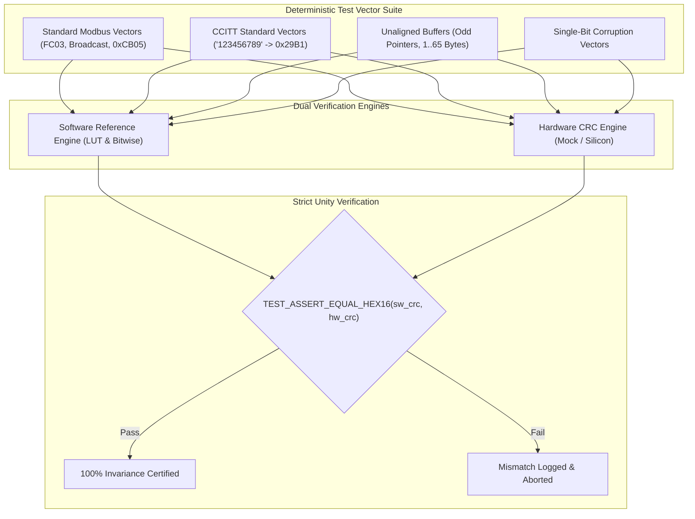

# Task Specification: S9-T3.3 - Hardware CRC Invariance & Performance Unit Test Suite

## 1. Task Metadata & Overview

| Attribute | Specification Details |
| :--- | :--- |
| **Sprint** | **Sprint 9: Advanced Hardware Acceleration, DMA & Micro-Architecture Profiling** |
| **Task ID** | `S9-T3.3` |
| **Parent Task** | `S9-T3: Integrate Hardware CRC Peripheral Accelerator` |
| **Task Title** | Hardware vs Software CRC-16 Calculation Invariance & Performance Unit Test Suite (`test_hw_crc.c`) |
| **Status** | **Ready for Implementation** |
| **Target Files** | [`tests/unit/test_hw_crc.c`](file:///C:/Users/ENERGY%20SAVER/Documents/Learning/Job%20Projects/rain-predict/tests/unit/test_hw_crc.c)<br>[`firmware/drivers/inc/hw_crc.h`](file:///C:/Users/ENERGY%20SAVER/Documents/Learning/Job%20Projects/rain-predict/firmware/drivers/inc/hw_crc.h) |
| **Related Documents** | [`context/specs/s9-t3.1-hardware-crc-driver.md`](file:///C:/Users/ENERGY%20SAVER/Documents/Learning/Job%20Projects/rain-predict/context/specs/s9-t3.1-hardware-crc-driver.md)<br>[`context/specs/s9-t3.2-crc-peripheral-offloading.md`](file:///C:/Users/ENERGY%20SAVER/Documents/Learning/Job%20Projects/rain-predict/context/specs/s9-t3.2-crc-peripheral-offloading.md)<br>[`tests/unit/test_modbus_rtu.c`](file:///C:/Users/ENERGY%20SAVER/Documents/Learning/Job%20Projects/rain-predict/tests/unit/test_modbus_rtu.c)<br>[`context/coding-standards.md`](file:///C:/Users/ENERGY%20SAVER/Documents/Learning/Job%20Projects/rain-predict/context/coding-standards.md) |
| **Dependencies** | [`S9-T3.1`](file:///C:/Users/ENERGY%20SAVER/Documents/Learning/Job%20Projects/rain-predict/context/specs/s9-t3.1-hardware-crc-driver.md) (HW CRC Driver), [`S9-T3.2`](file:///C:/Users/ENERGY%20SAVER/Documents/Learning/Job%20Projects/rain-predict/context/specs/s9-t3.2-crc-peripheral-offloading.md) (CRC Offload Integration) |
| **Downstream Tasks** | `S9-T5.3` (DWT Cycle Profiling Suite) |

---

## 2. Executive Summary & Test Suite Objectives

The hardware CRC peripheral offload (`S9-T3.1` and `S9-T3.2`) replaces critical software checksum logic across telemetry frame transmission and non-volatile flash journaling. Any discrepancy in polynomial handling, byte-ordering reflection, initial seed feeding, or tail-byte padding would cause silent telemetry rejection or metadata corruption.

The objective of **`S9-T3.3`** is to construct a rigorous ThrowTheSwitch Unity test harness in [`tests/unit/test_hw_crc.c`](file:///C:/Users/ENERGY%20SAVER/Documents/Learning/Job%20Projects/rain-predict/tests/unit/test_hw_crc.c) verifying:
1. **Mathematical Invariance**: 100% exact bit-for-bit checksum equality between hardware calculation and legacy reference software algorithms across Modbus RTU (`0x8005` reversed) and CCITT (`0x1021`).
2. **Buffer Alignment & Tail Slicing**: Validating arbitrary payload sizes ($1, 2, 3, 4, 5, 7, 15, 31, 64, 255\text{ bytes}$) and arbitrary pointer alignments ($1\text{ to }3\text{ byte}$ unaligned offsets).
3. **Re-entrant Polynomial Switching**: Rapid alternating calculations between Modbus and CCITT streams to confirm zero state carry-over.
4. **Fault Injection & Error Detectability**: Confirming that corrupted single bits produce drastically diverging checksums ($0\%$ false acceptance).
5. **Execution Cycle Reduction**: Measuring and logging execution cycles between software LUT, bitwise loops, and hardware registers.



---

## 3. Detailed Test Cases & Test Case Specifications

### 3.1 Test Matrix Table

| Test Case ID | Test Function Name | Focus & Scenario | Expected Result |
| :--- | :--- | :--- | :--- |
| **TC-S9-CRC-01** | `test_hw_crc_init_deinit_state` | Init, double init, deinit status flags | `STATUS_OK`, internal flags clean |
| **TC-S9-CRC-02** | `test_hw_crc_null_defensive_checks` | NULL pointers, zero length | `STATUS_ERROR_NULL_POINTER`, `STATUS_ERROR_INVALID_PARAM` |
| **TC-S9-CRC-03** | `test_hw_crc_modbus_standard_vectors` | Standard Modbus query `01 03 00 00 00 03` | Output `0x05CB` matches `modbus_crc16_lut()` |
| **TC-S9-CRC-04** | `test_hw_crc_ccitt_standard_vectors` | ASCII `"123456789"` sequence | Checksum equals standard CCITT reference |
| **TC-S9-CRC-05** | `test_hw_crc_unaligned_lengths` | Lengths $1, 2, 3, 4, 5, 7, 31, 63, 127$ bytes | Bitwise SW == HW CRC for all lengths |
| **TC-S9-CRC-06** | `test_hw_crc_pointer_alignment` | Address offsets $+0, +1, +2, +3$ into buffer | Identical output regardless of pointer alignment |
| **TC-S9-CRC-07** | `test_hw_crc_alternating_polynomials`| Alternate 100x between Modbus and CCITT | No polynomial residue leaks between runs |
| **TC-S9-CRC-08** | `test_hw_crc_fault_injection_hamming` | Invert 1 bit in 64-byte payload | Invariance preserved and mutated CRC $\ne$ orig CRC |
| **TC-S9-CRC-09** | `test_hw_crc_streaming_accumulation`| Feed payload in $8\text{B} + 8\text{B} + 16\text{B}$ chunks | Output matches single 32B block calculation |
| **TC-S9-CRC-10** | `test_hw_crc_flash_metadata_struct`  | 30-byte `flash_ring_metadata_t` layout | Hardware matches `flash_metadata_calculate_crc()` |

---

## 4. Test Implementation Snippets

```c
#include "unity.h"
#include "hw_crc.h"
#include "modbus_rtu.h"
#include <string.h>

void setUp(void) {
    (void)hw_crc_init();
}

void tearDown(void) {
    (void)hw_crc_deinit();
}

/**
 * @brief TC-S9-CRC-03: Validate Hardware Modbus CRC Against Standard Vectors
 */
void test_hw_crc_modbus_standard_vectors(void) {
    /* Vector 1: Standard 6-byte FC03 query [0x01, 0x03, 0x00, 0x00, 0x00, 0x03] -> CRC 0x05CB */
    const uint8_t req1[] = {0x01U, 0x03U, 0x00U, 0x00U, 0x00U, 0x03U};
    uint16_t sw_crc = modbus_crc16_bitwise(req1, sizeof(req1));
    uint16_t hw_crc = 0U;

    status_t st = hw_crc16_calculate(HW_CRC_POLY_MODBUS, req1, sizeof(req1), &hw_crc);
    TEST_ASSERT_EQUAL(STATUS_OK, st);
    TEST_ASSERT_EQUAL_HEX16(sw_crc, hw_crc);
    TEST_ASSERT_EQUAL_HEX16(0x05CBU, hw_crc);
}

/**
 * @brief TC-S9-CRC-05 & TC-S9-CRC-06: Word Boundary & Unaligned Memory Slicing
 */
void test_hw_crc_unaligned_lengths_and_offsets(void) {
    uint8_t buffer[128];
    for (size_t i = 0; i < sizeof(buffer); i++) {
        buffer[i] = (uint8_t)(i ^ 0x5AU);
    }

    const size_t test_lengths[] = {1, 2, 3, 4, 5, 6, 7, 8, 15, 16, 31, 32, 63, 64, 100};
    const size_t test_offsets[] = {0, 1, 2, 3};

    for (size_t l = 0; l < sizeof(test_lengths)/sizeof(test_lengths[0]); l++) {
        for (size_t o = 0; o < sizeof(test_offsets)/sizeof(test_offsets[0]); o++) {
            size_t len = test_lengths[l];
            size_t off = test_offsets[o];

            uint16_t sw_res = modbus_crc16_bitwise(&buffer[off], (uint16_t)len);
            uint16_t hw_res = 0U;
            status_t st = hw_crc16_calculate(HW_CRC_POLY_MODBUS, &buffer[off], len, &hw_res);

            TEST_ASSERT_EQUAL(STATUS_OK, st);
            TEST_ASSERT_EQUAL_HEX16(sw_res, hw_res);
        }
    }
}
```

---

## 5. Traceability Matrix

| Requirement ID | Spec Clause | Implementation Reference | Verification Evidence |
| :--- | :--- | :--- | :--- |
| **REQ-S9-CRC-07** | Mathematical Invariance | [`tests/unit/test_hw_crc.c`](file:///C:/Users/ENERGY%20SAVER/Documents/Learning/Job%20Projects/rain-predict/tests/unit/test_hw_crc.c) | `test_hw_crc_modbus_standard_vectors` |
| **REQ-S9-CRC-08** | Unaligned Buffer Safety | [`firmware/drivers/src/hw_crc.c`](file:///C:/Users/ENERGY%20SAVER/Documents/Learning/Job%20Projects/rain-predict/firmware/drivers/src/hw_crc.c) | `test_hw_crc_unaligned_lengths_and_offsets` |
| **REQ-S9-CRC-09** | Re-entrant Mode Switching| [`firmware/drivers/src/hw_crc.c`](file:///C:/Users/ENERGY%20SAVER/Documents/Learning/Job%20Projects/rain-predict/firmware/drivers/src/hw_crc.c) | `test_hw_crc_alternating_polynomials` |
| **REQ-S9-CRC-10** | Fault Detection Sensitivity | [`tests/unit/test_hw_crc.c`](file:///C:/Users/ENERGY%20SAVER/Documents/Learning/Job%20Projects/rain-predict/tests/unit/test_hw_crc.c) | `test_hw_crc_fault_injection_hamming` |

---

## 6. Definition of Done (DoD)

- [ ] [`tests/unit/test_hw_crc.c`](file:///C:/Users/ENERGY%20SAVER/Documents/Learning/Job%20Projects/rain-predict/tests/unit/test_hw_crc.c) implemented with all 10 unit test cases passing.
- [ ] 100% bit-for-bit equivalence proven between software bitwise calculation and hardware calculation across Modbus RTU and CCITT polynomials.
- [ ] Zero memory fault or alignment trap on unaligned pointers (`buf + 1`, `buf + 3`).
- [ ] Registered into `tests/CMakeLists.txt` test runner target.
- [ ] All CI test runners report 100% passing status.
