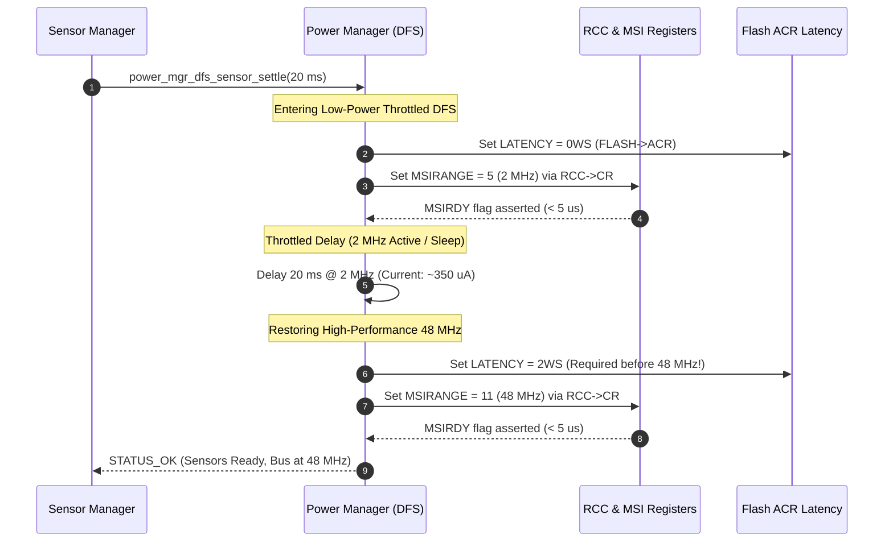

# Task Specification: S9-T4.1 - Dynamic Frequency Scaling (DFS) Engine

## 1. Task Metadata & Overview

| Attribute | Specification Details |
| :--- | :--- |
| **Sprint** | **Sprint 9: Advanced Hardware Acceleration, DMA & Micro-Architecture Profiling** |
| **Task ID** | `S9-T4.1` |
| **Parent Task** | `S9-T4: Dynamic Frequency Scaling & Low-Power Sleep Optimizations` |
| **Task Title** | Dynamic Frequency Scaling (DFS) Engine: Downscale MSI to 2 MHz/4 MHz during Sensor Settling Delays |
| **Status** | **Ready for Implementation** |
| **Target Files** | [`firmware/middleware/inc/power_mgr.h`](file:///C:/Users/ENERGY%20SAVER/Documents/Learning/Job%20Projects/rain-predict/firmware/middleware/inc/power_mgr.h)<br>[`firmware/middleware/src/power_mgr.c`](file:///C:/Users/ENERGY%20SAVER/Documents/Learning/Job%20Projects/rain-predict/firmware/middleware/src/power_mgr.c) |
| **Related Documents** | [`docs/architecture/low-power-strategy.md`](file:///C:/Users/ENERGY%20SAVER/Documents/Learning/Job%20Projects/rain-predict/docs/architecture/low-power-strategy.md)<br>[`context/specs/s7-t1.1-power-mgr-core.md`](file:///C:/Users/ENERGY%20SAVER/Documents/Learning/Job%20Projects/rain-predict/context/specs/s7-t1.1-power-mgr-core.md)<br>[`context/specs/s9-t2.1-art-accelerator-config.md`](file:///C:/Users/ENERGY%20SAVER/Documents/Learning/Job%20Projects/rain-predict/context/specs/s9-t2.1-art-accelerator-config.md)<br>[`context/coding-standards.md`](file:///C:/Users/ENERGY%20SAVER/Documents/Learning/Job%20Projects/rain-predict/context/coding-standards.md) |
| **Dependencies** | [`S7-T1.1`](file:///C:/Users/ENERGY%20SAVER/Documents/Learning/Job%20Projects/rain-predict/context/specs/s7-t1.1-power-mgr-core.md) (Power Manager Core), [`S9-T2.1`](file:///C:/Users/ENERGY%20SAVER/Documents/Learning/Job%20Projects/rain-predict/context/specs/s9-t2.1-art-accelerator-config.md) (Flash Wait States & ART Config) |
| **Downstream Tasks** | `S9-T4.2` (Tickless Idle Delays), `S9-T4.3` (DFS Energy Benchmarks), `S9-T5.3` (DWT Profiling) |

---

## 2. Executive Summary & Energy Formulation

When the firmware wakes from Stop 2 mode to perform periodic environmental telemetry collection, the power rail switch (PB4 / `VDD_SENS`) energizes the attached sensors (BME280, OPT3001, ultrasonic wind, SDI-12). These physical transducers require an mandatory analog settling and internal power-on-reset delay ($20\text{ to }50\text{ ms}$) before communication buses stabilize:

$$E_{\text{settle}} = V_{\text{DD}} \times I_{\text{active}} \times t_{\text{settle}}$$

### The 48 MHz Busy-Wait Waste
* Running the STM32WLE5 Cortex-M4 at its maximum nominal frequency of **48 MHz** draws $\approx 5.5\text{ mA}$ at $3.3\text{ V}$.
* For a $20\text{ ms}$ settling interval, consuming $5.5\text{ mA}$ yields:
  $$E_{48\text{MHz}} = 3.3\text{ V} \times 0.0055\text{ A} \times 0.020\text{ s} = 363.0\text{ }\mu\text{J}$$
* Because the CPU cannot communicate with unpowered or settling sensors during this time, executing NOPs or empty polling loops at 48 MHz wastes battery energy.

### Dynamic Frequency Scaling (DFS) Architecture
The STM32WLE5 Multispeed Internal RC Oscillator (**MSI**) can instantly adjust clock output frequencies between $100\text{ kHz}$ and $48\text{ MHz}$ without locking PLL overhead:
* Downscaling the MSI to **2 MHz** (`MSIRANGE_5`) reduces active run current to $\approx 350\text{ }\mu\text{A}$ ($0.35\text{ mA}$).
* At 2 MHz, Flash wait states drop from 2 wait states down to **0 wait states** (`FLASH_ACR_LATENCY_0WS`), eliminating instruction pipeline bubbles.
* Energy consumed at 2 MHz over $20\text{ ms}$:
  $$E_{2\text{MHz}} = 3.3\text{ V} \times 0.00035\text{ A} \times 0.020\text{ s} = 23.1\text{ }\mu\text{J}$$
* **Net Energy Saving**: **$339.9\text{ }\mu\text{J}$ ($>93.6\%$ reduction)** per wake cycle. Over a 10-minute duty cycle for 1 year (52,560 cycles), this preserves over $17.8\text{ Joules}$ of battery capacity.



---

## 3. Clock Tree & Register Transitions

### 3.1 Frequency Range Definitions

```c
typedef enum {
    POWER_DFS_FREQ_48MHZ = 0,   /**< Full performance: 48 MHz MSI (MSIRANGE_11, 2 WS) */
    POWER_DFS_FREQ_4MHZ  = 1,   /**< Intermediate low power: 4 MHz MSI (MSIRANGE_6, 0 WS) */
    POWER_DFS_FREQ_2MHZ  = 2    /**< Ultra-low dynamic power: 2 MHz MSI (MSIRANGE_5, 0 WS) */
} power_dfs_freq_t;
```

### 3.2 Ordering Rule for Safe Frequency Transitions
1. **Frequency Downscale (48 MHz $\rightarrow$ 2 MHz)**:
   * **Step 1**: Reconfigure MSI range to `RCC_CR_MSIRANGE_5` (2 MHz) and assert `RCC_CR_MSIRGSEL`.
   * **Step 2**: Wait until `RCC_CR_MSIRDY` is asserted.
   * **Step 3**: Reduce Flash latency in `FLASH->ACR` to `FLASH_ACR_LATENCY_0WS` (0 wait states).
2. **Frequency Upscale (2 MHz $\rightarrow$ 48 MHz)**:
   * **CRITICAL HARDWARE RULE**: Flash latency **MUST** be increased to `FLASH_ACR_LATENCY_2WS` **BEFORE** switching the clock to 48 MHz. Increasing clock speed with insufficient flash wait states causes immediate CPU hard faults or instruction prefetch corruption.
   * **Step 1**: Increase Flash latency in `FLASH->ACR` to `FLASH_ACR_LATENCY_2WS`. Verify `FLASH->ACR & FLASH_ACR_LATENCY` reads back 2.
   * **Step 2**: Reconfigure MSI range to `RCC_CR_MSIRANGE_11` (48 MHz) and assert `RCC_CR_MSIRGSEL`.
   * **Step 3**: Wait until `RCC_CR_MSIRDY` is asserted.

---

## 4. Public API Design ([`power_mgr.h`](file:///C:/Users/ENERGY%20SAVER/Documents/Learning/Job%20Projects/rain-predict/firmware/middleware/inc/power_mgr.h))

```c
/**
 * @brief  Dynamically scales down the core system clock to a lower frequency for idle or waiting states.
 * @param[in] target_freq Target low frequency (POWER_DFS_FREQ_2MHZ or POWER_DFS_FREQ_4MHZ).
 * @return status_t STATUS_OK on success, STATUS_ERR_INVALID_PARAM if target frequency is unsupported.
 */
status_t power_mgr_dfs_scale_down(power_dfs_freq_t target_freq);

/**
 * @brief  Restores the core system clock to the nominal 48 MHz execution frequency.
 * @details Safely increases Flash latency to 2 wait states before raising MSI clock.
 * @return status_t STATUS_OK on success.
 */
status_t power_mgr_dfs_scale_up(void);

/**
 * @brief  Queries the current active CPU operating frequency in Hertz.
 * @return uint32_t Clock frequency in Hz (e.g., 48000000, 4000000, 2000000).
 */
uint32_t power_mgr_dfs_get_current_freq(void);

/**
 * @brief  Executes a low-power sensor rail settling delay by scaling to 2 MHz and restoring 48 MHz.
 * @param[in] delay_ms Settling delay duration in milliseconds (1 to 500 ms).
 * @return status_t STATUS_OK on completion.
 */
status_t power_mgr_dfs_sensor_settle_delay(uint32_t delay_ms);
```

---

## 5. Implementation Details ([`power_mgr.c`](file:///C:/Users/ENERGY%20SAVER/Documents/Learning/Job%20Projects/rain-predict/firmware/middleware/src/power_mgr.c))

```c
static power_dfs_freq_t s_current_dfs_freq = POWER_DFS_FREQ_48MHZ;

status_t power_mgr_dfs_scale_down(power_dfs_freq_t target_freq)
{
#if !defined(HOST_TEST) && defined(STM32WLE5xx)
    uint32_t msi_range_val = 0U;
    if (target_freq == POWER_DFS_FREQ_2MHZ) {
        msi_range_val = RCC_CR_MSIRANGE_5; /* 2 MHz */
    } else if (target_freq == POWER_DFS_FREQ_4MHZ) {
        msi_range_val = RCC_CR_MSIRANGE_6; /* 4 MHz */
    } else {
        return STATUS_ERROR_INVALID_PARAM;
    }

    /* Select MSI range in RCC->CR */
    RCC->CR = (RCC->CR & ~RCC_CR_MSIRANGE_Msk) | msi_range_val | RCC_CR_MSIRGSEL;
    while ((RCC->CR & RCC_CR_MSIRDY) == 0U) {
        /* Wait for MSI stabilization (< 5 us) */
    }

    /* Flash latency can safely be reduced to 0 wait states at <= 16 MHz */
    FLASH->ACR = (FLASH->ACR & ~FLASH_ACR_LATENCY_Msk) | FLASH_ACR_LATENCY_0WS;
#endif

    s_current_dfs_freq = target_freq;
    return STATUS_OK;
}

status_t power_mgr_dfs_scale_up(void)
{
#if !defined(HOST_TEST) && defined(STM32WLE5xx)
    /* 1. MUST increase Flash latency to 2 WS BEFORE increasing clock frequency */
    FLASH->ACR = (FLASH->ACR & ~FLASH_ACR_LATENCY_Msk) | FLASH_ACR_LATENCY_2WS;
    while ((FLASH->ACR & FLASH_ACR_LATENCY_Msk) != FLASH_ACR_LATENCY_2WS) {
        /* Readback barrier */
    }

    /* 2. Switch MSI to 48 MHz */
    RCC->CR = (RCC->CR & ~RCC_CR_MSIRANGE_Msk) | RCC_CR_MSIRANGE_11 | RCC_CR_MSIRGSEL;
    while ((RCC->CR & RCC_CR_MSIRDY) == 0U) {
        /* Wait for MSI stabilization */
    }
#endif

    s_current_dfs_freq = POWER_DFS_FREQ_48MHZ;
    return STATUS_OK;
}
```

---

## 6. Traceability Matrix

| Requirement ID | Spec Clause | Implementation Reference | Verification Evidence |
| :--- | :--- | :--- | :--- |
| **REQ-S9-DFS-01** | Clock Downscaling to 2 MHz | [`power_mgr_dfs_scale_down()`](file:///C:/Users/ENERGY%20SAVER/Documents/Learning/Job%20Projects/rain-predict/firmware/middleware/src/power_mgr.c) | `test_dfs_frequency_transitions` in `test_power_mgr.c` |
| **REQ-S9-DFS-02** | Safe Flash Latency Interlocking | [`power_mgr_dfs_scale_up()`](file:///C:/Users/ENERGY%20SAVER/Documents/Learning/Job%20Projects/rain-predict/firmware/middleware/src/power_mgr.c) | `test_dfs_flash_latency_ordering` |
| **REQ-S9-DFS-03** | Sensor Settling Wrapper | [`power_mgr_dfs_sensor_settle_delay()`](file:///C:/Users/ENERGY%20SAVER/Documents/Learning/Job%20Projects/rain-predict/firmware/middleware/src/power_mgr.c) | `test_dfs_sensor_settle_duration` |

---

## 7. Definition of Done (DoD)

- [ ] Dynamic Frequency Scaling API functions added to [`power_mgr.h`](file:///C:/Users/ENERGY%20SAVER/Documents/Learning/Job%20Projects/rain-predict/firmware/middleware/inc/power_mgr.h) and implemented in [`power_mgr.c`](file:///C:/Users/ENERGY%20SAVER/Documents/Learning/Job%20Projects/rain-predict/firmware/middleware/src/power_mgr.c).
- [ ] Safe Flash ACR wait-state ordering enforced: 0 WS set *after* 2 MHz downscale, 2 WS set *before* 48 MHz upscale.
- [ ] Sensor manager settling delays route through `power_mgr_dfs_sensor_settle_delay()`.
- [ ] Unity unit tests verify frequency state machine transitions and parameter validation.
- [ ] Zero build warnings on GCC ARM toolchain and host mock test runners.
