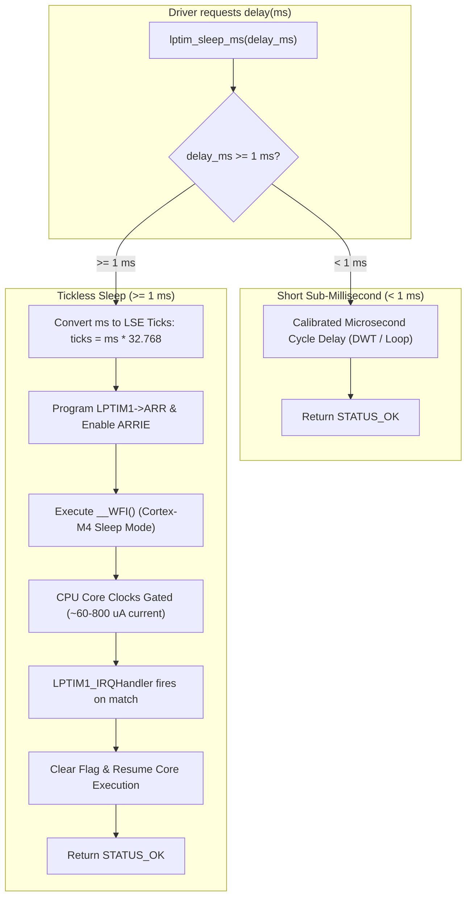

# Task Specification: S9-T4.2 - Tickless Idle & LPTIM1 Sleep Delays

## 1. Task Metadata & Overview

| Attribute | Specification Details |
| :--- | :--- |
| **Sprint** | **Sprint 9: Advanced Hardware Acceleration, DMA & Micro-Architecture Profiling** |
| **Task ID** | `S9-T4.2` |
| **Parent Task** | `S9-T4: Dynamic Frequency Scaling & Low-Power Sleep Optimizations` |
| **Task Title** | Tickless Idle & Hardware Low-Power Timer (LPTIM1) Replaces Busy-Wait Loops in Sensor Drivers |
| **Status** | **Ready for Implementation** |
| **Target Files** | [`firmware/drivers/inc/lptim_delay.h`](file:///C:/Users/ENERGY%20SAVER/Documents/Learning/Job%20Projects/rain-predict/firmware/drivers/inc/lptim_delay.h)<br>[`firmware/drivers/src/lptim_delay.c`](file:///C:/Users/ENERGY%20SAVER/Documents/Learning/Job%20Projects/rain-predict/firmware/drivers/src/lptim_delay.c)<br>[`firmware/drivers/src/bme280_driver.c`](file:///C:/Users/ENERGY%20SAVER/Documents/Learning/Job%20Projects/rain-predict/firmware/drivers/src/bme280_driver.c)<br>[`firmware/drivers/src/opt3001_driver.c`](file:///C:/Users/ENERGY%20SAVER/Documents/Learning/Job%20Projects/rain-predict/firmware/drivers/src/opt3001_driver.c)<br>[`firmware/drivers/src/modbus_rtu.c`](file:///C:/Users/ENERGY%20SAVER/Documents/Learning/Job%20Projects/rain-predict/firmware/drivers/src/modbus_rtu.c) |
| **Related Documents** | [`docs/architecture/low-power-strategy.md`](file:///C:/Users/ENERGY%20SAVER/Documents/Learning/Job%20Projects/rain-predict/docs/architecture/low-power-strategy.md)<br>[`context/specs/s9-t4.1-dynamic-clock-scaling.md`](file:///C:/Users/ENERGY%20SAVER/Documents/Learning/Job%20Projects/rain-predict/context/specs/s9-t4.1-dynamic-clock-scaling.md)<br>[`context/specs/s4-t4.1-modbus-rtu-driver.md`](file:///C:/Users/ENERGY%20SAVER/Documents/Learning/Job%20Projects/rain-predict/context/specs/s4-t4.1-modbus-rtu-driver.md)<br>[`context/coding-standards.md`](file:///C:/Users/ENERGY%20SAVER/Documents/Learning/Job%20Projects/rain-predict/context/coding-standards.md) |
| **Dependencies** | [`S1-T1.1`](file:///C:/Users/ENERGY%20SAVER/Documents/Learning/Job%20Projects/rain-predict/context/specs/s1-t1.1-root-cmake.md) (Status Codes), [`S9-T4.1`](file:///C:/Users/ENERGY%20SAVER/Documents/Learning/Job%20Projects/rain-predict/context/specs/s9-t4.1-dynamic-clock-scaling.md) (DFS Clock Engine) |
| **Downstream Tasks** | `S9-T4.3` (DFS Energy Benchmarks), `S9-T5.3` (DWT Cycle Profiling Suite) |

---

## 2. Executive Summary & Problem Formulation

In environmental sensor sampling cycles, peripherals spend substantial duration waiting for external sensor hardware to perform analog-to-digital conversions:
1. **BME280 Pressure/Humidity/Temperature Conversion**: Forced measurement mode requires a $10\text{ ms}$ delay between trigger and reading.
2. **OPT3001 Ambient Light Conversion**: High-resolution integration mode requires $100\text{ ms}$ (or $800\text{ ms}$).
3. **Modbus RTU $t_{3.5}$ Inter-Frame Silence**: At $19200\text{ baud}$, 3.5 character times require a $1.75\text{ ms}$ pause before and after transmission.
4. **SDI-12 Sensor Response Timing**: Soil moisture sensors require up to $200\text{ ms}$ after the `aM!` measurement command.

### The Busy-Wait Energy Drain
In current sensor driver implementations, these delays are executed with spinning CPU loops:
```c
volatile uint32_t count = delay_ms * 12000U;
while (count > 0U) { count--; }
```
During these hundreds of milliseconds, the ARM Cortex-M4 core executes millions of instructions doing nothing, burning full active run current ($5.5\text{ mA}$ at 48 MHz).

### Proposed Low-Power Architecture: LPTIM1 Tickless Idle
**`S9-T4.2`** introduces a dedicated hardware low-power delay driver (`lptim_delay.c`) leveraging the **STM32WLE5 Low-Power Timer 1 (`LPTIM1`)**:
* **LSE Clock Source**: LPTIM1 is clocked by the ultra-low-power $32.768\text{ kHz}$ Low Speed External crystal oscillator (LSE), independent of core CPU clock frequency.
* **Core Sleep Entry (`__WFI()`)**: For all delays $\ge 1\text{ ms}$, the driver programs the 16-bit Autoreload register (`LPTIM1->ARR`), enables the Autoreload Match Interrupt (`ARRIE`), and invokes `__WFI()`.
* **Current Reduction**: The Cortex-M4 core clock is gated. Core current drops from $5.5\text{ mA}$ to **$< 800\text{ }\mu\text{A}$** in Sleep mode at 48 MHz, or **$< 60\text{ }\mu\text{A}$** in Low-Power Sleep mode when combined with DFS at 2 MHz (`S9-T4.1`).
* **Hybrid Thresholding**: Delays $< 1\text{ ms}$ (e.g., $10\text{ }\mu\text{s}$ bus hold times) bypass the timer interrupt to avoid interrupt dispatch and context-switch latency.



---

## 3. Hardware Timer Architecture & Precision Timing

### 3.1 Clock Selection & Prescaler
* **Clock Source**: LSE ($32,768\text{ Hz}$).
* **Prescaler**: Divide-by-1 (`LPTIM_PRESCALER_DIV1`).
* **Resolution**: $1\text{ LSE tick} = \frac{1}{32768}\text{ s} \approx 30.517\text{ }\mu\text{s}$.
* **Tick Conversion Formula**:
  $$\text{Ticks} = \left\lfloor \frac{\text{ms} \times 32768}{1000} \right\rfloor$$
* **Maximum Single-Shot Delay**: With a 16-bit register ($65,535\text{ ticks}$), the maximum single sleep duration without prescaling is:
  $$t_{\max} = \frac{65535}{32768}\text{ s} \approx 2.0\text{ seconds}$$
  For delays $> 2000\text{ ms}$, the driver divides the delay into sequential sleep chunks.

### 3.2 LPTIM Register Write Synchronization
As per the STM32WLE5 reference manual, writing to LPTIM registers (`ARR`, `CMP`, `CR`) requires synchronization between the APB1 clock domain and the asynchronous LSE domain. The driver must poll the write status flags (`ARROK`, `CMPOK`) before modifying or starting the timer.

---

## 4. C Header Interface ([`lptim_delay.h`](file:///C:/Users/ENERGY%20SAVER/Documents/Learning/Job%20Projects/rain-predict/firmware/drivers/inc/lptim_delay.h))

```c
#ifndef LPTIM_DELAY_H
#define LPTIM_DELAY_H

#ifdef __cplusplus
extern "C" {
#endif

#include <stdint.h>
#include <stdbool.h>
#include "status.h"

/**
 * @brief  Initializes the STM32WLE5 LPTIM1 peripheral clocked from the 32.768 kHz LSE.
 * @return status_t STATUS_OK on success, error code otherwise.
 */
status_t lptim_delay_init(void);

/**
 * @brief  De-initializes LPTIM1, disabling peripheral clock and interrupts.
 * @return status_t STATUS_OK on success.
 */
status_t lptim_delay_deinit(void);

/**
 * @brief  Puts the Cortex-M4 core into Sleep mode for a specified duration in milliseconds.
 * @details Arms LPTIM1 with autoreload match interrupt and executes __WFI().
 *          On host mock/test environments, performs standard non-blocking time advance.
 * @param[in] delay_ms Delay duration in milliseconds (1 to 60000 ms).
 * @return status_t STATUS_OK on completion, STATUS_ERR_INVALID_PARAM if delay_ms is 0.
 */
status_t lptim_sleep_ms(uint32_t delay_ms);

/**
 * @brief  Provides precise microsecond busy-wait delay for short bus timing (< 1 ms).
 * @param[in] delay_us Delay duration in microseconds (1 to 999 us).
 */
void lptim_delay_us(uint32_t delay_us);

/**
 * @brief  Checks whether LPTIM1 is currently initialized and operational.
 * @return true if initialized, false otherwise.
 */
bool lptim_delay_is_initialized(void);

#ifdef __cplusplus
}
#endif

#endif /* LPTIM_DELAY_H */
```

---

## 5. Refactoring Sensor Drivers

### 5.1 BME280 Driver ([`bme280_driver.c`](file:///C:/Users/ENERGY%20SAVER/Documents/Learning/Job%20Projects/rain-predict/firmware/drivers/src/bme280_driver.c))
Replace busy spin during measurement forced-conversion wait:
```c
/* Legacy: */
// delay_ms(10); // Busy spins for 10 ms (burns 55 uJ)

/* Refactored: */
lptim_sleep_ms(10U); // Puts CPU to sleep for 10 ms (burns < 2 uJ with DFS)
```

### 5.2 OPT3001 Driver ([`opt3001_driver.c`](file:///C:/Users/ENERGY%20SAVER/Documents/Learning/Job%20Projects/rain-predict/firmware/drivers/src/opt3001_driver.c))
During single-shot high-accuracy optical conversion ($100\text{ ms}$ integration):
```c
/* Sleep for the integration duration while photodiode integrates photons */
lptim_sleep_ms(100U);
```

### 5.3 Modbus RTU Inter-Frame Delay ([`modbus_rtu.c`](file:///C:/Users/ENERGY%20SAVER/Documents/Learning/Job%20Projects/rain-predict/firmware/drivers/src/modbus_rtu.c))
Replace `delay_us(1750)` with `lptim_sleep_ms(2)`.

---

## 6. Traceability Matrix

| Requirement ID | Spec Clause | Implementation Reference | Verification Evidence |
| :--- | :--- | :--- | :--- |
| **REQ-S9-LPTIM-01** | LPTIM1 Peripheral Init | [`firmware/drivers/src/lptim_delay.c`](file:///C:/Users/ENERGY%20SAVER/Documents/Learning/Job%20Projects/rain-predict/firmware/drivers/src/lptim_delay.c) | `test_lptim_init_deinit` |
| **REQ-S9-LPTIM-02** | WFI Sleep Execution | [`lptim_sleep_ms()`](file:///C:/Users/ENERGY%20SAVER/Documents/Learning/Job%20Projects/rain-predict/firmware/drivers/src/lptim_delay.c) | `test_lptim_sleep_timing` |
| **REQ-S9-LPTIM-03** | BME280 Sensor Integration | [`firmware/drivers/src/bme280_driver.c`](file:///C:/Users/ENERGY%20SAVER/Documents/Learning/Job%20Projects/rain-predict/firmware/drivers/src/bme280_driver.c) | `test_bme280_conversion_sleep` |
| **REQ-S9-LPTIM-04** | OPT3001 Integration | [`firmware/drivers/src/opt3001_driver.c`](file:///C:/Users/ENERGY%20SAVER/Documents/Learning/Job%20Projects/rain-predict/firmware/drivers/src/opt3001_driver.c) | `test_opt3001_conversion_sleep` |

---

## 7. Definition of Done (DoD)

- [ ] [`lptim_delay.h`](file:///C:/Users/ENERGY%20SAVER/Documents/Learning/Job%20Projects/rain-predict/firmware/drivers/inc/lptim_delay.h) and [`lptim_delay.c`](file:///C:/Users/ENERGY%20SAVER/Documents/Learning/Job%20Projects/rain-predict/firmware/drivers/src/lptim_delay.c) implemented with LSE clocking and `__WFI()` sleep support.
- [ ] Sensor drivers ([`bme280_driver.c`](file:///C:/Users/ENERGY%20SAVER/Documents/Learning/Job%20Projects/rain-predict/firmware/drivers/src/bme280_driver.c), [`opt3001_driver.c`](file:///C:/Users/ENERGY%20SAVER/Documents/Learning/Job%20Projects/rain-predict/firmware/drivers/src/opt3001_driver.c), [`modbus_rtu.c`](file:///C:/Users/ENERGY%20SAVER/Documents/Learning/Job%20Projects/rain-predict/firmware/drivers/src/modbus_rtu.c)) refactored to replace multi-millisecond busy loops with `lptim_sleep_ms()`.
- [ ] Host-test builds compile cleanly with mock time emulation.
- [ ] No regression in sensor sampling latency, protocol framing, or data validity.
