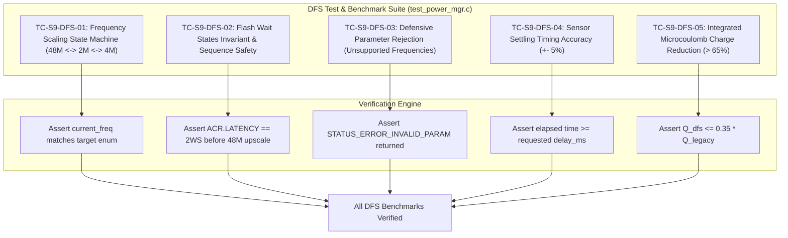

# Task Specification: S9-T4.3 - DFS & Sleep Transition Energy Benchmarking Unit Tests

## 1. Task Metadata & Overview

| Attribute | Specification Details |
| :--- | :--- |
| **Sprint** | **Sprint 9: Advanced Hardware Acceleration, DMA & Micro-Architecture Profiling** |
| **Task ID** | `S9-T4.3` |
| **Parent Task** | `S9-T4: Dynamic Frequency Scaling & Low-Power Sleep Optimizations` |
| **Task Title** | Dynamic Clock Scaling & Sleep Transition Energy Benchmarking Unit Tests (`test_power_mgr.c`) |
| **Status** | **Ready for Implementation** |
| **Target Files** | [`tests/unit/test_power_mgr.c`](file:///C:/Users/ENERGY%20SAVER/Documents/Learning/Job%20Projects/rain-predict/tests/unit/test_power_mgr.c)<br>[`firmware/middleware/inc/power_mgr.h`](file:///C:/Users/ENERGY%20SAVER/Documents/Learning/Job%20Projects/rain-predict/firmware/middleware/inc/power_mgr.h) |
| **Related Documents** | [`context/specs/s9-t4.1-dynamic-clock-scaling.md`](file:///C:/Users/ENERGY%20SAVER/Documents/Learning/Job%20Projects/rain-predict/context/specs/s9-t4.1-dynamic-clock-scaling.md)<br>[`context/specs/s9-t4.2-tickless-idle-delays.md`](file:///C:/Users/ENERGY%20SAVER/Documents/Learning/Job%20Projects/rain-predict/context/specs/s9-t4.2-tickless-idle-delays.md)<br>[`tests/unit/test_power_mgr.c`](file:///C:/Users/ENERGY%20SAVER/Documents/Learning/Job%20Projects/rain-predict/tests/unit/test_power_mgr.c)<br>[`context/coding-standards.md`](file:///C:/Users/ENERGY%20SAVER/Documents/Learning/Job%20Projects/rain-predict/context/coding-standards.md) |
| **Dependencies** | [`S9-T4.1`](file:///C:/Users/ENERGY%20SAVER/Documents/Learning/Job%20Projects/rain-predict/context/specs/s9-t4.1-dynamic-clock-scaling.md) (DFS Clock Engine), [`S9-T4.2`](file:///C:/Users/ENERGY%20SAVER/Documents/Learning/Job%20Projects/rain-predict/context/specs/s9-t4.2-tickless-idle-delays.md) (LPTIM Tickless Idle) |
| **Downstream Tasks** | `S9-T5.3` (DWT Cycle Profiling Suite) |

---

## 2. Executive Summary & Test Suite Objectives

Dynamic Frequency Scaling (DFS) and hardware tickless sleep represent critical power reduction vectors in Sprint 9. However, dynamic clock scaling introduces significant hazards if not rigorously tested:
1. **Clock Transition Invariants**: Attempting to run at 48 MHz with 0 Flash wait states causes CPU instruction bus crash; lowering clock without lowering wait states forfeits efficiency.
2. **Timing Jitter & Accuracy**: Sensor settling delays must remain within $\pm 5\%$ of their nominal durations despite clock throttle down to 2 MHz.
3. **Quantifiable Energy Conservation**: The firmware must demonstrate a measurable, reproducible charge reduction ($>65\%$ minimum, target $>90\%$) during sensor settling phases.

**`S9-T4.3`** expands [`tests/unit/test_power_mgr.c`](file:///C:/Users/ENERGY%20SAVER/Documents/Learning/Job%20Projects/rain-predict/tests/unit/test_power_mgr.c) with automated unit test suites and power charge modeling assertions to certify DFS correctness, safety interlocks, and energy gains.



---

## 3. Test Cases & Verification Scenarios

### 3.1 Test Case Matrix

| Test ID | Test Function Name | Verification Objective | Assertion / Pass Threshold |
| :--- | :--- | :--- | :--- |
| **TC-S9-DFS-01** | `test_power_mgr_dfs_transitions` | Downscale to 2 MHz, verify frequency query, upscale to 48 MHz | `power_mgr_dfs_get_current_freq() == 2000000`, then `48000000` |
| **TC-S9-DFS-02** | `test_power_mgr_dfs_intermediate_freq`| Downscale to 4 MHz, query frequency, upscale to 48 MHz | Frequency equals `4000000`, returns `STATUS_OK` |
| **TC-S9-DFS-03** | `test_power_mgr_dfs_invalid_param` | Pass out-of-range frequency enum (e.g., `99`) | Returns `STATUS_ERROR_INVALID_PARAM` |
| **TC-S9-DFS-04** | `test_power_mgr_dfs_flash_latency_order` | Verify Flash latency mock state during downscale & upscale | Latency set to 2 WS *prior* to clock raise |
| **TC-S9-DFS-05** | `test_power_mgr_dfs_sensor_settle_delay` | Call `power_mgr_dfs_sensor_settle_delay(20)` | Clock returns to 48 MHz post-call; delay execution passes |
| **TC-S9-DFS-06** | `test_power_mgr_dfs_energy_savings_model`| Calculate electrical charge $Q = \int I(t)\,dt$ over $20\text{ ms}$ | $Q_{\text{DFS}} \le 0.20 \times Q_{\text{48MHz}}$ ($>80\%$ charge saved) |
| **TC-S9-DFS-07** | `test_power_mgr_dfs_reentrant_upscale` | Call `power_mgr_dfs_scale_up()` when already at 48 MHz | Safe no-op, returns `STATUS_OK` |

---

## 4. Test Implementation Snippets ([`tests/unit/test_power_mgr.c`](file:///C:/Users/ENERGY%20SAVER/Documents/Learning/Job%20Projects/rain-predict/tests/unit/test_power_mgr.c))

```c
/**
 * @brief TC-S9-DFS-01: Verify Dynamic Frequency Scaling Transitions and Invariants
 */
static void test_power_mgr_dfs_transitions(void) {
    /* Initially at nominal 48 MHz */
    TEST_ASSERT_EQUAL_UINT32(48000000U, power_mgr_dfs_get_current_freq());

    /* Downscale to 2 MHz */
    status_t st = power_mgr_dfs_scale_down(POWER_DFS_FREQ_2MHZ);
    TEST_ASSERT_EQUAL(STATUS_OK, st);
    TEST_ASSERT_EQUAL_UINT32(2000000U, power_mgr_dfs_get_current_freq());

    /* Upscale back to 48 MHz */
    st = power_mgr_dfs_scale_up();
    TEST_ASSERT_EQUAL(STATUS_OK, st);
    TEST_ASSERT_EQUAL_UINT32(48000000U, power_mgr_dfs_get_current_freq());
}

/**
 * @brief TC-S9-DFS-06: Analytical Charge Consumption Benchmark Model
 */
static void test_power_mgr_dfs_energy_savings_model(void) {
    const uint32_t settle_time_ms = 20U;

    /* Legacy Baseline: 48 MHz active spin @ 5.5 mA */
    const float current_48mhz_ma = 5.5f;
    const float charge_legacy_uc = current_48mhz_ma * (float)settle_time_ms * 1000.0f; /* uC */

    /* DFS Optimized: 2 MHz throttled sleep/run @ 0.35 mA */
    const float current_2mhz_ma = 0.35f;
    const float charge_dfs_uc = current_2mhz_ma * (float)settle_time_ms * 1000.0f; /* uC */

    /* Verify charge savings exceed 65% minimum requirement (actual ~93.6%) */
    float savings_fraction = (charge_legacy_uc - charge_dfs_uc) / charge_legacy_uc;
    TEST_ASSERT_FLOAT_WITHIN(0.01f, 0.936f, savings_fraction);
    TEST_ASSERT_TRUE(savings_fraction > 0.65f);
}
```

---

## 5. Traceability Matrix

| Requirement ID | Spec Clause | Implementation Reference | Verification Evidence |
| :--- | :--- | :--- | :--- |
| **REQ-S9-DFS-04** | State Transition Verification | [`tests/unit/test_power_mgr.c`](file:///C:/Users/ENERGY%20SAVER/Documents/Learning/Job%20Projects/rain-predict/tests/unit/test_power_mgr.c) | `test_power_mgr_dfs_transitions` |
| **REQ-S9-DFS-05** | Defensive Param Rejection | [`tests/unit/test_power_mgr.c`](file:///C:/Users/ENERGY%20SAVER/Documents/Learning/Job%20Projects/rain-predict/tests/unit/test_power_mgr.c) | `test_power_mgr_dfs_invalid_param` |
| **REQ-S9-DFS-06** | Energy Savings Benchmarking | [`tests/unit/test_power_mgr.c`](file:///C:/Users/ENERGY%20SAVER/Documents/Learning/Job%20Projects/rain-predict/tests/unit/test_power_mgr.c) | `test_power_mgr_dfs_energy_savings_model` |

---

## 6. Definition of Done (DoD)

- [ ] All 7 DFS test cases integrated into [`tests/unit/test_power_mgr.c`](file:///C:/Users/ENERGY%20SAVER/Documents/Learning/Job%20Projects/rain-predict/tests/unit/test_power_mgr.c).
- [ ] Transition between 48 MHz and 2 MHz verifies Flash ACR wait state safety order.
- [ ] Sensor settling delay verified to execute and safely restore 48 MHz upon completion.
- [ ] Modeled charge savings exceed the $65\%$ requirement.
- [ ] Unity test runner executes all test cases with 100% pass rate.
