# Task Specification: S9-T5.1 - LTO, Dead Code Stripping & Per-Module Optimization

## 1. Task Metadata & Overview

| Attribute | Specification Details |
| :--- | :--- |
| **Sprint** | **Sprint 9: Advanced Hardware Acceleration, DMA & Micro-Architecture Profiling** |
| **Task ID** | `S9-T5.1` |
| **Parent Task** | `S9-T5: Toolchain Optimization, Lock-Free Concurrency & Profiling` |
| **Task Title** | Link-Time Optimization (LTO), Section Garbage Collection, and Per-Module Compiler Optimization |
| **Status** | **Ready for Implementation** |
| **Target Files** | [`cmake/CompilerFlags.cmake`](file:///C:/Users/ENERGY%20SAVER/Documents/Learning/Job%20Projects/rain-predict/cmake/CompilerFlags.cmake)<br>[`CMakeLists.txt`](file:///C:/Users/ENERGY%20SAVER/Documents/Learning/Job%20Projects/rain-predict/CMakeLists.txt)<br>[`firmware/app/CMakeLists.txt`](file:///C:/Users/ENERGY%20SAVER/Documents/Learning/Job%20Projects/rain-predict/firmware/app/CMakeLists.txt) |
| **Related Documents** | [`context/specs/s1-t1.1-root-cmake.md`](file:///C:/Users/ENERGY%20SAVER/Documents/Learning/Job%20Projects/rain-predict/context/specs/s1-t1.1-root-cmake.md)<br>[`context/specs/s6-t1.1-nowcasting-engine.md`](file:///C:/Users/ENERGY%20SAVER/Documents/Learning/Job%20Projects/rain-predict/context/specs/s6-t1.1-nowcasting-engine.md)<br>[`context/coding-standards.md`](file:///C:/Users/ENERGY%20SAVER/Documents/Learning/Job%20Projects/rain-predict/context/coding-standards.md) |
| **Dependencies** | [`S1-T1.1`](file:///C:/Users/ENERGY%20SAVER/Documents/Learning/Job%20Projects/rain-predict/context/specs/s1-t1.1-root-cmake.md) (Root CMake Configuration) |
| **Downstream Tasks** | `S9-T5.3` (DWT Cycle Profiling Suite) |

---

## 2. Executive Summary & Toolchain Motivation

In resource-constrained microcontrollers like the STM32WLE5 ($256\text{ KB Flash}$, $64\text{ KB SRAM}$), default compiler configurations leave substantial performance and flash headroom untapped:
1. **Compilation Unit Isolation**: Without Link-Time Optimization (**LTO**), the C compiler processes each `.c` source file in isolation. The linker merely resolves symbol addresses without the ability to inline frequently called helper functions across translation units (such as register writes from `bsp_power_rails.c` into `sensor_mgr.c`).
2. **Binary Bloat from Unreferenced Symbols**: Standard compilation lumps all functions in a translation unit into a single `.text` section. If an application references just one function from a module, the entire module's code and constants are linked into flash.
3. **Suboptimal Blanket Optimization**: Using a single global optimization flag (such as `-Os` or `-O2`) imposes a compromise: mathematical models ([`nowcasting_engine.c`](file:///C:/Users/ENERGY%20SAVER/Documents/Learning/Job%20Projects/rain-predict/firmware/app/src/nowcasting_engine.c)) miss vectorization and aggressive loop unrolling opportunities offered by `-O3`, while non-critical drivers and setup routines suffer from size expansion.

### The Sprint 9 Optimization Strategy
**`S9-T5.1`** implements a multi-tiered compilation pipeline in CMake:
* **Section-Level Granularity**: Applies `-ffunction-sections -fdata-sections` across all targets.
* **Linker Dead-Code Stripping**: Applies `-Wl,--gc-sections` to prune unreferenced functions and unused lookup tables.
* **Link-Time Optimization (`-flto`)**: Enables interprocedural optimization, allowing the compiler to perform cross-file function inlining, global constant propagation, and dead register elimination across the entire application binary.
* **Per-Module Tuning**:
  * `-O3` with loop unrolling for high-compute numerical algorithms ([`nowcasting_engine.c`](file:///C:/Users/ENERGY%20SAVER/Documents/Learning/Job%20Projects/rain-predict/firmware/app/src/nowcasting_engine.c) and heuristic decision trees).
  * `-Os` (Optimize for size) for initialization, peripheral HAL drivers, and error handling.
* **Map File Generation**: Emits detailed memory map (`-Wl,-Map=firmware.map,--cref`) for automated symbol and size auditing in CI.

```mermaid
flowchart TD
    subgraph TraditionalBuild["Traditional Compilation (Separate Units)"]
        SrcA["source_a.c"] --> ObjA["source_a.o (.text, .data)"]
        SrcB["source_b.c"] --> ObjB["source_b.o (.text, .data)"]
        ObjA & ObjB --> Link1["Linker (Concatenation Only)"]
        Link1 --> Bin1["Bloated Binary (Unused code included, no cross-file inline)"]
    end

    subgraph LTOBuild["Sprint 9 LTO Pipeline (-flto + -ffunction-sections + --gc-sections)"]
        Src1["nowcasting_engine.c (-O3)"] --> GIMPLE1["GIMPLE Bytecode IR (.o)"]
        Src2["sensor_mgr.c (-Os)"] --> GIMPLE2["GIMPLE Bytecode IR (.o)"]
        GIMPLE1 & GIMPLE2 --> LTOLink["LTO Linker (Whole-Program Optimizer)"]
        LTOLink --> Opt1["Cross-Module Inlining"]
        Opt1 --> Opt2["Global Dead Code & Variable Stripping (--gc-sections)"]
        Opt2 --> Bin2["Optimized Firmware Binary (-15% Flash Size, +20% Compute Speed)"]
    end
```



---

## 3. CMake Architectural Changes

### 3.1 New Build Options ([`CMakeLists.txt`](file:///C:/Users/ENERGY%20SAVER/Documents/Learning/Job%20Projects/rain-predict/CMakeLists.txt))

```cmake
# Build Options
option(ENABLE_LTO               "Enable Link-Time Optimization (-flto)" ON)
option(ENABLE_SECTION_GC        "Enable Section-Level Garbage Collection (--gc-sections)" ON)
option(GENERATE_MAP_FILE        "Generate detailed linker memory map file" ON)
```

### 3.2 Compiler and Linker Flags ([`cmake/CompilerFlags.cmake`](file:///C:/Users/ENERGY%20SAVER/Documents/Learning/Job%20Projects/rain-predict/cmake/CompilerFlags.cmake))

```cmake
# Section-level compilation flags
if(ENABLE_SECTION_GC)
    add_compile_options(
        -ffunction-sections
        -fdata-sections
    )
endif()

# Link-Time Optimization (LTO)
if(ENABLE_LTO)
    message(STATUS "Enabling Link-Time Optimization (-flto)")
    add_compile_options(-flto)
    add_link_options(-flto)
endif()

# Embedded Target Linker Flags
if(CMAKE_CROSSCOMPILING)
    if(ENABLE_SECTION_GC)
        add_link_options(-Wl,--gc-sections)
    endif()
    if(GENERATE_MAP_FILE)
        add_link_options(-Wl,-Map=${CMAKE_PROJECT_NAME}.map,--cref)
    endif()
endif()
```

### 3.3 Per-Module Differential Optimization ([`firmware/app/CMakeLists.txt`](file:///C:/Users/ENERGY%20SAVER/Documents/Learning/Job%20Projects/rain-predict/firmware/app/CMakeLists.txt))

To maximize nowcasting classification speed while maintaining compact size:
```cmake
# Apply aggressive -O3 loop optimization specifically to compute-heavy nowcasting algorithms
set_source_files_properties(
    src/nowcasting_engine.c
    PROPERTIES
    COMPILE_OPTIONS "-O3;-funroll-loops"
)
```

---

## 4. Flash and RAM Size Budgets

| Memory Region | Base Target | With S9-T5.1 LTO + GC | Headroom Improvement |
| :--- | :--- | :--- | :--- |
| **Flash (`.text` + `.rodata`)** | $\le 96\text{ KB}$ | $\le 82\text{ KB}$ | $\approx 14\text{ KB}$ saved ($14.5\%$) |
| **SRAM1 (`.data` + `.bss`)** | $\le 24\text{ KB}$ | $\le 21\text{ KB}$ | $\approx 3\text{ KB}$ saved ($12.5\%$) |
| **Nowcasting Loop Execution** | $850\text{ cycles}$ | $< 620\text{ cycles}$ | $> 27\%$ execution acceleration |

---

## 5. Verification & CI Automation

1. **Host & Target Dual Verification**:
   - Verify that enabling LTO does not break native desktop test compilation or symbol visibility in ThrowTheSwitch Unity test suites.
   - For host builds, AddressSanitizer (`ENABLE_ASAN`) remains compatible by disabling LTO conditionally if toolchain conflicts occur.
2. **CI Binary Size Tracking**:
   - In `.github/workflows/ci.yml`, execute `arm-none-eabi-size --format=berkeley firmware.elf` and assert Flash usage $\le 128\text{ KB}$ and SRAM usage $\le 32\text{ KB}$.
3. **Linker Map Inspection**:
   - Parse `firmware.map` to confirm that unused symbols from inactive HAL features or unused LUTs are stripped under `--gc-sections`.

---

## 6. Traceability Matrix

| Requirement ID | Spec Clause | Implementation Reference | Verification Evidence |
| :--- | :--- | :--- | :--- |
| **REQ-S9-LTO-01** | Section Garbage Collection | [`cmake/CompilerFlags.cmake`](file:///C:/Users/ENERGY%20SAVER/Documents/Learning/Job%20Projects/rain-predict/cmake/CompilerFlags.cmake) | `-Wl,--gc-sections` in target link flags |
| **REQ-S9-LTO-02** | Link-Time Optimization | [`cmake/CompilerFlags.cmake`](file:///C:/Users/ENERGY%20SAVER/Documents/Learning/Job%20Projects/rain-predict/cmake/CompilerFlags.cmake) | `-flto` verified in build commands |
| **REQ-S9-LTO-03** | Differential `-O3` Optimization| [`firmware/app/CMakeLists.txt`](file:///C:/Users/ENERGY%20SAVER/Documents/Learning/Job%20Projects/rain-predict/firmware/app/CMakeLists.txt) | `nowcasting_engine.c` compiles with `-O3` |
| **REQ-S9-LTO-04** | Map File Emission | [`CMakeLists.txt`](file:///C:/Users/ENERGY%20SAVER/Documents/Learning/Job%20Projects/rain-predict/CMakeLists.txt) | `firmware.map` generated in build artifacts |

---

## 7. Definition of Done (DoD)

- [ ] [`cmake/CompilerFlags.cmake`](file:///C:/Users/ENERGY%20SAVER/Documents/Learning/Job%20Projects/rain-predict/cmake/CompilerFlags.cmake) updated with `ENABLE_LTO`, `ENABLE_SECTION_GC`, and map file generation options.
- [ ] [`firmware/app/CMakeLists.txt`](file:///C:/Users/ENERGY%20SAVER/Documents/Learning/Job%20Projects/rain-predict/firmware/app/CMakeLists.txt) configures `-O3` for `nowcasting_engine.c`.
- [ ] Zero build regressions in cross-compilation with `arm-none-eabi-gcc`.
- [ ] Host testing with Unity and CTest executes cleanly without symbol stripping issues.
- [ ] Memory map file verifies $>10\text{ KB}$ Flash savings through dead code removal.
