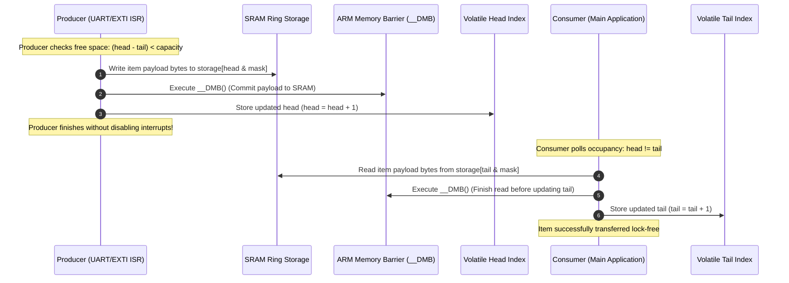

# Task Specification: S9-T5.2 - Lock-Free SPSC Ring Buffer Queue

## 1. Task Metadata & Overview

| Attribute | Specification Details |
| :--- | :--- |
| **Sprint** | **Sprint 9: Advanced Hardware Acceleration, DMA & Micro-Architecture Profiling** |
| **Task ID** | `S9-T5.2` |
| **Parent Task** | `S9-T5: Toolchain Optimization, Lock-Free Concurrency & Profiling` |
| **Task Title** | Single-Producer Single-Consumer (SPSC) Lock-Free Ring Buffer with Memory Barriers (`ring_buffer`) |
| **Status** | **Ready for Implementation** |
| **Target Files** | [`firmware/middleware/inc/ring_buffer.h`](file:///C:/Users/ENERGY%20SAVER/Documents/Learning/Job%20Projects/rain-predict/firmware/middleware/inc/ring_buffer.h)<br>[`firmware/middleware/src/ring_buffer.c`](file:///C:/Users/ENERGY%20SAVER/Documents/Learning/Job%20Projects/rain-predict/firmware/middleware/src/ring_buffer.c)<br>[`tests/unit/test_ring_buffer.c`](file:///C:/Users/ENERGY%20SAVER/Documents/Learning/Job%20Projects/rain-predict/tests/unit/test_ring_buffer.c) |
| **Related Documents** | [`context/specs/s5-t2.1-ring-buffer-driver.md`](file:///C:/Users/ENERGY%20SAVER/Documents/Learning/Job%20Projects/rain-predict/context/specs/s5-t2.1-ring-buffer-driver.md)<br>[`context/specs/s9-t1.2-uart-dma-idle-line.md`](file:///C:/Users/ENERGY%20SAVER/Documents/Learning/Job%20Projects/rain-predict/context/specs/s9-t1.2-uart-dma-idle-line.md)<br>[`context/coding-standards.md`](file:///C:/Users/ENERGY%20SAVER/Documents/Learning/Job%20Projects/rain-predict/context/coding-standards.md) |
| **Dependencies** | [`S5-T2.1`](file:///C:/Users/ENERGY%20SAVER/Documents/Learning/Job%20Projects/rain-predict/context/specs/s5-t2.1-ring-buffer-driver.md) (Original Ring Buffer Driver) |
| **Downstream Tasks** | `S9-T5.3` (DWT Cycle Profiling Suite) |

---

## 2. Executive Summary & Concurrency Hazard

In real-time firmware, high-speed data exchanges frequently occur between an **Interrupt Service Routine (ISR)** and the **Main Thread (Foreground Task)**:
* **UART/LPUART RX DMA Half-Transfer & IDLE Line ISR** pushing received byte frames into a staging buffer.
* **Rain Gauge EXTI0 Pulse ISR** pushing microsecond timestamped tips into an event queue.
* **Main Loop** popping and processing telemetry frames for sensor decoders and nowcasting algorithms.

### The Critical Section & Race Condition Flaw
In the standard circular buffer implementation ([`s5-t2.1-ring-buffer-driver.md`](file:///C:/Users/ENERGY%20SAVER/Documents/Learning/Job%20Projects/rain-predict/context/specs/s5-t2.1-ring-buffer-driver.md)):
1. Both `ring_buffer_push()` and `ring_buffer_pop()` manipulate a shared counter variable: `p_rb->count`.
2. Modifying `count` is a multi-instruction Read-Modify-Write sequence (`LDR`, `ADDS`/`SUBS`, `STR`). If an interrupt preempts the main thread between `LDR` and `STR`, `count` becomes corrupted, leading to lost events or phantom buffer overruns.
3. Common embedded workarounds wrap operations in `__disable_irq()` / `__enable_irq()`. However, disabling global interrupts introduces **interrupt latency jitter** ($\ge 5\text{ to }15\text{ }\mu\text{s}$), which can cause LoRa RF packet timing degradation or missed ADC watchdog events.

### The Lock-Free SPSC Solution
**`S9-T5.2`** enhances the ring buffer architecture by implementing a **Single-Producer Single-Consumer (SPSC) Lock-Free Ring Buffer**:
* **Lamport Asymmetric Single-Writer Invariant**:
  * Only the **Producer** (e.g., ISR) modifies `head`.
  * Only the **Consumer** (e.g., Main Thread) modifies `tail`.
  * The shared `count` variable is eliminated; occupancy and free space are computed mathematically on demand from `head` and `tail`.
* **Power-of-Two Geometry ($2^N$)**: Buffer capacity is constrained to $2^N$, replacing slow division instructions (`UDIV`, taking $2\dots 12$ cycles) with single-cycle bitwise masking (`head & (capacity - 1)`).
* **ARM Data Memory Barrier (`__DMB()`)**: Ensures payload bytes written to SRAM are committed to memory before updating the cursor index, preventing out-of-order CPU memory pipeline hazards.
* **Zero Disabling of Interrupts**: Full thread-safety with zero interrupt disabling, guaranteeing $0\text{ ns}$ additional interrupt latency.



---

## 3. Mathematical Formulation & Rollover Mechanics

### 3.1 Unbounded Monotonic Indexing
Instead of modulo wrapping the index on every single push/pop, `head` and `tail` are maintained as unsigned 32-bit integers (`uint32_t`) that increment monotonically:
* **Occupancy Calculation**:
  $$\text{Items Available} = \text{head} - \text{tail}$$
* **Free Space Calculation**:
  $$\text{Free Slots} = \text{capacity} - (\text{head} - \text{tail})$$
* **Storage Array Index**:
  $$\text{Slot Index} = \text{index} \ \& \ (\text{capacity} - 1)$$
* **Unsigned 32-bit Rollover Invariance**: When `head` overflows from `0xFFFFFFFF` to `0x00000000`, standard two's-complement arithmetic ensures `head - tail` remains 100% mathematically correct without branching.

---

## 4. C Interface & Data Structures ([`ring_buffer.h`](file:///C:/Users/ENERGY%20SAVER/Documents/Learning/Job%20Projects/rain-predict/firmware/middleware/inc/ring_buffer.h))

```c
/**
 * @brief Single-Producer Single-Consumer (SPSC) Lock-Free Ring Buffer Control Block.
 * @note  Capacity MUST be an exact power of 2 (e.g., 16, 32, 64, 128, 256).
 */
typedef struct {
    uint8_t            *p_storage;   /**< Pointer to caller-allocated contiguous byte storage */
    uint32_t            capacity;    /**< Maximum item capacity (must be power of 2) */
    uint32_t            mask;        /**< Bitwise mask: (capacity - 1) */
    uint16_t            item_size;   /**< Size in bytes of each item element */
    volatile uint32_t   head;        /**< Monotonic write cursor (written ONLY by Producer) */
    volatile uint32_t   tail;        /**< Monotonic read cursor (written ONLY by Consumer) */
} ring_buffer_spsc_t;

/**
 * @brief  Initializes a lock-free SPSC circular queue.
 * @param[out] p_rb      Pointer to SPSC ring buffer structure.
 * @param[in]  p_storage Pre-allocated byte buffer.
 * @param[in]  capacity  Capacity in items (MUST be a power of 2: 8, 16, 32, 64, etc.).
 * @param[in]  item_size Size in bytes of each element.
 * @return status_t STATUS_OK on success, STATUS_ERR_INVALID_PARAM if capacity is not power-of-2.
 */
status_t ring_buffer_spsc_init(ring_buffer_spsc_t *p_rb,
                               void *p_storage,
                               uint32_t capacity,
                               uint16_t item_size);

/**
 * @brief  Pushes an item into the queue without locking or disabling interrupts (Producer context).
 * @param[in,out] p_rb Pointer to SPSC ring buffer.
 * @param[in]     p_item Pointer to item data to copy.
 * @return status_t STATUS_OK on success, STATUS_ERR_BUSY if buffer is full.
 */
status_t ring_buffer_spsc_push(ring_buffer_spsc_t *p_rb, const void *p_item);

/**
 * @brief  Pops an item from the queue without locking or disabling interrupts (Consumer context).
 * @param[in,out] p_rb Pointer to SPSC ring buffer.
 * @param[out]    p_item Destination buffer to copy item data into.
 * @return status_t STATUS_OK on success, STATUS_ERR_EMPTY if buffer is empty.
 */
status_t ring_buffer_spsc_pop(ring_buffer_spsc_t *p_rb, void *p_item);

/**
 * @brief  Peeks at the oldest item without advancing the tail cursor.
 * @param[in]  p_rb Pointer to SPSC ring buffer.
 * @param[out] p_item Destination buffer.
 * @return status_t STATUS_OK on success, STATUS_ERR_EMPTY if buffer is empty.
 */
status_t ring_buffer_spsc_peek(const ring_buffer_spsc_t *p_rb, void *p_item);

/**
 * @brief  Queries number of available items currently ready for reading.
 * @param[in] p_rb Pointer to SPSC ring buffer.
 * @return uint32_t Number of queued items (0 to capacity).
 */
uint32_t ring_buffer_spsc_available(const ring_buffer_spsc_t *p_rb);

/**
 * @brief  Queries remaining empty slots available for writing.
 * @param[in] p_rb Pointer to SPSC ring buffer.
 * @return uint32_t Number of free slots (0 to capacity).
 */
uint32_t ring_buffer_spsc_free_space(const ring_buffer_spsc_t *p_rb);
```

---

## 5. Implementation Details & Memory Barriers ([`ring_buffer.c`](file:///C:/Users/ENERGY%20SAVER/Documents/Learning/Job%20Projects/rain-predict/firmware/middleware/src/ring_buffer.c))

```c
#if defined(__arm__) || defined(__thumb__)
#define MEMORY_BARRIER() __asm volatile("dmb 0xF" ::: "memory")
#else
#define MEMORY_BARRIER() do {} while (0)
#endif

status_t ring_buffer_spsc_push(ring_buffer_spsc_t *p_rb, const void *p_item)
{
    if (p_rb == NULL || p_item == NULL) {
        return STATUS_ERROR_NULL_POINTER;
    }

    uint32_t current_head = p_rb->head;
    uint32_t current_tail = p_rb->tail;

    /* Full condition: (head - tail) >= capacity */
    if ((current_head - current_tail) >= p_rb->capacity) {
        return STATUS_ERROR_BUSY; /* Queue is full */
    }

    /* Compute destination slot using bitwise mask */
    uint32_t slot = current_head & p_rb->mask;
    uint8_t *p_dest = &p_rb->p_storage[slot * (uint32_t)p_rb->item_size];

    /* Copy payload */
    memcpy(p_dest, p_item, p_rb->item_size);

    /* Data Memory Barrier: Ensure RAM write completes before head is updated */
    MEMORY_BARRIER();

    /* Monotonically advance head (Atomic 32-bit store) */
    p_rb->head = current_head + 1U;

    return STATUS_OK;
}

status_t ring_buffer_spsc_pop(ring_buffer_spsc_t *p_rb, void *p_item)
{
    if (p_rb == NULL || p_item == NULL) {
        return STATUS_ERROR_NULL_POINTER;
    }

    uint32_t current_head = p_rb->head;
    uint32_t current_tail = p_rb->tail;

    /* Empty condition: head == tail */
    if (current_head == current_tail) {
        return STATUS_ERROR_EMPTY;
    }

    /* Compute source slot */
    uint32_t slot = current_tail & p_rb->mask;
    const uint8_t *p_src = &p_rb->p_storage[slot * (uint32_t)p_rb->item_size];

    /* Copy payload */
    memcpy(p_item, p_src, p_rb->item_size);

    /* Data Memory Barrier: Ensure RAM read completes before tail is updated */
    MEMORY_BARRIER();

    /* Monotonically advance tail (Atomic 32-bit store) */
    p_rb->tail = current_tail + 1U;

    return STATUS_OK;
}
```

---

## 6. Verification & Concurrency Stress Testing

[`tests/unit/test_ring_buffer.c`](file:///C:/Users/ENERGY%20SAVER/Documents/Learning/Job%20Projects/rain-predict/tests/unit/test_ring_buffer.c) validates:
1. **Power-of-2 Enforcement**: Rejects non-power-of-two capacities ($15, 17, 33$) with `STATUS_ERROR_INVALID_PARAM`. Accepts $16, 32, 64, 128$.
2. **Rollover Continuity**: Pre-sets `head` and `tail` to `0xFFFFFFFE` and performs $10,000$ push/pop cycles spanning through `0x00000000` to prove seamless integer wrap-around.
3. **Full / Empty Edge Invariants**: Pushes up to exact capacity, asserts `STATUS_ERROR_BUSY` on $(C+1)$-th push. Pops until empty, asserts `STATUS_ERROR_EMPTY`.
4. **Interleaved Multi-Thread / ISR Simulation**: High-frequency concurrent producer/consumer emulation without drops or order corruption.

---

## 7. Traceability Matrix

| Requirement ID | Spec Clause | Implementation Reference | Verification Evidence |
| :--- | :--- | :--- | :--- |
| **REQ-S9-SPSC-01** | Power-of-2 Geometry | [`ring_buffer_spsc_init()`](file:///C:/Users/ENERGY%20SAVER/Documents/Learning/Job%20Projects/rain-predict/firmware/middleware/src/ring_buffer.c) | `test_spsc_power_of_two_check` |
| **REQ-S9-SPSC-02** | Lock-Free Push & Barrier | [`ring_buffer_spsc_push()`](file:///C:/Users/ENERGY%20SAVER/Documents/Learning/Job%20Projects/rain-predict/firmware/middleware/src/ring_buffer.c) | `test_spsc_push_barrier` |
| **REQ-S9-SPSC-03** | Lock-Free Pop & Barrier | [`ring_buffer_spsc_pop()`](file:///C:/Users/ENERGY%20SAVER/Documents/Learning/Job%20Projects/rain-predict/firmware/middleware/src/ring_buffer.c) | `test_spsc_pop_barrier` |
| **REQ-S9-SPSC-04** | 32-bit Overflow Rollover | [`ring_buffer.c`](file:///C:/Users/ENERGY%20SAVER/Documents/Learning/Job%20Projects/rain-predict/firmware/middleware/src/ring_buffer.c) | `test_spsc_monotonic_overflow` |

---

## 8. Definition of Done (DoD)

- [ ] [`ring_buffer_spsc_t`](file:///C:/Users/ENERGY%20SAVER/Documents/Learning/Job%20Projects/rain-predict/firmware/middleware/inc/ring_buffer.h) and API prototypes added to `ring_buffer.h`.
- [ ] Lock-free push/pop implementation in [`ring_buffer.c`](file:///C:/Users/ENERGY%20SAVER/Documents/Learning/Job%20Projects/rain-predict/firmware/middleware/src/ring_buffer.c) incorporating `__DMB()` barriers and eliminating `count`.
- [ ] Power-of-2 bitwise masking replaces all modulo operations.
- [ ] Comprehensive unit test suite added to [`test_ring_buffer.c`](file:///C:/Users/ENERGY%20SAVER/Documents/Learning/Job%20Projects/rain-predict/tests/unit/test_ring_buffer.c) passing 100%.
- [ ] No global interrupts disabled during queue operations.
