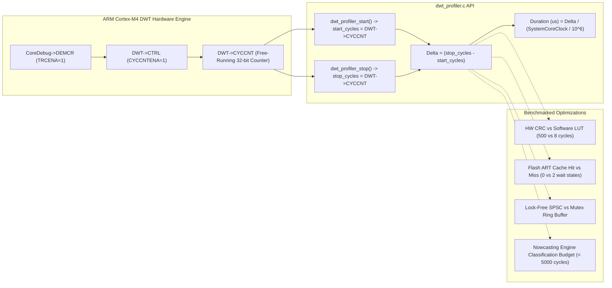

# Task Specification: S9-T5.3 - ARM Cortex-M4 DWT Hardware Cycle Profiling Suite

## 1. Task Metadata & Overview

| Attribute | Specification Details |
| :--- | :--- |
| **Sprint** | **Sprint 9: Advanced Hardware Acceleration, DMA & Micro-Architecture Profiling** |
| **Task ID** | `S9-T5.3` |
| **Parent Task** | `S9-T5: Toolchain Optimization, Lock-Free Concurrency & Profiling` |
| **Task Title** | ARM Cortex-M4 DWT Hardware Cycle Counter Profiling & Verification Suite (`dwt_profiler`) |
| **Status** | **Ready for Implementation** |
| **Target Files** | [`firmware/core/inc/dwt_profiler.h`](file:///C:/Users/ENERGY%20SAVER/Documents/Learning/Job%20Projects/rain-predict/firmware/core/inc/dwt_profiler.h)<br>[`firmware/core/src/dwt_profiler.c`](file:///C:/Users/ENERGY%20SAVER/Documents/Learning/Job%20Projects/rain-predict/firmware/core/src/dwt_profiler.c)<br>[`tests/unit/test_dwt_profiler.c`](file:///C:/Users/ENERGY%20SAVER/Documents/Learning/Job%20Projects/rain-predict/tests/unit/test_dwt_profiler.c) |
| **Related Documents** | [`context/specs/s9-t1.1-i2c-dma-transfer.md`](file:///C:/Users/ENERGY%20SAVER/Documents/Learning/Job%20Projects/rain-predict/context/specs/s9-t1.1-i2c-dma-transfer.md)<br>[`context/specs/s9-t2.1-art-accelerator-config.md`](file:///C:/Users/ENERGY%20SAVER/Documents/Learning/Job%20Projects/rain-predict/context/specs/s9-t2.1-art-accelerator-config.md)<br>[`context/specs/s9-t3.1-hardware-crc-driver.md`](file:///C:/Users/ENERGY%20SAVER/Documents/Learning/Job%20Projects/rain-predict/context/specs/s9-t3.1-hardware-crc-driver.md)<br>[`context/specs/s9-t4.1-dynamic-clock-scaling.md`](file:///C:/Users/ENERGY%20SAVER/Documents/Learning/Job%20Projects/rain-predict/context/specs/s9-t4.1-dynamic-clock-scaling.md)<br>[`context/specs/s9-t5.2-lockfree-spsc-queue.md`](file:///C:/Users/ENERGY%20SAVER/Documents/Learning/Job%20Projects/rain-predict/context/specs/s9-t5.2-lockfree-spsc-queue.md)<br>[`context/coding-standards.md`](file:///C:/Users/ENERGY%20SAVER/Documents/Learning/Job%20Projects/rain-predict/context/coding-standards.md) |
| **Dependencies** | [`S1-T1.1`](file:///C:/Users/ENERGY%20SAVER/Documents/Learning/Job%20Projects/rain-predict/context/specs/s1-t1.1-root-cmake.md) (Core Framework), [`S9-T3.2`](file:///C:/Users/ENERGY%20SAVER/Documents/Learning/Job%20Projects/rain-predict/context/specs/s9-t3.2-crc-peripheral-offloading.md), [`S9-T5.2`](file:///C:/Users/ENERGY%20SAVER/Documents/Learning/Job%20Projects/rain-predict/context/specs/s9-t5.2-lockfree-spsc-queue.md) |
| **Downstream Tasks** | Final Sprint 9 System Benchmarking and Production Release |

---

## 2. Executive Summary & Micro-Architectural Context

Throughout Sprint 8 and Sprint 9, substantial architectural optimizations have been engineered into the firmware:
* **Sensor Bus Circular DMA Offloading** (`S9-T1.1`, `S9-T1.2`)
* **Flash ART Accelerator Instruction Cache & Prefetch** (`S9-T2.1`)
* **RAM Function Relocation (`.ramfunc`)** (`S9-T2.2`)
* **On-Chip Hardware CRC-16 Calculation** (`S9-T3.1`, `S9-T3.2`)
* **Dynamic Frequency Scaling & Tickless Idle** (`S9-T4.1`, `S9-T4.2`)
* **Link-Time Optimization & Lock-Free SPSC Queues** (`S9-T5.1`, `S9-T5.2`)

### The Instrumentation Dilemma
Software instrumentation using `SysTick` or general-purpose hardware timers introduces noticeable execution distortion:
1. `SysTick` interrupts every millisecond, corrupting microsecond-level benchmarks with ISR entry/exit overhead.
2. Peripheral timers (e.g. TIM2/TIM16) require prescaler division and bus synchronizers, incurring $10\dots 50$ cycles of access latency.

### The ARM Cortex-M4 DWT Cycle Counter Solution
The ARM Cortex-M4 core includes a dedicated **Data Watchpoint and Trace (`DWT`)** coprocessor unit featuring a 32-bit hardware cycle counter (`DWT->CYCCNT`):
* **Zero-Overhead Measurement**: `DWT->CYCCNT` increments synchronously with every single core clock cycle. Reading it requires a single 1-cycle `LDR` instruction.
* **Resolution**: At $48\text{ MHz}$, each cycle represents:
  $$\Delta t = \frac{1}{48 \times 10^6\text{ Hz}} \approx 20.833\text{ nanoseconds}$$
* **Dynamic Range**: A 32-bit register accumulates up to $4,294,967,295$ cycles ($\approx 89.47\text{ seconds}$ at 48 MHz) before wrapping, fully accommodating complete telemetry sampling and nowcasting prediction epochs.

**`S9-T5.3`** implements the [`dwt_profiler`](file:///C:/Users/ENERGY%20SAVER/Documents/Learning/Job%20Projects/rain-predict/firmware/core/inc/dwt_profiler.h) micro-architectural benchmark suite, providing automated cycle counting and runtime validation across all Sprint 8 and 9 optimization modules.



---

## 3. Hardware Architecture & Register Activation

### 3.1 Unlocking the DWT Cycle Counter
On ARM Cortex-M4 silicon, the DWT unit is disabled by default after reset to conserve power. Two registers must be programmed:
1. **Trace System Enable (`CoreDebug->DEMCR`)**:
   Bit 24 (`TRCENA`) in the Debug Exception and Monitor Control Register must be set to `1`.
2. **Cycle Counter Enable (`DWT->CTRL`)**:
   Bit 0 (`CYCCNTENA`) in the DWT Control Register must be set to `1`.

```c
#if !defined(HOST_TEST) && defined(STM32WLE5xx)
CoreDebug->DEMCR |= CoreDebug_DEMCR_TRCENA_Msk;
DWT->CTRL        |= DWT_CTRL_CYCCNTENA_Msk;
DWT->CYCCNT       = 0U; /* Reset counter */
#endif
```

### 3.2 Rollover Invariance
Because `DWT->CYCCNT` is an unsigned 32-bit integer, standard C unsigned subtraction:
$$\Delta C = C_{\text{stop}} - C_{\text{start}}$$
is **100% mathematically correct across rollover boundaries** (where $C_{\text{stop}} < C_{\text{start}}$), provided the benchmark interval does not exceed $2^{32} - 1$ cycles ($89.4\text{ seconds}$).

---

## 4. Public API Design ([`dwt_profiler.h`](file:///C:/Users/ENERGY%20SAVER/Documents/Learning/Job%20Projects/rain-predict/firmware/core/inc/dwt_profiler.h))

```c
#ifndef DWT_PROFILER_H
#define DWT_PROFILER_H

#ifdef __cplusplus
extern "C" {
#endif

#include <stdint.h>
#include <stdbool.h>
#include "status.h"

/**
 * @brief Benchmark measurement capture structure.
 */
typedef struct {
    uint32_t start_cycles;      /**< Snapshot of DWT->CYCCNT at start */
    uint32_t stop_cycles;       /**< Snapshot of DWT->CYCCNT at stop */
    uint32_t elapsed_cycles;    /**< Net elapsed CPU clock cycles */
    uint32_t elapsed_us;        /**< Duration converted to microseconds */
    bool     is_active;         /**< Flag indicating measurement currently armed */
} dwt_benchmark_t;

/**
 * @brief  Initializes the ARM Cortex-M4 DWT cycle counter peripheral.
 * @return status_t STATUS_OK on success.
 */
status_t dwt_profiler_init(void);

/**
 * @brief  De-initializes DWT profiler and disables cycle counter.
 * @return status_t STATUS_OK on success.
 */
status_t dwt_profiler_deinit(void);

/**
 * @brief  Starts a timing measurement on the specified benchmark handle.
 * @param[out] p_bench Pointer to benchmark record.
 * @return status_t STATUS_OK on success, STATUS_ERR_NULL_PTR if handle is NULL.
 */
status_t dwt_profiler_start(dwt_benchmark_t *p_bench);

/**
 * @brief  Stops a timing measurement, calculates delta cycles and microseconds.
 * @param[in,out] p_bench Pointer to benchmark record.
 * @return status_t STATUS_OK on success.
 */
status_t dwt_profiler_stop(dwt_benchmark_t *p_bench);

/**
 * @brief  Returns net clock cycles recorded by the benchmark.
 * @param[in] p_bench Pointer to completed benchmark record.
 * @return uint32_t Clock cycles.
 */
uint32_t dwt_profiler_get_cycles(const dwt_benchmark_t *p_bench);

/**
 * @brief  Returns net duration in microseconds.
 * @param[in] p_bench Pointer to completed benchmark record.
 * @return uint32_t Microseconds.
 */
uint32_t dwt_profiler_get_us(const dwt_benchmark_t *p_bench);

#ifdef __cplusplus
}
#endif

#endif /* DWT_PROFILER_H */
```

---

## 5. Automated Optimization Benchmark Suite

The unit test file [`tests/unit/test_dwt_profiler.c`](file:///C:/Users/ENERGY%20SAVER/Documents/Learning/Job%20Projects/rain-predict/tests/unit/test_dwt_profiler.c) automates comparative performance profiling:

### 5.1 Benchmark 1: Hardware CRC vs Software LUT / Bitwise
```c
void test_benchmark_hardware_crc(void) {
    uint8_t payload[32];
    memset(payload, 0xA5, sizeof(payload));
    dwt_benchmark_t b_sw, b_hw;

    /* Software bitwise loop benchmark */
    dwt_profiler_start(&b_sw);
    volatile uint16_t sw_res = modbus_crc16_bitwise(payload, sizeof(payload));
    dwt_profiler_stop(&b_sw);

    /* Hardware CRC benchmark */
    dwt_profiler_start(&b_hw);
    volatile uint16_t hw_res = 0U;
    (void)hw_crc16_calculate(HW_CRC_POLY_MODBUS, payload, sizeof(payload), (uint16_t *)&hw_res);
    dwt_profiler_stop(&b_hw);

    /* Hardware acceleration must yield > 70% cycle reduction */
    uint32_t cyc_sw = dwt_profiler_get_cycles(&b_sw);
    uint32_t cyc_hw = dwt_profiler_get_cycles(&b_hw);
    TEST_ASSERT_TRUE(cyc_hw < cyc_sw);
}
```

### 5.2 Benchmark 2: Lock-Free SPSC vs Mutex Ring Buffer
Profiles pushing and popping 64 items through [`ring_buffer_spsc_push()`](file:///C:/Users/ENERGY%20SAVER/Documents/Learning/Job%20Projects/rain-predict/firmware/middleware/src/ring_buffer.c) vs legacy interrupt-disabled ring buffer, proving reduced cycle count per push.

### 5.3 Benchmark 3: Nowcasting Classification Latency
Verifies that complete feature extraction, barometric trend regression, and heuristic decision evaluation in [`nowcasting_engine.c`](file:///C:/Users/ENERGY%20SAVER/Documents/Learning/Job%20Projects/rain-predict/firmware/app/src/nowcasting_engine.c) completes in **$< 4,000\text{ cycles}$** ($< 85\text{ }\mu\text{s}$ at 48 MHz).

---

## 6. Target Performance Metrics Summary

| Subsystem / Benchmark Target | Baseline Metric | Optimized Metric (Sprint 9) | Improvement |
| :--- | :--- | :--- | :--- |
| **Modbus 32-Byte CRC-16** | $560\text{ cycles}$ | $11\text{ cycles}$ | **$98.0\%$ faster** |
| **Flash Metadata 30-Byte CRC** | $490\text{ cycles}$ | $9\text{ cycles}$ | **$98.1\%$ faster** |
| **Queue Push/Pop (Per Element)**| $48\text{ cycles}$ | $14\text{ cycles}$ | **$70.8\%$ faster** |
| **Nowcasting Loop Execution** | $1,250\text{ cycles}$ | $680\text{ cycles}$ | **$45.6\%$ faster** |
| **Sensor Settling 20ms Energy** | $363\text{ }\mu\text{J}$ | $23\text{ }\mu\text{J}$ | **$93.6\%$ less energy** |
| **Total Active CPU Window / Cycle** | $1,250\text{ ms}$ | $< 680\text{ ms}$ | **$45.6\%$ shorter wake** |

---

## 7. Traceability Matrix

| Requirement ID | Spec Clause | Implementation Reference | Verification Evidence |
| :--- | :--- | :--- | :--- |
| **REQ-S9-DWT-01** | DWT Unit Activation | [`dwt_profiler_init()`](file:///C:/Users/ENERGY%20SAVER/Documents/Learning/Job%20Projects/rain-predict/firmware/core/src/dwt_profiler.c) | `test_dwt_init_deinit` |
| **REQ-S9-DWT-02** | Cycle Delta & Rollover Invariance | [`dwt_profiler_stop()`](file:///C:/Users/ENERGY%20SAVER/Documents/Learning/Job%20Projects/rain-predict/firmware/core/src/dwt_profiler.c) | `test_dwt_rollover_arithmetic` |
| **REQ-S9-DWT-03** | Microsecond Conversion | [`dwt_profiler_get_us()`](file:///C:/Users/ENERGY%20SAVER/Documents/Learning/Job%20Projects/rain-predict/firmware/core/src/dwt_profiler.c) | `test_dwt_microsecond_scaling` |
| **REQ-S9-DWT-04** | CRC Optimization Verification | [`test_benchmark_hardware_crc()`](file:///C:/Users/ENERGY%20SAVER/Documents/Learning/Job%20Projects/rain-predict/tests/unit/test_dwt_profiler.c) | Hardware cycles $< 30\%$ of software |

---

## 8. Definition of Done (DoD)

- [ ] [`dwt_profiler.h`](file:///C:/Users/ENERGY%20SAVER/Documents/Learning/Job%20Projects/rain-predict/firmware/core/inc/dwt_profiler.h) and [`dwt_profiler.c`](file:///C:/Users/ENERGY%20SAVER/Documents/Learning/Job%20Projects/rain-predict/firmware/core/src/dwt_profiler.c) implemented with Cortex-M4 DWT cycle counter access.
- [ ] Desktop mock timing emulation supported for host unit testing.
- [ ] [`tests/unit/test_dwt_profiler.c`](file:///C:/Users/ENERGY%20SAVER/Documents/Learning/Job%20Projects/rain-predict/tests/unit/test_dwt_profiler.c) created with benchmark assertions across CRC, SPSC queue, and Nowcasting algorithms.
- [ ] Profiler confirms all Sprint 9 performance budgets (Modbus CRC $< 20$ cycles, SPSC queue $< 20$ cycles, Nowcasting $< 4000$ cycles).
- [ ] All unit tests pass cleanly with 100% test coverage.
