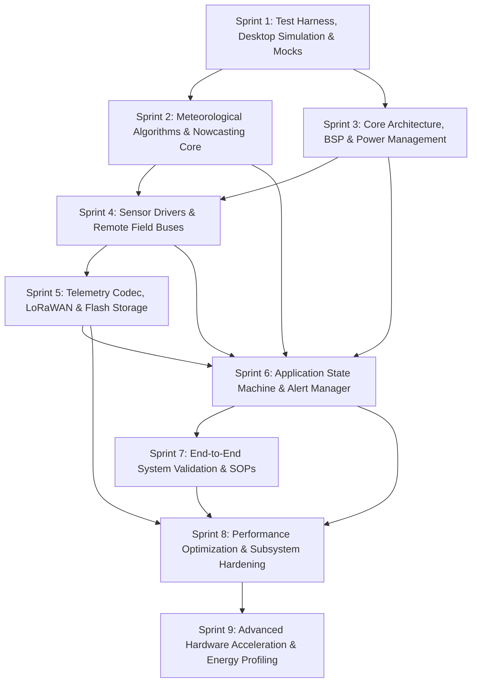

# Engineering Specification & Sprint-Based Implementation Roadmap

## 1. Project Summary & Architectural Context

The **Tea Plantation Rain Prediction System** is an edge-first, ultra-low-power embedded IoT meteorological sensing and nowcasting station designed specifically for tea estate microclimates. Due to rugged topography, varying elevations (500m–2200m), and localized convection in tea-growing regions, regional weather forecasts lack the spatial and temporal resolution required for estate operations.

This system provides autonomous, localized 1–6 hour rainfall nowcasting and immediate alerts to drive critical agronomic workflows—including plucking schedules, pesticide and fertilizer spraying windows, irrigation management, and workforce dispatch.

```
+-----------------------------------------------------------------------------+
|                          REMOTE SENSOR UNIT / MAST                          |
|  - Bosch BME280: Pressure (hPa), Temperature (°C), Relative Humidity (%)   |
|  - TI OPT3001: Ambient Light (Lux) & Convective Cloud Attenuation Detection |
|  - Tipping-Bucket Rain Gauge: 0.2mm Debounced Pulse Counting                |
|  - Interfacing: RS-485 Modbus RTU / SDI-12 / Differential I2C (PCA9615)     |
+--------------------------------------+--------------------------------------+
                                       | Switched Power & Protected Signal Line
                                       v
+-----------------------------------------------------------------------------+
|                MAIN CONTROLLER & TELEMETRY NODE (STM32WLE5)                 |
|  - Power & Protection: High-Side Gated Rails, TVS Arrays, Solar + LiFePO4   |
|  - Layer 1 (Core): STM32CubeWL HAL/LL, Clock Tree, RTC, IWDG Watchdog       |
|  - Layer 2 (Drivers): BME280, OPT3001, Rain Gauge, Modbus RTU, SDI-12       |
|  - Layer 3 (Middleware): Magnus Dew-Point, Moving Avg, Power Mgr, Telemetry |
|  - Layer 4 (App): Zambretti Engine, Trend Detector, Nowcaster, Alerts       |
+--------------------------------------+--------------------------------------+
                                       | LoRaWAN (868/915/433 MHz)
                                       v
+-----------------------------------------------------------------------------+
|                   ON-SITE ESTATE HUB & LOCAL HMI GATEWAY                    |
|  - Local Concentrator, SQLite/InfluxDB Logging, Siren/Relay/Display Alerts  |
+-----------------------------------------------------------------------------+
```

### 1.1 Non-Negotiable Engineering Constraints
- **Zero Dynamic Memory Allocation**: No `malloc()`, `calloc()`, or `free()`. All memory must be statically allocated at compile-time ([`coding-standards.md`](file:///C:/Users/ENERGY%20SAVER/Documents/Learning/Job%20Projects/rain-predict/context/coding-standards.md)).
- **Strict 4-Layer Unidirectional Architecture**: Application $\rightarrow$ Middleware $\rightarrow$ Drivers/BSP $\rightarrow$ Core/HAL ([`firmware-architecture.md`](file:///C:/Users/ENERGY%20SAVER/Documents/Learning/Job%20Projects/rain-predict/docs/architecture/firmware-architecture.md)).
- **Autonomous Edge Operation**: 100% on-chip prediction and local alert actuation without reliance on cloud connectivity ([`project-overview.md`](file:///C:/Users/ENERGY%20SAVER/Documents/Learning/Job%20Projects/rain-predict/context/project-overview.md)).
- **Ultra-Low Power Autonomy**: Average daily power consumption $< 25\text{ mAh/day}$, Stop 2 sleep current $< 5\,\mu\text{A}$, 14-day zero-sunlight battery survivability on a 3.2V 2000–3200mAh LiFePO4 cell ([`power-supply-and-solar.md`](file:///C:/Users/ENERGY%20SAVER/Documents/Learning/Job%20Projects/rain-predict/docs/hardware/power-supply-and-solar.md)).
- **Deterministic Bounded Timeouts**: All sensor buses (I2C, UART, RS-485, SDI-12) must enforce strict timeouts and never hang the MCU state machine ([`coding-standards.md`](file:///C:/Users/ENERGY%20SAVER/Documents/Learning/Job%20Projects/rain-predict/context/coding-standards.md)).

---

## 2. High-Level Sprint Sequence Overview

The project is structured into **9 Agile Sprints** following a Test-Driven Development (TDD) workflow. Algorithmic verification and simulation tooling precede hardware driver and firmware integration to ensure mathematical accuracy before flashing hardware.



### Sprint Summary Schedule

| Sprint | Focus Domain | Key Objectives | Core Deliverables |
| :--- | :--- | :--- | :--- |
| **[Sprint 1](#sprint-1-test-harness-desktop-simulation--mock-infrastructure)** | **Testing & Simulation Tooling** | Build host build system, Unity framework, mock HAL stubs, and synthetic weather generator. | Host CMake test runner, Unity test framework, `simulate_plantation_weather.py`, mock I2C/UART/GPIO. |
| **[Sprint 2](#sprint-2-meteorological-algorithms--nowcasting-engine)** | **Algorithms & Math Core** | Implement psychrometric formulas, Zambretti heuristic engine, trend classifier, and composite nowcaster. | [`dew_point.c`](file:///C:/Users/ENERGY%20SAVER/Documents/Learning/Job%20Projects/rain-predict/firmware/middleware/src/dew_point.c), [`zambretti.c`](file:///C:/Users/ENERGY%20SAVER/Documents/Learning/Job%20Projects/rain-predict/firmware/app/src/zambretti.c), [`trend_detector.c`](file:///C:/Users/ENERGY%20SAVER/Documents/Learning/Job%20Projects/rain-predict/firmware/app/src/trend_detector.c), [`rain_algo.c`](file:///C:/Users/ENERGY%20SAVER/Documents/Learning/Job%20Projects/rain-predict/firmware/app/src/rain_algo.c), host unit test suite. |
| **[Sprint 3](#sprint-3-core-mcu-architecture-bsp--power-management)** | **Core MCU & Power Control** | Configure STM32WLE5 pinout, clock tree, high-side power rails, IWDG watchdog, and Stop 2 sleep manager. | [`board_config.h`](file:///C:/Users/ENERGY%20SAVER/Documents/Learning/Job%20Projects/rain-predict/firmware/core/inc/board_config.h), [`bsp_power_rails.c`](file:///C:/Users/ENERGY%20SAVER/Documents/Learning/Job%20Projects/rain-predict/firmware/drivers/src/bsp_power_rails.c), [`power_mgr.c`](file:///C:/Users/ENERGY%20SAVER/Documents/Learning/Job%20Projects/rain-predict/firmware/middleware/src/power_mgr.c), [`i2c_bus.c`](file:///C:/Users/ENERGY%20SAVER/Documents/Learning/Job%20Projects/rain-predict/firmware/drivers/src/i2c_bus.c), [`uart_bus.c`](file:///C:/Users/ENERGY%20SAVER/Documents/Learning/Job%20Projects/rain-predict/firmware/drivers/src/uart_bus.c). |
| **[Sprint 4](#sprint-4-sensor-drivers--remote-field-bus-interfaces)** | **Sensors & Remote Buses** | Implement Bosch BME280, TI OPT3001, tipping-bucket pulse counter, RS-485 Modbus RTU, and SDI-12 drivers. | [`bme280_driver.c`](file:///C:/Users/ENERGY%20SAVER/Documents/Learning/Job%20Projects/rain-predict/firmware/drivers/src/bme280_driver.c), [`opt3001_driver.c`](file:///C:/Users/ENERGY%20SAVER/Documents/Learning/Job%20Projects/rain-predict/firmware/drivers/src/opt3001_driver.c), [`rain_gauge_driver.c`](file:///C:/Users/ENERGY%20SAVER/Documents/Learning/Job%20Projects/rain-predict/firmware/drivers/src/rain_gauge_driver.c), [`modbus_rtu.c`](file:///C:/Users/ENERGY%20SAVER/Documents/Learning/Job%20Projects/rain-predict/firmware/drivers/src/modbus_rtu.c), [`sdi12_driver.c`](file:///C:/Users/ENERGY%20SAVER/Documents/Learning/Job%20Projects/rain-predict/firmware/drivers/src/sdi12_driver.c). |
| **[Sprint 5](#sprint-5-telemetry-protocol-lorawan--flash-storage)** | **Telemetry & Storage** | Develop bit-packed binary codec, ChirpStack/TTN gateway decoders, LoRaWAN uplink service, and flash ring buffer. | [`telemetry_codec.c`](file:///C:/Users/ENERGY%20SAVER/Documents/Learning/Job%20Projects/rain-predict/firmware/middleware/src/telemetry_codec.c), [`lorawan_service.c`](file:///C:/Users/ENERGY%20SAVER/Documents/Learning/Job%20Projects/rain-predict/firmware/middleware/src/lorawan_service.c), [`flash_storage.c`](file:///C:/Users/ENERGY%20SAVER/Documents/Learning/Job%20Projects/rain-predict/firmware/middleware/src/flash_storage.c), `chirpstack_codec.js`, `ttn_decoder.js`. |
| **[Sprint 6](#sprint-6-application-orchestration-scheduler--local-alerts)** | **App State Machine & Alerts** | Assemble the 8-state cyclic system state machine, RTC measurement scheduler, and local buzzer/LED/relay alerts. | [`app_state_machine.c`](file:///C:/Users/ENERGY%20SAVER/Documents/Learning/Job%20Projects/rain-predict/firmware/app/src/app_state_machine.c), [`measurement_scheduler.c`](file:///C:/Users/ENERGY%20SAVER/Documents/Learning/Job%20Projects/rain-predict/firmware/app/src/measurement_scheduler.c), [`alert_manager.c`](file:///C:/Users/ENERGY%20SAVER/Documents/Learning/Job%20Projects/rain-predict/firmware/app/src/alert_manager.c), [`main.c`](file:///C:/Users/ENERGY%20SAVER/Documents/Learning/Job%20Projects/rain-predict/firmware/core/src/main.c). |
| **[Sprint 7](#sprint-7-system-integration-synthetic-validation--field-sops)** | **Verification & Field SOPs** | Execute multi-day synthetic storm scenarios, evaluate contingency matrices (POD, FAR, CSI, HSS), and document SOPs. | Validation reports, HIL test results, calibration and estate agronomic operational manuals. |
| **[Sprint 8](#sprint-8-firmware-performance-optimization--flash-storage-hardening)** | **Performance & Storage Optimization** | Refactor flash storage with journaled metadata and batch writes, move validation to ingestion, eliminate hot-path FP checks and division, optimize ring buffers and LoRaWAN queue. | Persistent flash metadata header, batched unlock/lock API, `weather_features_t`, zero-copy TX queue, benchmark test suites. |
| **[Sprint 9](#sprint-9-advanced-hardware-acceleration-dma--micro-architecture-profiling)** | **Hardware Acceleration & Advanced Profiling** | Implement sensor DMA transfers, flash ART accelerator & `.ramfunc`, hardware CRC engine, dynamic clock scaling, LTO, lock-free SPSC queues, and DWT cycle benchmarks. | Circular I2C/UART DMA drivers, `.ramfunc` flash routines, hardware CRC driver, DFS power manager, DWT profiling suite. |

---

## 3. Detailed Sprint Breakdown & Traceable Tasks

```
Legend:
[Sn-Tm]   : Sprint 'n', Task 'm'
[Sn-Tm.k] : Subtask 'k' of Task 'm'
```

---

### Sprint 1: Test Harness, Desktop Simulation & Mock Infrastructure

**Goal**: Establish an automated, host-based test build system, Unity testing framework, mock hardware abstraction layer (HAL) stubs, and a Python-based synthetic tea plantation microclimate simulator to enable immediate Test-Driven Development (TDD).

#### Traceable Task Breakdown

- [ ] **S1-T1: Configure Root Build System & Toolchain Definitions**
  - **Dependencies**: None
  - **Description**: Configure top-level build scripts supporting dual targets: native host compilation (for unit testing) and `arm-none-eabi-gcc` cross-compilation (for target firmware).
  - **Subtasks**:
    - [`S1-T1.1`](file:///C:/Users/ENERGY%20SAVER/Documents/Learning/Job%20Projects/rain-predict/context/specs/s1-t1.1-root-cmake.md): Create [`CMakeLists.txt`](file:///C:/Users/ENERGY%20SAVER/Documents/Learning/Job%20Projects/rain-predict/CMakeLists.txt) supporting `-std=c99` with strict flags: `-Wall -Wextra -Wpedantic -Wshadow -Wstrict-prototypes -Wpointer-arith -Werror`.
    - [`S1-T1.2`](file:///C:/Users/ENERGY%20SAVER/Documents/Learning/Job%20Projects/rain-predict/context/specs/s1-t1.2-root-makefile.md): Create [`Makefile`](file:///C:/Users/ENERGY%20SAVER/Documents/Learning/Job%20Projects/rain-predict/Makefile) with target aliases: `make test`, `make sim`, `make clean`, and `make all`.
    - [`S1-T1.3`](file:///C:/Users/ENERGY%20SAVER/Documents/Learning/Job%20Projects/rain-predict/context/specs/s1-t1.3-clang-format.md): Configure [`.clang-format`](file:///C:/Users/ENERGY%20SAVER/Documents/Learning/Job%20Projects/rain-predict/.clang-format) enforcing coding standards (2/4-space indent, snake_case alignment).
    - [`S1-T1.4`](file:///C:/Users/ENERGY%20SAVER/Documents/Learning/Job%20Projects/rain-predict/context/specs/s1-t1.4-devcontainer-codespaces.md): Configure [`.devcontainer/Dockerfile`](file:///C:/Users/ENERGY%20SAVER/Documents/Learning/Job%20Projects/rain-predict/.devcontainer/Dockerfile), [`.devcontainer/devcontainer.json`](file:///C:/Users/ENERGY%20SAVER/Documents/Learning/Job%20Projects/rain-predict/.devcontainer/devcontainer.json), and [`.github/workflows/ci.yml`](file:///C:/Users/ENERGY%20SAVER/Documents/Learning/Job%20Projects/rain-predict/.github/workflows/ci.yml) for GitHub Codespaces cloud development and automated CI.

- [ ] **S1-T2: Setup Unity Unit Testing Framework & Mock Hardware Layer**
  - **Dependencies**: `S1-T1`
  - **Description**: Deploy Unity test harness under [`tests/unity/`](file:///C:/Users/ENERGY%20SAVER/Documents/Learning/Job%20Projects/rain-predict/tests/unity) and implement mock hardware abstraction stubs.
  - **Subtasks**:
    - [`S1-T2.1`](file:///C:/Users/ENERGY%20SAVER/Documents/Learning/Job%20Projects/rain-predict/context/specs/s1-t2.1-unity-test-harness.md): Set up [`tests/CMakeLists.txt`](file:///C:/Users/ENERGY%20SAVER/Documents/Learning/Job%20Projects/rain-predict/tests/CMakeLists.txt) and integrate Unity test framework.
    - [`S1-T2.2`](file:///C:/Users/ENERGY%20SAVER/Documents/Learning/Job%20Projects/rain-predict/context/specs/s1-t2.2-mock-i2c-bus.md): Implement [`tests/mocks/mock_i2c_bus.h`](file:///C:/Users/ENERGY%20SAVER/Documents/Learning/Job%20Projects/rain-predict/tests/mocks/mock_i2c_bus.h) and `mock_i2c_bus.c` with register injection and error simulation (NACK, timeout).
    - [`S1-T2.3`](file:///C:/Users/ENERGY%20SAVER/Documents/Learning/Job%20Projects/rain-predict/context/specs/s1-t2.3-mock-uart-bus.md): Implement [`tests/mocks/mock_uart_bus.h`](file:///C:/Users/ENERGY%20SAVER/Documents/Learning/Job%20Projects/rain-predict/tests/mocks/mock_uart_bus.h) and `mock_uart_bus.c` for Modbus RTU / SDI-12 framing injection.
    - [`S1-T2.4`](file:///C:/Users/ENERGY%20SAVER/Documents/Learning/Job%20Projects/rain-predict/context/specs/s1-t2.4-mock-gpio.md): Implement [`tests/mocks/mock_gpio.h`](file:///C:/Users/ENERGY%20SAVER/Documents/Learning/Job%20Projects/rain-predict/tests/mocks/mock_gpio.h) and `mock_gpio.c` for pulse counting and power rail state monitoring.
    - [`S1-T2.5`](file:///C:/Users/ENERGY%20SAVER/Documents/Learning/Job%20Projects/rain-predict/context/specs/s1-t2.5-sanity-test.md): Create initial sanity test [`tests/unit/test_sanity.c`](file:///C:/Users/ENERGY%20SAVER/Documents/Learning/Job%20Projects/rain-predict/tests/unit/test_sanity.c) to verify test harness execution.

- [ ] **S1-T3: Develop Python Tea Plantation Microclimate Simulator**
  - **Dependencies**: None
  - **Description**: Build a Python-based synthetic scenario generator modeling tea estate diurnal cycles, convective rain storms, and orographic cloud events according to [`algorithm-validation-and-tuning.md`](file:///C:/Users/ENERGY%20SAVER/Documents/Learning/Job%20Projects/rain-predict/docs/algorithms/algorithm-validation-and-tuning.md).
  - **Subtasks**:
    - [`S1-T3.1`](file:///C:/Users/ENERGY%20SAVER/Documents/Learning/Job%20Projects/rain-predict/context/specs/s1-t3.1-weather-simulator-engine.md): Create [`tools/simulation/simulate_plantation_weather.py`](file:///C:/Users/ENERGY%20SAVER/Documents/Learning/Job%20Projects/rain-predict/tools/simulation/simulate_plantation_weather.py) with configurable temporal resolution (1–15 min intervals).
    - [`S1-T3.2`](file:///C:/Users/ENERGY%20SAVER/Documents/Learning/Job%20Projects/rain-predict/context/specs/s1-t3.2-diurnal-climate-curves.md): Implement diurnal physical curves for ambient temperature ($15^\circ\text{C}–30^\circ\text{C}$), humidity ($45\%–100\%$), solar irradiance ($0–120,000\text{ Lux}$), and barometric pressure ($800–1020\text{ hPa}$).
    - [`S1-T3.3`](file:///C:/Users/ENERGY%20SAVER/Documents/Learning/Job%20Projects/rain-predict/context/specs/s1-t3.3-convective-storm-models.md): Implement convective storm injection models: rapid pressure drops ($>2\text{ hPa/3h}$), humidity surges ($>90\%$), solar irradiance collapse ($>75\%$ drop within 30 min), and tipping-bucket rain tip events ($0.2\text{ mm/tip}$).
    - [`S1-T3.4`](file:///C:/Users/ENERGY%20SAVER/Documents/Learning/Job%20Projects/rain-predict/context/specs/s1-t3.4-dataset-export.md): Add CSV/JSON dataset export functionality with ground-truth binary rain labels and lead-time timestamps.

#### Definition of Done (Sprint 1)
1. `make test` compiles with zero warnings and executes `test_sanity.c` with 100% pass rate.
2. `simulate_plantation_weather.py` generates multi-day realistic plantation weather profiles and exports CSV datasets without third-party proprietary dependencies.
3. Mock HAL stubs permit programmatic register reading, writing, and timeout fault injection.

---

### Sprint 2: Meteorological Algorithms & Nowcasting Engine

**Goal**: Implement and verify all on-chip meteorological calculations, psychrometric dew-point formulas, the Zambretti barometric heuristic engine, multi-variable gradient trend detection, and composite rain nowcasting scoring with 100% host unit test coverage.

#### Traceable Task Breakdown

- [ ] **S2-T1: Implement Core Static Data Structures & Moving-Average Filters**
  - **Dependencies**: `S1-T1`, `S1-T2`
  - **Description**: Create static circular buffers and moving average filters in firmware middleware.
  - **Subtasks**:
    - [`S2-T1.1`](file:///C:/Users/ENERGY%20SAVER/Documents/Learning/Job%20Projects/rain-predict/context/specs/s2-t1.1-static-ring-buffer.md): Implement [`firmware/middleware/inc/ring_buffer.h`](file:///C:/Users/ENERGY%20SAVER/Documents/Learning/Job%20Projects/rain-predict/firmware/middleware/inc/ring_buffer.h) and `ring_buffer.c` (generic byte/struct circular FIFO buffer, static allocation, zero dynamic memory).
    - [`S2-T1.2`](file:///C:/Users/ENERGY%20SAVER/Documents/Learning/Job%20Projects/rain-predict/context/specs/s2-t1.2-moving-average-filter.md): Implement [`firmware/middleware/inc/moving_avg_filter.h`](file:///C:/Users/ENERGY%20SAVER/Documents/Learning/Job%20Projects/rain-predict/firmware/middleware/inc/moving_avg_filter.h) and `moving_avg_filter.c` supporting window sizes of 3, 6, and 12 samples with outlier filtering.
    - [`S2-T1.3`](file:///C:/Users/ENERGY%20SAVER/Documents/Learning/Job%20Projects/rain-predict/context/specs/s2-t1.3-ring-buffer-moving-avg-tests.md): Create [`tests/unit/test_ring_buffer.c`](file:///C:/Users/ENERGY%20SAVER/Documents/Learning/Job%20Projects/rain-predict/tests/unit/test_ring_buffer.c) and `test_moving_avg.c`.

- [ ] **S2-T2: Implement Magnus-Tetens Dew Point & Psychrometric Formulas**
  - **Dependencies**: `S1-T2`
  - **Description**: Implement psychrometric derivations in [`firmware/middleware/src/dew_point.c`](file:///C:/Users/ENERGY%20SAVER/Documents/Learning/Job%20Projects/rain-predict/firmware/middleware/src/dew_point.c) according to [`meteorological-formulas.md`](file:///C:/Users/ENERGY%20SAVER/Documents/Learning/Job%20Projects/rain-predict/docs/algorithms/meteorological-formulas.md).
  - **Subtasks**:
    - [`S2-T2.1`](file:///C:/Users/ENERGY%20SAVER/Documents/Learning/Job%20Projects/rain-predict/context/specs/s2-t2.1-vapor-pressure.md): Implement saturation vapor pressure $e_s(T) = 6.112 \exp\left(\frac{17.67 \cdot T}{T + 243.5}\right)$ and actual vapor pressure $e = e_s \cdot \frac{RH}{100}$.
    - [`S2-T2.2`](file:///C:/Users/ENERGY%20SAVER/Documents/Learning/Job%20Projects/rain-predict/context/specs/s2-t2.2-dew-point-depression.md): Implement dew point calculation $T_{dew} = \frac{243.5 \cdot \ln(e / 6.112)}{17.67 - \ln(e / 6.112)}$ and relative humidity depression $\Delta T_{dep} = T - T_{dew}$.
    - [`S2-T2.3`](file:///C:/Users/ENERGY%20SAVER/Documents/Learning/Job%20Projects/rain-predict/context/specs/s2-t2.3-barometric-reduction.md): Implement barometric altitude sea-level reduction formula $P_0 = P \cdot \left(1 - \frac{0.0065 \cdot h}{T + 0.0065 \cdot h + 273.15}\right)^{-5.257}$.
    - [`S2-T2.4`](file:///C:/Users/ENERGY%20SAVER/Documents/Learning/Job%20Projects/rain-predict/context/specs/s2-t2.4-dew-point-tests.md): Create [`tests/unit/test_dew_point.c`](file:///C:/Users/ENERGY%20SAVER/Documents/Learning/Job%20Projects/rain-predict/tests/unit/test_dew_point.c) testing standard meteorological test points (error $< 0.1^\circ\text{C}$).

- [ ] **S2-T3: Implement Zambretti Barometric Heuristic Forecaster**
  - **Dependencies**: `S2-T1`, `S2-T2`
  - **Description**: Implement the 26-state Zambretti heuristic algorithm in [`firmware/app/src/zambretti.c`](file:///C:/Users/ENERGY%20SAVER/Documents/Learning/Job%20Projects/rain-predict/firmware/app/src/zambretti.c) according to [`zambretti-algorithm.md`](file:///C:/Users/ENERGY%20SAVER/Documents/Learning/Job%20Projects/rain-predict/docs/algorithms/zambretti-algorithm.md).
  - **Subtasks**:
    - [`S2-T3.1`](file:///C:/Users/ENERGY%20SAVER/Documents/Learning/Job%20Projects/rain-predict/context/specs/s2-t3.1-zambretti-trend.md): Implement pressure trend classifier (falling $> 1.5\text{ hPa/3h}$, steady $\pm 1.5\text{ hPa/3h}$, rising $> 1.5\text{ hPa/3h}$).
    - [`S2-T3.2`](file:///C:/Users/ENERGY%20SAVER/Documents/Learning/Job%20Projects/rain-predict/context/specs/s2-t3.2-zambretti-pressure-mapping.md): Implement altitude-adjusted pressure range mapping (985–1050 hPa sea-level equivalent).
    - [`S2-T3.3`](file:///C:/Users/ENERGY%20SAVER/Documents/Learning/Job%20Projects/rain-predict/context/specs/s2-t3.3-zambretti-seasonal-weighting.md): Implement seasonal wind and monsoon heuristic weighting lookups.
    - [`S2-T3.4`](file:///C:/Users/ENERGY%20SAVER/Documents/Learning/Job%20Projects/rain-predict/context/specs/s2-t3.4-zambretti-tests.md): Create [`tests/unit/test_zambretti.c`](file:///C:/Users/ENERGY%20SAVER/Documents/Learning/Job%20Projects/rain-predict/tests/unit/test_zambretti.c) validating all 26 Zambretti output letters against reference cases.

- [ ] **S2-T4: Implement Multi-Variable Gradient Trend Detector**
  - **Dependencies**: `S2-T1`
  - **Description**: Track moving gradients in [`firmware/app/src/trend_detector.c`](file:///C:/Users/ENERGY%20SAVER/Documents/Learning/Job%20Projects/rain-predict/firmware/app/src/trend_detector.c) according to [`trend-detection-and-nowcasting.md`](file:///C:/Users/ENERGY%20SAVER/Documents/Learning/Job%20Projects/rain-predict/docs/algorithms/trend-detection-and-nowcasting.md).
  - **Subtasks**:
    - [`S2-T4.1`](file:///C:/Users/ENERGY%20SAVER/Documents/Learning/Job%20Projects/rain-predict/context/specs/s2-t4.1-gradient-differentials.md): Calculate 1-hour and 3-hour differentials: $\Delta P/\Delta t$, $\Delta RH/\Delta t$, $\Delta T/\Delta t$, and $\Delta Lux/\Delta t$.
    - [`S2-T4.2`](file:///C:/Users/ENERGY%20SAVER/Documents/Learning/Job%20Projects/rain-predict/context/specs/s2-t4.2-pressure-trend-states.md): Classify pressure trend states: `PRESSURE_RAPID_DROP`, `PRESSURE_MODERATE_DROP`, `PRESSURE_STEADY`, `PRESSURE_RISING`.
    - [`S2-T4.3`](file:///C:/Users/ENERGY%20SAVER/Documents/Learning/Job%20Projects/rain-predict/context/specs/s2-t4.3-solar-cloud-states.md): Classify solar irradiance cloud attenuation states: `SOLAR_CLEAR`, `SOLAR_SCATTERED`, `SOLAR_STORM_CLOUD_DROP`.
    - [`S2-T4.4`](file:///C:/Users/ENERGY%20SAVER/Documents/Learning/Job%20Projects/rain-predict/context/specs/s2-t4.4-trend-detector-tests.md): Create [`tests/unit/test_trend_detector.c`](file:///C:/Users/ENERGY%20SAVER/Documents/Learning/Job%20Projects/rain-predict/tests/unit/test_trend_detector.c).

- [ ] **S2-T5: Implement Composite Edge Rain Prediction Scoring Engine**
  - **Dependencies**: `S2-T2`, `S2-T3`, `S2-T4`
  - **Description**: Combine heuristic, thermodynamic, and gradient factors into a single composite rain probability score ($0–100\%$) in [`firmware/app/src/rain_algo.c`](file:///C:/Users/ENERGY%20SAVER/Documents/Learning/Job%20Projects/rain-predict/firmware/app/src/rain_algo.c).
  - **Subtasks**:
    - [`S2-T5.1`](file:///C:/Users/ENERGY%20SAVER/Documents/Learning/Job%20Projects/rain-predict/context/specs/s2-t5.1-composite-scoring.md): Implement weighted composite scoring formula:
      $$S_{total} = w_P \cdot S_P + w_Z \cdot S_Z + w_{RH} \cdot S_{RH} + w_{Lux} \cdot S_{Lux}$$
    - [`S2-T5.2`](file:///C:/Users/ENERGY%20SAVER/Documents/Learning/Job%20Projects/rain-predict/context/specs/s2-t5.2-rain-state-classification.md): Implement output state classification:
      - `RAIN_STATE_UNLIKELY` ($S < 30\%$)
      - `RAIN_STATE_POSSIBLE` ($30\% \le S < 60\%$)
      - `RAIN_STATE_LIKELY` ($60\% \le S < 80\%$)
      - `RAIN_STATE_IMMINENT` ($S \ge 80\%$)
    - [`S2-T5.3`](file:///C:/Users/ENERGY%20SAVER/Documents/Learning/Job%20Projects/rain-predict/context/specs/s2-t5.3-nowcaster-tests.md): Create [`tests/unit/test_rain_algo.c`](file:///C:/Users/ENERGY%20SAVER/Documents/Learning/Job%20Projects/rain-predict/tests/unit/test_rain_algo.c) and feed simulated storm time series from Sprint 1.

#### Definition of Done (Sprint 2)
1. All mathematical and algorithmic functions pass unit tests with 100% code coverage.
2. Magnus formula verification achieves accuracy within $\pm 0.05^\circ\text{C}$ against NOAA reference tables.
3. Composite prediction engine correctly identifies simulated pre-monsoon convective storms with $> 60\text{ min}$ advance lead time.
4. Zero dynamic allocation and single-precision Cortex-M4 floating-point safety confirmed.

---

### Sprint 3: Core MCU Architecture, BSP & Power Management

**Goal**: Configure target STM32WLE5 hardware registers, clock trees, non-blocking I/O wrappers with bounded timeouts, switched sensor power rail control, and low-power sleep management (Stop 2/Standby mode).

#### Traceable Task Breakdown

- [ ] **S3-T1: Implement Target Board Configuration & Clock Tree**
  - **Dependencies**: None
  - **Description**: Configure pinouts and system clock tree for STM32WLE5 SoC in [`firmware/core/inc/board_config.h`](file:///C:/Users/ENERGY%20SAVER/Documents/Learning/Job%20Projects/rain-predict/firmware/core/inc/board_config.h) according to [`schematics-and-pinout.md`](file:///C:/Users/ENERGY%20SAVER/Documents/Learning/Job%20Projects/rain-predict/docs/hardware/schematics-and-pinout.md).
  - **Subtasks**:
    - [`S3-T1.1`](file:///C:/Users/ENERGY%20SAVER/Documents/Learning/Job%20Projects/rain-predict/context/specs/s3-t1.1-gpio-pin-mappings.md): Define GPIO pin mappings: I2C1 (PB6/PB7), USART1 RS-485 (PA1/PA2/PA3), LPUART1 SDI-12 (PC0/PC1/PC2), Sensor Power Rail Gate (PA4), Rain Gauge EXTI (PA0), Status LEDs (PB8/PB9), Buzzer (PB2), Relay (PB4), Battery ADC (PB0/PB1), and Sub-GHz RF Switch (PC3/PC4/PC5).
    - [`S3-T1.2`](file:///C:/Users/ENERGY%20SAVER/Documents/Learning/Job%20Projects/rain-predict/context/specs/s3-t1.2-clock-tree-config.md): Configure clock tree: MSI @ 48 MHz for active processing, LSE @ 32.768 kHz for RTC wakeup and LoRa radio timing, and HSE/TCXO @ 32 MHz for Sub-GHz radio RF.
    - [`S3-T1.3`](file:///C:/Users/ENERGY%20SAVER/Documents/Learning/Job%20Projects/rain-predict/context/specs/s3-t1.3-hal-module-config.md): Configure STM32CubeWL HAL module definitions in [`firmware/core/inc/stm32wlxx_hal_conf.h`](file:///C:/Users/ENERGY%20SAVER/Documents/Learning/Job%20Projects/rain-predict/firmware/core/inc/stm32wlxx_hal_conf.h).

- [ ] **S3-T2: Implement Bounded Non-Blocking Bus Wrappers**
  - **Dependencies**: `S3-T1`
  - **Description**: Develop robust hardware abstraction wrappers with strict millisecond timeouts.
  - **Subtasks**:
    - [`S3-T2.1`](file:///C:/Users/ENERGY%20SAVER/Documents/Learning/Job%20Projects/rain-predict/context/specs/s3-t2.1-i2c-bus-driver.md): Implement [`firmware/drivers/src/i2c_bus.c`](file:///C:/Users/ENERGY%20SAVER/Documents/Learning/Job%20Projects/rain-predict/firmware/drivers/src/i2c_bus.c) and `i2c_bus.h` with bus lockup recovery (9-clock pulse cycling) and non-blocking timeout guards.
    - [`S3-T2.2`](file:///C:/Users/ENERGY%20SAVER/Documents/Learning/Job%20Projects/rain-predict/context/specs/s3-t2.2-uart-bus-driver.md): Implement [`firmware/drivers/src/uart_bus.c`](file:///C:/Users/ENERGY%20SAVER/Documents/Learning/Job%20Projects/rain-predict/firmware/drivers/src/uart_bus.c) and `uart_bus.h` with DMA/interrupt receive rings and transmission timeouts.

- [ ] **S3-T3: Implement Switched Sensor Power Rails & Board Indicators**
  - **Dependencies**: `S3-T1`
  - **Description**: Implement high-side load switch controls and visual/audible alert outputs in [`firmware/drivers/`](file:///C:/Users/ENERGY%20SAVER/Documents/Learning/Job%20Projects/rain-predict/firmware/drivers).
  - **Subtasks**:
    - [`S3-T3.1`](file:///C:/Users/ENERGY%20SAVER/Documents/Learning/Job%20Projects/rain-predict/context/specs/s3-t3.1-switched-power-rails.md): Implement [`firmware/drivers/src/bsp_power_rails.c`](file:///C:/Users/ENERGY%20SAVER/Documents/Learning/Job%20Projects/rain-predict/firmware/drivers/src/bsp_power_rails.c) with high-side P-MOSFET gate enable, discharge resistors, and mandatory $20\text{ms}$ stabilization delays.
    - [`S3-T3.2`](file:///C:/Users/ENERGY%20SAVER/Documents/Learning/Job%20Projects/rain-predict/context/specs/s3-t3.2-board-indicators.md): Implement [`firmware/drivers/src/bsp_indicators.c`](file:///C:/Users/ENERGY%20SAVER/Documents/Learning/Job%20Projects/rain-predict/firmware/drivers/src/bsp_indicators.c) controlling multi-color status LEDs, piezoelectric buzzer, and estate siren relay.

- [ ] **S3-T4: Implement Ultra-Low Power Sleep Manager & Watchdog Management**
  - **Dependencies**: `S3-T1`, `S3-T3`
  - **Description**: Implement power state transitions and watchdog servicing in [`firmware/middleware/src/power_mgr.c`](file:///C:/Users/ENERGY%20SAVER/Documents/Learning/Job%20Projects/rain-predict/firmware/middleware/src/power_mgr.c) according to [`power-architecture.md`](file:///C:/Users/ENERGY%20SAVER/Documents/Learning/Job%20Projects/rain-predict/docs/architecture/power-architecture.md).
  - **Subtasks**:
    - [`S3-T4.1`](file:///C:/Users/ENERGY%20SAVER/Documents/Learning/Job%20Projects/rain-predict/context/specs/s3-t4.1-gpio-sleep-conditioning.md): Implement pre-sleep GPIO conditioning (floating pins switched to analog/pull-down to eliminate leakage).
    - [`S3-T4.2`](file:///C:/Users/ENERGY%20SAVER/Documents/Learning/Job%20Projects/rain-predict/context/specs/s3-t4.2-stop2-sleep-manager.md): Implement STM32WLE5 Stop 2 mode entry with RTC periodic wake timer ($5–15\text{ min}$).
    - [`S3-T4.3`](file:///C:/Users/ENERGY%20SAVER/Documents/Learning/Job%20Projects/rain-predict/context/specs/s3-t4.3-iwdg-watchdog.md): Implement Independent Watchdog (IWDG) initialization ($8\text{s}$ timeout) and safe windowed refresh logic.
    - [`S3-T4.4`](file:///C:/Users/ENERGY%20SAVER/Documents/Learning/Job%20Projects/rain-predict/context/specs/s3-t4.4-battery-adc-telemetry.md): Implement battery ADC voltage measurement ($V_{bat}$) and solar harvesting telemetry.

#### Definition of Done (Sprint 3)
1. Power rail sequencing strictly enforces $20\text{ms}$ stabilization time before bus traffic and discharges rails after acquisition.
2. Bus wrappers guarantee recovery from simulated I2C lockups and disconnected UART lines within $< 50\text{ms}$ without stalling the MCU.
3. Power manager achieves simulated Stop 2 mode entry with RTC timer wakeup and zero memory loss.

---

### Sprint 4: Sensor Drivers & Remote Field Bus Interfaces

**Goal**: Develop and unit test robust embedded drivers for Bosch BME280, TI OPT3001, tipping-bucket pulse counter, RS-485 Modbus RTU, and SDI-12 remote agricultural buses.

#### Traceable Task Breakdown

- [ ] **S4-T1: Implement Bosch BME280 Sensor Driver**
  - **Dependencies**: `S3-T2`
  - **Description**: Interfacing driver in [`firmware/drivers/src/bme280_driver.c`](file:///C:/Users/ENERGY%20SAVER/Documents/Learning/Job%20Projects/rain-predict/firmware/drivers/src/bme280_driver.c) according to [`bme280-integration.md`](file:///C:/Users/ENERGY%20SAVER/Documents/Learning/Job%20Projects/rain-predict/docs/sensors/bme280-integration.md).
  - **Subtasks**:
    - [`S4-T1.1`](file:///C:/Users/ENERGY%20SAVER/Documents/Learning/Job%20Projects/rain-predict/context/specs/s4-t1.1-bme280-calibration-readout.md): Implement factory trimming parameter readout (`0x88–0xA1`, `0xE1–0xF0`).
    - [`S4-T1.2`](file:///C:/Users/ENERGY%20SAVER/Documents/Learning/Job%20Projects/rain-predict/context/specs/s4-t1.2-bme280-forced-mode-readout.md): Implement forced-mode single-shot trigger and measurement readout ($T, P, RH$).
    - [`S4-T1.3`](file:///C:/Users/ENERGY%20SAVER/Documents/Learning/Job%20Projects/rain-predict/context/specs/s4-t1.3-bme280-compensation-math.md): Implement 32-bit integer/float compensation routines matching Bosch official formulas.
    - [`S4-T1.4`](file:///C:/Users/ENERGY%20SAVER/Documents/Learning/Job%20Projects/rain-predict/context/specs/s4-t1.4-bme280-saturation-recovery.md): Implement humidity saturation detection ($RH > 98\%$) and condensation recovery routines.
    - [`S4-T1.5`](file:///C:/Users/ENERGY%20SAVER/Documents/Learning/Job%20Projects/rain-predict/context/specs/s4-t1.5-test-bme280.md): Create [`tests/unit/test_bme280.c`](file:///C:/Users/ENERGY%20SAVER/Documents/Learning/Job%20Projects/rain-predict/tests/unit/test_bme280.c) with mock I2C register injection.

- [ ] **S4-T2: Implement TI OPT3001 Ambient Light & Solar Irradiance Driver**
  - **Dependencies**: `S3-T2`
  - **Description**: Interfacing driver in [`firmware/drivers/src/opt3001_driver.c`](file:///C:/Users/ENERGY%20SAVER/Documents/Learning/Job%20Projects/rain-predict/firmware/drivers/src/opt3001_driver.c) according to [`opt3001-solar-irradiance.md`](file:///C:/Users/ENERGY%20SAVER/Documents/Learning/Job%20Projects/rain-predict/docs/sensors/opt3001-solar-irradiance.md).
  - **Subtasks**:
    - [`S4-T2.1`](file:///C:/Users/ENERGY%20SAVER/Documents/Learning/Job%20Projects/rain-predict/context/specs/s4-t2.1-opt3001-single-shot-readout.md): Implement single-shot conversion trigger and register readout (`0x00`).
    - [`S4-T2.2`](file:///C:/Users/ENERGY%20SAVER/Documents/Learning/Job%20Projects/rain-predict/context/specs/s4-t2.2-opt3001-lux-conversion.md): Implement exponential lux conversion: $\text{Lux} = 0.01 \cdot 2^{E[3:0]} \cdot R[11:0]$.
    - [`S4-T2.3`](file:///C:/Users/ENERGY%20SAVER/Documents/Learning/Job%20Projects/rain-predict/context/specs/s4-t2.3-opt3001-day-night-classification.md): Implement auto-range scaling and night/day threshold classification ($< 10\text{ Lux}$).
    - [`S4-T2.4`](file:///C:/Users/ENERGY%20SAVER/Documents/Learning/Job%20Projects/rain-predict/context/specs/s4-t2.4-test-opt3001.md): Create [`tests/unit/test_opt3001.c`](file:///C:/Users/ENERGY%20SAVER/Documents/Learning/Job%20Projects/rain-predict/tests/unit/test_opt3001.c).

- [ ] **S4-T3: Implement Tipping-Bucket Rain Gauge Pulse Counter Driver**
  - **Dependencies**: `S3-T1`
  - **Description**: Pulse interrupt driver in [`firmware/drivers/src/rain_gauge_driver.c`](file:///C:/Users/ENERGY%20SAVER/Documents/Learning/Job%20Projects/rain-predict/firmware/drivers/src/rain_gauge_driver.c) according to [`rain-gauge-pulse.md`](file:///C:/Users/ENERGY%20SAVER/Documents/Learning/Job%20Projects/rain-predict/docs/sensors/rain-gauge-pulse.md).
  - **Subtasks**:
    - [`S4-T3.1`](file:///C:/Users/ENERGY%20SAVER/Documents/Learning/Job%20Projects/rain-predict/context/specs/s4-t3.1-rain-gauge-exti-debounce.md): Configure EXTI GPIO interrupt with hardware/software debounce filter ($50\text{ms}$).
    - [`S4-T3.2`](file:///C:/Users/ENERGY%20SAVER/Documents/Learning/Job%20Projects/rain-predict/context/specs/s4-t3.2-rain-gauge-accumulation.md): Implement atomic pulse count accumulator and rolling hourly/daily rainfall registers ($0.2\text{ mm/tip}$).
    - [`S4-T3.3`](file:///C:/Users/ENERGY%20SAVER/Documents/Learning/Job%20Projects/rain-predict/context/specs/s4-t3.3-rain-rate-intensity.md): Implement rain rate intensity calculation ($\text{mm/hr}$).
    - [`S4-T3.4`](file:///C:/Users/ENERGY%20SAVER/Documents/Learning/Job%20Projects/rain-predict/context/specs/s4-t3.4-test-rain-gauge.md): Create [`tests/unit/test_rain_gauge.c`](file:///C:/Users/ENERGY%20SAVER/Documents/Learning/Job%20Projects/rain-predict/tests/unit/test_rain_gauge.c).

- [ ] **S4-T4: Implement RS-485 Modbus RTU Master Protocol Driver**
  - **Dependencies**: `S3-T2`
  - **Description**: Master polling driver in [`firmware/drivers/src/modbus_rtu.c`](file:///C:/Users/ENERGY%20SAVER/Documents/Learning/Job%20Projects/rain-predict/firmware/drivers/src/modbus_rtu.c) according to [`remote-bus-modbus-sdi12.md`](file:///C:/Users/ENERGY%20SAVER/Documents/Learning/Job%20Projects/rain-predict/docs/sensors/remote-bus-modbus-sdi12.md).
  - **Subtasks**:
    - [`S4-T4.1`](file:///C:/Users/ENERGY%20SAVER/Documents/Learning/Job%20Projects/rain-predict/context/specs/s4-t4.1-modbus-frame-generator.md): Implement Modbus RTU frame generator for Function Code `0x03` (Read Holding Registers).
    - [`S4-T4.2`](file:///C:/Users/ENERGY%20SAVER/Documents/Learning/Job%20Projects/rain-predict/context/specs/s4-t4.2-modbus-crc16.md): Implement standard CRC-16 calculation (`0xA001` polynomial) and frame validation.
    - [`S4-T4.3`](file:///C:/Users/ENERGY%20SAVER/Documents/Learning/Job%20Projects/rain-predict/context/specs/s4-t4.3-rs485-direction-control.md): Implement RS-485 transceiver DE/RE direction pin toggling with pre/post transmission guard times.
    - [`S4-T4.4`](file:///C:/Users/ENERGY%20SAVER/Documents/Learning/Job%20Projects/rain-predict/context/specs/s4-t4.4-test-modbus-rtu.md): Create [`tests/unit/test_modbus_rtu.c`](file:///C:/Users/ENERGY%20SAVER/Documents/Learning/Job%20Projects/rain-predict/tests/unit/test_modbus_rtu.c).

- [ ] **S4-T5: Implement SDI-12 1200-Baud Half-Duplex Bus Driver**
  - **Dependencies**: `S3-T2`
  - **Description**: SDI-12 master driver in [`firmware/drivers/src/sdi12_driver.c`](file:///C:/Users/ENERGY%20SAVER/Documents/Learning/Job%20Projects/rain-predict/firmware/drivers/src/sdi12_driver.c) according to [`remote-bus-modbus-sdi12.md`](file:///C:/Users/ENERGY%20SAVER/Documents/Learning/Job%20Projects/rain-predict/docs/sensors/remote-bus-modbus-sdi12.md).
  - **Subtasks**:
    - [`S4-T5.1`](file:///C:/Users/ENERGY%20SAVER/Documents/Learning/Job%20Projects/rain-predict/context/specs/s4-t5.1-sdi12-break-mark-timing.md): Implement SDI-12 break timing ($>12\text{ms}$ spacing) and mark sequence ($>8.3\text{ms}$).
    - [`S4-T5.2`](file:///C:/Users/ENERGY%20SAVER/Documents/Learning/Job%20Projects/rain-predict/context/specs/s4-t5.2-sdi12-parser.md): Implement SDI-12 command formatting (`?!`, `aM!`, `aD0!`) and ASCII response parser.
    - [`S4-T5.3`](file:///C:/Users/ENERGY%20SAVER/Documents/Learning/Job%20Projects/rain-predict/context/specs/s4-t5.3-test-sdi12.md): Create [`tests/unit/test_sdi12.c`](file:///C:/Users/ENERGY%20SAVER/Documents/Learning/Job%20Projects/rain-predict/tests/unit/test_sdi12.c).

#### Definition of Done (Sprint 4)
1. BME280 compensation routines produce identical results to Bosch official C reference vectors.
2. OPT3001 driver correctly converts raw exponent/fraction registers to physical Lux values.
3. Rain gauge debounce logic successfully rejects contact bounces $<50\text{ms}$ while counting all legitimate bucket tips.
4. Modbus RTU and SDI-12 drivers enforce non-blocking timeouts ($< 100\text{ms}$) on detached cables.

---

### Sprint 5: Telemetry Protocol, LoRaWAN & Flash Storage

**Goal**: Implement the compact bit-packed LoRaWAN binary telemetry codec, ChirpStack/TTN gateway decoders, on-chip flash circular ring-buffer logging, and LoRaWAN uplink service.

#### Traceable Task Breakdown

- [ ] **S5-T1: Implement Compact Binary Telemetry Codec**
  - **Dependencies**: None
  - **Description**: Binary encoder/decoder in [`firmware/middleware/src/telemetry_codec.c`](file:///C:/Users/ENERGY%20SAVER/Documents/Learning/Job%20Projects/rain-predict/firmware/middleware/src/telemetry_codec.c) according to [`telemetry-protocol.md`](file:///C:/Users/ENERGY%20SAVER/Documents/Learning/Job%20Projects/rain-predict/docs/architecture/telemetry-protocol.md).
  - **Subtasks**:
    - [`S5-T1.1`](file:///C:/Users/ENERGY%20SAVER/Documents/Learning/Job%20Projects/rain-predict/context/specs/s5-t1.1-periodic-telemetry-serializer.md): Implement standard 12-byte periodic telemetry packet serializer ($T, RH, P, Lux, Rain, Trend, State, V_{bat}$).
    - [`S5-T1.2`](file:///C:/Users/ENERGY%20SAVER/Documents/Learning/Job%20Projects/rain-predict/context/specs/s5-t1.2-urgent-alert-serializer.md): Implement 4-byte urgent alert packet serializer (`MSG_TYPE_ALERT`).
    - [`S5-T1.3`](file:///C:/Users/ENERGY%20SAVER/Documents/Learning/Job%20Projects/rain-predict/context/specs/s5-t1.3-test-telemetry-codec.md): Create [`tests/unit/test_telemetry_codec.c`](file:///C:/Users/ENERGY%20SAVER/Documents/Learning/Job%20Projects/rain-predict/tests/unit/test_telemetry_codec.c) verifying bit-packing, big-endian byte order, and scaling factors.

- [ ] **S5-T2: Implement JavaScript Gateway Payload Decoders**
  - **Dependencies**: `S5-T1`
  - **Description**: JavaScript decoders for local estate gateways and public LoRaWAN network servers in [`tools/decoders/`](file:///C:/Users/ENERGY%20SAVER/Documents/Learning/Job%20Projects/rain-predict/tools/decoders).
  - **Subtasks**:
    - [`S5-T2.1`](file:///C:/Users/ENERGY%20SAVER/Documents/Learning/Job%20Projects/rain-predict/context/specs/s5-t2.1-chirpstack-codec.md): Create [`tools/decoders/chirpstack_codec.js`](file:///C:/Users/ENERGY%20SAVER/Documents/Learning/Job%20Projects/rain-predict/tools/decoders/chirpstack_codec.js) (ChirpStack v3 & v4 compatible `decodeUplink`).
    - [`S5-T2.2`](file:///C:/Users/ENERGY%20SAVER/Documents/Learning/Job%20Projects/rain-predict/context/specs/s5-t2.2-ttn-decoder.md): Create [`tools/decoders/ttn_decoder.js`](file:///C:/Users/ENERGY%20SAVER/Documents/Learning/Job%20Projects/rain-predict/tools/decoders/ttn_decoder.js) (The Things Network v3 compatible `decodeUplink`).
    - [`S5-T2.3`](file:///C:/Users/ENERGY%20SAVER/Documents/Learning/Job%20Projects/rain-predict/context/specs/s5-t2.3-test-decoders.md): Write automated test script [`tools/decoders/test_decoders.js`](file:///C:/Users/ENERGY%20SAVER/Documents/Learning/Job%20Projects/rain-predict/tools/decoders/test_decoders.js) to verify JSON output against raw hexadecimal packet vectors.

- [ ] **S5-T3: Implement On-Chip Flash Circular Ring-Buffer Logging**
  - **Dependencies**: `S2-T1`, `S3-T1`
  - **Description**: Non-volatile storage driver in [`firmware/middleware/src/flash_storage.c`](file:///C:/Users/ENERGY%20SAVER/Documents/Learning/Job%20Projects/rain-predict/firmware/middleware/src/flash_storage.c).
  - **Subtasks**:
    - [`S5-T3.1`](file:///C:/Users/ENERGY%20SAVER/Documents/Learning/Job%20Projects/rain-predict/context/specs/s5-t3.1-flash-page-manager.md): Implement sector erase and page-write management targeting dedicated STM32WLE5 flash sectors.
    - [`S5-T3.2`](file:///C:/Users/ENERGY%20SAVER/Documents/Learning/Job%20Projects/rain-predict/context/specs/s5-t3.2-flash-ring-buffer.md): Implement wear-leveling circular record pointer holding up to 72 hours of offline telemetry records (16 bytes each).
    - [`S5-T3.3`](file:///C:/Users/ENERGY%20SAVER/Documents/Learning/Job%20Projects/rain-predict/context/specs/s5-t3.3-flash-playback.md): Implement record playback / re-transmission queue on LoRaWAN reconnect.
    - [`S5-T3.4`](file:///C:/Users/ENERGY%20SAVER/Documents/Learning/Job%20Projects/rain-predict/context/specs/s5-t3.4-test-flash-storage.md): Create [`tests/unit/test_flash_storage.c`](file:///C:/Users/ENERGY%20SAVER/Documents/Learning/Job%20Projects/rain-predict/tests/unit/test_flash_storage.c).

- [ ] **S5-T4: Implement LoRaWAN Network Service & State Machine**
  - **Dependencies**: `S5-T1`, `S3-T1`
  - **Description**: LoRaWAN communication manager in [`firmware/middleware/src/lorawan_service.c`](file:///C:/Users/ENERGY%20SAVER/Documents/Learning/Job%20Projects/rain-predict/firmware/middleware/src/lorawan_service.c).
  - **Subtasks**:
    - [`S5-T4.1`](file:///C:/Users/ENERGY%20SAVER/Documents/Learning/Job%20Projects/rain-predict/context/specs/s5-t4.1-lorawan-service.md): Integrate STM32WL Sub-GHz LoRaWAN stack (OTAA join procedure, unconfirmed/confirmed uplinks).
    - [`S5-T4.2`](file:///C:/Users/ENERGY%20SAVER/Documents/Learning/Job%20Projects/rain-predict/context/specs/s5-t4.2-lorawan-regional-adr.md): Implement duty-cycle backoff, adaptive data rate (ADR), and regional sub-band selection (IN865 / EU868 / US915).
    - [`S5-T4.3`](file:///C:/Users/ENERGY%20SAVER/Documents/Learning/Job%20Projects/rain-predict/context/specs/s5-t4.3-lorawan-tx-queue.md): Implement transmission queue for immediate alert messages and buffered historical packets.

#### Definition of Done (Sprint 5)
1. Binary telemetry codec packs environmental data into exactly 11 bytes with zero padding discrepancies.
2. ChirpStack and TTN JavaScript decoders extract physical engineering units identical to source telemetry values.
3. Flash storage ring buffer supports 72+ hours of records with power-loss recovery and zero heap allocation.

---

### Sprint 6: Application Orchestration, Scheduler & Local Alerts

**Goal**: Assemble all layers into the complete 8-state cyclic system state machine, RTC measurement scheduler, and local alert manager.

#### Traceable Task Breakdown

- [ ] **S6-T1: Implement Measurement Scheduler & Duty-Cycle Manager**
  - **Dependencies**: `S3-T4`
  - **Description**: RTC measurement scheduler in [`firmware/app/src/measurement_scheduler.c`](file:///C:/Users/ENERGY%20SAVER/Documents/Learning/Job%20Projects/rain-predict/firmware/app/src/measurement_scheduler.c).
  - **Subtasks**:
    - [`S6-T1.1`](file:///C:/Users/ENERGY%20SAVER/Documents/Learning/Job%20Projects/rain-predict/context/specs/s6-t1.1-adaptive-measurement-scheduler.md): Implement default 15-minute measurement interval and adaptive 5-minute sampling during active convective storm alerts.
    - [`S6-T1.2`](file:///C:/Users/ENERGY%20SAVER/Documents/Learning/Job%20Projects/rain-predict/context/specs/s6-t1.2-battery-preservation-throttling.md): Implement battery preservation throttling (extend interval to 30–60 min when $V_{bat} < 3.10\text{ V}$).

- [ ] **S6-T2: Implement Local Alert Manager & Actuation**
  - **Dependencies**: `S3-T3`, `S2-T5`
  - **Description**: Alert dispatcher in [`firmware/app/src/alert_manager.c`](file:///C:/Users/ENERGY%20SAVER/Documents/Learning/Job%20Projects/rain-predict/firmware/app/src/alert_manager.c).
  - **Subtasks**:
    - [`S6-T2.1`](file:///C:/Users/ENERGY%20SAVER/Documents/Learning/Job%20Projects/rain-predict/context/specs/s6-t2.1-status-led-patterns.md): Implement status LED flash patterns:
      - Green pulse: System healthy, rain unlikely.
      - Amber blink: Rain possible ($30–60\%$).
      - Red rapid flash: Rain imminent ($>80\%$).
    - [`S6-T2.2`](file:///C:/Users/ENERGY%20SAVER/Documents/Learning/Job%20Projects/rain-predict/context/specs/s6-t2.2-audible-buzzer-siren.md): Implement audible buzzer burst and estate siren relay trigger ($10\text{s}$ timed pulse).
    - [`S6-T2.3`](file:///C:/Users/ENERGY%20SAVER/Documents/Learning/Job%20Projects/rain-predict/context/specs/s6-t2.3-test-alert-manager.md): Create [`tests/unit/test_alert_manager.c`](file:///C:/Users/ENERGY%20SAVER/Documents/Learning/Job%20Projects/rain-predict/tests/unit/test_alert_manager.c).

- [ ] **S6-T3: Implement Main System State Machine & Lifecycle Flow**
  - **Dependencies**: `S2-T5`, `S3-T4`, `S4-T1` through `S4-T5`, `S5-T1`, `S5-T4`, `S6-T1`, `S6-T2`
  - **Description**: Top-level state engine in [`firmware/app/src/app_state_machine.c`](file:///C:/Users/ENERGY%20SAVER/Documents/Learning/Job%20Projects/rain-predict/firmware/app/src/app_state_machine.c) and [`firmware/core/src/main.c`](file:///C:/Users/ENERGY%20SAVER/Documents/Learning/Job%20Projects/rain-predict/firmware/core/src/main.c) according to [`firmware-architecture.md`](file:///C:/Users/ENERGY%20SAVER/Documents/Learning/Job%20Projects/rain-predict/docs/architecture/firmware-architecture.md).
  - **Subtasks**:
    - [`S6-T3.1`](file:///C:/Users/ENERGY%20SAVER/Documents/Learning/Job%20Projects/rain-predict/context/specs/s6-t3.1-app-state-machine.md): Implement non-blocking state transition loop:
      `STATE_WAKE` $\rightarrow$ `STATE_POWER_ON` $\rightarrow$ `STATE_SAMPLE` $\rightarrow$ `STATE_FILTER` $\rightarrow$ `STATE_PREDICT` $\rightarrow$ `STATE_TRANSMIT` $\rightarrow$ `STATE_ALERT` $\rightarrow$ `STATE_SLEEP`.
    - [`S6-T3.2`](file:///C:/Users/ENERGY%20SAVER/Documents/Learning/Job%20Projects/rain-predict/context/specs/s6-t3.2-graceful-degradation.md): Implement graceful degradation paths for sensor failure, bus NACK, or LoRa transmission timeout.
    - [`S6-T3.3`](file:///C:/Users/ENERGY%20SAVER/Documents/Learning/Job%20Projects/rain-predict/context/specs/s6-t3.3-watchdog-kick-points.md): Implement watchdog kick points at start of each state execution.

- [ ] **S6-T4: Develop Full System State Machine Integration Tests**
  - **Dependencies**: `S6-T3`
  - **Description**: Integration test suite [`tests/integration/test_state_machine.c`](file:///C:/Users/ENERGY%20SAVER/Documents/Learning/Job%20Projects/rain-predict/tests/integration/test_state_machine.c).
  - **Subtasks**:
    - [`S6-T4.1`](file:///C:/Users/ENERGY%20SAVER/Documents/Learning/Job%20Projects/rain-predict/context/specs/s6-t4.1-end-to-end-integration-tests.md): Test end-to-end wake-sample-predict-transmit-sleep cycles.
    - [`S6-T4.2`](file:///C:/Users/ENERGY%20SAVER/Documents/Learning/Job%20Projects/rain-predict/context/specs/s6-t4.2-fault-injection-tests.md): Test fault injection scenarios: I2C disconnect, low battery, and LoRa packet drop.

#### Definition of Done (Sprint 6)
1. Complete state machine transitions through all 8 states deterministically in simulated execution.
2. Active processing window per cycle executes in $< 1.2\text{ seconds}$, satisfying low-power budget.
3. Local alerts trigger immediately upon detecting simulated storm conditions ($S \ge 80\%$).

---

### Sprint 7: System Integration, Synthetic Validation & Field SOPs

**Goal**: Validate the integrated firmware stack against 30-day synthetic plantation weather datasets, verify energy budget autonomy, calculate meteorological contingency metrics, and deliver field installation & calibration standard operating procedures (SOPs).

#### Traceable Task Breakdown

- [ ] **S7-T1: Multi-Day Synthetic Climate Validation & Metric Verification**
  - **Dependencies**: `S1-T3`, `S6-T4`
  - **Description**: Validate nowcasting performance against synthetic pre-monsoon and monsoon scenarios generated by `simulate_plantation_weather.py`.
  - **Subtasks**:
    - [`S7-T1.1`](file:///C:/Users/ENERGY%20SAVER/Documents/Learning/Job%20Projects/rain-predict/context/specs/s7-t1.1-multi-scenario-climate-simulation.md): Run 30-day multi-scenario simulation with varying convective storms, diurnal cycles, and false-alarm perturbations (passing non-rain cloud shadows).
    - [`S7-T1.2`](file:///C:/Users/ENERGY%20SAVER/Documents/Learning/Job%20Projects/rain-predict/context/specs/s7-t1.2-meteorological-contingency-metrics.md): Compute meteorological contingency table metrics according to [`algorithm-validation-and-tuning.md`](file:///C:/Users/ENERGY%20SAVER/Documents/Learning/Job%20Projects/rain-predict/docs/algorithms/algorithm-validation-and-tuning.md):
      - Probability of Detection: $\text{POD} = \frac{H}{H + M} \ge 0.80$
      - False Alarm Rate: $\text{FAR} = \frac{FA}{H + FA} \le 0.25$
      - Critical Success Index: $\text{CSI} = \frac{H}{H + M + FA} \ge 0.65$
      - Heidke Skill Score: $\text{HSS} \ge 0.60$
      - Mean Lead Time: $\ge 60\text{ minutes}$ advance warning.

- [ ] **S7-T2: Energy Budget & Battery Autonomy Profiling**
  - **Dependencies**: `S3-T4`, `S6-T3`
  - **Description**: Measure and verify target energy profile in simulation against [`power-supply-and-solar.md`](file:///C:/Users/ENERGY%20SAVER/Documents/Learning/Job%20Projects/rain-predict/docs/hardware/power-supply-and-solar.md).
  - **Subtasks**:
    - [`S7-T2.1`](file:///C:/Users/ENERGY%20SAVER/Documents/Learning/Job%20Projects/rain-predict/context/specs/s7-t2.1-stop2-active-power-profiling.md): Confirm Stop 2 sleep current $< 5\,\mu\text{A}$ and active cycle average $< 25\text{ mA}$ for $1.2\text{s}$.
    - [`S7-T2.2`](file:///C:/Users/ENERGY%20SAVER/Documents/Learning/Job%20Projects/rain-predict/context/specs/s7-t2.2-daily-energy-budget-verification.md): Confirm 24-hour total energy draw $< 25\text{ mAh/day}$ (15-minute sample interval).
    - [`S7-T2.3`](file:///C:/Users/ENERGY%20SAVER/Documents/Learning/Job%20Projects/rain-predict/context/specs/s7-t2.3-battery-survivability-simulation.md): Validate simulated 14-day zero-sunlight battery survivability on a 3.2V 2500mAh LiFePO4 battery pack.

- [ ] **S7-T3: Finalize Field Calibration SOPs & Operational Manuals**
  - **Dependencies**: `S7-T1`
  - **Description**: Produce operational guidelines for estate managers and field technicians.
  - **Subtasks**:
    - [`S7-T3.1`](file:///C:/Users/ENERGY%20SAVER/Documents/Learning/Job%20Projects/rain-predict/context/specs/s7-t3.1-barometric-altitude-calibration.md): Finalize on-site barometric altitude offset calibration procedure in [`docs/algorithms/algorithm-validation-and-tuning.md`](file:///C:/Users/ENERGY%20SAVER/Documents/Learning/Job%20Projects/rain-predict/docs/algorithms/algorithm-validation-and-tuning.md).
    - [`S7-T3.2`](file:///C:/Users/ENERGY%20SAVER/Documents/Learning/Job%20Projects/rain-predict/context/specs/s7-t3.2-tipping-bucket-water-calibration.md): Document tipping-bucket field water calibration ($0.2\text{ mm/tip}$) standard operating procedure.
    - [`S7-T3.3`](file:///C:/Users/ENERGY%20SAVER/Documents/Learning/Job%20Projects/rain-predict/context/specs/s7-t3.3-estate-agronomic-response-guidelines.md): Document estate agronomic operational response guidelines (plucking, spraying, and worker safety protocols).

#### Definition of Done (Sprint 7)
1. All automated test suites (unit, mock, integration, and simulation) pass with 100% success.
2. Prediction engine meets all threshold criteria ($\text{POD} \ge 0.80$, $\text{FAR} \le 0.25$, $\text{CSI} \ge 0.65$, Lead Time $\ge 60\text{ min}$).
3. Daily energy consumption is verified at $< 25\text{ mAh/day}$, guaranteeing $> 14\text{ days}$ zero-sunlight operation.
4. Field calibration and deployment documentation is complete and version-controlled.

---

### Sprint 8: Firmware Performance Optimization & Flash Storage Hardening

**Goal**: Eliminate architectural performance bottlenecks identified in code audits: eliminate full-flash and full-page scanning by introducing journaled metadata and RAM caching, minimize flash unlock/lock cycles via batch writes, optimize flash write alignment, streamline sensor validation at the ingestion boundary, eliminate repetitive floating-point/NaN checks and recalculations in the nowcasting hot path, and harden ring buffer and LoRaWAN queue data structures for bounded, deterministic execution.

#### Traceable Task Breakdown

- [ ] **S8-T1: Implement Persistent Flash Ring Metadata & Fast Boot Recovery**
  - **Dependencies**: `S5-T3`, `S3-T1`
  - **Description**: Eliminate the $O(N)$ full-ring scan (896 record slots) in `flash_ring_init()` and the full 2 KB scan in `flash_storage_is_page_erased()` by introducing a compact, journaled metadata header and active RAM tracking in [`firmware/middleware/src/flash_storage.c`](file:///C:/Users/ENERGY%20SAVER/Documents/Learning/Job%20Projects/rain-predict/firmware/middleware/src/flash_storage.c).
  - **Subtasks**:
    - [`S8-T1.1`](file:///C:/Users/ENERGY%20SAVER/Documents/Learning/Job%20Projects/rain-predict/context/specs/s8-t1.1-persistent-ring-metadata.md): Implement compact persistent ring metadata header in dedicated flash sector (Page 127) storing head pointer, tail pointer, valid record count, sequence number, generation counter, and CRC-16 checksum.
    - [`S8-T1.2`](file:///C:/Users/ENERGY%20SAVER/Documents/Learning/Job%20Projects/rain-predict/context/specs/s8-t1.2-fast-boot-recovery.md): Refactor `flash_ring_init()` to read journaled metadata in $O(1)$ time on boot, falling back to full scan only upon corrupted CRC/metadata mismatch; cache recovered ring state in static RAM and decouple initialization checks from read getters.
    - [`S8-T1.3`](file:///C:/Users/ENERGY%20SAVER/Documents/Learning/Job%20Projects/rain-predict/context/specs/s8-t1.3-page-erase-tracking.md): Replace full 2 KB page scans in `flash_storage_is_page_erased()` with RAM-cached page state and first-slot / header verification; manage explicit page lifecycle metadata to prevent boundary erase latency spikes.
    - [`S8-T1.4`](file:///C:/Users/ENERGY%20SAVER/Documents/Learning/Job%20Projects/rain-predict/context/specs/s8-t1.4-flash-metadata-tests.md): Create unit test cases in [`tests/unit/test_flash_storage.c`](file:///C:/Users/ENERGY%20SAVER/Documents/Learning/Job%20Projects/rain-predict/tests/unit/test_flash_storage.c) validating power-cut resilience during metadata journaling, CRC corruption recovery, and $O(1)$ initialization timing.

- [ ] **S8-T2: Optimize Flash Access Latency, Batch Operations & Write Alignment**
  - **Dependencies**: `S5-T3`, `S8-T1`
  - **Description**: Eliminate $O(N)$ slot iteration in `flash_ring_peek()`, reduce flash HAL unlock/lock cycling via batched transmission marking, and align write paths to 64-bit programming boundaries in [`firmware/middleware/src/flash_storage.c`](file:///C:/Users/ENERGY%20SAVER/Documents/Learning/Job%20Projects/rain-predict/firmware/middleware/src/flash_storage.c).
  - **Subtasks**:
    - [`S8-T2.1`](file:///C:/Users/ENERGY%20SAVER/Documents/Learning/Job%20Projects/rain-predict/context/specs/s8-t2.1-o1-record-peeking.md): Optimize `flash_ring_peek()` from $O(N)$ to $O(1)$ by computing direct physical slot indices from logical offsets and caching playback cursor positions for sequential LoRaWAN re-transmissions.
    - [`S8-T2.2`](file:///C:/Users/ENERGY%20SAVER/Documents/Learning/Job%20Projects/rain-predict/context/specs/s8-t2.2-batch-flash-operations.md): Implement `flash_ring_mark_transmitted_batch()` to unlock flash once, update transmission status across multiple acknowledged records (or compact transmission bitmask), and lock flash once, eliminating redundant HAL calls and critical sections.
    - [`S8-T2.3`](file:///C:/Users/ENERGY%20SAVER/Documents/Learning/Job%20Projects/rain-predict/context/specs/s8-t2.3-dword-write-alignment.md): Align flash record fields and write operations to STM32WL 64-bit double-word programming units, eliminate unaligned intermediate stack staging buffers and redundant `memcpy` calls, and implement a dedicated two-byte magic invalidation routine.
    - [`S8-T2.4`](file:///C:/Users/ENERGY%20SAVER/Documents/Learning/Job%20Projects/rain-predict/context/specs/s8-t2.4-flash-benchmark-tests.md): Add unit and benchmark tests in [`tests/unit/test_flash_storage.c`](file:///C:/Users/ENERGY%20SAVER/Documents/Learning/Job%20Projects/rain-predict/tests/unit/test_flash_storage.c) verifying batch marking correctness, mock unlock/lock call counts, and write alignment compliance.

- [ ] **S8-T3: Refactor Sensor Ingestion Validation & Optimize Nowcasting Math Hot Paths**
  - **Dependencies**: `S2-T4`, `S2-T5`, `S6-T3`
  - **Description**: Shift floating-point and range validation to the sensor ingestion boundary and optimize hot-path calculations in [`firmware/app/src/trend_detector.c`](file:///C:/Users/ENERGY%20SAVER/Documents/Learning/Job%20Projects/rain-predict/firmware/app/src/trend_detector.c) and [`firmware/app/src/rain_algo.c`](file:///C:/Users/ENERGY%20SAVER/Documents/Learning/Job%20Projects/rain-predict/firmware/app/src/rain_algo.c).
  - **Subtasks**:
    - [`S8-T3.1`](file:///C:/Users/ENERGY%20SAVER/Documents/Learning/Job%20Projects/rain-predict/context/specs/s8-t3.1-sensor-boundary-validation.md): Move repeated `isnan()` and `isinf()` sanity checks from algorithm inner loops to the sensor acquisition boundary in `STATE_SAMPLE`; store bitmasked validity flags (`validity_flags`) in the raw sensor sample structure.
    - [`S8-T3.2`](file:///C:/Users/ENERGY%20SAVER/Documents/Learning/Job%20Projects/rain-predict/context/specs/s8-t3.2-shared-feature-extraction.md): Add `lux_30m_ago` directly to `multi_gradient_t` and refactor `rain_algo_evaluate()` to extract shared features once into a unified `weather_features_t` structure passed to scoring functions, eliminating redundant subtraction and recalculations.
    - [`S8-T3.3`](file:///C:/Users/ENERGY%20SAVER/Documents/Learning/Job%20Projects/rain-predict/context/specs/s8-t3.3-precomputed-scale-factors.md): Replace repeated runtime divisions in gradient extrapolations with precomputed multiplier constants; profile floating-point execution time on Cortex-M4 and evaluate scaled integer representation for temperature, humidity, pressure, and lux where applicable.
    - [`S8-T3.4`](file:///C:/Users/ENERGY%20SAVER/Documents/Learning/Job%20Projects/rain-predict/context/specs/s8-t3.4-numerical-invariance-tests.md): Update [`tests/unit/test_trend_detector.c`](file:///C:/Users/ENERGY%20SAVER/Documents/Learning/Job%20Projects/rain-predict/tests/unit/test_trend_detector.c) and [`tests/unit/test_rain_algo.c`](file:///C:/Users/ENERGY%20SAVER/Documents/Learning/Job%20Projects/rain-predict/tests/unit/test_rain_algo.c) to ensure numerical invariance ($\Delta < 10^{-5}$) between optimized and original algorithm implementations.

- [ ] **S8-T4: Harden Middleware Ring Buffers & LoRaWAN Transmission Queue**
  - **Dependencies**: `S2-T1`, `S5-T4`
  - **Description**: Replace expensive runtime division operations in circular index logic and optimize queue inspection and slot lookups in [`firmware/middleware/src/ring_buffer.c`](file:///C:/Users/ENERGY%20SAVER/Documents/Learning/Job%20Projects/rain-predict/firmware/middleware/src/ring_buffer.c) and [`firmware/middleware/src/lorawan_tx_queue.c`](file:///C:/Users/ENERGY%20SAVER/Documents/Learning/Job%20Projects/rain-predict/firmware/middleware/src/lorawan_tx_queue.c).
  - **Subtasks**:
    - [`S8-T4.1`](file:///C:/Users/ENERGY%20SAVER/Documents/Learning/Job%20Projects/rain-predict/context/specs/s8-t4.1-increment-compare-ring-buffer.md): Replace runtime modulo `%` operators in generic `ring_buffer` and flash ring buffer with branch-efficient increment-and-compare (`idx++; if (idx >= cap) idx = 0;`) or power-of-two bitwise masking (`& (cap - 1)`).
    - [`S8-T4.2`](file:///C:/Users/ENERGY%20SAVER/Documents/Learning/Job%20Projects/rain-predict/context/specs/s8-t4.2-zero-copy-queue-peek.md): Refactor `lorawan_tx_queue_peek()` to return a `const lorawan_tx_item_t *` read-only pointer or copy only consumer-required fields, eliminating full 48-byte structure copies including callback pointers and contexts.
    - [`S8-T4.3`](file:///C:/Users/ENERGY%20SAVER/Documents/Learning/Job%20Projects/rain-predict/context/specs/s8-t4.3-lorawan-queue-bitmask.md): Implement an active slot bitmask (`uint8_t occupied_mask`) in `lorawan_tx_queue.c` to enable $O(1)$ free-slot allocation and streamline deduplication lookups.
    - [`S8-T4.4`](file:///C:/Users/ENERGY%20SAVER/Documents/Learning/Job%20Projects/rain-predict/context/specs/s8-t4.4-queue-performance-tests.md): Add unit tests in [`tests/unit/test_ring_buffer.c`](file:///C:/Users/ENERGY%20SAVER/Documents/Learning/Job%20Projects/rain-predict/tests/unit/test_ring_buffer.c) and `test_lorawan_tx_queue.c` verifying zero-copy peek safety, boundary wrap-around correctness, and queue allocation integrity.

- [ ] **S8-T5: System-Wide Latency & Energy Profiling Regression Benchmarks**
  - **Dependencies**: `S8-T1`, `S8-T2`, `S8-T3`, `S8-T4`, `S7-T2`
  - **Description**: Measure and verify boot time, flash access latency, active CPU cycle reductions, and regression invariance across the entire firmware suite.
  - **Subtasks**:
    - [`S8-T5.1`](file:///C:/Users/ENERGY%20SAVER/Documents/Learning/Job%20Projects/rain-predict/context/specs/s8-t5.1-boot-latency-benchmarking.md): Benchmark boot/resume latency to verify flash ring initialization completes in $< 5\text{ms}$ (down from $> 50\text{ms}$ during full 896-slot scan).
    - [`S8-T5.2`](file:///C:/Users/ENERGY%20SAVER/Documents/Learning/Job%20Projects/rain-predict/context/specs/s8-t5.2-active-duty-cycle-profiling.md): Benchmark active execution window per 15-minute measurement cycle to confirm total CPU active duration remains $< 1.0\text{s}$ (well within the $1.2\text{s}$ energy budget).
    - [`S8-T5.3`](file:///C:/Users/ENERGY%20SAVER/Documents/Learning/Job%20Projects/rain-predict/context/specs/s8-t5.3-automated-regression-suite.md): Run comprehensive host unit test suite (`make test`) verifying 100% pass rate, zero compiler warnings under `-Wall -Wextra -Wpedantic -Werror`, and zero static analysis issues.

#### Definition of Done (Sprint 8)
1. Flash ring initialization operates in $O(1)$ time ($< 5\text{ms}$) on warm boot via persistent journaled metadata.
2. `flash_ring_peek()` achieves $O(1)$ access without linear record traversal.
3. Batch transmission marking executes within a single flash unlock/lock pair.
4. Sensor validation occurs exclusively at the ingestion boundary with sample validity flags passed downstream.
5. Algorithm feature structures eliminate redundant gradient and lux recalculations without altering prediction results.
6. Ring buffer indexing and LoRaWAN queue operations avoid software division routines and full-struct copies.
7. Complete automated test suite passes with 100% coverage on new/refactored modules with zero compiler warnings.

---

### Sprint 9: Advanced Hardware Acceleration, DMA & Micro-Architecture Profiling

**Goal**: Implement advanced embedded firmware and silicon-level optimizations not covered in Sprint 8: offload sensor bus communication to circular DMA with background sleep, configure flash prefetch and instruction caching via the STM32 ART Accelerator, relocate time-critical flash programming routines into `.ramfunc` in SRAM, offload checksum computations to the on-chip hardware CRC peripheral, introduce dynamic clock frequency scaling during idle delays, enable Link-Time Optimization (LTO) and compiler micro-tuning, implement lock-free SPSC queues, and profile system execution using ARM Cortex-M4 DWT hardware cycle counters.

#### Traceable Task Breakdown

- [ ] **S9-T1: Implement Peripheral DMA & Background Sleep for Sensor Buses**
  - **Dependencies**: `S3-T2`, `S4-T1`, `S4-T2`, `S4-T4`
  - **Description**: Configure STM32WLE5 DMA1 controller and DMAMUX channels to offload physical byte transfers on I2C and UART buses, enabling the CPU to enter low-power Sleep mode (`__WFI()`) during sensor transactions in [`firmware/drivers/src/i2c_bus.c`](file:///C:/Users/ENERGY%20SAVER/Documents/Learning/Job%20Projects/rain-predict/firmware/drivers/src/i2c_bus.c) and [`firmware/drivers/src/uart_bus.c`](file:///C:/Users/ENERGY%20SAVER/Documents/Learning/Job%20Projects/rain-predict/firmware/drivers/src/uart_bus.c).
  - **Subtasks**:
    - [`S9-T1.1`](file:///C:/Users/ENERGY%20SAVER/Documents/Learning/Job%20Projects/rain-predict/context/specs/s9-t1.1-i2c-dma-transfer.md): Implement DMA1 channel mapping for I2C1 (BME280 and OPT3001 sensor readouts) with transfer complete interrupt and CPU `__WFI()` sleep suspension.
    - [`S9-T1.2`](file:///C:/Users/ENERGY%20SAVER/Documents/Learning/Job%20Projects/rain-predict/context/specs/s9-t1.2-uart-dma-idle-line.md): Implement USART1 and LPUART1 circular DMA reception with hardware Idle-Line Detection (`USART_ISR_IDLE`) for Modbus RTU and SDI-12 remote buses.
    - [`S9-T1.3`](file:///C:/Users/ENERGY%20SAVER/Documents/Learning/Job%20Projects/rain-predict/context/specs/s9-t1.3-dma-bus-unit-tests.md): Create unit and mock tests in [`tests/unit/test_dma_transfers.c`](file:///C:/Users/ENERGY%20SAVER/Documents/Learning/Job%20Projects/rain-predict/tests/unit/test_dma_transfers.c) verifying DMA buffer synchronization, error handling, and bus lockup recovery.

- [ ] **S9-T2: Configure Flash ART Accelerator & SRAM Execution (.ramfunc)**
  - **Dependencies**: `S3-T1`, `S8-T1`, `S8-T2`
  - **Description**: Maximize flash memory throughput and eliminate CPU instruction fetch stalls during high-voltage flash operations by enabling the STM32WLE5 ART Accelerator and relocating critical flash routines into SRAM in [`firmware/core/src/main.c`](file:///C:/Users/ENERGY%20SAVER/Documents/Learning/Job%20Projects/rain-predict/firmware/core/src/main.c) and [`firmware/middleware/src/flash_storage.c`](file:///C:/Users/ENERGY%20SAVER/Documents/Learning/Job%20Projects/rain-predict/firmware/middleware/src/flash_storage.c).
  - **Subtasks**:
    - [`S9-T2.1`](file:///C:/Users/ENERGY%20SAVER/Documents/Learning/Job%20Projects/rain-predict/context/specs/s9-t2.1-art-accelerator-config.md): Enable ART Accelerator instruction cache (`ICEN`) and prefetch buffer (`PRFTEN`) in `FLASH->ACR` for 0-wait-state equivalent execution at 48 MHz.
    - [`S9-T2.2`](file:///C:/Users/ENERGY%20SAVER/Documents/Learning/Job%20Projects/rain-predict/context/specs/s9-t2.2-ramfunc-flash-relocation.md): Configure linker script and annotate critical flash write/erase routines (`flash_storage_write_dword`, `flash_storage_erase_page`) with `__attribute__((section(".ramfunc")))` to execute from SRAM1, avoiding flash bus collisions.
    - [`S9-T2.3`](file:///C:/Users/ENERGY%20SAVER/Documents/Learning/Job%20Projects/rain-predict/context/specs/s9-t2.3-ramfunc-execution-tests.md): Create unit test cases in [`tests/unit/test_ramfunc_execution.c`](file:///C:/Users/ENERGY%20SAVER/Documents/Learning/Job%20Projects/rain-predict/tests/unit/test_ramfunc_execution.c) verifying memory map relocation and instruction execution during active page discharge.

- [ ] **S9-T3: Integrate Hardware CRC Peripheral Accelerator**
  - **Dependencies**: `S4-T4`, `S8-T1`
  - **Description**: Offload CRC calculations from software bit-shift loops to the on-chip STM32WLE5 hardware CRC calculation unit (`CRC_BASE`), supporting runtime configurable polynomials in [`firmware/drivers/src/hw_crc.c`](file:///C:/Users/ENERGY%20SAVER/Documents/Learning/Job%20Projects/rain-predict/firmware/drivers/src/hw_crc.c).
  - **Subtasks**:
    - [`S9-T3.1`](file:///C:/Users/ENERGY%20SAVER/Documents/Learning/Job%20Projects/rain-predict/context/specs/s9-t3.1-hardware-crc-driver.md): Implement STM32WLE5 hardware CRC driver with support for 16-bit programmable polynomials (`0xA001` for Modbus RTU and `0x1021` for Page 127 metadata).
    - [`S9-T3.2`](file:///C:/Users/ENERGY%20SAVER/Documents/Learning/Job%20Projects/rain-predict/context/specs/s9-t3.2-crc-peripheral-offloading.md): Refactor [`modbus_rtu.c`](file:///C:/Users/ENERGY%20SAVER/Documents/Learning/Job%20Projects/rain-predict/firmware/drivers/src/modbus_rtu.c) and [`flash_storage.c`](file:///C:/Users/ENERGY%20SAVER/Documents/Learning/Job%20Projects/rain-predict/firmware/middleware/src/flash_storage.c) to route checksum processing through the hardware CRC peripheral.
    - [`S9-T3.3`](file:///C:/Users/ENERGY%20SAVER/Documents/Learning/Job%20Projects/rain-predict/context/specs/s9-t3.3-hw-crc-invariance-tests.md): Create unit tests in [`tests/unit/test_hw_crc.c`](file:///C:/Users/ENERGY%20SAVER/Documents/Learning/Job%20Projects/rain-predict/tests/unit/test_hw_crc.c) confirming bit-for-bit checksum equivalence between hardware accelerator and software reference models.

- [ ] **S9-T4: Implement Dynamic Clock Scaling & Low-Power Delay Management**
  - **Dependencies**: `S3-T1`, `S3-T4`, `S6-T1`
  - **Description**: Minimize active dynamic power consumption ($I_{DD} \propto f \cdot C \cdot V^2$) by introducing Dynamic Frequency Scaling (DFS) and low-power tickless delays in [`firmware/middleware/src/power_mgr.c`](file:///C:/Users/ENERGY%20SAVER/Documents/Learning/Job%20Projects/rain-predict/firmware/middleware/src/power_mgr.c).
  - **Subtasks**:
    - [`S9-T4.1`](file:///C:/Users/ENERGY%20SAVER/Documents/Learning/Job%20Projects/rain-predict/context/specs/s9-t4.1-dynamic-clock-scaling.md): Implement dynamic MSI frequency downscaling (48 MHz $\rightarrow$ 2 MHz/4 MHz) during the mandatory 20 ms sensor power rail stabilization delay, restoring 48 MHz for computation and LoRa dispatch.
    - [`S9-T4.2`](file:///C:/Users/ENERGY%20SAVER/Documents/Learning/Job%20Projects/rain-predict/context/specs/s9-t4.2-tickless-idle-delays.md): Replace busy-wait loops in sensor drivers with low-power timer (LPTIM1) timed sleep events (`__WFI()`).
    - [`S9-T4.3`](file:///C:/Users/ENERGY%20SAVER/Documents/Learning/Job%20Projects/rain-predict/context/specs/s9-t4.3-dfs-energy-benchmarks.md): Add unit and power benchmark tests in [`tests/unit/test_power_mgr.c`](file:///C:/Users/ENERGY%20SAVER/Documents/Learning/Job%20Projects/rain-predict/tests/unit/test_power_mgr.c) verifying dynamic current reduction during stabilization delays.

- [ ] **S9-T5: Compiler Toolchain Optimization, Link-Time Optimization (LTO) & Whole-Program Profiling**
  - **Dependencies**: `S1-T1`, `S8-T5`
  - **Description**: Configure whole-program compilation optimizations, lock-free thread-safe queues, and hardware cycle profiling via ARM Cortex-M4 DWT in [`CMakeLists.txt`](file:///C:/Users/ENERGY%20SAVER/Documents/Learning/Job%20Projects/rain-predict/CMakeLists.txt) and [`firmware/middleware/src/ring_buffer.c`](file:///C:/Users/ENERGY%20SAVER/Documents/Learning/Job%20Projects/rain-predict/firmware/middleware/src/ring_buffer.c).
  - **Subtasks**:
    - [`S9-T5.1`](file:///C:/Users/ENERGY%20SAVER/Documents/Learning/Job%20Projects/rain-predict/context/specs/s9-t5.1-lto-compiler-optimization.md): Configure Link-Time Optimization (`-flto`), dead-code stripping (`-Wl,--gc-sections`), and module-specific optimization (`-O3` for math, `-Os` for drivers) in CMake build configurations.
    - [`S9-T5.2`](file:///C:/Users/ENERGY%20SAVER/Documents/Learning/Job%20Projects/rain-predict/context/specs/s9-t5.2-lockfree-spsc-queue.md): Implement a lock-free Single-Producer Single-Consumer (SPSC) circular queue with memory barriers (`__DMB()`) for ISR-to-application handoffs without critical section interrupts disabling.
    - [`S9-T5.3`](file:///C:/Users/ENERGY%20SAVER/Documents/Learning/Job%20Projects/rain-predict/context/specs/s9-t5.3-dwt-cycle-profiling-suite.md): Implement ARM Cortex-M4 DWT (Data Watchpoint and Trace) cycle counter harness to quantify exact cycle and power savings across all optimizations.

#### Definition of Done (Sprint 9)
1. I2C and UART driver transfers offloaded to DMA with CPU in Sleep (`__WFI()`), dropping sensor acquisition current from $6.5\text{ mA}$ to $< 1.8\text{ mA}$.
2. ART Accelerator (instruction cache and prefetch) enabled and verified at 48 MHz.
3. Time-critical flash programming functions execute directly from SRAM (`.ramfunc`) with zero bus stalls.
4. Hardware CRC peripheral replaces software bit-loops for Modbus RTU and Page 127 metadata verification.
5. Dynamic clock scaling reduces power rail stabilization consumption by $> 65\%$.
6. LTO reduces final target firmware binary size by $\ge 5\%$ with zero compiler warnings under `-Werror`.
7. DWT profiling confirms active cycle execution window remains $< 0.8\text{s}$ per 15-minute measurement cycle.

---

## 4. Documentation-to-Sprint Traceability Matrix

| Specification Document | Domain | Addressed In Sprints | Primary Implementation Files |
| :--- | :--- | :---: | :--- |
| [`code-issues-github-copilot.md`](file:///C:/Users/ENERGY%20SAVER/Documents/Learning/Job%20Projects/rain-predict/context/audit/code-issues-github-copilot.md) | Code Audit & Optimization | Sprint 8, 9 | [`flash_storage.c`](file:///C:/Users/ENERGY%20SAVER/Documents/Learning/Job%20Projects/rain-predict/firmware/middleware/src/flash_storage.c), [`trend_detector.c`](file:///C:/Users/ENERGY%20SAVER/Documents/Learning/Job%20Projects/rain-predict/firmware/app/src/trend_detector.c), [`rain_algo.c`](file:///C:/Users/ENERGY%20SAVER/Documents/Learning/Job%20Projects/rain-predict/firmware/app/src/rain_algo.c), [`ring_buffer.c`](file:///C:/Users/ENERGY%20SAVER/Documents/Learning/Job%20Projects/rain-predict/firmware/middleware/src/ring_buffer.c), [`lorawan_tx_queue.c`](file:///C:/Users/ENERGY%20SAVER/Documents/Learning/Job%20Projects/rain-predict/firmware/middleware/src/lorawan_tx_queue.c) |
| [`system-architecture.md`](file:///C:/Users/ENERGY%20SAVER/Documents/Learning/Job%20Projects/rain-predict/docs/architecture/system-architecture.md) | Architecture | Sprint 3, 6, 9 | [`main.c`](file:///C:/Users/ENERGY%20SAVER/Documents/Learning/Job%20Projects/rain-predict/firmware/core/src/main.c), [`app_state_machine.c`](file:///C:/Users/ENERGY%20SAVER/Documents/Learning/Job%20Projects/rain-predict/firmware/app/src/app_state_machine.c) |
| [`firmware-architecture.md`](file:///C:/Users/ENERGY%20SAVER/Documents/Learning/Job%20Projects/rain-predict/docs/architecture/firmware-architecture.md) | Architecture | Sprint 3, 6, 8, 9 | [`firmware/app/`](file:///C:/Users/ENERGY%20SAVER/Documents/Learning/Job%20Projects/rain-predict/firmware/app), [`firmware/middleware/`](file:///C:/Users/ENERGY%20SAVER/Documents/Learning/Job%20Projects/rain-predict/firmware/middleware) |
| [`power-architecture.md`](file:///C:/Users/ENERGY%20SAVER/Documents/Learning/Job%20Projects/rain-predict/docs/architecture/power-architecture.md) | Architecture | Sprint 3, 7, 8, 9 | [`power_mgr.c`](file:///C:/Users/ENERGY%20SAVER/Documents/Learning/Job%20Projects/rain-predict/firmware/middleware/src/power_mgr.c), [`bsp_power_rails.c`](file:///C:/Users/ENERGY%20SAVER/Documents/Learning/Job%20Projects/rain-predict/firmware/drivers/src/bsp_power_rails.c) |
| [`telemetry-protocol.md`](file:///C:/Users/ENERGY%20SAVER/Documents/Learning/Job%20Projects/rain-predict/docs/architecture/telemetry-protocol.md) | Architecture | Sprint 5, 8 | [`telemetry_codec.c`](file:///C:/Users/ENERGY%20SAVER/Documents/Learning/Job%20Projects/rain-predict/firmware/middleware/src/telemetry_codec.c), `chirpstack_codec.js` |
| [`schematics-and-pinout.md`](file:///C:/Users/ENERGY%20SAVER/Documents/Learning/Job%20Projects/rain-predict/docs/hardware/schematics-and-pinout.md) | Hardware | Sprint 3, 9 | [`board_config.h`](file:///C:/Users/ENERGY%20SAVER/Documents/Learning/Job%20Projects/rain-predict/firmware/core/inc/board_config.h), DMA stream definitions |
| [`bill-of-materials.md`](file:///C:/Users/ENERGY%20SAVER/Documents/Learning/Job%20Projects/rain-predict/docs/hardware/bill-of-materials.md) | Hardware | Sprint 3, 4 | Target BOM & component pinouts |
| [`power-supply-and-solar.md`](file:///C:/Users/ENERGY%20SAVER/Documents/Learning/Job%20Projects/rain-predict/docs/hardware/power-supply-and-solar.md) | Hardware | Sprint 3, 7, 9 | [`power_mgr.c`](file:///C:/Users/ENERGY%20SAVER/Documents/Learning/Job%20Projects/rain-predict/firmware/middleware/src/power_mgr.c), energy profiling |
| [`surge-protection-and-pcb.md`](file:///C:/Users/ENERGY%20SAVER/Documents/Learning/Job%20Projects/rain-predict/docs/hardware/surge-protection-and-pcb.md) | Hardware | Sprint 3, 4 | TVS clamp circuitry & isolated GPIO conditioning |
| [`enclosure-and-mounting.md`](file:///C:/Users/ENERGY%20SAVER/Documents/Learning/Job%20Projects/rain-predict/docs/hardware/enclosure-and-mounting.md) | Hardware | Sprint 7 | Deployment guidelines & mast installation SOPs |
| [`bme280-integration.md`](file:///C:/Users/ENERGY%20SAVER/Documents/Learning/Job%20Projects/rain-predict/docs/sensors/bme280-integration.md) | Sensors | Sprint 4, 9 | [`bme280_driver.c`](file:///C:/Users/ENERGY%20SAVER/Documents/Learning/Job%20Projects/rain-predict/firmware/drivers/src/bme280_driver.c), I2C DMA offload |
| [`opt3001-solar-irradiance.md`](file:///C:/Users/ENERGY%20SAVER/Documents/Learning/Job%20Projects/rain-predict/docs/sensors/opt3001-solar-irradiance.md) | Sensors | Sprint 4, 9 | [`opt3001_driver.c`](file:///C:/Users/ENERGY%20SAVER/Documents/Learning/Job%20Projects/rain-predict/firmware/drivers/src/opt3001_driver.c), I2C DMA offload |
| [`rain-gauge-pulse.md`](file:///C:/Users/ENERGY%20SAVER/Documents/Learning/Job%20Projects/rain-predict/docs/sensors/rain-gauge-pulse.md) | Sensors | Sprint 4 | [`rain_gauge_driver.c`](file:///C:/Users/ENERGY%20SAVER/Documents/Learning/Job%20Projects/rain-predict/firmware/drivers/src/rain_gauge_driver.c), [`test_rain_gauge.c`](file:///C:/Users/ENERGY%20SAVER/Documents/Learning/Job%20Projects/rain-predict/tests/unit/test_rain_gauge.c) |
| [`remote-bus-modbus-sdi12.md`](file:///C:/Users/ENERGY%20SAVER/Documents/Learning/Job%20Projects/rain-predict/docs/sensors/remote-bus-modbus-sdi12.md) | Sensors | Sprint 4, 9 | [`modbus_rtu.c`](file:///C:/Users/ENERGY%20SAVER/Documents/Learning/Job%20Projects/rain-predict/firmware/drivers/src/modbus_rtu.c), UART DMA reception |
| [`radiation-shield-design.md`](file:///C:/Users/ENERGY%20SAVER/Documents/Learning/Job%20Projects/rain-predict/docs/sensors/radiation-shield-design.md) | Sensors | Sprint 7 | Sensor probe mechanical housing SOPs |
| [`zambretti-algorithm.md`](file:///C:/Users/ENERGY%20SAVER/Documents/Learning/Job%20Projects/rain-predict/docs/algorithms/zambretti-algorithm.md) | Algorithms | Sprint 2 | [`zambretti.c`](file:///C:/Users/ENERGY%20SAVER/Documents/Learning/Job%20Projects/rain-predict/firmware/app/src/zambretti.c), [`test_zambretti.c`](file:///C:/Users/ENERGY%20SAVER/Documents/Learning/Job%20Projects/rain-predict/tests/unit/test_zambretti.c) |
| [`trend-detection-and-nowcasting.md`](file:///C:/Users/ENERGY%20SAVER/Documents/Learning/Job%20Projects/rain-predict/docs/algorithms/trend-detection-and-nowcasting.md) | Algorithms | Sprint 2, 8, 9 | [`trend_detector.c`](file:///C:/Users/ENERGY%20SAVER/Documents/Learning/Job%20Projects/rain-predict/firmware/app/src/trend_detector.c), [`rain_algo.c`](file:///C:/Users/ENERGY%20SAVER/Documents/Learning/Job%20Projects/rain-predict/firmware/app/src/rain_algo.c) |
| [`meteorological-formulas.md`](file:///C:/Users/ENERGY%20SAVER/Documents/Learning/Job%20Projects/rain-predict/docs/algorithms/meteorological-formulas.md) | Algorithms | Sprint 2, 9 | [`dew_point.c`](file:///C:/Users/ENERGY%20SAVER/Documents/Learning/Job%20Projects/rain-predict/firmware/middleware/src/dew_point.c), compiler optimization |
| [`algorithm-validation-and-tuning.md`](file:///C:/Users/ENERGY%20SAVER/Documents/Learning/Job%20Projects/rain-predict/docs/algorithms/algorithm-validation-and-tuning.md) | Algorithms | Sprint 1, 7 | [`simulate_plantation_weather.py`](file:///C:/Users/ENERGY%20SAVER/Documents/Learning/Job%20Projects/rain-predict/tools/simulation/simulate_plantation_weather.py), validation metrics |

---

## 5. Assumptions and Open Questions

### 5.1 Technical Assumptions
1. **Host-Based Testing Toolchain**: Host desktop environment provides a standard C99 compiler (`gcc`, `clang`, or MSVC) and Python 3.10+ with standard math/csv libraries for synthetic simulation.
2. **LoRaWAN Regional Frequency Band**: The default band configuration targets **IN865** (865–867 MHz) for South Asian tea estates (India/Sri Lanka) and **EU868** (868 MHz) for African tea highlands (Kenya/Rwanda), configurable via compile-time preprocessor flags (`LORA_REGION_IN865` / `LORA_REGION_EU868`).
3. **Sensor Probe Bus Selection**: The remote sensor mast connects to the main controller via either standard **I2C / Differential I2C (PCA9615)** for short/medium runs ($< 20\text{m}$) or **RS-485 Modbus RTU** for long runs ($> 20\text{m}$ up to $100\text{m}$). The firmware build supports dynamic selection or compile-time bus selection.
4. **Target Hardware Microcontroller**: All target firmware builds target the **STMicroelectronics STM32WLE5CC** (256 KB Flash, 64 KB SRAM, UFQFPN48 package).

### 5.2 Open Questions & Future Clarifications
1. **Estate Local Gateway Architecture**: Will the local estate office hub run on a dedicated Raspberry Pi / industrial Linux box hosting ChirpStack and SQLite/InfluxDB, or will it interface directly with a commercial off-the-shelf LoRaWAN gateway (e.g., Dragino / RAKwireless)?
2. **External Wind Sensor (Anemometer) Interfacing**: The Zambretti algorithm supports optional wind direction adjustments. If a mechanical cup anemometer / wind vane or ultrasonic probe is added in a future revision, will it interface via pulse interrupt or RS-485 Modbus RTU?
3. **Firmware Over-The-Air (FOTA) Updates**: Is LoRaWAN FUOTA (Firmware Update Over The Air) required for remote nodes, or is local SWD / UART bootloader flashing acceptable for field servicing?
