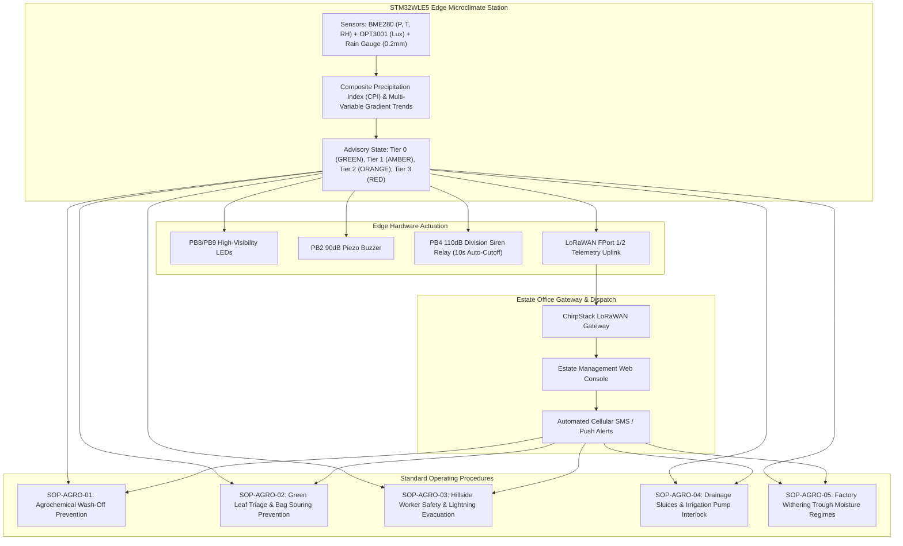

# Estate Agronomic Operational Response Guidelines & Field Safety Protocols

## 1. Document Metadata & Operational Purpose

| Attribute | Specification Details |
| :--- | :--- |
| **Document ID** | `SOP-AGRO-MASTER-01` |
| **Title** | Estate Agronomic Operational Response Guidelines, Agrochemical Wash-Off Prevention, Leaf Quality Preservation & Field Safety Protocols |
| **Target Agro-Ecosystem** | High-Altitude Commercial Tea Plantations (*Camellia sinensis*, 500m to 2,200m AMSL) |
| **Applicable Regions** | Western Ghats (Munnar, Nilgiris, Valparai), Darjeeling, Assam, Sri Lanka Central Highlands, Kenya Great Rift Valley |
| **Hardware Reference** | STM32WLE5 Edge Microclimate Station Node with LoRaWAN Telemetry |
| **Associated Firmware Task** | `S7-T3.3` |
| **Version & Status** | Version 1.0 (Production Operational Field Manual) |

### 1.1 Operational Mandate

This manual defines standard operating procedures (SOPs) for plantation general managers, field division officers, agricultural conductors, and factory withering supervisors. It translates edge-computed meteorological predictions—specifically the **Composite Precipitation Index ($CPI$)**, **Barometric Pressure Gradient ($\Delta P / \Delta t$)**, **Solar Irradiance Attenuation ($\Delta Lux / \Delta t$)**, and **Tipping-Bucket Pulse Counts**—into immediate, verifiable agronomic and workforce safety interventions.

By providing **$\ge 60\text{ minutes}$** of advance warning prior to convective orographic precipitation, this framework:
1. **Eliminates agrochemical wash-off losses** ($>\$45\text{ to }\$80\text{/ha}$ per prevented washout).
2. **Prevents green leaf thermal souring** and auto-fermentation inside compacted collection bags, averting a $15\%\text{ to }30\%$ discount on auction tea valuations.
3. **Protects hillside laborers** from fatal lightning strikes on exposed ridges and prevents injuries from flash floods in steep terrain ($15^\circ\text{ to }45^\circ$ slopes).
4. **Prevents electrical motor burnout** and soil erosion via automated irrigation shutdown and drainage sluice actuation.
5. **Pre-conditions factory withering troughs** for high surface-moisture intake before leaf arrival.

---

## 2. High-Altitude Mountain Agro-Ecosystem Context

```
+---------------------------------------------------------------------------------------------------+
|                            HIGH-ALTITUDE TEA PLANTATION RISK PROFILE                              |
+------------------------------------+--------------------------------------------------------------+
| Agronomic Domain                   | Impact of Unpredicted Convective Storms                      |
+------------------------------------+--------------------------------------------------------------+
| 1. Agrochemical Spraying           | - Rainwash of contact/systemic fungicides within 3-4 hours   |
|                                    | - $45 - $80/hectare direct chemical & labor loss per washout |
|                                    | - Chemical runoff causing stream and river contamination     |
+------------------------------------+--------------------------------------------------------------+
| 2. Harvesting & Leaf Quality       | - Excessive surface moisture on fresh green leaf (> 15% wt)  |
|                                    | - Leaf core temperature spikes (> 35°C) in wet bags          |
|                                    | - Pre-fermentation souring, reducing CTC/Orthodox tea grade |
|                                    | - 15% - 30% discount on auction hammer price                 |
+------------------------------------+--------------------------------------------------------------+
| 3. Hillside Workforce Safety       | - Fatal lightning strikes on exposed high ridge tops         |
|                                    | - Slip-and-fall injuries on steep terraces (25° - 45° grade) |
|                                    | - Flash flood entrapment in drainage ravines                 |
+------------------------------------+--------------------------------------------------------------+
| 4. Irrigation & Drainage           | - Wasteful power consumption running heavy pump motors       |
|                                    | - Soil waterlogging causing root asphyxiation in valleys     |
|                                    | - Severe topsoil silt erosion and gully collapse             |
+------------------------------------+--------------------------------------------------------------+
| 5. Factory Processing              | - Wet leaf overloading withering trough heaters & fans       |
|                                    | - Inadequate airflow causing uneven fermentation & black leaf|
+------------------------------------+--------------------------------------------------------------+
```



---

## 3. Four-Tier Agronomic Advisory Decision Matrix

The station firmware maps meteorological stability into four distinct operational advisory tiers:

| Tier | State Name | $CPI$ Score | Atmospheric Indicators | Edge Visual / Acoustic Outputs | Primary Operational Directive |
| :---: | :--- | :---: | :--- | :--- | :--- |
| **0** | **GREEN**<br>(Normal Ops) | $0\% - 29\%$ | $\Delta P / \Delta t \ge -0.5\,\text{hPa/3h}$<br>Active rain tips $= 0$ | Green LED 1 Hz pulse (5% duty cycle)<br>Buzzer / Siren **OFF** | **Normal Field Operations**: Full plucking rounds, authorized agrochemical spraying, and routine nursery irrigation. |
| **1** | **AMBER**<br>(Pre-Alert / Caution) | $30\% - 59\%$ | $-1.5 \le \Delta P / \Delta t < -0.5\,\text{hPa/3h}$<br>Rapid solar fluctuations | Amber LED 2 Hz blink (50% duty cycle)<br>Buzzer / Siren **OFF** | **Pre-Alert**: Suspend chemical spraying; do not mix concentrate; stage waterproof tarpaulins at field weigh stations. |
| **2** | **ORANGE**<br>(High Alert) | $60\% - 79\%$ | $\Delta P / \Delta t < -1.5\,\text{hPa/3h}$<br>Lux attenuation $> 50\%$ in 30m | Red LED 2.5 Hz flash (50% duty cycle)<br>Intermittent piezo chirp (1s on, 4s off) | **High Alert**: Recall pluckers from high ridges ($>1500\text{m}$); accelerate green leaf bagging and weigh-in; open drainage silt gates. |
| **3** | **RED**<br>(Emergency Evacuation) | $80\% - 100\%$ | Active rain tips $\ge 2$ ($0.4\text{mm}$)<br>OR $\Delta P / \Delta t \le -2.0\,\text{hPa/3h}$ | Red LED 10 Hz rapid strobe<br>Division Siren: **10.0s continuous pulse**<br>Continuous 90dB buzzer | **Emergency Evacuation**: Immediate retreat to lightning-grounded muster sheds; shut down irrigation pumps; seal leaf transit sheds. |

### 3.1 State Transitions and Clearance Hysteresis

To prevent operational chatter and false resets during passing storm squalls:
1. **Escalation Gate**: Escalation from Tier 0 through Tier 3 occurs instantaneously upon crossing threshold parameters. Immediate override to **Tier 3 (RED)** occurs if $\ge 2\text{ tipping bucket pulses}$ ($0.4\text{mm}$) are detected or barometric pressure drops $> 2.0\,\text{hPa/3h}$.
2. **De-escalation Hysteresis Filter**:
   - RED $\rightarrow$ ORANGE requires $CPI < 80\%$ and zero tipping bucket pulses for **$\ge 30\text{ consecutive minutes}$**.
   - ORANGE $\rightarrow$ AMBER requires $CPI < 60\%$ for **$\ge 45\text{ consecutive minutes}$**.
   - AMBER $\rightarrow$ GREEN requires $CPI < 30\%$ and steady/rising barometric pressure for **$\ge 60\text{ consecutive minutes}$**.

---

## 4. Deep-Domain Standard Operating Procedures (SOPs)

### 4.1 SOP-AGRO-01: Agrochemical Spray Wash-Off Prevention

Tea cultivation requires timely application of high-cost chemical inputs to control endemic pests and diseases:
- **Blister Blight (*Exobasidium vexans*)**: Copper Oxychloride 50% WP (contact fungicide) and Hexaconazole/Propiconazole (systemic ergosterol inhibitors).
- **Red Spider Mite (*Oligonychus coffeae*)**: Fenpyroximate, Spiromesifen (contact/ingestion acaricides).
- **Foliar Micronutrients**: Zinc Sulphate ($\text{ZnSO}_4$), Boric Acid, and Urea.

#### 1. Rainfastness Curing Physics
Foliar chemicals require a critical drying and cuticular absorption window before rain impact:
- Contact protectants (Copper Oxychloride, wettable sulfur): $T_{\text{cure}} = \mathbf{2.5\text{ to }3.0\text{ hours}}$.
- Systemic fungicides (Triazoles, translaminar strobilurins): $T_{\text{cure}} = \mathbf{3.5\text{ to }4.0\text{ hours}}$.
- Foliar micronutrients: $T_{\text{cure}} = \mathbf{2.0\text{ to }3.0\text{ hours}}$.

#### 2. Wash-Off Loss Mathematical Formulation
If rainfall occurs at interval $\Delta t = t_{\text{rain}} - t_{\text{spray}}$, the percentage of unabsorbed chemical washed into the ground is modeled as:

$$L_{\text{chem}}(\Delta t) = \begin{cases} 100.0\% & \text{if } \Delta t < 0.5\text{ hr} \\ 100 \times \exp\left(-\frac{\Delta t}{T_{\text{cure}} \cdot 0.4343}\right) & \text{if } 0.5\text{ hr} \le \Delta t < T_{\text{cure}} \\ 0.0\% & \text{if } \Delta t \ge T_{\text{cure}} \end{cases}$$

```
Chemical Wash-Off Fraction vs. Lead Time (T_cure = 3.5 hrs):
  Δt = 0.5 hr  -->  Loss = 72.0% ($46.80/ha wasted)  --> SEVERE FAILURE
  Δt = 1.5 hr  -->  Loss = 37.2% ($24.18/ha wasted)  --> MODERATE LOSS
  Δt = 2.5 hr  -->  Loss = 19.3% ($12.55/ha wasted)  --> PARTIAL ABSORPTION
  Δt = 3.5 hr  -->  Loss =  0.0% ($0.00/ha wasted)   --> 100% RAINFAST
```

#### 3. Field Spray Protocol Actions
- **Tier 0 (GREEN)**: Field Conductor authorizes spraying. Power knapsack sprayers operate across scheduled 4-hour morning blocks (07:00 to 11:00).
- **Tier 1 (AMBER)**: **HOLD SPRAY AUTHORIZATION**. Spray gangs do not fill tanks or mix concentrates. Gangs already in the field finish current tank and do not refill. Redirect spray labor to terrace cleaning or manual weeding.
- **Tier 2 (ORANGE / RED)**: **IMMEDIATE SPRAY CESSATION**. Shut off motorized spray engines, drain unused spray into storage drums, wash nozzles with clean water, and return to chemical storehouse.

---

### 4.2 SOP-AGRO-02: Plucking Squad Triage & Green Leaf Quality Preservation

Harvesting in commercial tea targets tender apical shoots (**Two Leaves and a Bud**). The physical quality and auction valuation of made tea (CTC or Orthodox) depend strictly on leaf temperature and moisture upon arrival at the processing factory.

#### 1. Wet Leaf Respiration & Thermal Souring Kinetics
When leaf is plucked during rain or wet leaf is crammed into $50\text{ kg}$ woven nylon/HDPE collection sacks:
1. **Excess Surface Moisture ($W_{\text{surf}}$)**: Saturated leaf carries $15\%\text{ to }30\%$ surface water, increasing haulage transport costs and suffocating leaf pore structures.
2. **Respiration Thermal Runaway**: Compacted wet leaf undergoes accelerated anaerobic respiration. The internal core temperature follows:
   $$T_{\text{core}}(t) = T_{\text{ambient}} + (T_{\text{max}} - T_{\text{ambient}}) \cdot \left(1 - \exp\left(-k_{\text{resp}} \cdot t\right)\right)$$
   Where $k_{\text{resp}} = 0.035\,\text{min}^{-1}$ for wet compacted leaf (versus $0.008\,\text{min}^{-1}$ for dry leaf). Internal bag temperature reaches the critical thermal damage threshold of **$35^\circ\text{C}$ within 38 minutes**!
3. **Auto-Fermentation & Auction Valuation Destruction**: Temperatures exceeding $35^\circ\text{C}$ destroy essential polyphenol oxidases, denaturing **Theaflavins (TF)** and **Thearubigins (TR)**. The resulting blackened, soured leaf causes an immediate **$15\%\text{ to }30\%$ auction discount** ($\approx \$0.95\text{/kg}$ made tea loss).

#### 2. Field Harvest Directives
- **Tier 0 (GREEN)**: Standard harvesting. Pluckers empty bamboo baskets/nylon bags at muster weigh stations every 2.5 hours.
- **Tier 1 (AMBER)**:
  - Unfold and anchor heavy-duty PVC waterproof tarpaulins over all open hillside weighing platforms.
  - Dispatch division transport tractors to roadside staging points.
  - Pluckers secure bag rain covers and prepare harvest capes.
- **Tier 2 (ORANGE)**:
  - **Accelerated Field Weigh-In**: Field conductors whistle for immediate mid-session weigh-in.
  - Bagged leaf is weighed, loosely tied (avoiding compaction), and transferred into covered transport trailers.
  - Plucking squads on exposed high ridges ($>1500\text{m}$) migrate to sheltered valley terraces.
- **Tier 3 (RED)**:
  - **Immediate Plucking Stop**: Pluckers bag current picked volume and evacuate to muster sheds.
  - Sacks stored inside division sheds on raised slatted wooden benches ($> 15\text{ cm}$ above floor) with natural cross-ventilation. Never stack bags more than 2 layers high.

---

### 4.3 SOP-AGRO-03: Hillside Workforce Safety & Lightning / Landslide Mitigation

Mountain tea estates present steep gradients ($15^\circ\text{ to }45^\circ$) and remote ridge summits where severe convective weather poses acute life safety hazards:

```
+---------------------------------------------------------------------------------------------------+
|                                  HILLSIDE WORKFORCE HAZARD MATRIX                                 |
+---------------------+-------------------------------+---------------------------------------------+
| Hazard Category     | Primary Environmental Trigger | Specific Danger to Field Personnel          |
+---------------------+-------------------------------+---------------------------------------------+
| 1. Lightning Strike | Convective cumulonimbus cloud | Direct strike / ground step-potential on    |
|                     | Solar Lux drop > 75% in 30min | exposed ridges and under isolated trees     |
+---------------------+-------------------------------+---------------------------------------------+
| 2. Slope Slip / Fall| Rain intensity > 25 mm/hr     | Mud slicks on steep tea terraces; puncture  |
|                     | Soil saturation > 85%         | wounds from pruned tea bush stumps          |
+---------------------+-------------------------------+---------------------------------------------+
| 3. Debris / Flash   | Sustained rainfall > 50 mm/2h | Torrential runoff through natural ravines;  |
|    Flood in Ravines | Valley convergence            | washed out culverts trapping field squads   |
+---------------------+-------------------------------+---------------------------------------------+
```

#### 1. Lightning Safety Protocols: The Enhanced 30-30 Rule
- **Standard 30-30 Rule**: Seek shelter when flash-to-thunder time is $< 30\text{ seconds}$ ($\approx 10\text{ km}$ away); remain sheltered until 30 minutes after the last thunderclap.
- **Station Predictive Advantage**: The station node identifies rapid barometric drops ($\Delta P / \Delta t$) and cloud attenuation ($\Delta Lux / \Delta t$) **$\mathbf{45\text{ to }75\text{ minutes}}$ before the first cloud-to-ground flash**, providing adequate margin for workers on remote ridges ($1.2\text{ km}$ walking distance at $0.8\,\text{m/s} = 25\text{ minutes}$) to reach shelter.

#### 2. Mandatory Safe vs Prohibited Shelters
- **STRICTLY PROHIBITED**:
  - Isolated shade trees (*Grevillea robusta*, *Erythrina lithosperma*) — high risk of side-flash and lethal step voltage.
  - Wire fence lines, metallic plucking frames, and water pipeline crossings.
  - Open hilltop ridges or terrace crests.
- **MANDATORY SAFE SHELTERS**:
  - Division Muster Sheds equipped with UL 96A copper lightning arrestors and low-resistance grounding rods ($R_g < 5\,\Omega$).
  - Fully enclosed all-metal tractor cabs and crew transport buses.
  - Permanent masonry estate division offices and bungalows.

---

### 4.4 SOP-AGRO-04: Estate Irrigation & Drainage Sluice Gate Control

Commercial tea nurseries, clonal multiplication plots, and young plantings feature sprinkler networks and valley drainage channels:

| Operational State | Rain Prediction | Irrigation & Drainage Actions |
| :---: | :---: | :--- |
| **Tier 0 (GREEN)** | $CPI < 30\%$ | Scheduled overhead sprinkler cycles active (04:30–08:30 / 16:30–19:30). Sluice gates at normal weir levels. |
| **Tier 1 (AMBER)** | $30\% \le CPI < 60\%$ | Inhibit pending sprinkler starts. Inspect drainage trash racks for silt and fallen leaves. |
| **Tier 2 (ORANGE)**| $60\% \le CPI < 80\%$ | Fully open low-level drainage sluice gates; clear silt sedimentation traps to prevent torrent erosion. |
| **Tier 3 (RED)**   | $CPI \ge 80\%$ OR<br>Tips $\ge 2$ | **EMERGENCY PUMP MOTOR SHUTDOWN**: Disengage main 415V contactors to prevent lightning voltage transients, pump cavitational jamming, and power waste. |

---

### 4.5 SOP-AGRO-05: Factory Withering Trough Coordination

The tea factory withering shed must prepare trough regimes prior to the arrival of leaf consignments:

| Leaf Condition | Surface Moisture | Target Withering Duration | Airflow & Temperature Configuration |
| :--- | :---: | :---: | :--- |
| **Regime A (Standard Dry Leaf)** | $< 2.0\%$ | $12.0 - 14.0\text{ hours}$ | Ambient air fan ventilation; $24^\circ\text{C} - 26^\circ\text{C}$; bed thickness $20\text{ cm}$. |
| **Regime B (Dew-Damp Leaf)** | $3.0\% - 8.0\%$ | $14.0 - 16.0\text{ hours}$ | Heated air assist ($30^\circ\text{C}$); $100\%$ fan CFM; bed thickness $15\text{ cm}$. |
| **Regime C (Storm-Saturated Leaf)** | $> 15.0\%$ | $18.0 - 22.0\text{ hours}$ | Full heater boost ($35^\circ\text{C}$); maximum static pressure; thin bed spread ($10\text{ cm}$) to avert souring. |

- **Dispatch Action**: When node uplinks indicate **Tier 2 (ORANGE)** or **Tier 3 (RED)**, the factory supervisor immediately clears Troughs #4–#8 for **Regime C**, pre-heating air ducts before tractors arrive.

---

## 5. Telemetry, Alert Dispatch & Local Gateway Architecture

In accordance with [`telemetry-protocol.md`](file:///C:/Users/ENERGY%20SAVER/Documents/Learning/Job%20Projects/rain-predict/docs/architecture/telemetry-protocol.md), edge stations report status over LoRaWAN:
- **FPort 1 (12 Bytes)**: Periodic routine telemetry every 15, 5, or 2 minutes.
- **FPort 2 (4 Bytes)**: Asynchronous Immediate Urgent Alert:
  - Byte 0: `0x02` (`MSG_TYPE_ALERT`)
  - Byte 1: `[7:6]` Rain State (0..3), `[5:0]` CPI Percentage (0..100)
  - Byte 2: `[7:5]` Pressure Gradient Trend (0..7), `[4:0]` Solar Attenuation (0..31)
  - Byte 3: `[7:4]` Hardware Alert Flags (Siren Active, Buzzer Active), `[3:0]` CRC-4

```mermaid
sequenceDiagram
    autonumber
    participant Node as STM32WLE5 Station Node
    participant Siren as PB4 Siren Relay (110dB)
    participant Field as Hillside Field Gangs
    participant GW as Division LoRaWAN Gateway
    participant Mgmt as Estate Office / Factory

    Note over Node: Convective Cloud Buildup: CPI = 72%
    Node->>Node: Red LED 2.5Hz Flash; Piezo chirp active
    Node->>GW: Uplink FPort 2 Alert (0x02, CPI=72%, ORANGE)
    GW->>Mgmt: Push WhatsApp / SMS Alert to Field Officers
    Mgmt->>Field: Radio Alert: Hold chemical spraying; recall ridge pluckers

    Note over Node: Cloudburst / Rapid Baro Plunge: CPI = 86%
    Node->>Siren: Energize PB4 Relay for 10.0 Seconds
    Siren-->>Field: 110dB Acoustic Tone echoes across tea valleys
    Field->>Field: Immediate evacuation to lightning-grounded muster shed
    Node->>GW: Uplink FPort 2 Alert (0x02, CPI=86%, RED, Siren=1)
    GW->>Mgmt: Push Alert: Factory prep Regime C withering troughs
```

---

## 6. Field Inspection & Maintenance Checklist

### Daily Operational Protocol
- [ ] **05:45 AM**: Inspect Master Web Dashboard for overnight barometric trend and Zambretti baseline.
- [ ] **06:00 AM**: Confirm Station Node green optical LED pulse (1 Hz, 5% duty cycle).
- [ ] **06:30 AM**: Issue gang dispatch orders (plucking blocks and spray authorizations).
- [ ] **12:00 PM**: Conduct mid-day telemetry check for afternoon convective cloud development.
- [ ] **17:00 PM**: Review daily rainfall totals and log harvested green leaf quality ratings.

### Weekly Sensor Integrity Check
- [ ] Clean tipping-bucket funnel screen of organic debris, leaves, and bird droppings.
- [ ] Inspect BME280 radiation shield louvers for spider webs or dust accumulation.
- [ ] Wipe OPT3001 optical diffuser with clean, damp microfiber cloth.
- [ ] Verify battery telemetry voltage $> 3.25\text{V}$ under full solar illumination.
