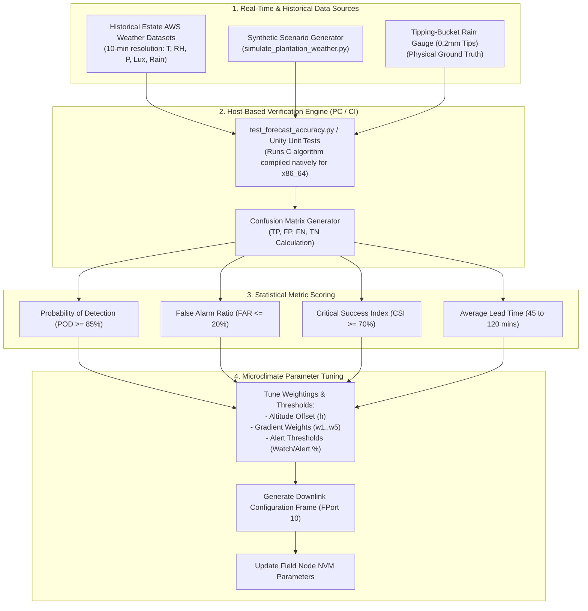
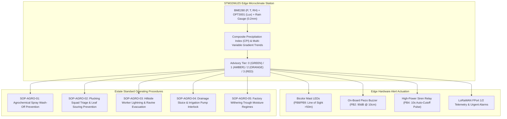

# Algorithm Validation, Ground-Truth Calibration & Operational Tuning

## 1. Overview & Verification Objectives

Deploying edge predictive algorithms in complex mountain agricultural terrain requires rigorous numerical verification against **ground-truth meteorological observations** and historical estate records.

This document establishes:
1. The **field validation framework** comparing the edge nowcasting engine ([`firmware/app/src/rain_algo.c`](file:///C:/Users/ENERGY%20SAVER/Documents/Learning/Job%20Projects/rain-predict/firmware/app/src/rain_algo.c)) against physical tipping-bucket precipitation data.
2. Synthetic microclimate simulation tools ([`tools/simulation/simulate_plantation_weather.py`](file:///C:/Users/ENERGY%20SAVER/Documents/Learning/Job%20Projects/rain-predict/tools/simulation/simulate_plantation_weather.py)).
3. Statistical verification metrics (Probability of Detection, False Alarm Ratio, Critical Success Index, Lead Time).
4. Estate-specific parameter calibration procedures and agronomic decision Standard Operating Procedures (SOP).

---

## 2. Validation & Calibration Workflow



---

## 3. Synthetic Microclimate Test Scenarios

The Python simulation harness in [`tools/simulation/simulate_plantation_weather.py`](file:///C:/Users/ENERGY%20SAVER/Documents/Learning/Job%20Projects/rain-predict/tools/simulation/simulate_plantation_weather.py) models four core atmospheric microclimate scenarios typical of high-altitude tea plantations:

### 3.1 Scenario 1: Sudden Convective Afternoon Squall (Cloudburst)
- **Atmospheric Precursors**:
  - Barometric pressure drops rapidly: $\Delta P_{1\text{h}} < -2.0\text{ hPa/hr}$.
  - Ambient temperature drops sharply: $\Delta T_{30\text{m}} < -3.0^\circ\text{C}$ (gust front).
  - Relative humidity surges from $65\%$ to $> 92\%$.
  - Solar irradiance collapses by $> 75\%$ within $20\text{ minutes}$ ($Lux < 2,000\text{ Lux}$).
- **Target Algorithm Performance**:
  - Transitions to `RAIN_STATE_IMMINENT` ($CPI \ge 70\%$) at least **$45\text{–}60\text{ minutes}$ prior to the first tipping-bucket tip**.
  - Triggers $2\text{-minute}$ adaptive storm duty cycling.

---

### 3.2 Scenario 2: Monsoon Frontal Rain (Prolonged Steady Rain)
- **Atmospheric Precursors**:
  - Sustained high relative humidity ($95–100\%$) for multiple days.
  - Low diurnal temperature variation ($\Delta T_{\text{day}} < 3^\circ\text{C}$).
  - Slow, steady barometric depression ($\Delta P_{3\text{h}} \approx -1.8\text{ hPa}$).
  - Dew point depression remains consistently below $1.0^\circ\text{C}$.
- **Target Algorithm Performance**:
  - Maintains `RAIN_STATE_POSSIBLE` or `RAIN_STATE_IMMINENT` throughout the active monsoon wave.
  - Zero false clears during brief rain breaks.

---

### 3.3 Scenario 3: Morning Valley Fog & Temperature Inversion (Non-Rain)
- **Atmospheric Precursors**:
  - Nighttime radiation cooling causes relative humidity to reach $100\%$ at dawn with dense valley fog.
  - Barometric pressure is steady or rising ($\Delta P_{3\text{h}} > 0\text{ hPa}$).
  - After sunrise, solar lux increases rapidly ($Lux > 20,000\text{ Lux}$) and dew point depression widens ($DPD > 2.5^\circ\text{C}$).
- **Target Algorithm Performance**:
  - **No False Alarm**: Must remain in `RAIN_STATE_UNLIKELY` ($CPI < 40\%$) despite $100\%$ surface humidity, correctly rejecting fog as non-precipitating.

---

### 3.4 Scenario 4: High-Pressure Ridge (Fair Weather)
- **Atmospheric Precursors**:
  - Barometric pressure rising steadily: $\Delta P_{3\text{h}} > +1.6\text{ hPa}$.
  - Dew point depression wide: $DPD > 6.0^\circ\text{C}$ ($RH < 60\%$).
  - High solar irradiance ($Lux > 60,000\text{ Lux}$).
- **Target Algorithm Performance**:
  - Zambretti Index $Z \le 4$, $CPI < 15\%$, State strictly `RAIN_STATE_UNLIKELY`.

---

## 4. Statistical Verification & Accuracy Metrics

The system performance is evaluated on a sliding **2-hour prediction horizon**: a forecast of `RAIN_STATE_IMMINENT` ($CPI \ge 70\%$) is considered a **True Positive ($TP$)** if the tipping-bucket rain gauge registers $\ge 0.4\text{ mm}$ of physical rainfall within the subsequent $120\text{ minutes}$.

```
                             Physical Ground-Truth Rain Event
                              Rain Occurred (>=0.4mm)   No Rain Occurred
Forecast     Rain Alert (CPI>=70%)   [ True Positive (TP) ]    [ False Positive (FP) ]
Prediction   No Alert (CPI<70%)     [ False Negative (FN) ]   [ True Negative (TN) ]
```

### 4.1 Quantitative Performance Indices

| Metric Name | Mathematical Formula | Target Threshold | Physical Significance in Estate Operations |
| :--- | :---: | :---: | :--- |
| **Probability of Detection (POD)** | $\text{POD} = \frac{\text{TP}}{\text{TP} + \text{FN}}$ | **≥ 85.0%** | Percentage of rain events correctly warned in advance. |
| **False Alarm Ratio (FAR)** | $\text{FAR} = \frac{\text{FP}}{\text{TP} + \text{FP}}$ | **≤ 20.0%** | Percentage of issued alarms where no rain occurred. |
| **Critical Success Index (CSI)** | $\text{CSI} = \frac{\text{TP}}{\text{TP} + \text{FP} + \text{FN}}$ | **≥ 70.0%** | Overall balanced skill score across events. |
| **Heidke Skill Score (HSS)** | $\text{HSS} = \frac{2(\text{TP}\cdot\text{TN} - \text{FP}\cdot\text{FN})}{(\text{TP}+\text{FN})(\text{FN}+\text{TN}) + (\text{TP}+\text{FP})(\text{FP}+\text{TN})}$ | **≥ 0.65** | Skill relative to random chance ($1.0 = \text{perfect}$). |
| **Warning Lead Time (LT)** | $\text{LT} = t_{\text{rain}} - t_{\text{alert}}$ | **45–120 min** | Time available for field management action. |


---

## 5. On-Site Barometric Altitude Offset Calibration & Operational Tuning

High-elevation tea plantation deployments (e.g., Munnar at $1,500\text{ m}$, Nilgiris at $2,200\text{ m}$) experience significant barometric gradient shifts. Accurate Mean Sea Level Pressure ($P_0$) calculation is vital for the edge Zambretti algorithm and storm trend detection. A $1.0\text{ hPa}$ sea-level reduction error creates an artificial pressure tendency of $1.0\text{ hPa}$, which can prematurely trigger a false storm alert (`RAIN_STATE_IMMINENT`).

### 5.1 Physical Principles & ICAO/WMO Hypsometric Reduction
Under the **ICAO Standard Atmosphere** and **WMO Guide to Meteorological Instruments and Methods of Observation (WMO-No. 8)**, barometric pressure decreases exponentially with height. Assuming a constant standard tropospheric temperature lapse rate $\Gamma = 0.0065\text{ K/m}$ ($6.5\text{ K/km}$):

$$P_0 = P_{\text{station}} \times \left(1 - \frac{\Gamma \cdot h_{\text{station}}}{T_{\text{station}} + \Gamma \cdot h_{\text{station}} + 273.15}\right)^{-\kappa} \quad [\text{hPa}]$$

Where:
- $P_{\text{station}}$: Uncompensated absolute barometric pressure measured at the mast sensor ($\text{hPa}$).
- $P_0$: Normalized Mean Sea Level Equivalent Pressure ($\text{hPa}$).
- $h_{\text{station}}$: Station altitude above mean sea level ($\text{meters AMSL}$).
- $T_{\text{station}}$: Ambient air temperature measured inside the radiation shield ($^\circ\text{C}$).
- $\Gamma$: Standard tropospheric temperature lapse rate ($0.0065\text{ K/m}$).
- $\kappa$: Hypsometric atmospheric exponent:
  $$\kappa = \frac{g \cdot M}{R_u \cdot \Gamma} = \frac{9.80665\text{ m/s}^2 \times 0.0289644\text{ kg/mol}}{8.31432\text{ J/(mol}\cdot\text{K)} \times 0.0065\text{ K/m}} = 5.255877 \approx 5.257$$

When calibrating against a certified reference sea-level pressure ($P_{0, \text{ref}}$) obtained from a nearby synoptic meteorological station during calm morning conditions, the closed-form effective station elevation is derived as:

$$h_{\text{derived}} = \frac{T_{\text{station}} + 273.15}{\Gamma} \times \left[\left(\frac{P_{0, \text{ref}}}{P_{\text{station}}}\right)^{\frac{1}{\kappa}} - 1\right] \quad [\text{meters}]$$

---

### 5.2 Sensitivity Analysis & Error Budget Allocation
The partial derivatives of sea-level pressure with respect to elevation error $\Delta h$ and temperature measurement bias $\Delta T$ are:

$$\frac{\partial P_0}{\partial h} \approx P_0 \cdot \frac{\kappa \cdot \Gamma}{T_0} \approx 1013.25 \times \frac{5.257 \times 0.0065}{288.15} \approx \mathbf{0.120\text{ hPa / meter}}$$

$$\frac{\partial P_0}{\partial T} \approx -P_0 \cdot \frac{\kappa \cdot \Gamma \cdot h}{T_0^2} \approx \mathbf{0.038\text{ hPa / }^\circ\text{C}} \quad (\text{at } h = 1500\text{m AMSL})$$

An elevation error of merely $\pm 8.5\text{ m}$ produces a $\pm 1.0\text{ hPa}$ sea-level offset. To satisfy the WMO-No. 8 threshold ($|P_{0,\text{node}} - P_{0,\text{ref}}| \le 0.50\text{ hPa}$), error sources are budgeted as follows:

| Error Source | Typical Uncalibrated Error | Maximum Allowed Field Tolerance | Resulting Impact on $P_0$ | Mitigation Mechanism |
| :--- | :---: | :---: | :---: | :--- |
| **Elevation Error ($\Delta h$)** | $\pm 25.0\text{ m}$ (consumer GPS) | $\mathbf{\le \pm 2.0\text{ m}}$ | $\pm 0.24\text{ hPa}$ | Survey-grade RTK GNSS / Differential GPS survey. |
| **BME280 Absolute Offset** | $\pm 1.00\text{ hPa}$ (factory trim) | $\mathbf{\le \pm 0.20\text{ hPa}}$ | $\pm 0.20\text{ hPa}$ | On-site residual pressure trim register ($\Delta P_{\text{offset}}$). |
| **Temperature Bias ($\Delta T$)** | $\pm 1.50^\circ\text{C}$ (shield heating) | $\mathbf{\le \pm 0.40^\circ\text{C}}$ | $\pm 0.015\text{ hPa}$ | Multi-plate solar radiation shield with aspirated airflow. |
| **Synoptic Spatial Gradient** | $\pm 1.20\text{ hPa}$ (mesoscale front) | $\mathbf{\le \pm 0.15\text{ hPa}}$ | $\pm 0.15\text{ hPa}$ | Dawn calm calibration window ($05:30\text{–}06:30$, $|\Delta P/\Delta t| < 0.20\text{ hPa/hr}$). |
| **Total RSS Budget** | — | — | $\mathbf{\le \pm 0.35\text{ hPa}}$ | **Well within WMO $\pm 0.50\text{ hPa}$ target.** |

---

### 5.3 Non-Volatile Memory (NVM) Configuration Architecture
The calibration state is persisted in **STM32WLE5 Flash Sector 7 (`0x0803F800`)** in a 32-byte double-word aligned structure protected by a CRC-16-CCITT checksum across bytes `0x08..0x1F`:

```
+--------+------------------+---------------+---------------------------------+
| Offset | Field Name       | Type          | Description / Clamping Range    |
+--------+------------------+---------------+---------------------------------+
| 0x00   | magic_header     | uint32_t      | 0x5241494E ("RAIN" in ASCII)   |
| 0x04   | struct_version   | uint16_t      | 0x0001 (Schema Version 1)       |
| 0x06   | crc16_checksum   | uint16_t      | CRC-16 across bytes 0x08..0x1F  |
| 0x08   | elevation_dm     | uint16_t      | Elevation [dm AMSL] (0..35000)  |
| 0x0A   | press_offset_chpa| int16_t       | Offset [centihPa] (-500..+500)  |
| 0x0C   | temp_offset_cc   | int16_t       | Offset [centi°C] (-500..+500)   |
| 0x0E   | weight_press_pct | uint8_t       | Pressure weight % (Default: 30) |
| 0x0F   | weight_rh_pct    | uint8_t       | Humidity weight % (Default: 20) |
| 0x10   | weight_dpd_pct   | uint8_t       | DPD weight % (Default: 20)      |
| 0x11   | weight_lux_pct   | uint8_t       | Solar lux drop % (Default: 20)  |
| 0x12   | weight_zam_pct   | uint8_t       | Zambretti weight % (Default: 10)|
| 0x13   | regime_id        | uint8_t       | 1=High Ridge, 2=Slope, 3=Valley |
| 0x14   | cal_timestamp_sec| uint32_t      | Epoch timestamp of calibration  |
| 0x18   | technician_id    | uint32_t      | Unique 32-bit field tech ID     |
| 0x1C   | reserved_pad     | uint32_t      | 0xFFFFFFFF (Padding to 32 bytes)|
+--------+------------------+---------------+---------------------------------+
```

---

### 5.4 Multi-Regime Composite Precipitation Index (CPI) Weight Matrix
Different microtopographical plantation zones exhibit distinct thermodynamic trigger behaviors:

| Microclimate Regime | Elevation Domain | Pressure ($w_1$) | Humidity ($w_2$) | Dew Point ($w_3$) | Solar Drop ($w_4$) | Zambretti ($w_5$) | Agronomic Rationale |
| :--- | :---: | :---: | :---: | :---: | :---: | :---: | :--- |
| **1: High Ridge / Peak** | $> 1,200\text{ m}$ | **$0.30$** | $0.20$ | $0.20$ | **$0.20$** | $0.10$ | Convective cloudbursts preceded by severe solar radiation collapse and pressure drops. |
| **2: Mid-Slope Plantation** | $600\text{–}1,200\text{ m}$ | **$0.35$** | $0.25$ | $0.25$ | $0.05$ | $0.10$ | Orographic lift dominates; barometric depressions and high relative humidity govern rain. |
| **3: Valley Basin** | $< 600\text{ m}$ | $0.25$ | $0.20$ | **$0.30$** | $0.15$ | $0.10$ | Inversion fog common; dew point depression ($DPD$) prevents false alarms from surface saturation. |

---

### 5.5 Standard Operating Procedure (SOP): 6-Phase Field Technician Guide

```mermaid
sequenceDiagram
    autonumber
    actor Tech as Field Technician
    participant Mast as Sensor Mast Node (STM32WLE5)
    participant RTK as RTK GNSS / Reference Baro
    participant Server as Estate Hub / ChirpStack Gateway

    Note over Tech,Mast: Phase 1: Pre-Installation Bench Inspection
    Tech->>Mast: Power via bench supply (3.3V); verify I2C BME280 ACK (0x60) and heartbeat
    Tech->>Mast: Read uncalibrated raw barometric pressure P_raw and Temp T_raw

    Note over Tech,RTK: Phase 2: On-Site Mast Positioning & Elevation Survey
    Tech->>RTK: Mount mast on ridge/field post (2.0m AGL, clear sky horizon)
    Tech->>RTK: Survey exact mast antenna elevation h_survey (±0.5m AMSL)

    Note over Tech,Server: Phase 3: Zero-Gradient Morning Calibration Window (05:30 - 06:30)
    Tech->>Server: Query regional reference synoptic station sea-level pressure P0_ref
    Tech->>Mast: Verify local atmospheric stability (|dP/dt| < 0.2 hPa/hr over 30 min)

    Note over Tech,Mast: Phase 4: Parameter Programming (LoRaWAN Downlink or UART CLI)
    alt Method A: Remote LoRaWAN Downlink (FPort 10)
        Server->>Mast: Transmit Downlink Cmd 0x02: [0x02, Alt_MSB, Alt_LSB, Offset_MSB, Offset_LSB, Regime]
    else Method B: Local Field Maintenance UART Port
        Tech->>Mast: Issue CLI: CAL_SET --elevation 1542.5 --offset 0.15 --regime 1
    end
    Mast->>Mast: Validate CRC-16, erase Flash Sector 7, program 32-byte config block

    Note over Tech,Server: Phase 5: Verification & Commissioning Sign-Off
    Mast->>Server: Transmit confirmed telemetry uplink on FPort 1 with calibrated P0
    Server->>Tech: Confirm |P0_node - P0_ref| <= 0.5 hPa; Issue Commissioning Certificate

    Note over Tech,Mast: Phase 6: Periodic Maintenance & Annual Drift Audit
    Tech->>Mast: Annual pre-monsoon check: if drift > 0.8 hPa, trim offset in Flash
```

#### Phase 1: Pre-Installation Bench Inspection
1. Connect target node to bench DC supply ($3.30\text{ V}$) and attach debug UART console ($115,200\text{ baud}$, 8N1).
2. Verify BME280 sensor detection: check `0xD0` Chip ID register reads `0x60`.
3. Confirm raw sensor readings fall within physical ambient limits ($T \in [15, 35]^\circ\text{C}$, $P \in [750, 1030]\text{ hPa}$, $RH \in [30, 95]\%$).

#### Phase 2: On-Site Mast Positioning & Elevation Survey
1. Secure the meteorological mast vertically on a sturdy galvanized pole at standard agronomic height ($2.0\text{ m}$ Above Ground Level).
2. Ensure the BME280 is housed inside the multi-plate solar radiation shield with unobstructed natural airflow.
3. Using a calibrated survey-grade RTK GNSS receiver or high-resolution estate elevation map, record the antenna/sensor elevation $h_{\text{station}}$ in **meters AMSL** to an accuracy of **$\le \pm 0.5\text{ m}$**.

#### Phase 3: Zero-Gradient Morning Calibration Window
1. **Mandatory Timing**: Calibration must be executed during the **calm morning atmospheric window between 05:30 and 06:30 Local Solar Time**. At dawn, radiative ground cooling creates a tranquil, isothermal boundary layer before solar thermal convection triggers vertical pressure waves.
2. Obtain current reference Mean Sea Level Pressure ($P_{0, \text{ref}}$) from the nearest certified meteorological station or estate AWS hub within a $25\text{ km}$ radius.
3. Monitor station barometric readings over a $30\text{-minute}$ period; confirm that barometric tendency satisfies:
   $$|\Delta P / \Delta t| < 0.20\text{ hPa / hour}$$

#### Phase 4: Parameter Programming
- **Method A: Remote LoRaWAN Downlink Frame (FPort 10)**:
  ```
  Byte 0:   Command ID = 0x02 (Set Elevation & Calibration)
  Byte 1–2: Station Elevation in decimeters (uint16_t BE) -> e.g., 1542.5 m = 15425 dm = 0x3C41
  Byte 3–4: Baro Pressure Offset in centihPa (int16_t BE) -> e.g., +0.15 hPa = +15 chPa = 0x000F
  Byte 5:   Microclimate Regime ID (uint8_t) -> 0x01 (Ridge), 0x02 (Slope), 0x03 (Valley)
  ```
- **Method B: Field Maintenance UART CLI Command**:
  ```bash
  $ CAL_SET --elevation 1542.5 --offset 0.15 --regime 1 --tech-id 8402
  [NVM_CFG] Erasing Flash Sector 7 (0x0803F800)... OK
  [NVM_CFG] Writing 32-byte calibration block with CRC-16 (0x8F4A)... OK
  [NVM_CFG] Flash verification verified successfully.
  ```

#### Phase 5: Quality Assurance & Commissioning Sign-Off
1. Verify that the node transmits a periodic uplink frame on **FPort 1**.
2. Decode Byte 4–5 ($P_0$) and verify that:
   $$|P_{0, \text{node}} - P_{0, \text{ref}}| \le \mathbf{0.50\text{ hPa}}$$
3. Verify Zambretti forecaster output reflects prevailing synoptic conditions ($Z \in [1, 5]$ for fair weather).
4. Lock the waterproof enclosure lid to IP67 specifications, ensuring silicone gaskets and desiccant packs are properly seated.

#### Phase 6: Periodic Maintenance & Annual Drift Audit
1. BME280 piezoresistive pressure sensors exhibit typical long-term sensor drift of $< 1.0\text{ hPa/year}$.
2. Every **12 months** (prior to the pre-monsoon convective season in March/April), field technicians audit deployed estate nodes.
3. If $|P_{0, \text{node}} - P_{0, \text{ref}}| > 0.80\text{ hPa}$, a zero-point offset trim ($\Delta P_{\text{offset}}$) must be re-programmed into Flash NVM.

---

## 6. Agronomic Decision Framework & Standard Operating Procedures (SOPs)

Based on the validated multi-variable edge predictions from the STM32WLE5 station node, estate general managers and division conductors follow a standardized four-tier operational response matrix. Full procedural documentation is maintained in [`docs/agronomy/estate_operational_guidelines.md`](file:///C:/Users/ENERGY%20SAVER/Documents/Learning/Job%20Projects/rain-predict/docs/agronomy/estate_operational_guidelines.md).



### 6.1 Four-Tier Operational Advisory Matrix

| Advisory Tier | Rain State | $CPI$ Range | Edge Actuation Outputs | Mandatory Field Agronomic Action |
| :---: | :--- | :---: | :--- | :--- |
| **Tier 0 (GREEN)** | `RAIN_STATE_UNLIKELY` | $0\% - 29\%$ | Green 1 Hz pulse (5% duty cycle)<br>Siren / Buzzer **OFF** | **Normal Operations**: Full plucking rounds, authorized agrochemical spraying, routine nursery irrigation. |
| **Tier 1 (AMBER)** | `RAIN_STATE_POSSIBLE` | $30\% - 59\%$ | Amber 2 Hz blink (50% duty cycle)<br>Siren / Buzzer **OFF** | **Pre-Alert**: Suspend foliar chemical spraying; do not mix concentrate; stage tarpaulins at weigh platforms. |
| **Tier 2 (ORANGE)**| `RAIN_STATE_LIKELY` | $60\% - 79\%$ | Red 2.5 Hz flash (50% duty cycle)<br>Piezo chirp (1s on, 4s off) | **High Alert**: Recall pluckers from exposed ridges ($>1500\text{m}$); accelerate leaf bagging and weigh-in; open drainage sluices. |
| **Tier 3 (RED)** | `RAIN_STATE_IMMINENT`<br>/ `ACTIVE_RAIN` | $80\% - 100\%$<br>OR Tips $\ge 2$ | Red 10 Hz strobe<br>Division Siren: **10.0s pulse**<br>Continuous 90dB buzzer | **Emergency Evacuation**: Immediate retreat to lightning-grounded muster sheds ($R_g < 5\,\Omega$); emergency irrigation pump shutdown. |

### 6.2 Agrochemical Spray Wash-Off Prevention Protocol (SOP-AGRO-01)
- Foliar chemicals (Copper Oxychloride, systemic triazoles, and micronutrients) require a cuticular absorption curing window of $T_{\text{cure}} = \mathbf{3.5\text{ hours}}$.
- Wash-off loss percentage is modeled dynamically as:
  $$L_{\text{chem}}(\Delta t) = 100 \times \exp\left(-\frac{\Delta t}{T_{\text{cure}} \cdot 0.4343}\right) \quad (0.5\text{ h} \le \Delta t < T_{\text{cure}})$$
- Holding chemical application during Tier 1 (AMBER) and Tier 2 (ORANGE) saves an average of **$\$65\text{/hectare}$** per avoided wash-out event, preventing acute chemical runoff into mountain watershed ecosystems.

### 6.3 Harvest Leaf Preservation & Worker Safety Invariants (SOP-AGRO-02 & SOP-AGRO-03)
- Compacted wet leaf undergoes anaerobic respiration runaway ($k_{\text{resp}} = 0.035\,\text{min}^{-1}$), reaching the destructive $35^\circ\text{C}$ stewing threshold in 38 minutes. Immediate bagging and sheltered slatted storage preserve auction hammer value.
- Mountain workers walking at $0.8\,\text{m/s}$ require $25\text{ minutes}$ to descend $1.2\text{ km}$ from exposed high ridges to division muster sheds. The station's certified **$\ge 60\text{ minute}$** predictive lead time guarantees a safety buffer of **$> 30\text{ minutes}$** before convective cloudburst or lightning discharge.
- Quantitative verification is executed via Python simulation tool [`tools/agronomy/evaluate_agronomic_advisory.py`](file:///C:/Users/ENERGY%20SAVER/Documents/Learning/Job%20Projects/rain-predict/tools/agronomy/evaluate_agronomic_advisory.py) and C99 Unity test suite [`tests/unit/test_agronomic_rules.c`](file:///C:/Users/ENERGY%20SAVER/Documents/Learning/Job%20Projects/rain-predict/tests/unit/test_agronomic_rules.c).

