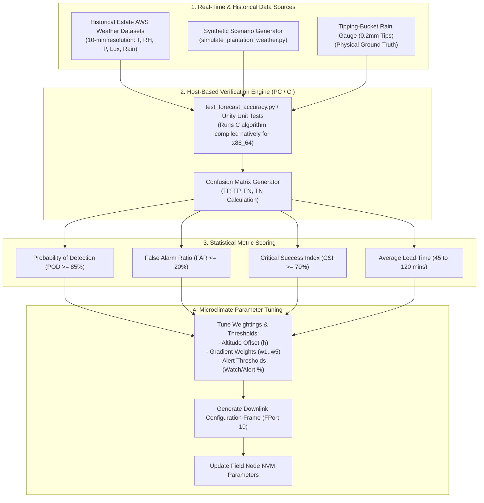
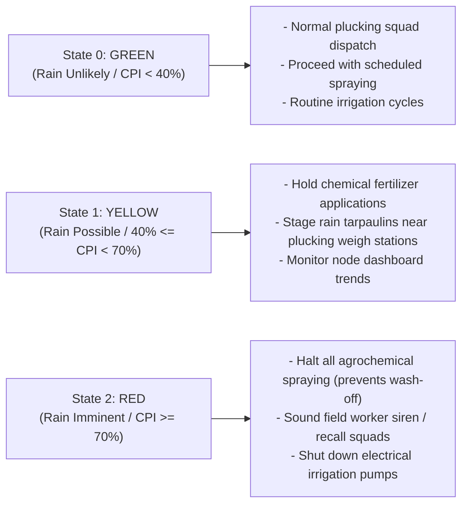

# Algorithm Validation, Ground-Truth Calibration & Operational Tuning

## 1. Overview & Verification Objectives

Deploying edge predictive algorithms in complex mountain agricultural terrain requires rigorous numerical verification against **ground-truth meteorological observations** and historical estate records.

This document establishes:
1. The **field validation framework** comparing the edge nowcasting engine ([`firmware/app/src/rain_algo.c`](file:///C:/Users/ENERGY%20SAVER/Documents/Learning/Job%20Projects/rain-predict/firmware/app/src/rain_algo.c)) against physical tipping-bucket precipitation data.
2. Synthetic microclimate simulation tools ([`tools/simulation/simulate_plantation_weather.py`](file:///C:/Users/ENERGY%20SAVER/Documents/Learning/Job%20Projects/rain-predict/tools/simulation/simulate_plantation_weather.py)).
3. Statistical verification metrics (Probability of Detection, False Alarm Ratio, Critical Success Index, Lead Time).
4. Estate-specific parameter calibration procedures and agronomic decision Standard Operating Procedures (SOP).

---

## 2. Validation & Calibration Workflow



---

## 3. Synthetic Microclimate Test Scenarios

The Python simulation harness in [`tools/simulation/simulate_plantation_weather.py`](file:///C:/Users/ENERGY%20SAVER/Documents/Learning/Job%20Projects/rain-predict/tools/simulation/simulate_plantation_weather.py) models four core atmospheric microclimate scenarios typical of high-altitude tea plantations:

### 3.1 Scenario 1: Sudden Convective Afternoon Squall (Cloudburst)
- **Atmospheric Precursors**:
  - Barometric pressure drops rapidly: $\Delta P_{1\text{h}} < -2.0\text{ hPa/hr}$.
  - Ambient temperature drops sharply: $\Delta T_{30\text{m}} < -3.0^\circ\text{C}$ (gust front).
  - Relative humidity surges from $65\%$ to $> 92\%$.
  - Solar irradiance collapses by $> 75\%$ within $20\text{ minutes}$ ($Lux < 2,000\text{ Lux}$).
- **Target Algorithm Performance**:
  - Transitions to `RAIN_STATE_IMMINENT` ($CPI \ge 70\%$) at least **$45\text{–}60\text{ minutes}$ prior to the first tipping-bucket tip**.
  - Triggers $2\text{-minute}$ adaptive storm duty cycling.

---

### 3.2 Scenario 2: Monsoon Frontal Rain (Prolonged Steady Rain)
- **Atmospheric Precursors**:
  - Sustained high relative humidity ($95–100\%$) for multiple days.
  - Low diurnal temperature variation ($\Delta T_{\text{day}} < 3^\circ\text{C}$).
  - Slow, steady barometric depression ($\Delta P_{3\text{h}} \approx -1.8\text{ hPa}$).
  - Dew point depression remains consistently below $1.0^\circ\text{C}$.
- **Target Algorithm Performance**:
  - Maintains `RAIN_STATE_POSSIBLE` or `RAIN_STATE_IMMINENT` throughout the active monsoon wave.
  - Zero false clears during brief rain breaks.

---

### 3.3 Scenario 3: Morning Valley Fog & Temperature Inversion (Non-Rain)
- **Atmospheric Precursors**:
  - Nighttime radiation cooling causes relative humidity to reach $100\%$ at dawn with dense valley fog.
  - Barometric pressure is steady or rising ($\Delta P_{3\text{h}} > 0\text{ hPa}$).
  - After sunrise, solar lux increases rapidly ($Lux > 20,000\text{ Lux}$) and dew point depression widens ($DPD > 2.5^\circ\text{C}$).
- **Target Algorithm Performance**:
  - **No False Alarm**: Must remain in `RAIN_STATE_UNLIKELY` ($CPI < 40\%$) despite $100\%$ surface humidity, correctly rejecting fog as non-precipitating.

---

### 3.4 Scenario 4: High-Pressure Ridge (Fair Weather)
- **Atmospheric Precursors**:
  - Barometric pressure rising steadily: $\Delta P_{3\text{h}} > +1.6\text{ hPa}$.
  - Dew point depression wide: $DPD > 6.0^\circ\text{C}$ ($RH < 60\%$).
  - High solar irradiance ($Lux > 60,000\text{ Lux}$).
- **Target Algorithm Performance**:
  - Zambretti Index $Z \le 4$, $CPI < 15\%$, State strictly `RAIN_STATE_UNLIKELY`.

---

## 4. Statistical Verification & Accuracy Metrics

The system performance is evaluated on a sliding **2-hour prediction horizon**: a forecast of `RAIN_STATE_IMMINENT` ($CPI \ge 70\%$) is considered a **True Positive ($TP$)** if the tipping-bucket rain gauge registers $\ge 0.4\text{ mm}$ of physical rainfall within the subsequent $120\text{ minutes}$.

```
                             Physical Ground-Truth Rain Event
                              Rain Occurred (>=0.4mm)   No Rain Occurred
Forecast     Rain Alert (CPI>=70%)   [ True Positive (TP) ]    [ False Positive (FP) ]
Prediction   No Alert (CPI<70%)     [ False Negative (FN) ]   [ True Negative (TN) ]
```

### 4.1 Quantitative Performance Indices

| Metric Name | Mathematical Formula | Target Threshold | Physical Significance in Estate Operations |
| :--- | :---: | :---: | :--- |
| **Probability of Detection ($\text{POD}$)** | $\text{POD} = \frac{\text{TP}}{\text{TP} + \text{FN}}$ | **$\ge 85.0\%$** | Percentage of rain events correctly warned in advance. |
| **False Alarm Ratio ($\text{FAR}$)** | $\text{FAR} = \frac{\text{FP}}{\text{TP} + \text{FP}}$ | **$\le 20.0\%$** | Percentage of issued alarms where no rain occurred. |
| **Critical Success Index ($\text{CSI}$)** | $\text{CSI} = \frac{\text{TP}}{\text{TP} + \text{FP} + \text{FN}}$ | **$\ge 70.0\%$** | Overall balanced skill score across events. |
| **Heidke Skill Score ($\text{HSS}$)** | $\text{HSS} = \frac{2(\text{TP}\cdot\text{TN} - \text{FP}\cdot\text{FN})}{(\text{TP}+\text{FN})(\text{FN}+\text{TN}) + (\text{TP}+\text{FP})(\text{FP}+\text{TN})}$ | **$\ge 0.65$** | Skill relative to random chance ($1.0 = \text{perfect}$). |
| **Warning Lead Time ($\text{LT}$)** | $\text{LT} = t_{\text{rain\_start}} - t_{\text{alert\_issued}}$ | **$45\text{–}120\text{ min}$** | Time available for field management action. |

---

## 5. Field Parameter Calibration Guidelines

When commissioning a node in a new plantation microclimate, three parameters should be calibrated:

### 5.1 Station Elevation Calibration ($h_{\text{station}}$)
- **Procedure**: Obtain exact GPS elevation ($\text{meters AMSL}$) using an RTK receiver or surveyed estate topographic map.
- **Configuration**: Send LoRaWAN Downlink Command `0x02` (FPort 10) to program the elevation offset into the microcontroller NVM.
- **Verification**: Verify that computed sea-level pressure ($P_0$) aligns within $\pm 0.5\text{ hPa}$ of the regional synoptic airport/meteorological station baseline during steady atmospheric conditions.

---

### 5.2 Regional Gradient Weight Tuning ($w_1..w_5$)
Depending on whether the estate is dominated by **convective thunderstorms** (e.g., Nilgiris, Sri Lanka Central Highlands) or **orographic monsoon rain** (e.g., Assam plains, Munnar windward slopes):

| Microclimate Regime | Pressure Weight ($w_1$) | Humidity Weight ($w_2$) | Dew Point Weight ($w_3$) | Solar Drop Weight ($w_4$) | Zambretti Weight ($w_5$) |
| :--- | :---: | :---: | :---: | :---: | :---: |
| **Convective / Squall Dominant** | $0.30$ | $0.20$ | $0.20$ | **$0.20$** | $0.10$ |
| **Orographic / Monsoon Dominant** | **$0.35$** | $0.25$ | $0.25$ | $0.05$ | $0.10$ |
| **High-Altitude Valley Fog Region**| $0.25$ | $0.20$ | **$0.30$** | $0.15$ | $0.10$ |

---

## 6. Agronomic Decision SOP (Standard Operating Procedures)

Based on the validated 3-state output from the node, estate managers follow defined operational workflows:



### 6.1 Spraying Wash-Off Prevention Rule
- Agrochemical spraying (fungicides, foliar fertilizers) requires a minimum rain-free period of **$3\text{–}4\text{ hours}$** after application to absorb into the tea leaf cuticle.
- If the node indicates `RAIN_STATE_POSSIBLE` ($CPI \ge 40\%$) or `RAIN_STATE_IMMINENT` ($CPI \ge 70\%$), spraying operations are immediately postponed, saving substantial chemical input costs and preventing waterway contamination.
