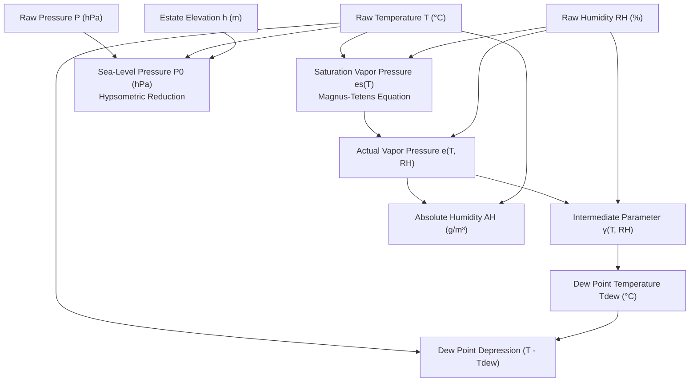

# Meteorological Formulas & Thermodynamic Derivations

## 1. Overview & Mathematical Scope

This document details the exact mathematical formulas, thermodynamic approximations, and numerical considerations implemented in the **Tea Plantation Rain Prediction System** firmware running on the **STM32WLE5** (ARM Cortex-M4 with hardware Single-Precision FPU).

These formulas transform raw sensor readings ($T, RH, P, Lux$) into derived meteorological state variables:
1. **Saturation & Actual Vapor Pressure** ($e_s, e$).
2. **Dew Point Temperature** ($T_{dew}$).
3. **Dew Point Depression** ($T - T_{dew}$).
4. **Absolute Humidity** ($AH\text{ in g/m}^3$).
5. **Sea-Level Equivalent Barometric Pressure** ($P_0$).

---

## 2. Thermodynamic Derivation Pipeline



---

## 3. Core Meteorological Formulations

### 3.1 Magnus-Tetens Vapor Pressure Equations
The saturation vapor pressure of water vapor over liquid water $e_s(T)$ is computed via the **Magnus-Tetens** approximation (valid for $-40^\circ\text{C} \le T \le +50^\circ\text{C}$ with uncertainty $< 0.1\%$):

$$e_s(T) = 6.112 \times \exp\left(\frac{17.67 \cdot T}{T + 243.5}\right) \quad [\text{hPa}]$$

The actual partial vapor pressure $e(T, RH)$ is obtained directly from relative humidity:

$$e(T, RH) = e_s(T) \times \frac{RH}{100.0} \quad [\text{hPa}]$$

---

### 3.2 Dew Point Temperature Calculation ($T_{dew}$)
The dew point temperature is derived by inverting the Magnus formula using the intermediate variable $\gamma(T, RH)$:

$$\gamma(T, RH) = \ln\left(\frac{RH}{100.0}\right) + \frac{17.67 \cdot T}{T + 243.5}$$

$$T_{dew} = \frac{243.5 \cdot \gamma(T, RH)}{17.67 - \gamma(T, RH)} \quad [^\circ\text{C}]$$

---

### 3.3 Dew Point Depression ($DPD$)
The **Dew Point Depression ($DPD$)** measures the difference between ambient air temperature and dew point:

$$DPD = T - T_{dew} \quad [^\circ\text{C}]$$

#### Meteorological Significance in Nowcasting
- **$DPD > 5.0^\circ\text{C}$**: Dry air parcel; precipitation highly unlikely.
- **$2.0^\circ\text{C} \le DPD \le 5.0^\circ\text{C}$**: Moderate humidity; clouds or light fog possible.
- **$DPD < 2.0^\circ\text{C}$**: Near-saturation ($RH > 88–92\%$); cloud base reaches canopy height; high risk of rain condensation.
- **$DPD \le 0.5^\circ\text{C}$**: Complete saturation ($RH \approx 98–100\%$); fog, active condensation, and rainfall occurring.

---

### 3.4 Absolute Humidity ($AH$)
The volumetric water vapor density ($AH$) in grams per cubic meter ($\text{g/m}^3$):

$$AH = \frac{216.7 \times e(T, RH)}{T + 273.15} \quad [\text{g/m}^3]$$

---

### 3.5 Barometric Hypsometric Altitude Correction
To eliminate terrain elevation bias and compute true meteorological pressure gradients across estate valleys:

$$P_0 = P \times \left(1 - \frac{0.0065 \cdot h}{T + 0.0065 \cdot h + 273.15}\right)^{-5.257} \quad [\text{hPa}]$$

- $P$: Local barometric pressure at sensor mast ($\text{hPa}$).
- $T$: Local ambient temperature ($^\circ\text{C}$).
- $h$: Station altitude above sea level ($\text{meters}$).
- $0.0065\text{ K/m}$: Standard tropospheric temperature lapse rate ($\Gamma$).
- $5.257$: Exponent derived from standard atmospheric constants $\left(\frac{g \cdot M}{R_0 \cdot \Gamma}\right)$.

---

## 4. Embedded Numerical Implementation & Guards

Implemented in [`firmware/middleware/src/dew_point.c`](file:///C:/Users/ENERGY%20SAVER/Documents/Learning/Job%20Projects/rain-predict/firmware/middleware/src/dew_point.c):

```c
#include "dew_point.h"
#include <math.h>

#define MAGNUS_A            17.67f
#define MAGNUS_B            243.5f
#define MAGNUS_C            6.112f

/**
 * @brief Computes dew point and vapor pressure from T and RH.
 * @param[in]  temp_c     Ambient temperature in degrees C.
 * @param[in]  rh_pct     Relative humidity in % (0.0 to 100.0).
 * @param[out] p_dew_c    Pointer to output dew point in degrees C.
 * @param[out] p_vp_hpa   Pointer to output vapor pressure in hPa.
 * @return status_t       STATUS_OK on success, error code otherwise.
 */
status_t calc_dew_point(float temp_c, float rh_pct, float *p_dew_c, float *p_vp_hpa)
{
    if (p_dew_c == NULL || p_vp_hpa == NULL) {
        return STATUS_ERR_NULL_PTR;
    }

    /* Guard against physically invalid inputs & log(0) */
    if (rh_pct < 0.1f) {
        rh_pct = 0.1f;
    } else if (rh_pct > 100.0f) {
        rh_pct = 100.0f;
    }

    /* Clamping temperature to physical range */
    if (temp_c < -40.0f) {
        temp_c = -40.0f;
    } else if (temp_c > 85.0f) {
        temp_c = 85.0f;
    }

    /* Saturation Vapor Pressure: es(T) */
    float es = MAGNUS_C * expf((MAGNUS_A * temp_c) / (temp_c + MAGNUS_B));
    
    /* Actual Vapor Pressure: e = es * (RH / 100) */
    float e = es * (rh_pct / 100.0f);
    *p_vp_hpa = e;

    /* Intermediate parameter: gamma = ln(RH / 100) + (A * T) / (T + B) */
    float gamma = logf(rh_pct / 100.0f) + ((MAGNUS_A * temp_c) / (temp_c + MAGNUS_B));

    /* Guard against denominator singularity */
    float denom = MAGNUS_A - gamma;
    if (fabsf(denom) < 1e-4f) {
        denom = 1e-4f;
    }

    /* Dew Point Temperature */
    *p_dew_c = (MAGNUS_B * gamma) / denom;

    return STATUS_OK;
}

/**
 * @brief Computes sea-level equivalent pressure from station pressure.
 */
float calc_sea_level_pressure(float station_p_hpa, float temp_c, float altitude_m)
{
    if (altitude_m <= 0.0f) {
        return station_p_hpa;
    }
    
    float lapse_h = 0.0065f * altitude_m;
    float t_kelvin = temp_c + lapse_h + 273.15f;
    float base = 1.0f - (lapse_h / t_kelvin);
    
    return station_p_hpa * powf(base, -5.257f);
}
```
