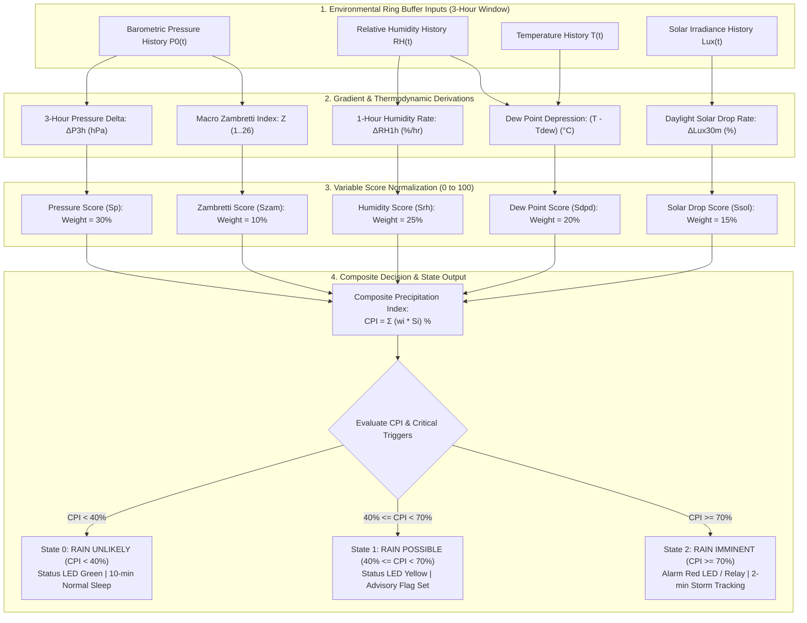

# Multi-Variable Trend Detection & Rain Nowcasting Model

## 1. Overview & Nowcasting Architecture

While synoptic weather models (NWP) forecast 24–72 hour regional trends, plantation microclimate management requires **short-term nowcasting (1–6 hour horizon)** directly at the tea parcel level.

The **Tea Plantation Rain Prediction System** implements an on-chip, multi-variable heuristic scoring model running on the **STM32WLE5** SoC. It fuses high-resolution gradients of barometric pressure, relative humidity, dew-point depression, solar cloud attenuation, and the macro Zambretti index into a unified **Composite Precipitation Index ($CPI \in [0, 100\%]$)**.

---

## 2. Multi-Variable Scoring Pipeline



---

## 3. Variable Scoring Functions & Weights

The **Composite Precipitation Index ($CPI$)** is a linear weighted sum of 5 normalized sub-scores:

$$CPI = 0.30 \cdot S_P + 0.25 \cdot S_{RH} + 0.20 \cdot S_{DPD} + 0.15 \cdot S_{SOL} + 0.10 \cdot S_{ZAM}$$

### 3.1 Barometric Pressure Gradient Score ($S_P$, Weight: $30\%$)
Evaluates the 3-hour pressure delta $\Delta P_{3\text{h}} = P_0(t) - P_0(t - 3\text{h})$:

$$S_P = \begin{cases} 
100 & \text{if } \Delta P_{3\text{h}} \le -3.0\text{ hPa} \quad (\text{Severe squall line}) \\
80 & \text{if } -3.0\text{ hPa} < \Delta P_{3\text{h}} \le -2.0\text{ hPa} \quad (\text{Rapid fall}) \\
50 & \text{if } -2.0\text{ hPa} < \Delta P_{3\text{h}} \le -1.0\text{ hPa} \quad (\text{Moderate fall}) \\
20 & \text{if } -1.0\text{ hPa} < \Delta P_{3\text{h}} \le 0.0\text{ hPa} \quad (\text{Slow fall}) \\
0 & \text{if } \Delta P_{3\text{h}} > 0.0\text{ hPa} \quad (\text{Rising pressure / anticyclone})
\end{cases}$$

---

### 3.2 Relative Humidity Gradient Score ($S_{RH}$, Weight: $25\%$)
Evaluates the 1-hour rate of humidity increase $\Delta RH_{1\text{h}} = RH(t) - RH(t - 1\text{h})$ and absolute humidity level:

$$S_{RH} = \begin{cases}
100 & \text{if } RH \ge 95\% \text{ or } \Delta RH_{1\text{h}} \ge +15\%/\text{hr} \\
80 & \text{if } 90\% \le RH < 95\% \text{ or } \Delta RH_{1\text{h}} \ge +10\%/\text{hr} \\
50 & \text{if } 80\% \le RH < 90\% \text{ or } \Delta RH_{1\text{h}} \ge +5\%/\text{hr} \\
15 & \text{if } 65\% \le RH < 80\% \\
0 & \text{if } RH < 65\%
\end{cases}$$

---

### 3.3 Dew Point Depression Score ($S_{DPD}$, Weight: $20\%$)
Evaluates proximity of ambient temperature to the dew point $DPD = T - T_{dew}$:

$$S_{DPD} = \begin{cases}
100 & \text{if } DPD \le 0.5^\circ\text{C} \quad (\text{Complete air saturation / fog}) \\
80 & \text{if } 0.5^\circ\text{C} < DPD \le 1.5^\circ\text{C} \quad (\text{Condensation threshold}) \\
50 & \text{if } 1.5^\circ\text{C} < DPD \le 3.0^\circ\text{C} \quad (\text{High moisture}) \\
15 & \text{if } 3.0^\circ\text{C} < DPD \le 5.0^\circ\text{C} \quad (\text{Moderate moisture}) \\
0 & \text{if } DPD > 5.0^\circ\text{C} \quad (\text{Dry air parcel})
\end{cases}$$

---

### 3.4 Solar Attenuation Score ($S_{SOL}$, Weight: $15\%$)
Evaluates rapid daylight light loss over 30 minutes $\left(\frac{Lux_{t-30m} - Lux_t}{Lux_{t-30m}}\right)$ during daylight hours ($Lux_{t-30m} > 5,000\text{ Lux}$):

$$S_{SOL} = \begin{cases}
100 & \text{if drop } \ge 70\% \text{ and current } Lux < 3,000\text{ Lux} \quad (\text{Cumulonimbus overhead}) \\
65 & \text{if drop } \ge 50\% \\
30 & \text{if drop } \ge 30\% \\
0 & \text{if steady, increasing, or nighttime}
\end{cases}$$

---

### 3.5 Zambretti Macro Score ($S_{ZAM}$, Weight: $10\%$)
Evaluates the baseline Zambretti index $Z \in [1, 26]$:

$$S_{ZAM} = \min\left(100, \max\left(0, (Z - 1) \times 4\right)\right)$$

---

## 4. Operational Alert States & Adaptive Duty-Cycling

| Forecast State | $CPI$ Range | Field Warning Level | Node Actions & Transmissions | Sampling Interval |
| :--- | :---: | :---: | :--- | :---: |
| **`RAIN_STATE_UNLIKELY`** (0) | $0\% \le CPI < 40\%$ | **Normal / Green** | Standard telemetry packet; normal plucking operations. | $10\text{ minutes}$ |
| **`RAIN_STATE_POSSIBLE`** (1) | $40\% \le CPI < 70\%$ | **Watch / Yellow** | Advisory flag asserted; supervisor notified via dashboard. | $5\text{ minutes}$ |
| **`RAIN_STATE_IMMINENT`** (2) | $CPI \ge 70\%$ | **Alert / Red** | Local buzzer/relay triggered; field worker siren broadcast. | $\mathbf{2\text{ minutes}}$ (Adaptive) |

### 4.1 Adaptive Rapid Storm Tracking Mode
When $CPI \ge 70\%$ or $\Delta P_{1\text{h}} < -1.5\text{ hPa/hr}$, the firmware dynamically switches from the default $10\text{-minute}$ sampling interval down to a **$2\text{-minute}$ rapid storm tracking mode**. This captures fast convective cloudburst dynamics while remaining well within the LiFePO4 battery energy budget.

---

## 5. Embedded C Coordinator Implementation

Implemented in [`firmware/app/src/rain_algo.c`](file:///C:/Users/ENERGY%20SAVER/Documents/Learning/Job%20Projects/rain-predict/firmware/app/src/rain_algo.c):

```c
#include "rain_algo.h"
#include "trend_detector.h"
#include "zambretti.h"
#include "dew_point.h"

/**
 * @brief Executes the composite rain nowcasting algorithm.
 */
status_t rain_algo_evaluate(const env_sample_t *p_current, const env_history_t *p_history, rain_forecast_t *p_out)
{
    if (p_current == NULL || p_history == NULL || p_out == NULL) {
        return STATUS_ERR_NULL_PTR;
    }

    /* 1. Calculate pressure gradient score */
    float dp_3h = p_current->press_sea_hpa - p_history->press_sea_3h_ago_hpa;
    uint8_t s_p = score_pressure_gradient(dp_3h);

    /* 2. Calculate humidity gradient score */
    float drh_1h = p_current->humidity_pct - p_history->humidity_1h_ago_pct;
    uint8_t s_rh = score_humidity_gradient(p_current->humidity_pct, drh_1h);

    /* 3. Calculate dew point depression score */
    float dpd = p_current->temp_c - p_current->dew_point_c;
    uint8_t s_dpd = score_dew_point_depression(dpd);

    /* 4. Calculate solar attenuation score */
    uint8_t s_sol = evaluate_solar_attenuation(p_current->ambient_lux, p_history->lux_30m_ago, p_current->is_daylight);

    /* 5. Calculate Zambretti score */
    uint8_t z_idx = 0;
    zambretti_calculate(p_current->press_sea_hpa, dp_3h, &z_idx);
    uint8_t s_zam = (z_idx > 1) ? ((z_idx - 1) * 4) : 0;
    if (s_zam > 100) s_zam = 100;

    /* Weighted Composite Score */
    float cpi = (0.30f * s_p) + (0.25f * s_rh) + (0.20f * s_dpd) + (0.15f * s_sol) + (0.10f * s_zam);
    
    p_out->composite_prob_pct = (uint8_t)cpi;
    p_out->zambretti_index = z_idx;

    /* Determine operational alert state */
    if (cpi >= 70.0f || dp_3h <= -3.0f) {
        p_out->forecast_state = RAIN_STATE_IMMINENT;
        p_out->recommended_sample_interval_sec = 120; /* 2-min rapid mode */
    } else if (cpi >= 40.0f) {
        p_out->forecast_state = RAIN_STATE_POSSIBLE;
        p_out->recommended_sample_interval_sec = 300; /* 5-min watch mode */
    } else {
        p_out->forecast_state = RAIN_STATE_UNLIKELY;
        p_out->recommended_sample_interval_sec = 600; /* 10-min normal mode */
    }

    return STATUS_OK;
}
```
