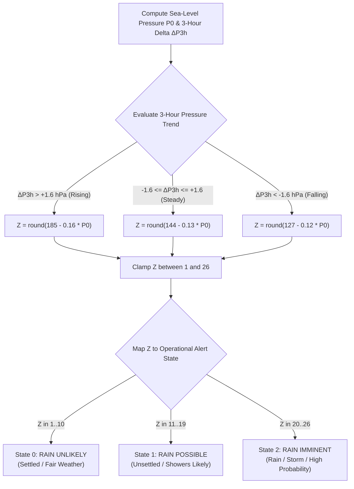

# Zambretti Barometric Forecaster Heuristic

## 1. Overview & Theoretical Foundation

The **Zambretti Forecaster** is an empirical meteorological heuristic formulated in 1915 by Negretti and Zambra. It calculates short-term local weather forecasts (over a 3–12 hour horizon) by evaluating **sea-level equivalent barometric pressure ($P_0$)**, the **rate of barometric pressure change over a 3-hour window ($\Delta P_{3\text{h}}$)**, and seasonal wind trends.

In the **Tea Plantation Rain Prediction System**, the Zambretti algorithm serves as the primary macro-pressure heuristic engine executing on the **STM32WLE5** SoC without requiring cloud computing or numerical weather prediction (NWP) servers.

---

## 2. Sea-Level Pressure Reduction

Because tea estates are situated at high elevations ($h = 500\text{m}–2200\text{m}$ AMSL), measured station pressure ($P$) must first be normalized to equivalent **Sea-Level Pressure ($P_0$)** using the international barometric hypsometric formula:

$$P_0 = P \times \left(1 - \frac{0.0065 \cdot h}{T + 0.0065 \cdot h + 273.15}\right)^{-5.257}$$

- $P$: Raw barometric pressure measured by BME280 ($\text{hPa}$).
- $T$: Ambient air temperature ($^\circ\text{C}$).
- $h$: Station elevation above mean sea level ($\text{meters}$, configured per plantation block).

---

## 3. Barometric Trend Categorization

The firmware maintains a **3-hour moving average history** (18 samples at 10-minute intervals). The 3-hour pressure delta is computed as:

$$\Delta P_{3\text{h}} = P_0(t) - P_0(t - 3\text{ hours})$$

| Trend Classification | Condition | Atmospheric Phenomenon | Zambretti Equation Domain |
| :--- | :---: | :--- | :---: |
| **Rising** | $\Delta P_{3\text{h}} > +1.6\text{ hPa}$ | High-pressure anticyclone building; clearing skies | Formula A |
| **Steady** | $-1.6\text{ hPa} \le \Delta P_{3\text{h}} \le +1.6\text{ hPa}$ | Stable atmospheric pressure field | Formula B |
| **Falling** | $\Delta P_{3\text{h}} < -1.6\text{ hPa}$ | Low-pressure trough approaching; convective instability | Formula C |

---

## 4. Zambretti Numerical Formulas

Based on the categorized trend and sea-level pressure ($P_0$), the Zambretti Index ($Z$) is computed and clamped between $1$ and $26$:



### 4.1 Heuristic Equations
1. **Falling Pressure (Formula C)**:
   $$Z = \text{round}\left(127 - 0.12 \times P_0\right)$$
2. **Steady Pressure (Formula B)**:
   $$Z = \text{round}\left(144 - 0.13 \times P_0\right)$$
3. **Rising Pressure (Formula A)**:
   $$Z = \text{round}\left(185 - 0.16 \times P_0\right)$$

---

## 5. Zambretti Index (1–26) to Operational State Mapping

| Zambretti Index ($Z$) | Standard Meteorological Description | Operational State | Alert Level |
| :---: | :--- | :---: | :---: |
| **1** | Settled Fine Weather | `RAIN_STATE_UNLIKELY` (0) | Green |
| **2** | Fine Weather | `RAIN_STATE_UNLIKELY` (0) | Green |
| **3** | Becoming Fine | `RAIN_STATE_UNLIKELY` (0) | Green |
| **4** | Fine, Becoming Less Settled | `RAIN_STATE_UNLIKELY` (0) | Green |
| **5** | Fine, Possible Showers | `RAIN_STATE_UNLIKELY` (0) | Green |
| **6** | Fairly Fine, Improving | `RAIN_STATE_UNLIKELY` (0) | Green |
| **7** | Fairly Fine, Possible Showers Early | `RAIN_STATE_UNLIKELY` (0) | Green |
| **8** | Fairly Fine, Showers Later | `RAIN_STATE_UNLIKELY` (0) | Green |
| **9** | Showery Early, Improving | `RAIN_STATE_UNLIKELY` (0) | Green |
| **10** | Changeable, Mending | `RAIN_STATE_UNLIKELY` (0) | Green |
| **11** | Fairly Fine, Showers Likely | `RAIN_STATE_POSSIBLE` (1) | Yellow |
| **12** | Rather Unsettled, Clearing Later | `RAIN_STATE_POSSIBLE` (1) | Yellow |
| **13** | Unsettled, Probably Improving | `RAIN_STATE_POSSIBLE` (1) | Yellow |
| **14** | Showery, Bright Intervals | `RAIN_STATE_POSSIBLE` (1) | Yellow |
| **15** | Showery, Becoming More Unsettled | `RAIN_STATE_POSSIBLE` (1) | Yellow |
| **16** | Changeable, Some Rain | `RAIN_STATE_POSSIBLE` (1) | Yellow |
| **17** | Unsettled, Short Fine Intervals | `RAIN_STATE_POSSIBLE` (1) | Yellow |
| **18** | Unsettled, Rain Later | `RAIN_STATE_POSSIBLE` (1) | Yellow |
| **19** | Unsettled, Some Rain | `RAIN_STATE_POSSIBLE` (1) | Yellow |
| **20** | Mostly Very Unsettled | `RAIN_STATE_IMMINENT` (2) | Red |
| **21** | Occasional Rain, Worsening | `RAIN_STATE_IMMINENT` (2) | Red |
| **22** | Rain at Times, Very Unsettled | `RAIN_STATE_IMMINENT` (2) | Red |
| **23** | Rain at Frequent Intervals | `RAIN_STATE_IMMINENT` (2) | Red |
| **24** | Rain, Very Unsettled | `RAIN_STATE_IMMINENT` (2) | Red |
| **25** | Stormy, Much Rain | `RAIN_STATE_IMMINENT` (2) | Red |
| **26** | Severe Storm, Heavy Rain | `RAIN_STATE_IMMINENT` (2) | Red |

---

## 6. Embedded C Implementation

Implemented in [`firmware/app/src/zambretti.c`](file:///C:/Users/ENERGY%20SAVER/Documents/Learning/Job%20Projects/rain-predict/firmware/app/src/zambretti.c):

```c
#include "zambretti.h"
#include <math.h>

/**
 * @brief Calculates the Zambretti forecast index and mapped rain state.
 * @param[in]  p0_hpa       Current sea-level pressure in hPa.
 * @param[in]  p_delta_3h   Pressure change over last 3 hours in hPa.
 * @param[out] p_z_index    Pointer to output Zambretti index (1 to 26).
 * @return rain_forecast_state_t Evaluated operational state (0, 1, or 2).
 */
rain_forecast_state_t zambretti_calculate(float p0_hpa, float p_delta_3h, uint8_t *p_z_index)
{
    float z_raw;

    if (p_delta_3h > 1.6f) {
        /* Rising trend */
        z_raw = 185.0f - (0.16f * p0_hpa);
    } else if (p_delta_3h < -1.6f) {
        /* Falling trend */
        z_raw = 127.0f - (0.12f * p0_hpa);
    } else {
        /* Steady trend */
        z_raw = 144.0f - (0.13f * p0_hpa);
    }

    /* Clamp between 1 and 26 */
    int32_t z = (int32_t)roundf(z_raw);
    if (z < 1) {
        z = 1;
    } else if (z > 26) {
        z = 26;
    }

    if (p_z_index != NULL) {
        *p_z_index = (uint8_t)z;
    }

    /* Map to 3 operational states */
    if (z <= 10) {
        return RAIN_STATE_UNLIKELY;
    } else if (z <= 19) {
        return RAIN_STATE_POSSIBLE;
    } else {
        return RAIN_STATE_IMMINENT;
    }
}
```
