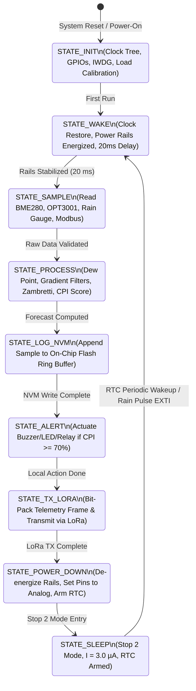
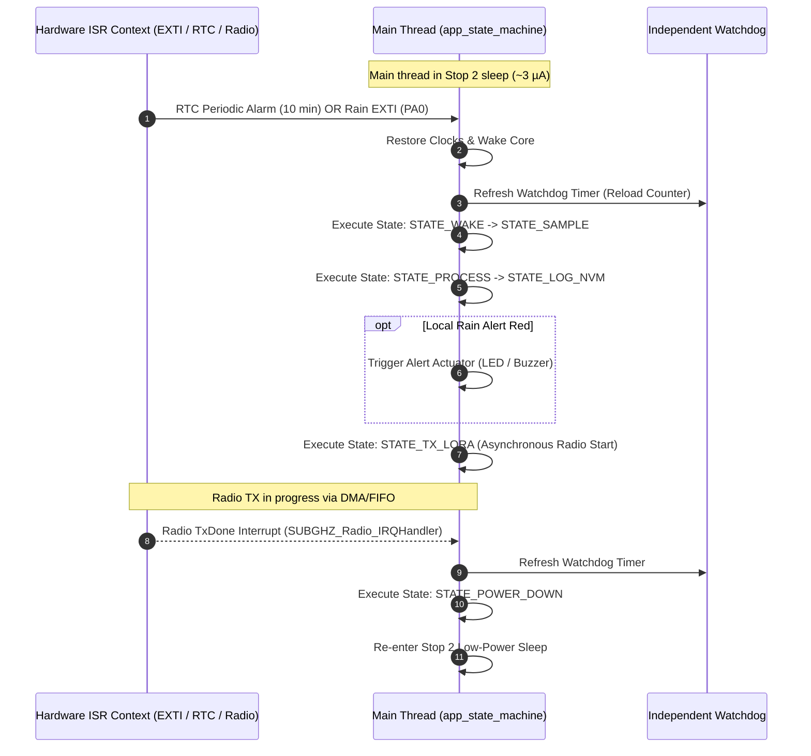

# Embedded Firmware Architecture & Modular Layering

## 1. Architectural Principles & Overview

The firmware for the **Tea Plantation Rain Prediction System** is structured as an **Edge-First, Deterministic, 4-Layer Embedded C Architecture** targeting the **STMicroelectronics STM32WLE5** SoC (ARM Cortex-M4 @ 48 MHz with Single-Precision FPU and integrated Sub-GHz LoRa radio).

### Core Architectural Mandates
- **Strict Unidirectional Coupling**: Higher layers invoke functions in lower layers. Lower layers (e.g., drivers, HAL) never reference or include upper layers.
- **Zero Dynamic Memory Allocation**: `malloc()`, `calloc()`, and `free()` are strictly forbidden in runtime firmware. All ring buffers, data structures, and state objects are statically allocated at compile time.
- **Deterministic Non-Blocking Execution**: Blocking busy-waits (`HAL_Delay` or `while(1)`) are prohibited during operational workflows. All peripheral transfers enforce hardware/software bounded timeouts.
- **Isolated Host-Testable Units**: Algorithmic units (Zambretti forecaster, Magnus dew-point derivation, telemetry codec) are decoupled from hardware registers to enable automated unit testing on host PCs (x86_64) using Unity.

---

## 2. 4-Layer Modular Layering Diagram

```mermaid
flowchart TD
    subgraph Layer4["Layer 4: Application Layer (firmware/app/)"]
        direction TB
        ASM["app_state_machine.c / .h<br/>Top-level operational lifecycle & sleep gating"]
        SCHED["measurement_scheduler.c / .h<br/>RTC tick handling & adaptive duty-cycling"]
        ALGO["rain_algo.c / .h<br/>Composite nowcasting scoring engine"]
        ZAM["zambretti.c / .h<br/>Zambretti barometric heuristic engine"]
        TREND["trend_detector.c / .h<br/>Multi-variable gradient & trend classifier"]
        ALERT["alert_manager.c / .h<br/>Local siren, buzzer & indicator controller"]
    end

    subgraph Layer3["Layer 3: Middleware & Services Layer (firmware/middleware/)"]
        direction TB
        LORA["lorawan_service.c / .h<br/>LoRaWAN Class A stack & event handler"]
        CODEC["telemetry_codec.c / .h<br/>Bit-packed binary packet serializer"]
        PWR["power_mgr.c / .h<br/>Stop 2 low-power entry & clock gating"]
        RBUFF["ring_buffer.c / .h<br/>Static circular buffer implementation"]
        MAVG["moving_avg_filter.c / .h<br/>Moving average & noise reduction filters"]
        DEW["dew_point.c / .h<br/>Magnus-Tetens thermodynamic formulas"]
        NVM["flash_storage.c / .h<br/>Non-volatile on-chip flash ring logging"]
    end

    subgraph Layer2["Layer 2: Driver & BSP Layer (firmware/drivers/)"]
        direction TB
        BME["bme280_driver.c / .h<br/>Bosch BME280 temp/RH/pressure driver"]
        OPT["opt3001_driver.c / .h<br/>TI OPT3001 lux & cloud driver"]
        RAIN["rain_gauge_driver.c / .h<br/>Debounced pulse counter & accumulator"]
        MODBUS["modbus_rtu.c / .h<br/>RS-485 Modbus RTU master engine & CRC"]
        SDI["sdi12_driver.c / .h<br/>SDI-12 1200-baud agricultural bus"]
        I2CBUS["i2c_bus.c / .h<br/>Non-blocking bounded I2C wrapper"]
        UARTBUS["uart_bus.c / .h<br/>Non-blocking UART/RS-485 wrapper"]
        RAILS["bsp_power_rails.c / .h<br/>Switched sensor power rail controller"]
        IND["bsp_indicators.c / .h<br/>LEDs, buzzer & alarm relay toggling"]
    end

    subgraph Layer1["Layer 1: Core & HAL Layer (firmware/core/)"]
        direction TB
        MAIN["main.c / .h<br/>Reset entry, clock init & state dispatcher"]
        MSP["stm32wlxx_hal_msp.c<br/>MCU support package peripheral init"]
        IT["stm32wlxx_it.c / .h<br/>Interrupt service routines (RTC, Radio, EXTI)"]
        SYS["system_stm32wlxx.c<br/>CMSIS clock tree setup (48 MHz MSI/HSE)"]
        CONF["board_config.h<br/>Pin mappings & peripheral assignments"]
        START["startup_stm32wle5xx.s<br/>Vector table & reset handler"]
        LNK["STM32WLE5XX_FLASH.ld<br/>Linker memory layout (Flash/RAM)"]
    end

    Layer4 --> Layer3
    Layer4 --> Layer2
    Layer4 --> Layer1
    Layer3 --> Layer2
    Layer3 --> Layer1
    Layer2 --> Layer1
```



---

## 3. Application State Machine Lifecycle

The top-level operational state machine in [`firmware/app/src/app_state_machine.c`](file:///C:/Users/ENERGY%20SAVER/Documents/Learning/Job%20Projects/rain-predict/firmware/app/src/app_state_machine.c) executes a non-blocking sequential state flow:



---

## 4. Layer Responsibilities & Directory Mapping

### 4.1 Layer 4: Application Layer (`firmware/app/`)
- **Authority**: System orchestration, heuristic prediction logic, alert dispatching.
- **Key Modules**:
  - `app_state_machine`: High-level system state dispatcher and power sequencing coordinator.
  - `measurement_scheduler`: Adaptive sampling interval manager ($10\text{ min}$ default down to $2\text{ min}$ during storms).
  - `rain_algo`: Multi-variable Composite Precipitation Index ($CPI$) scoring coordinator.
  - `zambretti`: Heuristic pressure engine calculating 3-hour barometric trends and forecast indices ($1..26$).
  - `trend_detector`: Moving gradient calculations for pressure ($\Delta P/\Delta t$), humidity ($\Delta RH/\Delta t$), and solar lux ($\Delta Lux/\Delta t$).
  - `alert_manager`: Local worker alert driver (strobe LED, piezo buzzer, and relay outputs).

### 4.2 Layer 3: Middleware & Services Layer (`firmware/middleware/`)
- **Authority**: Mathematical algorithms, data structures, storage, power governance, RF stack.
- **Key Modules**:
  - `lorawan_service`: LoRaWAN Class A protocol driver, duty cycle compliance, OTAA join handling.
  - `telemetry_codec`: Compact binary 12-byte payload serializer with sub-byte bit packing.
  - `power_mgr`: Manages MCU low-power transitions (Stop 2 mode, MSI clock scaling, peripheral clock gating).
  - `ring_buffer`: Statically sized circular buffer for time-series environmental history.
  - `moving_avg_filter`: Windowed moving average and noise rejection filters for barometric data.
  - `dew_point`: Magnus-Tetens formula implementation for vapor pressure and dew point.
  - `flash_storage`: Flash page circular logging for offline sensor retention.

### 4.3 Layer 2: Driver / BSP Layer (`firmware/drivers/`)
- **Authority**: Hardware communications with on-board and remote sensor ICs.
- **Key Modules**:
  - `bme280_driver`: Bosch BME280 forced-mode acquisition, burst reads, and compensation.
  - `opt3001_driver`: TI OPT3001 single-shot ambient lux driver and range configuration.
  - `rain_gauge_driver`: Debounced pulse accumulator and rainfall depth integrator.
  - `modbus_rtu`: Half-duplex RS-485 master state machine with bounded timeouts and CRC-16.
  - `sdi12_driver`: SDI-12 1200-baud half-duplex command transceiver.
  - `bsp_power_rails`: High-side P-MOSFET load switch sequencer with stabilization guards.
  - `bsp_indicators`: Status LED toggling and alarm relay actuation.

### 4.4 Layer 1: Core & Hardware Abstraction Layer (`firmware/core/`)
- **Authority**: Microcontroller hardware initialization, CMSIS startup, and interrupt routing.
- **Key Modules**:
  - `main`: Hardware clock tree init, watchdog arming, and application loop invocation.
  - `stm32wlxx_it`: Interrupt Service Routines (RTC periodic wake, Sub-GHz radio IRQ, EXTI0 pulse counter).
  - `board_config.h`: Central hardware pinout mapping (GPIOs, alternate functions, bus allocations).
  - `STM32WLE5XX_FLASH.ld`: Linker script defining Flash (256 KB) and SRAM (64 KB) partitions.

---

## 5. Concurrency, Interrupts & Execution Model



### 5.1 Watchdog (IWDG) Servicing Strategy
- The Independent Watchdog is clocked from the internal $32\text{ kHz}$ LSI oscillator with a timeout period of **$8.0\text{ seconds}$**.
- The watchdog is refreshed **only at dedicated state machine transition checkpoints** in the main execution thread.
- **Crucial Rule**: Watchdog refreshes inside Interrupt Service Routines (ISRs) are strictly forbidden to prevent masking deadlocked main threads.

---

## 6. Standard Return Codes & Error Handling

All driver, middleware, and application APIs return the standardized `status_t` enumeration defined in [`firmware/core/inc/main.h`](file:///C:/Users/ENERGY%20SAVER/Documents/Learning/Job%20Projects/rain-predict/firmware/core/inc/main.h):

```c
typedef enum {
    STATUS_OK                       = 0x00, /* Operation completed successfully */
    STATUS_ERR_GENERIC              = 0x01, /* Unspecified runtime error */
    STATUS_ERR_BUSY                 = 0x02, /* Peripheral or bus is busy */
    STATUS_ERR_TIMEOUT              = 0x03, /* Bounded transaction timeout elapsed */
    STATUS_ERR_NULL_PTR             = 0x04, /* Invalid NULL pointer passed as argument */
    STATUS_ERR_INVALID_PARAM        = 0x05, /* Parameter exceeds allowable range */
    STATUS_ERR_I2C_BUS              = 0x06, /* I2C bus error or NACK */
    STATUS_ERR_UART_BUS             = 0x07, /* UART framing or parity error */
    STATUS_ERR_CRC_MISMATCH         = 0x08, /* Packet CRC-16 verification failed */
    STATUS_ERR_SENSOR_NO_RESPONSE   = 0x09, /* Sensor IC did not respond to probe */
    STATUS_ERR_BUFFER_OVERFLOW      = 0x0A, /* Circular buffer capacity exceeded */
    STATUS_ERR_FLASH_WRITE          = 0x0B, /* Flash page write / erase failure */
    STATUS_ERR_RADIO_TX_FAIL        = 0x0C  /* LoRa radio transmission failure */
} status_t;
```
