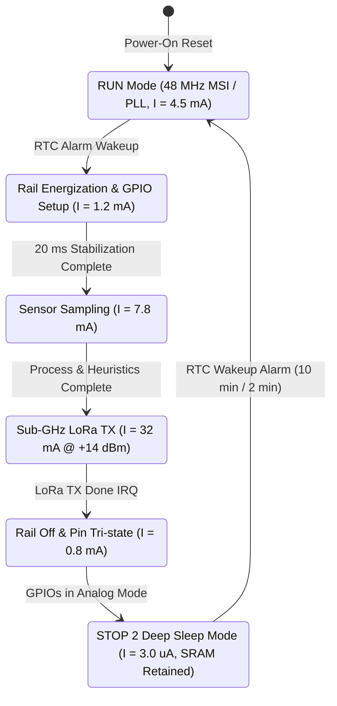
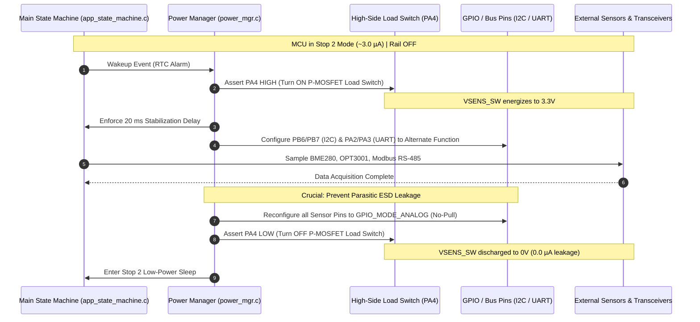

# Low-Power Architecture & Energy Management

## 1. Overview & Low-Power Philosophy

The **Tea Plantation Rain Prediction System** operates in remote, off-grid highland parcels where battery longevity and solar energy harvesting are vital. The firmware running on the **STMicroelectronics STM32WLE5** SoC (ARM Cortex-M4 @ 48 MHz) enforces an aggressive **duty-cycled power architecture** designed to achieve a baseline standby sleep current of **$< 5.0\,\mu\text{A}$** and multi-year field autonomy.

---

## 2. STM32WLE5 Power Modes & Transition Model

The microcontroller transitions between active processing, low-power sensing, and deep sleep modes:



---

### 2.1 MCU Low-Power States Breakdown

| Mode | System Clocks | Core & SRAM | Peripherals Active | Typical Current ($I$) | Wakeup Source | Usage in Firmware |
| :--- | :--- | :--- | :--- | :---: | :--- | :--- |
| **Run Mode** | MSI / HSE @ 48 MHz | Active | All peripherals enabled | $4.5\text{–}7.8\text{ mA}$ | — | Algorithm execution, I2C/UART bus transactions. |
| **Stop 2 Mode** | LSE 32.768 kHz only | Core stopped; **Full 64KB SRAM retained** | RTC, LPTIM1, EXTI, IWDG | **$1.5\text{–}3.0\,\mu\text{A}$** | RTC Alarm, EXTI0 (Rain pulse) | **Primary Standby Mode** ($99.8\%$ of lifetime). |
| **Standby Mode**| LSE 32.768 kHz only | Core stopped; Backup SRAM only | RTC, IWDG | $0.8\,\mu\text{A}$ | RTC Alarm, NRST | Long-term shelf storage mode. |

---

## 3. Power Gating & Switched Sensor Power Rail

External sensors (BME280, OPT3001, RS-485 transceiver SP3485) consume significant quiescent current ($> 500\,\mu\text{A}$) if left continuously energized. The system implements a **hardware switched power rail (`VSENS_SW`)** controlled via a high-side P-channel MOSFET (GPIO `PA4`):



### 3.1 Parasitic Back-Powering Prevention Rule
When `VSENS_SW` is de-energized, external sensor ICs have their $V_{DD}$ at $0\text{V}$. If microcontroller I/O pins connected to these ICs (e.g., I2C $SCL/SDA$, UART $TX/RX$) remain driven HIGH or with internal pull-ups enabled:
- Current will leak through the external ICs' internal ESD protection clamping diodes into the unpowered rail.
- This parasitic leakage draws **$200\,\mu\text{A}$ to $2.0\text{ mA}$**, completely defeating low-power sleep.
- **Mandatory Firmware Rule**: Before powering off `VSENS_SW`, [`firmware/middleware/src/power_mgr.c`](file:///C:/Users/ENERGY%20SAVER/Documents/Learning/Job%20Projects/rain-predict/firmware/middleware/src/power_mgr.c) must convert all connected pins to `GPIO_MODE_ANALOG` with no pull-up or pull-down resistors.

---

## 4. Battery Voltage Monitoring Subsystem

Battery voltage ($V_{\text{bat}}$) is monitored using an internal ADC channel connected to a high-impedance resistor divider:

```
        VBAT (3.0V - 3.6V)
           │
     ┌─────┴─────┐
     │  P-MOSFET │  (PB1 = LOW enables divider measurement)
     └─────┬─────┘
           │
         [100k] 1% Resistor
           │
           ├────────────> ADC_IN1 (PB0) [V_ADC = VBAT * 0.50]
           │
         [100k] 1% Resistor
           │
          GND
```

- **Zero Standby Leakage**: The divider is isolated from $V_{\text{bat}}$ by a P-MOSFET gate (`PB1`). When measurement is not actively in progress, `PB1` is set HIGH, reducing divider leakage to **$< 10\text{ nA}$**.
- **Sampling Strategy**: Battery voltage is sampled once every hour or on storm state transitions.

---

## 5. Adaptive Duty Cycle Management

The measurement scheduler dynamically alters the wake period based on weather severity:

| Weather Condition | Trigger Criteria | Sampling Interval | Daily Cycles ($N$) | Daily Energy ($E_{\text{daily}}$) |
| :--- | :--- | :---: | :---: | :---: |
| **Fair Weather (Normal)** | $CPI < 40\%$ and $|\Delta P_{1\text{h}}| < 1.0\text{ hPa}$ | **$10\text{ minutes}$** | $144$ | $0.564\text{ mWh/day}$ |
| **Unsettled (Watch)** | $40\% \le CPI < 70\%$ | **$5\text{ minutes}$** | $288$ | $1.128\text{ mWh/day}$ |
| **Severe Storm (Alert)** | $CPI \ge 70\%$ or physical rain active | **$2\text{ minutes}$** | $720$ | $2.820\text{ mWh/day}$ |

Even in continuous **2-minute emergency storm tracking mode**, the node consumes only $0.855\text{ mAh/day}$, allowing over **$8\text{ years}$ of operation** on a single $3200\text{ mAh}$ LiFePO4 battery without any solar input.
