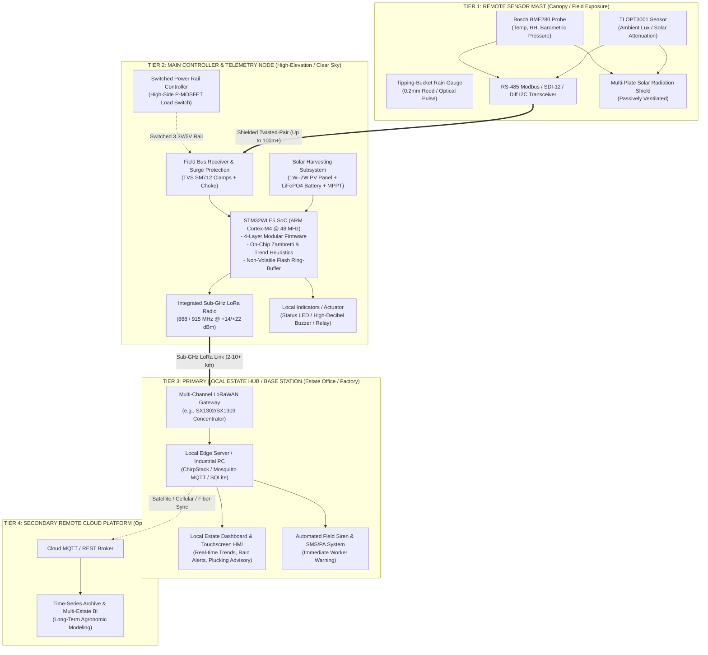
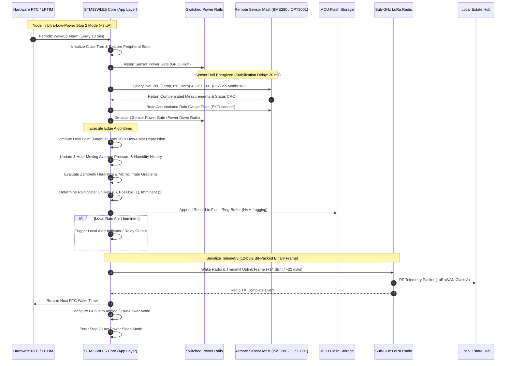

# System Architecture & Topology

## 1. Overview & Architectural Philosophy

The **Tea Plantation Rain Prediction System** is an industrial-grade, edge-first embedded IoT solution designed to monitor localized microclimates and predict rainfall events within tea estates. Due to steep topography, high elevations (500m–2200m AMSL), and rapid convective dynamics typical of tea-growing highlands, regional synoptic weather forecasts lack the spatial and temporal resolution required for estate operations.

The system adheres to an **Edge-First Architecture**:
- **Zero Cloud Dependency for Core Functions**: Meteorological heuristics, barometric trend analysis, dew-point depression calculations, sensor data logging, and immediate local alarm actuation run 100% autonomously on the on-site microcontroller and local estate hub.
- **Physical Decoupling of Sensing & RF Transceiver**: The remote environmental sensor mast is positioned for optimal atmospheric exposure (canopy/clearing), while the main controller and RF antenna are positioned for maximum solar harvesting and line-of-sight RF propagation across valley slopes.
- **Long-Range, Low-Power Mesh & Star Topology**: Uses license-free Sub-GHz LoRa / LoRaWAN links to bridge 2–10+ km rugged terrain back to a centralized on-site base station.

---

## 2. End-to-End System Topology

The end-to-end architecture is organized into four distinct operational tiers:

---

## 3. Subsystem Breakdown & Physical Decoupling

### 3.1 Remote Sensor Mast Assembly (Tier 1)
- **Deployment Location**: Mounted on an agronomic mast at canopy height (1.5m–2.5m above tea bush level) in a central estate clearing.
- **Components**:
  - **Atmospheric Probe**: Bosch BME280 measuring ambient temperature ($-40^\circ\text{C}$ to $+85^\circ\text{C} \pm 0.5^\circ\text{C}$), relative humidity ($0–100\% \pm 3\%$), and barometric pressure ($300–1100\text{ hPa} \pm 0.12\text{ hPa}$ resolution).
  - **Solar Irradiance Probe**: Texas Instruments OPT3001 ambient light sensor ($0.01\text{ to } 83,000\text{ Lux}$) tracking daylight cloud attenuation.
  - **Precipitation Sensor**: Aerodynamic tipping-bucket rain gauge ($0.2\text{ mm}$ per tip) with debounced reed switch or optical interrupt.
  - **Radiation Shield**: Multi-plate louvered Stevenson-type shield preventing thermal solar radiation bias and direct rain wetting while maintaining laminar natural airflow.
  - **Field Bus Interface**: High-noise-immunity differential bus driver (RS-485 Modbus RTU / SDI-12 / PCA9615 differential I2C).

### 3.2 Main Controller & Telemetry Node (Tier 2)
- **Deployment Location**: Positioned at a high-elevation ridge or tree canopy clearing to ensure unobstructed solar insolation and maximum Fresnel zone clearance for LoRa RF transmission.
- **Components**:
  - **Core SoC**: STMicroelectronics **STM32WLE5** (ARM Cortex-M4 32-bit core with hardware single-precision FPU, up to 256 KB Flash, 64 KB SRAM, and integrated Sub-GHz LoRa radio).
  - **Switched Power Rails**: High-side P-channel MOSFET load switches completely de-energizing the external cable and remote sensor mast between measurement cycles to eliminate quiescent leakage.
  - **Surge & Lightning Hardening**: Bidirectional TVS diode clamps (SM712), gas discharge tubes (GDT), and common-mode ferrite chokes on all external cable entry points.
  - **Power Subsystem**: $1\text{W}–2\text{W}$ Monocrystalline PV panel, MPPT charge controller (e.g., CN3791), and $3.2\text{V } 2000\text{–}3200\text{ mAh}$ LiFePO4 cell.

### 3.3 Primary Local Estate Hub / Gateway (Tier 3)
- **Deployment Location**: Estate manager’s office, tea processing factory, or central communication tower.
- **Key Capabilities**:
  - Operates **100% offline** without public internet access.
  - Hosts an embedded LoRaWAN network server (e.g., ChirpStack on a Raspberry Pi / industrial gateway).
  - Maintains a local SQLite / InfluxDB database storing high-resolution parcel microclimate histories.
  - Generates instant audible/visual sirens or automated local SMS broadcasts to field supervisors when a high-probability rain event is forecasted.

### 3.4 Secondary Remote Cloud Platform (Tier 4)
- **Purpose**: Optional enterprise aggregation across multiple geographic estates for regional agronomic forecasting, fertilizer yield correlation, and firmware Over-The-Air (FOTA) release staging.

---

## 4. End-to-End Operational Lifecycle & Sequence

The node operates on an ultra-low-power duty cycle (default: $10\text{ minutes}$ sleep interval, configurable via downlink down to $2\text{ minutes}$ during rapid barometric drops):

---

## 5. Architectural Quality Attributes & Guarantees

| Quality Attribute | Architectural Provision | Implementation Reference |
| :--- | :--- | :--- |
| **Field Autonomy** | Self-contained prediction algorithm & flash logging running on bare-metal firmware without external server dependency. | [`firmware/app/src/rain_algo.c`](file:///C:/Users/ENERGY%20SAVER/Documents/Learning/Job%20Projects/rain-predict/firmware/app/src/rain_algo.c), [`firmware/middleware/src/flash_storage.c`](file:///C:/Users/ENERGY%20SAVER/Documents/Learning/Job%20Projects/rain-predict/firmware/middleware/src/flash_storage.c) |
| **Deterministic Reliability** | Zero dynamic memory allocation (`malloc` prohibited), static buffer allocations, hardware independent watchdog (IWDG). | [`context/coding-standards.md`](file:///C:/Users/ENERGY%20SAVER/Documents/Learning/Job%20Projects/rain-predict/context/coding-standards.md) |
| **Energy Longevity** | Switched sensor rails, deep Stop 2 MCU sleep ($< 5\mu\text{A}$ baseline), $10\text{ min}$ duty cycle offering 30+ days autonomy under total darkness. | [`docs/hardware/power-supply-and-solar.md`](file:///C:/Users/ENERGY%20SAVER/Documents/Learning/Job%20Projects/rain-predict/docs/hardware/power-supply-and-solar.md) |
| **Environmental Hardening** | IP65/IP67 enclosure, TVS surge clamping on external lines, louvered solar radiation shield eliminating thermal insolation error. | [`docs/hardware/surge-protection-and-pcb.md`](file:///C:/Users/ENERGY%20SAVER/Documents/Learning/Job%20Projects/rain-predict/docs/hardware/surge-protection-and-pcb.md), [`docs/sensors/radiation-shield-design.md`](file:///C:/Users/ENERGY%20SAVER/Documents/Learning/Job%20Projects/rain-predict/docs/sensors/radiation-shield-design.md) |
| **Long-Range RF Coverage** | Sub-GHz LoRa modulation (+14 to +22 dBm ERP) with high receiver sensitivity ($-137\text{ dBm}$ @ SF12) traversing plantation topography. | [`firmware/middleware/src/lorawan_service.c`](file:///C:/Users/ENERGY%20SAVER/Documents/Learning/Job%20Projects/rain-predict/firmware/middleware/src/lorawan_service.c) |
