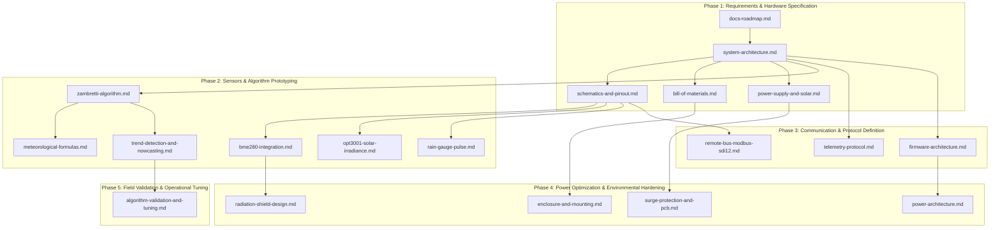

# Documentation Roadmap & Architecture Blueprint

## 1. Overview & Objectives

This document serves as the master roadmap for all technical documentation within the **Tea Plantation Rain Prediction System** repository. It defines the structure, document inventory, technical specifications, and delivery milestones for the [`docs/`](file:///C:/Users/ENERGY%20SAVER/Documents/Learning/Job%20Projects/rain-predict/docs) directory tree, directly reflecting the repository architecture established in [`context/project-structure.md`](file:///C:/Users/ENERGY%20SAVER/Documents/Learning/Job%20Projects/rain-predict/context/project-structure.md) and the system requirements in [`context/project-overview.md`](file:///C:/Users/ENERGY%20SAVER/Documents/Learning/Job%20Projects/rain-predict/context/project-overview.md).

### 1.1 Documentation Goals
- **Full Traceability**: Maintain a direct, bidirectional link between high-level meteorological requirements, hardware specifications, embedded firmware modules, and verification tests.
- **Hardware & Field Engineering Readiness**: Provide comprehensive schematics, BOM, solar sizing formulas, radiation shield mechanical specs, and surge protection guidelines for field deployment in remote tea estates.
- **Embedded C Firmware Clarity**: Document the 4-layer architecture targeting the **STMicroelectronics STM32WLE5** SoC (ARM Cortex-M4 + Sub-GHz LoRa radio), detailing state transitions, zero-dynamic-memory rules, and non-blocking bus protocols.
- **Algorithm Transparency**: Formally document meteorological heuristics (Zambretti forecaster, Magnus dew-point derivation, pressure/humidity gradient nowcasting) and validation procedures against ground-truth tipping-bucket data.

---

## 2. Documentation Directory Taxonomy

The documentation tree is organized into four core domain subdirectories under [`docs/`](file:///C:/Users/ENERGY%20SAVER/Documents/Learning/Job%20Projects/rain-predict/docs), complemented by root-level guides and protocol specifications:

```
docs/
├── docs-roadmap.md                         # (This document) Documentation master plan & status
│
├── architecture/                           # System, firmware & power architecture
│   ├── system-architecture.md              # End-to-end system topology & data flow
│   ├── firmware-architecture.md            # 4-layer embedded C modular design & state machine
│   ├── power-architecture.md               # Energy harvesting, power states & rail gating
│   └── telemetry-protocol.md               # LoRaWAN binary payload codec specification
│
├── hardware/                               # Electronics, power sizing & PCB engineering
│   ├── schematics-and-pinout.md            # STM32WLE5 pin allocation, buses & transceivers
│   ├── bill-of-materials.md                # Component list, tolerances & supplier part numbers
│   ├── power-supply-and-solar.md           # Solar panel, MPPT, LiFePO4 battery & power budget
│   ├── surge-protection-and-pcb.md         # Outdoor TVS arrays, lightning protection & PCB layout
│   └── enclosure-and-mounting.md           # IP65/67 enclosure, mast mounting & cable glands
│
├── sensors/                                # Sensor drivers, field buses & radiation shields
│   ├── bme280-integration.md               # Bosch BME280 driver, registers & compensation
│   ├── opt3001-solar-irradiance.md         # TI OPT3001 ambient light & cloud detection
│   ├── rain-gauge-pulse.md                 # Tipping-bucket rain gauge & debounce counter
│   ├── remote-bus-modbus-sdi12.md          # RS-485 Modbus RTU, SDI-12 & Differential I2C
│   └── radiation-shield-design.md          # Stevenson screen & louvered solar radiation shield
│
└── algorithms/                             # Meteorological theory, heuristics & validation
    ├── zambretti-algorithm.md              # Zambretti barometric heuristic engine & sea-level reduction
    ├── trend-detection-and-nowcasting.md   # Multi-variable gradient analysis & rain probability scoring
    ├── meteorological-formulas.md          # Magnus dew-point, vapor pressure & hypsometric formulas
    └── algorithm-validation-and-tuning.md  # Ground truth correlation & synthetic weather modeling
```

---

## 3. Document Specifications & Inventory

### 3.1 Architecture Domain (`docs/architecture/`)

| Document | Target File | Scope & Technical Content | Firmware Mapping |
| :--- | :--- | :--- | :--- |
| **System Architecture** | [`docs/architecture/system-architecture.md`](file:///C:/Users/ENERGY%20SAVER/Documents/Learning/Job%20Projects/rain-predict/docs/architecture/system-architecture.md) | End-to-end topology: Remote Sensor Mast $\rightarrow$ Main Controller Node $\rightarrow$ Local Estate Hub (Gateway/HMI) $\rightarrow$ Optional Cloud. Physical decoupling of RF node and canopy probe. | Top-level system overview |
| **Firmware Architecture** | [`docs/architecture/firmware-architecture.md`](file:///C:/Users/ENERGY%20SAVER/Documents/Learning/Job%20Projects/rain-predict/docs/architecture/firmware-architecture.md) | 4-layer unidirectional model (App $\rightarrow$ Middleware $\rightarrow$ Drivers $\rightarrow$ Core/HAL). System state machine (`Wake` $\rightarrow$ `PowerRailsOn` $\rightarrow$ `Sample` $\rightarrow$ `Filter` $\rightarrow$ `Predict` $\rightarrow$ `Transmit` $\rightarrow$ `Alert` $\rightarrow$ `Sleep`). Zero dynamic memory allocation. | [`firmware/app/`](file:///C:/Users/ENERGY%20SAVER/Documents/Learning/Job%20Projects/rain-predict/firmware/app), [`firmware/core/`](file:///C:/Users/ENERGY%20SAVER/Documents/Learning/Job%20Projects/rain-predict/firmware/core) |
| **Power Architecture** | [`docs/architecture/power-architecture.md`](file:///C:/Users/ENERGY%20SAVER/Documents/Learning/Job%20Projects/rain-predict/docs/architecture/power-architecture.md) | Low-power duty cycle (5–15 min wake periods), Stop 2 / Standby mode entry, RTC wake timer, switched high-side sensor power rail control, peripheral clock gating. | [`firmware/middleware/src/power_mgr.c`](file:///C:/Users/ENERGY%20SAVER/Documents/Learning/Job%20Projects/rain-predict/firmware/middleware/src/power_mgr.c), [`firmware/drivers/src/bsp_power_rails.c`](file:///C:/Users/ENERGY%20SAVER/Documents/Learning/Job%20Projects/rain-predict/firmware/drivers/src/bsp_power_rails.c) |
| **Telemetry Protocol** | [`docs/architecture/telemetry-protocol.md`](file:///C:/Users/ENERGY%20SAVER/Documents/Learning/Job%20Projects/rain-predict/docs/architecture/telemetry-protocol.md) | LoRaWAN Class A packet structure, bit-packed binary encoding for environmental telemetry ($T, RH, P, Lux, Rain, Trend, State, V_{bat}$), ChirpStack/TTN payload decoders, error codes. | [`firmware/middleware/src/telemetry_codec.c`](file:///C:/Users/ENERGY%20SAVER/Documents/Learning/Job%20Projects/rain-predict/firmware/middleware/src/telemetry_codec.c), [`tools/decoders/`](file:///C:/Users/ENERGY%20SAVER/Documents/Learning/Job%20Projects/rain-predict/tools/decoders) |

---

### 3.2 Hardware Domain (`docs/hardware/`)

| Document | Target File | Scope & Technical Content | Hardware / Subsystem Mapping |
| :--- | :--- | :--- | :--- |
| **Schematics & Pinout** | [`docs/hardware/schematics-and-pinout.md`](file:///C:/Users/ENERGY%20SAVER/Documents/Learning/Job%20Projects/rain-predict/docs/hardware/schematics-and-pinout.md) | STM32WLE5 pin mapping (I2C, SPI, USART, LPUART, GPIO, RF frontend matching), load switch circuits, RS-485 transceiver (MAX485/MAX1487), differential I2C (PCA9615). | [`firmware/core/inc/board_config.h`](file:///C:/Users/ENERGY%20SAVER/Documents/Learning/Job%20Projects/rain-predict/firmware/core/inc/board_config.h), MCU PCB |
| **Bill of Materials (BOM)** | [`docs/hardware/bill-of-materials.md`](file:///C:/Users/ENERGY%20SAVER/Documents/Learning/Job%20Projects/rain-predict/docs/hardware/bill-of-materials.md) | Comprehensive component list: STM32WLE5 SoC, BME280/OPT3001, solar panel, LiFePO4 cells, charge controller IC, TVS diodes, connectors, enclosure parts, passive component ratings. | Procurement & assembly |
| **Power Supply & Solar** | [`docs/hardware/power-supply-and-solar.md`](file:///C:/Users/ENERGY%20SAVER/Documents/Learning/Job%20Projects/rain-predict/docs/hardware/power-supply-and-solar.md) | Solar harvesting calculations (0.5W–2W panel sizing for monsoon/cloudy conditions), LiFePO4 battery capacity (e.g., 3.2V 2000–3200mAh), MPPT / linear charger specs, active vs sleep energy budget analysis. | Power subsystem & battery management |
| **Surge Protection & PCB** | [`docs/hardware/surge-protection-and-pcb.md`](file:///C:/Users/ENERGY%20SAVER/Documents/Learning/Job%20Projects/rain-predict/docs/hardware/surge-protection-and-pcb.md) | Lightning and surge protection for long external sensor lines: TVS diodes (SM712 for RS-485, ESD clamps on I2C/GPIO), common-mode filtering, RF trace impedance matching (50 $\Omega$), PCB stackup & grounding. | Protection circuit & layout design |
| **Enclosure & Mounting** | [`docs/hardware/enclosure-and-mounting.md`](file:///C:/Users/ENERGY%20SAVER/Documents/Learning/Job%20Projects/rain-predict/docs/hardware/enclosure-and-mounting.md) | IP65/IP67 weatherproof housing, UV-resistant ASA/polycarbonate materials, mast clamps, cable gland sealing, ventilation GORE-TEX membranes, positioning rules for RF line-of-sight. | Mechanical packaging & installation |

---

### 3.3 Sensors Domain (`docs/sensors/`)

| Document | Target File | Scope & Technical Content | Firmware Mapping |
| :--- | :--- | :--- | :--- |
| **BME280 Integration** | [`docs/sensors/bme280-integration.md`](file:///C:/Users/ENERGY%20SAVER/Documents/Learning/Job%20Projects/rain-predict/docs/sensors/bme280-integration.md) | Bosch BME280 sensor interfacing (I2C/SPI), forced-mode sampling, factory calibration readout, integer/float compensation routines, humidity saturation recovery, pressure resolution. | [`firmware/drivers/src/bme280_driver.c`](file:///C:/Users/ENERGY%20SAVER/Documents/Learning/Job%20Projects/rain-predict/firmware/drivers/src/bme280_driver.c) |
| **OPT3001 Solar Irradiance** | [`docs/sensors/opt3001-solar-irradiance.md`](file:///C:/Users/ENERGY%20SAVER/Documents/Learning/Job%20Projects/rain-predict/docs/sensors/opt3001-solar-irradiance.md) | TI OPT3001 ambient light sensor driver, lux conversion, optical response curve matching human eye / solar spectrum, daylight detection thresholding, convective storm cloud attenuation detection. | [`firmware/drivers/src/opt3001_driver.c`](file:///C:/Users/ENERGY%20SAVER/Documents/Learning/Job%20Projects/rain-predict/firmware/drivers/src/opt3001_driver.c) |
| **Rain Gauge Pulse Counter** | [`docs/sensors/rain-gauge-pulse.md`](file:///C:/Users/ENERGY%20SAVER/Documents/Learning/Job%20Projects/rain-predict/docs/sensors/rain-gauge-pulse.md) | Tipping-bucket rain gauge pulse capture (reed switch / optical), GPIO external interrupt handling, hardware RC filter + software debouncing, bucket calibration factor ($0.2\text{ mm/tip}$), rolling accumulation. | [`firmware/drivers/src/rain_gauge_driver.c`](file:///C:/Users/ENERGY%20SAVER/Documents/Learning/Job%20Projects/rain-predict/firmware/drivers/src/rain_gauge_driver.c) |
| **Remote Bus Protocols** | [`docs/sensors/remote-bus-modbus-sdi12.md`](file:///C:/Users/ENERGY%20SAVER/Documents/Learning/Job%20Projects/rain-predict/docs/sensors/remote-bus-modbus-sdi12.md) | Long-range field bus implementation: RS-485 Modbus RTU master framing, CRC-16 generation, SDI-12 1200-baud command parsing, PCA9615 differential I2C, bounded non-blocking bus timeouts. | [`firmware/drivers/src/modbus_rtu.c`](file:///C:/Users/ENERGY%20SAVER/Documents/Learning/Job%20Projects/rain-predict/firmware/drivers/src/modbus_rtu.c), [`firmware/drivers/src/sdi12_driver.c`](file:///C:/Users/ENERGY%20SAVER/Documents/Learning/Job%20Projects/rain-predict/firmware/drivers/src/sdi12_driver.c) |
| **Radiation Shield Design** | [`docs/sensors/radiation-shield-design.md`](file:///C:/Users/ENERGY%20SAVER/Documents/Learning/Job%20Projects/rain-predict/docs/sensors/radiation-shield-design.md) | Multi-plate solar radiation shield (Stevenson screen principle), thermal isolation of BME280 probe, prevention of direct solar radiation and rain splash errors, airflow dynamics in humid tea canopies. | Mechanical & sensor mounting |

---

### 3.4 Algorithms Domain (`docs/algorithms/`)

| Document | Target File | Scope & Technical Content | Firmware Mapping |
| :--- | :--- | :--- | :--- |
| **Zambretti Algorithm** | [`docs/algorithms/zambretti-algorithm.md`](file:///C:/Users/ENERGY%20SAVER/Documents/Learning/Job%20Projects/rain-predict/docs/algorithms/zambretti-algorithm.md) | Zambretti barometric heuristic formulation, sea-level pressure reduction at estate altitudes (500m–2200m), pressure trend categorization (falling, steady, rising), seasonal wind/pressure adjustments. | [`firmware/app/src/zambretti.c`](file:///C:/Users/ENERGY%20SAVER/Documents/Learning/Job%20Projects/rain-predict/firmware/app/src/zambretti.c) |
| **Trend Detection & Nowcasting** | [`docs/algorithms/trend-detection-and-nowcasting.md`](file:///C:/Users/ENERGY%20SAVER/Documents/Learning/Job%20Projects/rain-predict/docs/algorithms/trend-detection-and-nowcasting.md) | Multi-variable nowcasting engine: 3-hour moving pressure gradient ($\Delta P/\Delta t$), relative humidity trend ($\Delta RH/\Delta t$), temperature lapse ($\Delta T/\Delta t$), solar radiation drop ($\Delta Lux/\Delta t$), composite rain probability score ($0–100\%$). | [`firmware/app/src/trend_detector.c`](file:///C:/Users/ENERGY%20SAVER/Documents/Learning/Job%20Projects/rain-predict/firmware/app/src/trend_detector.c), [`firmware/app/src/rain_algo.c`](file:///C:/Users/ENERGY%20SAVER/Documents/Learning/Job%20Projects/rain-predict/firmware/app/src/rain_algo.c) |
| **Meteorological Formulas** | [`docs/algorithms/meteorological-formulas.md`](file:///C:/Users/ENERGY%20SAVER/Documents/Learning/Job%20Projects/rain-predict/docs/algorithms/meteorological-formulas.md) | Magnus-Tetens formula for dew-point ($T_{dew}$) and actual/saturation vapor pressure ($e, e_s$), relative humidity depression ($T - T_{dew}$), barometric hypsometric formula for altitude correction, Cortex-M4 single-precision float optimization. | [`firmware/middleware/src/dew_point.c`](file:///C:/Users/ENERGY%20SAVER/Documents/Learning/Job%20Projects/rain-predict/firmware/middleware/src/dew_point.c) |
| **Validation & Tuning** | [`docs/algorithms/algorithm-validation-and-tuning.md`](file:///C:/Users/ENERGY%20SAVER/Documents/Learning/Job%20Projects/rain-predict/docs/algorithms/algorithm-validation-and-tuning.md) | Algorithm verification methodology, historical tea plantation dataset testing, synthetic scenario generator ([`tools/simulation/simulate_plantation_weather.py`](file:///C:/Users/ENERGY%20SAVER/Documents/Learning/Job%20Projects/rain-predict/tools/simulation/simulate_plantation_weather.py)), confusion matrix metrics (False Alarm Rate vs Probability of Detection). | [`tests/unit/test_rain_algo.c`](file:///C:/Users/ENERGY%20SAVER/Documents/Learning/Job%20Projects/rain-predict/tests/unit/test_rain_algo.c), [`tools/simulation/`](file:///C:/Users/ENERGY%20SAVER/Documents/Learning/Job%20Projects/rain-predict/tools/simulation) |

---

## 4. Phased Documentation Rollout Plan

Documentation delivery is scheduled in alignment with the 5 project implementation phases defined in [`context/project-overview.md`](file:///C:/Users/ENERGY%20SAVER/Documents/Learning/Job%20Projects/rain-predict/context/project-overview.md):



### Phase Schedule Breakdown

| Phase | Milestone Name | Target Documents | Primary Focus | Status |
| :---: | :--- | :--- | :--- | :---: |
| **Phase 1** | **System & Hardware Architecture** | `docs-roadmap.md`<br>`system-architecture.md`<br>`schematics-and-pinout.md`<br>`bill-of-materials.md`<br>`power-supply-and-solar.md` | Establish hardware foundations, STM32WLE5 pinout, solar budget, and BOM. | **Completed** |
| **Phase 2** | **Sensors & Prediction Math** | `bme280-integration.md`<br>`opt3001-solar-irradiance.md`<br>`rain-gauge-pulse.md`<br>`zambretti-algorithm.md`<br>`meteorological-formulas.md`<br>`trend-detection-and-nowcasting.md` | Sensor driver registers, Dew-point Magnus formulas, Zambretti logic, and trend calculations. | **Completed** |
| **Phase 3** | **Firmware & Telemetry Protocols** | `firmware-architecture.md`<br>`telemetry-protocol.md`<br>`remote-bus-modbus-sdi12.md` | Layered firmware state machine, binary bit-packing codec, RS-485 Modbus / SDI-12 drivers. | Planned |
| **Phase 4** | **Power, Hardening & Mechanical** | `power-architecture.md`<br>`surge-protection-and-pcb.md`<br>`radiation-shield-design.md`<br>`enclosure-and-mounting.md` | Ultra-low power states, lightning surge TVS clamps, Stevenson screen mechanical specs. | Planned |
| **Phase 5** | **Field Validation & Calibration** | `algorithm-validation-and-tuning.md` | Ground-truth verification, historical dataset tuning, and field operational procedures. | Planned |

---

## 5. Documentation Standards & Formatting Rules

To maintain high documentation quality across the repository:

1. **Clickable Hyperlinks**:
   - All internal file references must use clickable markdown links with the `file:///` scheme (e.g., [`bme280_driver.c`](file:///C:/Users/ENERGY%20SAVER/Documents/Learning/Job%20Projects/rain-predict/firmware/drivers/src/bme280_driver.c)).
   - Code symbols (types, structs, functions) must link directly to their defining header or source file.

2. **Mandatory Mermaid Diagrams for Visualizations**:
   - **Requirement**: All technical documentation across `docs/` must use standard Mermaid (`mermaid` code blocks) for visual representations (block diagrams, architectures, workflows, state machines, and protocol sequences) rather than unformatted ASCII art or external raster images.
   - **Supported Diagram Types & Project Applications**:
     - **Flowcharts (`flowchart TD` / `flowchart LR`)**: System topologies, data processing pipelines, hardware block diagrams, decision trees, and nowcasting scoring logic.
     - **Sequence Diagrams (`sequenceDiagram`)**: Sensor bus transactions (Modbus RTU master/slave polling, SDI-12 command/response), LoRaWAN OTAA/uplink handshakes, and power rail power-up/stabilization/power-down sequences.
     - **State Diagrams (`stateDiagram-v2`)**: Firmware lifecycle state machines (e.g., `Wake` $\rightarrow$ `PowerRailsOn` $\rightarrow$ `SampleSensors` $\rightarrow$ `ComputeTrend` $\rightarrow$ `LoRaTransmit` $\rightarrow$ `DeepSleep`), LoRaWAN connection management, and low-power MCU mode transitions.
     - **Class & Entity Diagrams (`classDiagram` / `erDiagram`)**: Modular data structures, telemetry packet payload layout, and ring buffer relationships.
   - **Mermaid Syntax & Quality Rules**:
     - Always quote node labels that contain special characters, units, or parentheses (e.g., `id["BME280 (Temp, RH, Press)"]`).
     - Use meaningful node IDs and clear directional layouts (`TD`, `LR`) for readability across dark and light markdown viewers.
     - Maintain diagrams directly alongside the corresponding text to guarantee version-controlled documentation updates.

3. **Mathematical Precision**:
   - Express mathematical equations in clear LaTeX notation (e.g., Magnus formula for vapor pressure: $e_s(T) = 6.112 \exp\left(\frac{17.67 \cdot T}{T + 243.5}\right)$).
   - Document unit types explicitly (e.g., Temperature in $^\circ\text{C}$, Pressure in $\text{hPa}$, Solar Irradiance in $\text{W/m}^2$ or $\text{Lux}$).

4. **Code References & Doxygen Alignment**:
   - All documented firmware functions, enums, and structures must mirror the exact names defined in [`firmware/`](file:///C:/Users/ENERGY%20SAVER/Documents/Learning/Job%20Projects/rain-predict/firmware) and comply with [`context/coding-standards.md`](file:///C:/Users/ENERGY%20SAVER/Documents/Learning/Job%20Projects/rain-predict/context/coding-standards.md).

