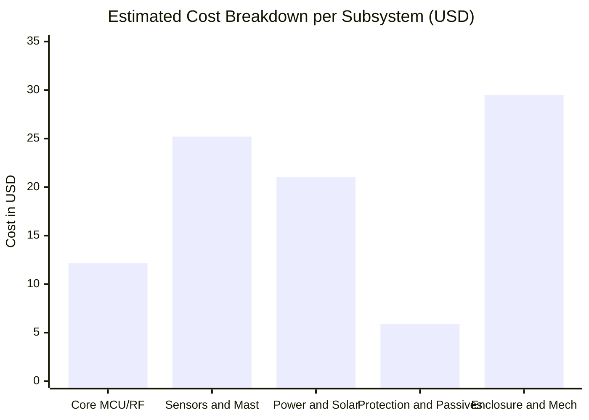

# Bill of Materials (BOM) & Component Selection

## 1. Overview & Sourcing Strategy

This document specifies the complete engineering **Bill of Materials (BOM)** for the **Tea Plantation Rain Prediction System** edge controller node and remote sensor mast probe. 

### Sourcing & Reliability Criteria
- **Temperature Rating**: All active and passive components must be rated for standard industrial temperature range ($-40^\circ\text{C}\text{ to }+85^\circ\text{C}$).
- **Moisture & Corrosion Resilience**: Conformal coating (silicone or acrylic base) is specified for exposed PCBAs; enclosure hardware must be stainless steel (SS304 / SS316).
- **Supply Chain Availability**: Primary components are selected from established global manufacturers (STMicroelectronics, Bosch Sensortec, Texas Instruments, Diodes Inc.) with verified second-source or cross-compatible pinouts.

---

## 2. Structured Bill of Materials

### 2.1 Core Processing & RF Subsystem

| RefDes | Item / Component | Description / Specification | Package | Manufacturer | Manufacturer Part Number (MPN) | Qty | Est. Unit ($) | Sourcing / LCSC / Mouser |
| :--- | :--- | :--- | :--- | :--- | :--- | :---: | :---: | :--- |
| **U1** | MCU SoC | ARM Cortex-M4 @ 48 MHz, 256KB Flash, 64KB RAM, Sub-GHz LoRa radio | UFQFPN48 | STMicroelectronics | `STM32WLE5CCU6` | 1 | $4.20 | ST / Mouser / DigiKey |
| **Y1** | LSE Crystal | $32.768\text{ kHz}, \pm 20\text{ ppm}, C_L = 6\text{ pF}$ | 3.2x1.5mm SMD | Epson / Abracon | `FC-135 32.7680KA-AG0` | 1 | $0.45 | LCSC / Mouser |
| **Y2** | HSE TCXO | $32.000\text{ MHz}, \pm 0.5\text{ ppm}$ temperature-compensated oscillator | 2.5x2.0mm SMD | Murata / NDK | `NX2016SA-32M-EXS00A` | 1 | $0.95 | LCSC / DigiKey |
| **U2** | RF Switch | High-isolation SPDT/SP3T Sub-GHz RF switch ($0.1\text{–}3.0\text{ GHz}$) | QFN-12 / SC-70 | Skyworks / Peregrine | `SKY13373-460LF` / `PE4259` | 1 | $0.65 | Mouser / DigiKey |
| **J1** | RF Connector | SMA Female Straight PCB Edge Mount, $50\,\Omega$, Gold-plated | Edge SMA | Amphenol / Linx | `CONSMA001-SMD-G` | 1 | $1.10 | LCSC / Mouser |
| **ANT1** | LoRa Antenna | $868/915\text{ MHz}$ Omnidirectional Rubber Duck / Fibreglass Mast ($+3\text{ dBi}$) | SMA Male | Linx / Taoglas | `ANT-868-CW-HWR-SMA` | 1 | $4.80 | Mouser / DigiKey |

---

### 2.2 Environmental Sensors & Field Transceivers

| RefDes | Item / Component | Description / Specification | Package | Manufacturer | Manufacturer Part Number (MPN) | Qty | Est. Unit ($) | Sourcing / LCSC / Mouser |
| :--- | :--- | :--- | :--- | :--- | :--- | :---: | :---: | :--- |
| **U3** | Weather Sensor | Barometric Pressure ($300–1100\text{ hPa}$), RH ($0–100\%$), Temp ($-40\text{ to }+85^\circ\text{C}$) | 8-LGA (2.5x2.5mm)| Bosch Sensortec | `BME280` | 1 | $3.50 | Bosch / Mouser / DigiKey |
| **U4** | Lux Sensor | Ambient light sensor with human eye / solar spectrum matching ($0.01\text{–}83\text{k Lux}$) | 6-USON (2x2mm) | Texas Instruments | `OPT3001DNPR` | 1 | $1.25 | TI / Mouser |
| **S1** | Rain Gauge | Aerodynamic Tipping-Bucket Rain Gauge ($0.2\text{ mm}$ per tip, Reed Switch) | Standalone Mast | Davis / Misol / Custom | `WH-SP-RG01` / `Davis 7852` | 1 | $18.50 | Amazon / SparkFun / OEM |
| **U5** | RS-485 Transceiver| Low-Power $3.3\text{V}$ Half-Duplex RS-485/422 Transceiver ($250\text{ kbps}$) | SOIC-8 | MaxLinear / Sipex | `SP3485EN-L/TR` | 1 | $0.55 | LCSC / Mouser |
| **U6** | Diff I2C Transceiver| Differential I2C Bus Buffer for long twisted-pair cable runs ($>20\text{m}$) | TSSOP-10 / SO-8 | NXP Semiconductors | `PCA9615DPJ` | 1 | $1.40 | Mouser / DigiKey |

---

### 2.3 Power Management & Energy Harvesting

| RefDes | Item / Component | Description / Specification | Package | Manufacturer | Manufacturer Part Number (MPN) | Qty | Est. Unit ($) | Sourcing / LCSC / Mouser |
| :--- | :--- | :--- | :--- | :--- | :--- | :---: | :---: | :--- |
| **U7** | Solar MPPT Charger| High-efficiency Solar Charger IC for LiFePO4 with integrated MPPT | SOP-16 / QFN | Consonance | `CN3791` / `CN3722` | 1 | $1.15 | LCSC |
| **U8** | Low-Iq LDO | Ultra-low quiescent current ($I_q = 25\text{ nA}$) $3.3\text{V } 200\text{mA}$ LDO | SOT-23-5 | Texas Instruments | `TPS7A0233PDBVR` | 1 | $0.60 | TI / Mouser |
| **Q1** | High-Side P-MOS | $20\text{V } 3.8\text{A}$ P-Channel MOSFET ($R_{DS(on)} < 45\text{ m}\Omega$) for sensor rail switch | SOT-23 | Diodes Inc. | `DMG2305UX-7` | 1 | $0.18 | LCSC / Mouser |
| **Q2** | N-MOS Driver | $60\text{V } 300\text{mA}$ N-Channel MOSFET for gate drive | SOT-23 | Diodes Inc. | `2N7002-7-F` | 2 | $0.08 | LCSC / Mouser |
| **PV1** | Solar Panel | $1.5\text{W } 6\text{V}$ Monocrystalline Waterproof Solar Panel (ETFE laminated) | $110\times 130\text{mm}$ | Voltaic / Seeed / OEM | `1.5W-6V-ETFE` | 1 | $6.50 | Adafruit / Seeed / OEM |
| **BAT1** | Battery Cell | $3.2\text{V } 3200\text{ mAh}$ LiFePO4 Rechargeable Cell (26650 or 18650 format) | 26650 / 18650 | EEMB / PKCELL | `IFR26650-3200mAh` | 1 | $5.20 | PKCELL / Amazon / Distrelec |
| **BTH1**| Battery Holder | 26650 / 18650 Through-Hole High-Retention Gold-Plated Battery Holder | PCB Mount | Keystone | `Keystone 1048` | 1 | $1.80 | Mouser / DigiKey |

---

### 2.4 Surge Protection, Passives & Connectors

| RefDes | Item / Component | Description / Specification | Package | Manufacturer | Manufacturer Part Number (MPN) | Qty | Est. Unit ($) | Sourcing / LCSC / Mouser |
| :--- | :--- | :--- | :--- | :--- | :--- | :---: | :---: | :--- |
| **D1** | RS-485 TVS | Asymmetrical Bidirectional TVS Diode Array ($-7\text{V to }+12\text{V}$) for RS-485 | SOT-23 | Semtech / ProTek | `SM712.TCT` | 1 | $0.65 | Mouser / DigiKey |
| **D2, D3**| ESD Clamps | Low-capacitance ($0.5\text{ pF}$) ESD TVS arrays for I2C / GPIO lines | SOT-23-6 | STMicroelectronics | `USBLC6-2SC6` | 2 | $0.25 | Mouser / LCSC |
| **L1** | RF Inductor | $2.2\text{ nH } \pm 0.1\text{ nH}$ High-Q RF Ceramic Inductor for Sub-GHz match | 0402 SMD | Murata | `LQW15AN2N2B00D` | 2 | $0.12 | Mouser / DigiKey |
| **L2** | Common Choke | Dual Common Mode Choke for differential RS-485 line filter | 0805 SMD | Wurth Elektronik | `744230220` | 1 | $0.45 | Wurth / Mouser |
| **TB1** | Terminal Block | 4-Pole $3.81\text{ mm}$ Pluggable Screw Terminal Block (Power + RS-485) | Through-Hole | Phoenix Contact | `1803594` | 1 | $1.35 | Mouser / Phoenix |
| **SW1** | Reed / Button | Waterproof tactile push button for local trigger/reset | Sealed SMD | C&K / Panasonic | `KMR231GLFG` | 1 | $0.35 | Mouser |
| **LED1,2**| Indicators | High-efficiency 0805 SMD LEDs (Green = Status OK, Red = Rain Warning) | 0805 SMD | Lite-On / Kingbright | `APT2012SGC / SURC` | 2 | $0.10 | LCSC / Mouser |
| **BZ1** | Buzzer | $3.3\text{V } 90\text{ dB } @ 10\text{ cm}$ Magnetic/Piezo Audio Transducer | $12\text{mm}$ SMD/TH | CUI Devices | `CPE-171` | 1 | $0.85 | Mouser / CUI |

---

### 2.5 Enclosure & Mechanical Hardware

| RefDes | Item / Component | Description / Specification | Material / Standard | Manufacturer | Manufacturer Part Number (MPN) | Qty | Est. Unit ($) | Sourcing / LCSC / Mouser |
| :--- | :--- | :--- | :--- | :--- | :--- | :---: | :---: | :--- |
| **ENC1** | Node Enclosure | Weatherproof IP67 Enclosure with transparent/opaque cover, silicone gasket | Polycarbonate / UV ASA | Polycase / BUD | `WC-20` / `Bud NBF-32014` | 1 | $12.50 | Polycase / Amazon |
| **GLD1** | Cable Glands | PG7 / PG9 IP68 Waterproof Cable Glands with strain relief ($3–8\text{mm}$ cable) | Nylon PA66 | Heyco / Sealcon | `PG7-IP68` | 2 | $0.60 | Amazon / LCSC |
| **SHLD1**| Radiation Shield | 6-Plate Louvered Solar Radiation Shield (Stevenson screen) for BME280 probe | UV-Resistant ASA | Ambient / Davis | `SRS100` / `Custom 3D ASA`| 1 | $14.00 | Davis / Amazon / 3D Print |
| **UB1** | Mast U-Bolts | Stainless Steel (SS304) U-Bolt Clamps for $32\text{–}50\text{mm}$ mast mounting | SS304 Steel | Fastenal / Generic | `M6-50mm-SS` | 2 | $1.20 | Hardware Supply |

---

## 3. Cost Rollup & Bill of Materials Summary

### Total Cost Estimation
- **Single Prototype Unit Cost**: $\approx \mathbf{\$93.75\text{ USD}}$ (including external commercial tipping-bucket rain gauge and UV radiation shield).
- **Volume Production (100+ Units)**: $\approx \mathbf{\$54.20\text{ USD}}$ (with direct factory sensor integration and injection-molded/extruded radiation shields).
