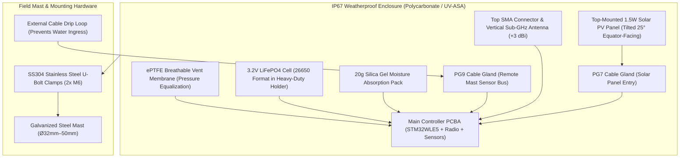

# Enclosure Selection, Environmental Hardening & Field Mounting Guide

## 1. Overview & Field Deployment Conditions

The **Tea Plantation Rain Prediction System** edge controller node is engineered for continuous outdoor field operation under extreme environmental conditions:
- **Relative Humidity**: Sustained $90–100\%$ atmospheric humidity with heavy condensation.
- **Precipitation**: Torrential monsoon rains ($> 50\text{ mm/hr}$), heavy mountain mist, and hail.
- **Solar Insolation & Thermal Cycling**: High UV exposure with rapid temperature swings of $\pm 20^\circ\text{C}$ between afternoon sun and cold mountain nights.
- **Chemical Exposure**: Repeated exposure to agricultural pesticide sprays, copper fungicides, and organic fertilizers.

---

## 2. Enclosure Architecture & Mechanical Layout



---

## 3. Enclosure Specifications & Sealing

### 3.1 Material & Ingress Protection
- **Ingress Rating**: **IP67 / NEMA 4X** (complete protection against dust ingress and immersion in water up to $1\text{ meter}$ depth for $30\text{ minutes}$).
- **Enclosure Material**: UV-stabilized **Polycarbonate (PC)** or **ASA** (opaque light grey, RAL 7035) with high impact rating (**IK08**).
- **Gasket Seal**: Continuous, seamless silicone or EPDM gasket seated in a deep tongue-and-groove channel along the lid perimeter.
- **Fasteners**: 4x captive stainless steel (SS304) screws with brass threaded inserts in the base.

---

### 3.2 Breathable Membrane Vent (Condensation Prevention)
When solar radiation warms an airtight enclosure, internal air expands; during a sudden thunderstorm, rapid cooling creates an internal vacuum:
- A sealed enclosure will suck moisture past rubber gaskets, causing internal fogging and PCBA corrosion.
- **Engineered Solution**: An **ePTFE breathable membrane vent plug** (e.g., Gore Automotive Vent / Amphenol Vent M12) is installed on the bottom enclosure wall.
- **Performance**: Allows bidirectional air and water vapor diffusion ($> 150\text{ ml/min}$ at $70\text{ mbar}$) while maintaining an **IP67 liquid water barrier** (water breakthrough pressure $> 300\text{ mbar}$).
- **Desiccant Pack**: A replaceable $20\text{g}$ non-indicating silica gel packet is secured inside the base to absorb residual assembly humidity.

---

## 4. Cable Gland Sealing & Drip Loops

All cable entries are located exclusively on the **bottom face** of the enclosure:

```
               ┌───────────────────────────────┐
               │    ENCLOSURE (Bottom Face)    │
               └──────┬─────────────────┬──────┘
                   PG7 Gland         PG9 Gland
                      │                 │
                      │                 │  Cable from Remote Mast
                      │                 │
                      │             ┌───┴───┐
                      │             │       │
                      │             │ DRIP  │ (Water drips off lowest point)
                      │             │ LOOP  │
                      │             └───┬───┘
                      │                 │
                      ▼                 ▼
                 Solar Panel       Remote Sensor Mast
```

### 4.1 Cable Gland Guidelines
- **Solar Cable Entry**: **PG7 IP68 Nylon Gland** ($3.0\text{–}6.5\text{mm}$ clamping range) with integrated neoprene seal ring.
- **Sensor Mast Cable Entry**: **PG9 IP68 Nylon Gland** ($4.0\text{–}8.0\text{mm}$ clamping range) securing the shielded twisted-pair sensor line.
- **Mandatory Drip Loop**: External cables must drop **at least $10\text{cm}$ below the bottom of the enclosure** before looping upward into the gland. This forces surface rainwater to drip off the bottom of the loop rather than tracking into the gland seal.

---

## 5. Field Mast Mounting & Orientation

### 5.1 Solar Panel Orientation & Tilt Angle
- **Azimuth Orientation**: Pointed directly towards the **Equator** (True South in the Northern Hemisphere, True North in the Southern Hemisphere).
- **Optimal Tilt Angle ($\theta$)**:
  $$\theta = \text{Local Latitude} + 10^\circ \quad (\text{Typically } 20^\circ–25^\circ \text{ across South Indian and Sri Lankan tea belts})$$
- **Self-Cleaning Advantage**: A tilt angle of $\ge 20^\circ$ prevents dust, tea flower pollen, and rain pools from settling on the solar glass.

---

### 5.2 LoRa Antenna Placement
- **Vertical Orientation**: The Sub-GHz omnidirectional antenna ($+3\text{ dBi}$) must be mounted completely vertical on the top of the mast.
- **Fresnel Zone Clearance**: The antenna tip must extend at least **$0.3\text{m}$ above all metal mounting brackets and the solar panel frame** to prevent RF pattern distortion and ground detuning.

---

### 5.3 Stainless Steel Mounting Hardware
- **Mast Diameter**: Clamps accept standard $32\text{mm}–50\text{mm}$ ($1.25"–2.0"$) galvanized steel or structural fiberglass poles.
- **Hardware Material**: All U-bolts, saddle washers, lock washers, and hex nuts must be **Grade 304 or 316 Stainless Steel** to prevent galvanic corrosion in high-rainfall tea hills.
