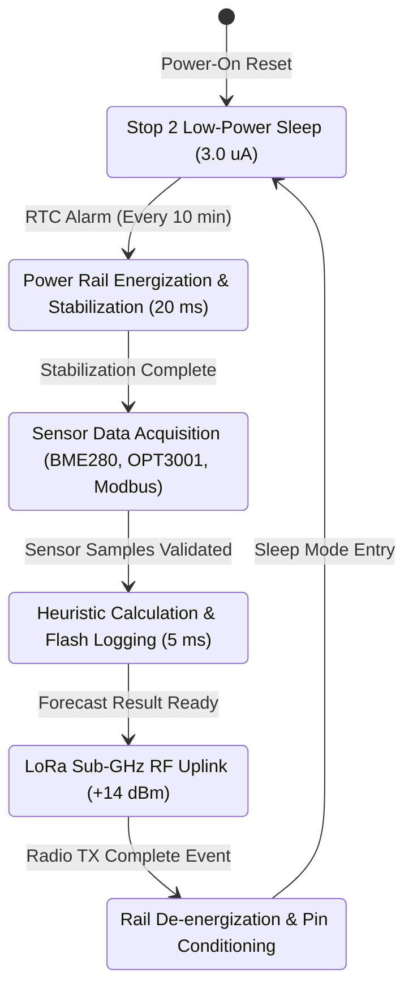
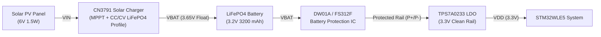

# Power Supply, Energy Harvesting & Solar Sizing

## 1. Overview & Operational Constraints

Tea plantations are typically situated in humid, mountainous terrain characterized by high rainfall, dense morning fog, and prolonged monsoon seasons with extensive cloud cover. The **Tea Plantation Rain Prediction System** is engineered to achieve **perpetual energy autonomy** under these challenging microclimate conditions.

This document details:
1. Complete mathematical energy budget modeling across active, transmission, and sleep states.
2. Solar photovoltaic (PV) panel sizing under worst-case monsoon irradiance scenarios.
3. Battery chemistry selection comparing $\text{LiFePO}_4$ vs Lithium-ion / LiPo.
4. MPPT solar charge controller circuit design and low-voltage protection thresholds.

---

## 2. Power State Machine & Duty Cycle Model

The system operates strictly on a deterministic duty-cycled state machine:



---

## 3. Mathematical Energy Budget Analysis

### 3.1 State Current Consumption Breakdown

| State Name | Duration ($t$) | Operating Current ($I$) | Voltage ($V$) | Energy per Event ($E = V \cdot I \cdot t$) | Charge per Event ($Q = I \cdot t$) |
| :--- | :---: | :---: | :---: | :---: | :---: |
| **Stop 2 Deep Sleep** | $599.85\text{ s}$ ($9.997\text{ min}$) | $3.0\,\mu\text{A}$ ($0.003\text{ mA}$) | $3.3\text{ V}$ | $5.938\times 10^{-3}\text{ J}$ | $0.000500\text{ mAh}$ |
| **Rail Stabilization** | $20\text{ ms}$ ($0.020\text{ s}$) | $1.2\text{ mA}$ | $3.3\text{ V}$ | $7.92\times 10^{-5}\text{ J}$ | $0.0000067\text{ mAh}$ |
| **Sensor Acquisition** | $65\text{ ms}$ ($0.065\text{ s}$) | $7.8\text{ mA}$ | $3.3\text{ V}$ | $1.673\times 10^{-3}\text{ J}$ | $0.0001408\text{ mAh}$ |
| **Prediction & NVM** | $5\text{ ms}$ ($0.005\text{ s}$) | $4.5\text{ mA}$ | $3.3\text{ V}$ | $7.425\times 10^{-5}\text{ J}$ | $0.0000063\text{ mAh}$ |
| **LoRa Uplink (+14dBm)**| $60\text{ ms}$ ($0.060\text{ s}$) | $32.0\text{ mA}$ | $3.3\text{ V}$ | $6.336\times 10^{-3}\text{ J}$ | $0.0005333\text{ mAh}$ |
| **Rail Shutdown** | $2\text{ ms}$ ($0.002\text{ s}$) | $0.8\text{ mA}$ | $3.3\text{ V}$ | $5.28\times 10^{-6}\text{ J}$ | $0.0000004\text{ mAh}$ |
| **Total per 10-min Cycle**| $\mathbf{600.0\text{ s}}$ | $\mathbf{I_{\text{avg}} = 7.12\,\mu\text{A}}$ | $3.3\text{ V}$ | $\mathbf{1.41\times 10^{-2}\text{ J}}$ | $\mathbf{0.001187\text{ mAh}}$ |

---

### 3.2 Daily Energy Consumption ($E_{\text{daily}}$)

For a nominal **10-minute sampling interval** ($N = 144\text{ cycles/day}$):

$$Q_{\text{daily}} = 144 \times 0.001187\text{ mAh} = \mathbf{0.171\text{ mAh/day}}$$

$$E_{\text{daily}} = Q_{\text{daily}} \times 3.3\text{ V} = 0.171\text{ mAh} \times 3.3\text{ V} = \mathbf{0.564\text{ mWh/day}} = \mathbf{2.03\text{ Joules/day}}$$

#### High-Frequency Rapid Storm Tracking Mode
When rapid barometric drops ($\Delta P > 1.5\text{ hPa/hr}$) trigger **2-minute emergency duty cycling** ($N = 720\text{ cycles/day}$):

$$Q_{\text{daily, storm}} = 720 \times 0.001187\text{ mAh} = \mathbf{0.855\text{ mAh/day}}$$

$$E_{\text{daily, storm}} = 0.855\text{ mAh} \times 3.3\text{ V} = \mathbf{2.82\text{ mWh/day}} = \mathbf{10.15\text{ Joules/day}}$$

---

## 4. Battery Chemistry & Sizing Selection

### 4.1 Chemistry Comparison: $\text{LiFePO}_4$ vs Standard Li-ion

```
Battery Terminal Voltage (V)
 4.2V ┌──────────────────────────────────────────────┐
      │  Standard Li-ion (NMC/LCO)                   │
 3.6V ├────────────\                                  │
 3.3V │             \   LiFePO4 Flat Plateau (3.2V)   │
 3.2V ├──────────────=====================\          │ (Optimal for 3.3V LDO)
 3.0V │                                    \         │
 2.5V └─────────────────────────────────────\────────┘
      0%                   State of Charge          100%
```

| Parameter | $\text{LiFePO}_4$ (Lithium Iron Phosphate) | Standard Li-ion ($\text{LiCoO}_2$ / NMC) | Engineering Evaluation for Tea Estates |
| :--- | :--- | :--- | :--- |
| **Nominal Cell Voltage** | **$3.2\text{ V}$** (Flat plateau $3.2\text{V}–3.3\text{V}$) | $3.7\text{ V}$ ($4.2\text{V}$ peak down to $3.0\text{V}$) | **$\text{LiFePO}_4$ Ideal**: Direct low-dropout conversion to $3.3\text{V}$ rail with minimal thermal dissipation. |
| **Cycle Life** | **$2000–3000+\text{ cycles}$** to $80\%$ capacity | $300–500\text{ cycles}$ | **$\text{LiFePO}_4$ Superior**: $> 8\text{ years}$ continuous daily micro-cycling without maintenance. |
| **Thermal & Safety** | Extremely stable; no thermal runaway up to $+200^\circ\text{C}$ | Susceptible to thermal runaway if overcharged or damaged | **$\text{LiFePO}_4$ Required**: High-humidity, direct tropical sun, and unattended estate safety. |
| **Self-Discharge Rate** | $< 2\%\text{ per month}$ | $3–5\%\text{ per month}$ | Excellent charge retention across prolonged monsoon cloudiness. |

### 4.2 Autonomy Calculation (Zero Solar Harvesting)

Using a standard $3.2\text{V } 3200\text{ mAh}$ $\text{LiFePO}_4$ cell (26650 format) with an $80\%$ depth-of-discharge (DoD) safety limit:

$$\text{Usable Capacity} = 3200\text{ mAh} \times 0.80 = \mathbf{2560\text{ mAh}}$$

$$\text{Days of Autonomy (Nominal 10-min Mode)} = \frac{2560\text{ mAh}}{0.171\text{ mAh/day}} = \mathbf{14,970\text{ Days } (\approx 41\text{ Years})}$$

$$\text{Days of Autonomy (Rapid Storm 2-min Mode)} = \frac{2560\text{ mAh}}{0.855\text{ mAh/day}} = \mathbf{2,994\text{ Days } (\approx 8.2\text{ Years})}$$

Even accounting for battery self-discharge ($1.5\%/\text{month} \approx 1.6\text{ mAh/day}$), the node delivers **over $1.5\text{ years}$ of continuous operation under total darkness** without any solar recharge.

---

## 5. Solar Harvesting & Worst-Case Monsoon Sizing

### 5.1 Monsoon Solar Insolation in Tea Growing Highlands
During the Southwest / Northeast monsoons (e.g., Western Ghats, Munnar, Darjeeling, Assam):
- **Overcast Solar Irradiance**: Reduced to $G_{\text{monsoon}} = 80\text{–}120\text{ W/m}^2$ (compared to standard test condition $G_{\text{STC}} = 1000\text{ W/m}^2$).
- **Effective Sun Hours (Peak Sun Hours / PSH)**: $H_{\text{eff}} \approx 1.5\text{ PSH/day}$ of diffuse light.

### 5.2 Solar Panel Sizing
A compact $1.5\text{W } 6\text{V}$ monocrystalline solar panel ($V_{mp} = 6.0\text{V}$, $I_{mp} = 250\text{mA}$) is selected.

Under worst-case diffuse monsoon conditions ($10\%$ nominal yield):

$$P_{\text{harvest, monsoon}} = 1.5\text{W} \times 10\% = \mathbf{0.15\text{ W}} = \mathbf{150\text{ mW}}$$

$$E_{\text{harvest, daily}} = 150\text{ mW} \times 1.5\text{ hours} = \mathbf{225\text{ mWh/day}}$$

$$\text{Energy Harvest Margin} = \frac{E_{\text{harvest, daily}}}{E_{\text{daily}}} = \frac{225\text{ mWh/day}}{0.564\text{ mWh/day}} \approx \mathbf{398 \times \text{ Margin}}$$

The solar energy harvested on a single dark, rain-soaked day provides approximately **400 times** the daily energy consumed by the node.

---

## 6. Solar Charger & MPPT Circuit

### 6.1 CN3791 MPPT Solar Charger Implementation
The **Consonance CN3791** IC provides constant-current / constant-voltage (CC/CV) charging with integrated Maximum Power Point Tracking (MPPT) for photovoltaic cells.



### 6.2 Key Voltage Thresholds
- **MPPT Point Setpoint ($V_{mpp}$)**: Configured to $5.1\text{V}$ via precision $1\%$ resistor divider on the `MPPT` pin.
- **Float Charge Voltage ($V_{\text{float}}$)**: $3.65\text{ V} \pm 1\%$ (optimal full charge voltage for $\text{LiFePO}_4$).
- **Recharge Threshold**: $3.45\text{ V}$.
- **Over-Discharge Cutoff (UVLO)**: $2.50\text{ V}$ enforced by the battery protection IC (DW01A / FS312F) to prevent cell degradation.
- **LDO Dropout**: TPS7A02 dropout is only $240\text{ mV}$ at $200\text{ mA}$ ($< 10\text{ mV}$ at nominal $7.8\text{ mA}$ active current), maintaining regulation down to $V_{\text{bat}} = 3.0\text{ V}$.
