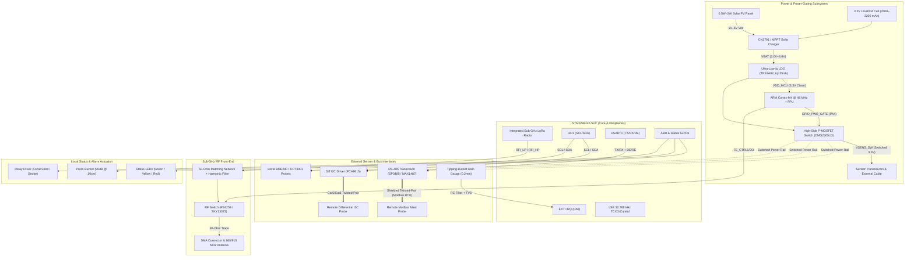

# Schematics, Pinout & Interfacing Guide

## 1. Overview

This document provides the hardware interfacing specification, complete pin allocation, electrical schematic design guidelines, and transceiver circuits for the **Tea Plantation Rain Prediction System** main controller board based on the **STMicroelectronics STM32WLE5** SoC (ARM Cortex-M4 @ 48 MHz with integrated Sub-GHz radio).

The board is engineered for extreme outdoor environmental resilience, ultra-low standby power consumption ($< 5\,\mu\text{A}$ in Stop 2 sleep), and multi-protocol industrial sensor interfacing over distances from direct PCB mounting up to $100\text{m}+$ remote mast cables.

---

## 2. Hardware Architecture & Subsystem Interconnect



---

## 3. STM32WLE5 Pin Allocation Table

The pinout mapping targets the **STM32WLE5CCU6 / STM32WLE5J8** in the UFQFPN48 package.

| Pin # | Pin Name | Configured Function | Direction | Peripheral Mapping | Connected Hardware / Description | Sleep State (Stop 2) |
| :---: | :--- | :--- | :---: | :--- | :--- | :---: |
| **1** | `VBAT` | Power Input | IN | Power Subsystem | LiFePO4 / Backup battery rail | Powered |
| **2** | `PC13` | GPIO Output | OUT | Push-Pull | User Config / Field Test Button | High-Z |
| **3** | `PC14-OSC32_IN` | LSE Input | IN | RCC / RTC | 32.768 kHz Quartz Crystal / LSE | Active (RTC) |
| **4** | `PC15-OSC32_OUT`| LSE Output | OUT | RCC / RTC | 32.768 kHz Quartz Crystal / LSE | Active (RTC) |
| **5** | `OSC_IN` | HSE / TCXO Input | IN | RCC | 32 MHz TCXO / HSE Clock Source | Off in Stop 2 |
| **6** | `OSC_OUT` | HSE Clock Out | OUT | RCC | 32 MHz Oscillator Output | Off in Stop 2 |
| **7** | `NRST` | System Reset | IN | Hardware Reset | Pushbutton & 100nF debouncing cap | Reset Line |
| **8** | `PA0` | EXTI0 | IN | EXTI | Rain Gauge Reed Switch (Active Low, Debounced) | EXTI Wakeup |
| **9** | `PA1` | GPIO Output | OUT | Push-Pull | RS-485 Driver Enable (`RS485_DE_RE`) | Low (RX/Disable) |
| **10** | `PA2` | USART1_TX | OUT | AF7 | RS-485 Transceiver Data In (`DI`) | Analog / Hi-Z |
| **11** | `PA3` | USART1_RX | IN | AF7 | RS-485 Transceiver Data Out (`RO`) | Analog / Hi-Z |
| **12** | `PA4` | GPIO Output | OUT | Push-Pull | High-Side Power Rail Gate (`PWR_SENS_EN`) | High (Rail OFF) |
| **13** | `PA5` | SPI1_SCK | OUT | AF5 | Optional External Flash / SPI Bus | Analog / Hi-Z |
| **14** | `PA6` | SPI1_MISO | IN | AF5 | Optional External Flash / SPI Bus | Analog / Hi-Z |
| **15** | `PA7` | SPI1_MOSI | OUT | AF5 | Optional External Flash / SPI Bus | Analog / Hi-Z |
| **16** | `PB0` | ADC_IN1 | IN | ADC | Battery Voltage Divider (`VBAT_MEAS`) | Analog / Hi-Z |
| **17** | `PB1` | GPIO Output | OUT | Push-Pull | Battery Divider Enable P-MOSFET | High (Off) |
| **18** | `PB2` | GPIO Output | OUT | Push-Pull | Local Alarm Buzzer Gate (MOSFET Gate) | Low (Off) |
| **19** | `PB4` | GPIO Output | OUT | Push-Pull | Local Alert Relay Drive (Optocoupler) | Low (Off) |
| **20** | `PB6` | I2C1_SCL | OD | AF4 | Local / Diff I2C Clock ($4.7\text{k}\Omega$ pullup) | Open-Drain / Hi-Z|
| **21** | `PB7` | I2C1_SDA | OD | AF4 | Local / Diff I2C Data ($4.7\text{k}\Omega$ pullup) | Open-Drain / Hi-Z|
| **22** | `PB8` | GPIO Output | OUT | Push-Pull | Status LED Green (`LED_STATUS_OK`) | Low (Off) |
| **23** | `PB9` | GPIO Output | OUT | Push-Pull | Warning LED Red (`LED_WARN_RAIN`) | Low (Off) |
| **24** | `PC0` | LPUART1_TX | OUT | AF8 | Auxiliary SDI-12 Bus Transmit | Analog / Hi-Z |
| **25** | `PC1` | LPUART1_RX | IN | AF8 | Auxiliary SDI-12 Bus Receive | Analog / Hi-Z |
| **26** | `PC2` | GPIO Output | OUT | Push-Pull | SDI-12 Direction / Bus Control | Low (RX) |
| **27** | `PC3` | FE_CTRL3 | OUT | RF Control | RF Switch Control Line 3 | Controlled |
| **28** | `PC4` | FE_CTRL1 | OUT | RF Control | RF Switch Control Line 1 | Controlled |
| **29** | `PC5` | FE_CTRL2 | OUT | RF Control | RF Switch Control Line 2 | Controlled |
| **34** | `PA13` | SWDIO | I/O | AF0 | ARM Serial Wire Debug Data | Pull-up |
| **35** | `PA14` | SWCLK | IN | AF0 | ARM Serial Wire Debug Clock | Pull-down |
| **48** | `VDD` | Power Supply | IN | Power | Clean 3.3V DC Rail | Powered |

---

## 4. Key Circuit Schematics & Design Rules

### 4.1 Switched Sensor Power Rail (Power Gating)
To achieve sub-$5\,\mu\text{A}$ sleep currents, all external sensor transceivers (RS-485, PCA9615, BME280/OPT3001) are powered through a high-side P-channel MOSFET switch:

```
                  VDD (3.3V)
                     │
              ┌──────┴──────┐
              │  P-MOSFET   │  DMG2305UX (SOT-23)
              │  (Source)   │  Rds(on) < 0.05 Ohm
   100k Pullup│   Source    │
   ┌──/\/\/\──┤             ├──> VSENS_SW (Switched 3.3V)
   │          │  (Drain)    │    (To RS-485, BME280, Transceivers)
   │          └──────┬──────┘
   │            Gate │
   │                 │
   │           ┌─────┴─────┐
   │           │ N-MOSFET  │   2N7002 / DMN65D8L
   │           │  (Drain)  │
   │           │           │
   │  10k Res  │   Gate    │
   └────/\/\/\─┤           │
               └─────┬─────┘
                     │ (Source)
                    GND
                     ▲
                     │
    MCU Pin PA4 ─────┴── (Active HIGH turns ON sensor power)
```

- **Sequencing Rule**: When `PA4` is driven HIGH, firmware must enforce a **$20\text{ ms}$ stabilization delay** before asserting I2C or UART clock lines to prevent bus contention during sensor IC boot.
- **Power Down Rule**: Before setting `PA4` LOW, MCU pins connected to sensors (I2C SCL/SDA, UART TX/RX) must be converted to **Analog mode** (`GPIO_MODE_ANALOG`) to prevent parasitic back-powering of external ICs through internal MCU ESD protection diodes.

---

### 4.2 RS-485 Modbus RTU Transceiver Circuit
The RS-485 differential bus connects long mast cable runs ($10\text{m}–100\text{m}+$):

- **Transceiver IC**: **SP3485** / **MAX1487** ($3.3\text{V}$ low-power half-duplex, SOIC-8).
- **Direction Control**: `PA1` controls Driver Enable (`DE`) and Receiver Enable (`/RE`).
  - `PA1 = LOW`: Receiver active (listening for sensor response).
  - `PA1 = HIGH`: Transmitter active (sending Modbus command frame).
- **Fail-Safe Biasing**: $4.7\,\text{k}\Omega$ pull-up on A-line to `VSENS_SW`, $4.7\,\text{k}\Omega$ pull-down on B-line to GND.
- **Termination**: Selectable $120\,\Omega$ parallel termination resistor via DIP switch / jumper for long runs.

```
                  VSENS_SW
                     │
                   [4.7k] Fail-safe Pull-up
                     │
  SP3485 (3.3V)      ├──────────── A (+) ────/\/\/\─── [TVS SM712] ───> Remote Mast A
 ┌─────────────┐     │                       10-Ohm                     (Pin 1)
 │ 1: RO (RX)  ├─────┼─── MCU PA3 (USART1_RX)
 │ 2: /RE      ├──┬──┘
 │ 3: DE       ├──┴────── MCU PA1 (RS485_DIR)
 │ 4: DI (TX)  ├───────── MCU PA2 (USART1_TX)
 │ 8: VCC      ├───────── VSENS_SW
 │ 5: GND      ├────┬──── GND
 └─────────────┘    │
                    │
                   [4.7k] Fail-safe Pull-down
                    │
                    ├──────────── B (-) ────/\/\/\─── [TVS SM712] ───> Remote Mast B
                    │                       10-Ohm                     (Pin 2)
                   GND
```

---

### 4.3 Rain Gauge Debounce & Interrupt Circuit
The tipping-bucket rain gauge utilizes a magnetic reed switch or optical switch pulse:

- **RC Low-Pass Filter**: $10\,\text{k}\Omega$ series resistor + $100\,\text{nF}$ ceramic capacitor provides a hardware hardware debounce time constant $\tau = R \cdot C = 1.0\,\text{ms}$.
- **Firmware Lockout**: A $50\,\text{ms}$ software interrupt debounce window in [`firmware/drivers/src/rain_gauge_driver.c`](file:///C:/Users/ENERGY%20SAVER/Documents/Learning/Job%20Projects/rain-predict/firmware/drivers/src/rain_gauge_driver.c) rejects mechanical contact bounce.
- **TVS Clamp**: Bidirectional TVS diode protects `PA0` against induced ESD on outdoor wires.

```
       VDD (3.3V Clean)
             │
           [10k] Pull-up
             │
             ├───/\/\/\────┬────────────> MCU PA0 (EXTI0 Falling-Edge IRQ)
             │   10k Res   │
             │           [100nF] Cap
             │             │
    Tipping  │            GND
    Bucket ──┴── [TVS Clamp] ── GND
     Reed Switch
    (Closes to GND on tip)
```

---

### 4.4 RF Front-End & Antenna Matching
- **RF Power Output**: STM32WLE5 supports high-power transmission up to $+22\,\text{dBm}$ (HP path) or low-power $+14\,\text{dBm}$ (LP path).
- **Matching Network**: 50 $\Omega$ LC network matching impedance to an external SMA connector.
- **RF Switching**: RF switch (e.g., Skyworks SKY13373 / Peregrine PE4259) controlled by `PC4/PC5/PC3` to toggle between TX (High Power / Low Power) and RX modes.
- **PCB Trace**: Coplanar waveguide with ground ($50\,\Omega \pm 10\%$) with ground stitch vias alongside RF traces.

---

## 5. Firmware Board Header Cross-Reference

All hardware pin definitions must match the C macros configured in [`firmware/core/inc/board_config.h`](file:///C:/Users/ENERGY%20SAVER/Documents/Learning/Job%20Projects/rain-predict/firmware/core/inc/board_config.h):

```c
/* Power Gating Pin */
#define PIN_PWR_SENS_PORT            GPIOA
#define PIN_PWR_SENS_PIN             GPIO_PIN_4

/* RS-485 Modbus Interface */
#define PIN_RS485_DIR_PORT           GPIOA
#define PIN_RS485_DIR_PIN            GPIO_PIN_1
#define PIN_RS485_TX_PORT            GPIOA
#define PIN_RS485_TX_PIN             GPIO_PIN_2
#define PIN_RS485_RX_PORT            GPIOA
#define PIN_RS485_RX_PIN             GPIO_PIN_3

/* Rain Gauge Interrupt */
#define PIN_RAIN_GAUGE_PORT          GPIOA
#define PIN_RAIN_GAUGE_PIN           GPIO_PIN_0
#define PIN_RAIN_GAUGE_EXTI_IRQ      EXTI0_IRQn

/* I2C Sensor Bus */
#define PIN_I2C1_SCL_PORT            GPIOB
#define PIN_I2C1_SCL_PIN             GPIO_PIN_6
#define PIN_I2C1_SDA_PORT            GPIOB
#define PIN_I2C1_SDA_PIN             GPIO_PIN_7

/* Alert Actuators & Indicators */
#define PIN_LED_OK_PORT              GPIOB
#define PIN_LED_OK_PIN               GPIO_PIN_8
#define PIN_LED_WARN_PORT            GPIOB
#define PIN_LED_WARN_PIN             GPIO_PIN_9
#define PIN_BUZZER_PORT              GPIOB
#define PIN_BUZZER_PIN               GPIO_PIN_2
#define PIN_RELAY_PORT               GPIOB
#define PIN_RELAY_PIN                GPIO_PIN_4
```
