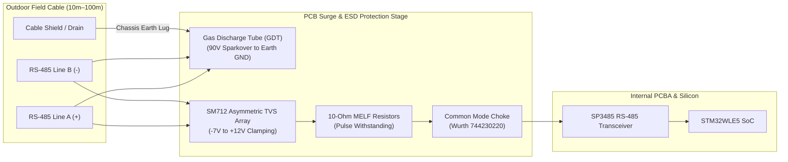

# Surge Protection, Lightning Hardening & PCB Layout Guide

## 1. Overview & Environmental Hazard Profile

Highland tea plantations are situated on exposed mountain slopes (500m–2200m AMSL) characterized by severe tropical thunderstorms, rapid convective storm activity, and frequent cloud-to-ground lightning discharges.

Long outdoor sensor cables ($10\text{m}–100\text{m}+$) extending from the high-elevation controller node down to the crop canopy mast act as **receiving antennas for lightning electromagnetic pulses (LEMP)** and electrostatic ground potential shifts.

This document details:
1. Multi-stage surge protection circuits for RS-485, I2C, rain gauge, and solar power inputs.
2. 4-layer PCB layer stackup and $50\,\Omega$ coplanar RF waveguide design.
3. Mixed-signal grounding and isolation guidelines.

---

## 2. Multi-Stage Surge Protection Circuitry



---

### 2.1 RS-485 Line Protection (SM712 Asymmetric TVS Array)
RS-485 differential transceivers operate with common-mode voltages between $-7\text{V}$ and $+12\text{V}$:
- **Primary Clamping**: **Semtech SM712** TVS diode array provides asymmetrical breakdown protection (clamps negative spikes below $-7\text{V}$ and positive spikes above $+12\text{V}$).
- **Energy Dissipation Resistors**: $10\,\Omega / 1\text{W}$ pulse-withstanding MELF resistors placed between the TVS clamp and the transceiver IC limit peak fault currents during transients.
- **Common-Mode Filtering**: A dual-line SMD common-mode choke (**Wurth 744230220**) suppresses high-frequency common-mode noise induced by near-strike lightning fields.

---

### 2.2 GPIO & Rain Gauge Line Protection
The tipping-bucket rain gauge line carries low-frequency pulses across outdoor wiring:
- **TVS Clamping**: **ST USBLC6-2SC6** or **ON Semi ESD9L5.0** low-leakage ESD protection diode clamped between signal and $0\text{V}$ ground ($\pm 15\text{kV}$ air, $\pm 8\text{kV}$ contact per IEC 61000-4-2).
- **Current Limiting**: $10\,\text{k}\Omega$ series resistor limits injected current into the MCU pin to $< 100\,\mu\text{A}$ during severe transients.
- **Low-Pass Filter**: $100\,\text{nF}$ ceramic capacitor ($X7R$, $50\text{V}$ rating) shunts RF interference directly to ground.

---

### 2.3 Solar PV & Battery Input Protection
- **Overvoltage Clamping**: **SMAJ6.0A** unidirectional TVS diode ($600\text{W}$ peak pulse power, $6.0\text{V}$ standoff) across the solar PV terminal prevents charge controller destruction from inductive surges.
- **Overcurrent Protection**: $500\text{mA}$ self-resetting Polymeric Positive Temperature Coefficient (**PPTC**) fuse protects the battery circuit against sustained line shorts.
- **Reverse Polarity**: Low forward-drop Schottky barrier diode (**SS34 / B5819W**, $V_f < 0.35\text{V}$) guards against reverse battery installation.

---

## 3. 4-Layer PCB Stackup & Layer Allocation

A standard 4-layer FR4 PCB ($1.6\text{mm}$ overall thickness) is specified to ensure continuous ground reference planes and controlled RF impedance:

```
Layer 1 (Top)      ─── [Top Signals, Components, 50-Ohm CPWG RF Trace]
                       Dielectric 1 (Prepreg, Er = 4.4, H = 0.20 mm)
Layer 2 (Inner 1)  ─── [CONTINUOUS SOLID GROUND PLANE (0V Reference)]
                       Core Dielectric (FR4, Er = 4.4, H = 1.05 mm)
Layer 3 (Inner 2)  ─── [POWER DISTRIBUTION PLANES (VDD, VSENS_SW, VBAT)]
                       Dielectric 2 (Prepreg, Er = 4.4, H = 0.20 mm)
Layer 4 (Bottom)   ─── [Bottom Signals, Test Points, Solid Ground Fill]
```

### 3.1 Stackup Rules
1. **Unbroken Ground Reference (Layer 2)**: The ground plane directly beneath the STM32WLE5 SoC, RF matching network, and antenna trace must be **100% solid and unbroken** with zero trace routing splits.
2. **Layer 1 to Layer 2 Coupling**: The thin $0.20\text{mm}$ prepreg dielectric provides tight capacitive coupling, minimizing electromagnetic radiation and improving ESD immunity.

---

## 4. Sub-GHz LoRa RF Layout ($50\,\Omega$ Coplanar Waveguide)

The RF trace from the STM32WLE5 `RFI_LP` / `RFI_HP` pins through the matching network and RF switch to the SMA connector must be routed as a **Coplanar Waveguide with Ground (CPWG)**:

```
                 Ground Stitching Vias (Pitch < 1.5mm)
                   │             │
                   ▼             ▼
       Ground Pour █   Trace W   █ Ground Pour
       ────────────█ ┌─────────┐ █──────────── (Layer 1 Top)
                     │  50-Ohm │
              Gap G ─┤  Trace  ├─ Gap G
                     └─────────┘
       ═══════════════════════════════════════ (Layer 2 Solid GND)
                      Height H = 0.20 mm
```

### 4.1 CPWG Dimensional Parameters ($50\,\Omega \pm 5\%$)
- **Trace Width ($W$)**: $0.42\text{ mm}$ ($16.5\text{ mils}$)
- **Ground Clearance Gap ($G$)**: $0.25\text{ mm}$ ($10.0\text{ mils}$)
- **Dielectric Height ($H$)**: $0.20\text{ mm}$ ($8.0\text{ mils}$)
- **Dielectric Constant ($\epsilon_r$)**: $4.4$ (FR4 at $868/915\text{ MHz}$)
- **Via Stitching Fence**: Continuous ground vias placed along both sides of the RF trace at a pitch of $< 1.5\text{ mm}$ ($\approx \lambda / 20$) to prevent substrate resonant radiation.

---

## 5. Mixed-Signal Grounding & Isolation Guidelines

To prevent noisy switching currents (from the MPPT solar charger and high-side load switches) from corrupting sensitive analog sensor readings and ADC conversions:

1. **Star-Point Grounding Topology**:
   - The PCB maintains three functional ground zones on Layer 1: **Power GND** (solar/battery), **Digital GND** (MCU core/radio), and **Analog GND** (ADC/BME280/OPT3001).
   - All three zones tie together at a **single star point** directly at the battery negative terminal pad on Layer 2.
2. **Crystal Oscillator Isolation**:
   - The $32.768\text{ kHz}$ LSE crystal and $32\text{ MHz}$ TCXO must have dedicated ground guard rings with no high-speed digital traces routed adjacent or on underlying layers.
3. **Conformal Coating**:
   - Production PCBAs must receive a **Class 2 silicone or acrylic conformal coating** (e.g., MG Chemicals 422B) over all components except the BME280 vent hole and SMA RF connector to prevent dendritic conductive growth in $100\%$ RH plantation atmospheres.
