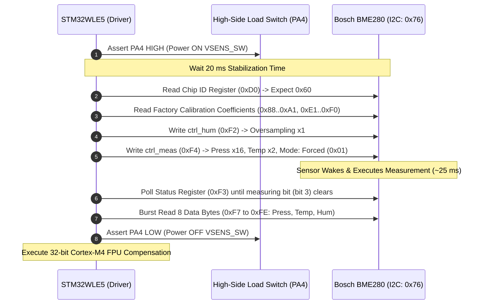

# Bosch BME280 Environmental Sensor Integration

## 1. Overview & Sensor Role

The **Bosch Sensortec BME280** is an integrated environmental sensor combining high-linearity, high-accuracy measurement of **barometric pressure**, **ambient temperature**, and **relative humidity**.

In the **Tea Plantation Rain Prediction System**, the BME280 provides the primary thermodynamic inputs required for microclimate forecasting:
- **Barometric Pressure ($P$)**: Detects rapid synoptic and convective pressure drops indicative of incoming squalls and rain fronts.
- **Relative Humidity ($RH$)**: Measures atmospheric moisture saturation approaching the condensation point.
- **Ambient Temperature ($T$)**: Used for thermal compensation, lapse rate calculation, and vapor pressure computation.

---

## 2. Electrical Interface & Power Gating

### 2.1 Interface Configuration
- **Communication Protocol**: I2C Fast Mode ($400\text{ kHz}$) or SPI (4-wire).
- **Default I2C Address**: `0x76` (`SDO` tied to `GND`) or `0x77` (`SDO` tied to `VDD`).
- **Operating Voltage**: $1.71\text{V}–3.6\text{V}$ (powered from the switched sensor rail `VSENS_SW` at $3.3\text{V}$).

### 2.2 Forced Mode Sampling Lifecycle
To achieve ultra-low power consumption, the BME280 is operated strictly in **Forced Mode**. The sensor remains in deep sleep ($0.1\,\mu\text{A}$), performs a single measurement on command, updates its data registers, and automatically returns to sleep.



---

## 3. Register Map & Oversampling Configuration

### 3.1 Recommended Meteorological Oversampling Profile

| Measurement | Oversampling Setting | `ctrl_meas` / `ctrl_hum` Bits | Resolution | RMS Noise | Target Metric |
| :--- | :---: | :---: | :---: | :---: | :--- |
| **Pressure** | **$\times 16$** (Ultra-High Resolution)| `osrs_p = 0b101` | $0.12\text{ Pa } (0.0012\text{ hPa})$ | $0.02\text{ hPa}$ | Detects subtle 3-hour micro-trends |
| **Temperature** | **$\times 2$** | `osrs_t = 0b010` | $0.005^\circ\text{C}$ | $0.01^\circ\text{C}$ | Thermal compensation baseline |
| **Humidity** | **$\times 1$** | `osrs_h = 0b001` | $0.008\%\text{ RH}$ | $0.05\%\text{ RH}$ | Fast moisture gradient detection |
| **IIR Filter** | **Filter Coefficient 4** | `config: filter = 0b010` | Bandwidth limiting | Attenuates wind gusts | Stabilizes barometric gradient |

---

## 4. Factory Calibration & Compensation Algorithms

The BME280 contains 26 factory calibration coefficients stored in non-volatile memory (NVM). The raw 20-bit ADC output values (`adc_T`, `adc_P`, `adc_H`) must be converted to physical engineering units using Bosch compensation equations optimized for the **ARM Cortex-M4 Single-Precision FPU**.

### 4.1 Calibration Coefficient Table

| Coefficient | Parameter | Address Range | Bit Width & Type |
| :--- | :--- | :---: | :---: |
| `dig_T1` | Temperature calibration 1 | `0x88 / 0x89` | 16-bit unsigned (`uint16_t`) |
| `dig_T2` | Temperature calibration 2 | `0x8A / 0x8B` | 16-bit signed (`int16_t`) |
| `dig_T3` | Temperature calibration 3 | `0x8C / 0x8D` | 16-bit signed (`int16_t`) |
| `dig_P1` | Pressure calibration 1 | `0x8E / 0x8F` | 16-bit unsigned (`uint16_t`) |
| `dig_P2` to `dig_P9` | Pressure calibrations 2–9 | `0x90` to `0x9F` | 16-bit signed (`int16_t`) |
| `dig_H1` | Humidity calibration 1 | `0xA1` | 8-bit unsigned (`uint8_t`) |
| `dig_H2` | Humidity calibration 2 | `0xE1 / 0xE2` | 16-bit signed (`int16_t`) |
| `dig_H3` | Humidity calibration 3 | `0xE3` | 8-bit unsigned (`uint8_t`) |
| `dig_H4 / dig_H5` | Humidity calibrations 4 & 5 | `0xE4 / 0xE5 / 0xE6` | 12-bit signed (bit-split) |
| `dig_H6` | Humidity calibration 6 | `0xE7` | 8-bit signed (`int8_t`) |

---

### 4.2 Cortex-M4 Single-Precision Float Compensation

Implemented in [`firmware/drivers/src/bme280_driver.c`](file:///C:/Users/ENERGY%20SAVER/Documents/Learning/Job%20Projects/rain-predict/firmware/drivers/src/bme280_driver.c):

```c
/**
 * @brief Compensates raw BME280 temperature ADC value.
 * @return Temperature in degrees Celsius (e.g. 24.52 deg C).
 */
float bme280_compensate_temperature(int32_t adc_T, bme280_calib_t *calib, float *p_t_fine)
{
    float var1 = (((float)adc_T) / 16384.0f - ((float)calib->dig_T1) / 1024.0f) * ((float)calib->dig_T2);
    float var2 = ((((float)adc_T) / 131072.0f - ((float)calib->dig_T1) / 8192.0f) *
                  (((float)adc_T) / 131072.0f - ((float)calib->dig_T1) / 8192.0f)) * ((float)calib->dig_T3);
    *p_t_fine = var1 + var2;
    return (*p_t_fine) / 5120.0f;
}

/**
 * @brief Compensates raw BME280 pressure ADC value.
 * @return Atmospheric pressure in hPa (e.g. 1013.25 hPa).
 */
float bme280_compensate_pressure(int32_t adc_P, bme280_calib_t *calib, float t_fine)
{
    float var1 = (t_fine / 2.0f) - 64000.0f;
    float var2 = var1 * var1 * ((float)calib->dig_P6) / 32768.0f;
    var2 = var2 + var1 * ((float)calib->dig_P5) * 2.0f;
    var2 = (var2 / 4.0f) + (((float)calib->dig_P4) * 65536.0f);
    var1 = (((float)calib->dig_P3) * var1 * var1 / 524288.0f + ((float)calib->dig_P2) * var1) / 524288.0f;
    var1 = (1.0f + var1 / 32768.0f) * ((float)calib->dig_P1);

    if (var1 <= 0.0f) {
        return 0.0f; /* Prevent division by zero */
    }

    float p = 1048576.0f - (float)adc_P;
    p = (p - (var2 / 4096.0f)) * 6250.0f / var1;
    var1 = ((float)calib->dig_P9) * p * p / 2147483648.0f;
    var2 = p * ((float)calib->dig_P8) / 32768.0f;
    p = p + (var1 + var2 + ((float)calib->dig_P7)) / 16.0f;

    return p / 100.0f; /* Convert Pa to hPa */
}

/**
 * @brief Compensates raw BME280 relative humidity ADC value.
 * @return Relative humidity in %RH clamped between 0.0% and 100.0%.
 */
float bme280_compensate_humidity(int32_t adc_H, bme280_calib_t *calib, float t_fine)
{
    float var_H = t_fine - 76800.0f;
    var_H = (adc_H - (((float)calib->dig_H4) * 64.0f + ((float)calib->dig_H5) / 16384.0f * var_H)) *
            (((float)calib->dig_H2) / 65536.0f * (1.0f + ((float)calib->dig_H6) / 67108864.0f * var_H *
            (1.0f + ((float)calib->dig_H3) / 67108864.0f * var_H)));
    var_H = var_H * (1.0f - ((float)calib->dig_H1) * var_H / 524288.0f);

    /* Clamp relative humidity to realistic physical limits */
    if (var_H > 100.0f) {
        var_H = 100.0f;
    } else if (var_H < 0.0f) {
        var_H = 0.0f;
    }
    return var_H;
}
```

---

## 5. Tea Plantation Environmental Hardening & Saturation Recovery

### 5.1 Radiation Shield Housing
The BME280 probe must be housed inside a **passively ventilated multi-plate radiation shield** (detailed in [`docs/sensors/radiation-shield-design.md`](file:///C:/Users/ENERGY%20SAVER/Documents/Learning/Job%20Projects/rain-predict/docs/sensors/radiation-shield-design.md)). This protects the sensor from direct sunlight (which induces up to $+5^\circ\text{C}$ thermal bias) and prevents water droplet deposition on the sensor vent hole.

### 5.2 100% RH Saturation Drift Mitigation
During highland monsoon conditions, atmospheric humidity remains near $100\%\text{ RH}$ for multiple days:
- **Porous Membrane Protection**: A hydrophobic, oleophobic PTFE / GORE-TEX membrane cap over the BME280 metal lid prevents liquid water ingress while allowing water vapor diffusion.
- **Creep Re-calibration**: Firmware applies a baseline calibration offset if relative humidity reads $100\%$ continuously without rain gauge pulse activity over a 48-hour period.
