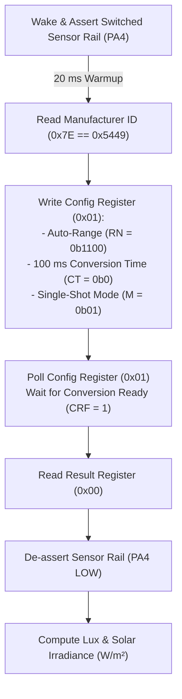

# TI OPT3001 Solar Irradiance & Ambient Light Sensor Integration

## 1. Overview & Sensor Role

The **Texas Instruments OPT3001** is a single-chip digital ambient light sensor (ALS) with a spectral response closely matched to the photopic curve of the human eye ($550\text{ nm}$ peak) and high infrared (IR) rejection ($> 99\%$).

In the **Tea Plantation Rain Prediction System**, the OPT3001 serves two critical meteorological functions:
1. **Daytime Convective Cloud Detection**: A sudden drop in ambient light during daylight hours indicates the arrival of thick convective storm clouds (cumulonimbus) before precipitation begins.
2. **Solar Irradiance Approximation ($W/m^2$)**: Provides daylight solar intensity measurements used to validate evapotranspiration models and battery solar harvesting status.

---

## 2. Electrical Interface & Registers

### 2.1 Interface & Address Map
- **Communication Protocol**: I2C Fast Mode ($400\text{ kHz}$) with $4.7\,\text{k}\Omega$ pull-up resistors.
- **I2C Slave Address**:
  - `ADDR = GND` $\rightarrow$ `0x44` (Default)
  - `ADDR = VDD` $\rightarrow$ `0x45`
  - `ADDR = SDA` $\rightarrow$ `0x46`
  - `ADDR = SCL` $\rightarrow$ `0x47`
- **Supply Voltage**: $1.6\text{V}–3.6\text{V}$ (powered via switched sensor rail `VSENS_SW` at $3.3\text{V}$).

---

### 2.2 Register Map Summary

| Register Name | Address | Description | Default Value | Usage |
| :--- | :---: | :--- | :---: | :--- |
| **Result** | `0x00` | Contains raw 16-bit measurement (Exponent + Mantissa) | `0x0000` | Read measured lux |
| **Configuration** | `0x01` | Controls range, conversion time, mode, fault count | `0xC810` | Set single-shot & range |
| **Low Limit** | `0x02` | Low interrupt comparison threshold | `0xC000` | Not used in polled mode |
| **High Limit** | `0x03` | High interrupt comparison threshold | `0xBFFF` | Not used in polled mode |
| **Manufacturer ID** | `0x7E` | Manufacturer identification register | `0x5449` (`'TI'`) | Device validation |
| **Device ID** | `0x7F` | Device identification register | `0x3001` | Device validation |

---

## 3. Configuration & Single-Shot Measurement

To maintain sub-microamp average power consumption, the OPT3001 is triggered in **Single-Shot (Shutdown) Mode** on each sample period:



### 3.1 Configuration Bitfield (`0x01`)
- **Range Number (`RN[3:0] = 0b1100`)**: Enables automatic full-scale range selection ($0.01\text{ to } 83,865.60\text{ Lux}$).
- **Conversion Time (`CT = 0b0`)**: Sets $100\text{ ms}$ integration time (minimizes active power while maintaining $0.01\text{ Lux}$ resolution).
- **Mode of Conversion (`M[1:0] = 0b01`)**: Single-shot trigger mode.

---

## 4. Mathematical Conversion to Lux and Solar Irradiance

### 4.1 Raw Register to Lux Conversion
The 16-bit Result Register (`0x00`) is split into a 4-bit exponent ($E$) and a 12-bit fractional mantissa ($R$):

$$\text{Bitfield: } [E_3, E_2, E_1, E_0, R_{11}, R_{10}, \dots, R_0]$$

$$\text{Lux} = 0.01 \times 2^E \times R$$

- **Dynamic Range**: $0.01\text{ Lux}$ (when $E = 0, R = 1$) up to $83,865.60\text{ Lux}$ (when $E = 11, R = 4095$).

---

### 4.2 Lux to Solar Irradiance Conversion ($W/m^2$)
For broad-spectrum daylight solar radiation in agricultural applications, the empirical relationship between luminous flux (Lux) and total solar irradiance ($W/m^2$) is approximated using daylight luminous efficacy ($\eta \approx 120\text{ lm/W}$):

$$\text{Solar Irradiance } (G) \approx \frac{\text{Lux}}{120} \approx \text{Lux} \times 0.00833\text{ W/m}^2$$

| Environmental Condition | Ambient Lux ($\text{Lux}$) | Solar Irradiance ($W/m^2$) | Meteorological Significance |
| :--- | :---: | :---: | :--- |
| **Direct Bright Sunlight** | $60,000–85,000\text{ Lux}$ | $500–710\text{ W/m}^2$ | Clear sky, maximum solar harvesting |
| **Thin High Clouds / Haze** | $25,000–50,000\text{ Lux}$ | $200–415\text{ W/m}^2$ | Moderate insolation |
| **Thick Overcast / Fog** | $5,000–20,000\text{ Lux}$ | $40–165\text{ W/m}^2$ | High humidity, diffuse solar charging |
| **Dark Convective Storm Cloud** | $\mathbf{< 2,000\text{ Lux}}$ | $\mathbf{< 16\text{ W/m}^2}$ | **Sudden cloud attenuation $\rightarrow$ Rain imminent** |
| **Twilight / Dawn / Dusk** | $10–500\text{ Lux}$ | $< 4\text{ W/m}^2$ | Solar algorithms disabled |
| **Nighttime** | $< 1\text{ Lux}$ | $0\text{ W/m}^2$ | Nighttime state (no attenuation scoring) |

---

## 5. Storm Cloud Attenuation Detection Heuristic

The OPT3001 light reading feeds into the nowcasting engine in [`firmware/app/src/trend_detector.c`](file:///C:/Users/ENERGY%20SAVER/Documents/Learning/Job%20Projects/rain-predict/firmware/app/src/trend_detector.c):

```c
/**
 * @brief Evaluates daylight storm cloud attenuation.
 * @param[in] current_lux     Current OPT3001 reading in Lux.
 * @param[in] history_30m_lux Average Lux recorded 30 minutes prior.
 * @param[in] is_daylight     Boolean flag indicating solar elevation > 10 degrees.
 * @return Attenuation score (0 = clear sky, 100 = severe storm cloud attenuation).
 */
uint8_t evaluate_solar_attenuation(float current_lux, float history_30m_lux, bool is_daylight)
{
    if (!is_daylight || history_30m_lux < 5000.0f) {
        return 0; /* Night or dusk: disable attenuation scoring */
    }

    /* Compute percentage drop over 30 minutes */
    float drop_ratio = (history_30m_lux - current_lux) / history_30m_lux;

    if (drop_ratio >= 0.70f && current_lux < 3000.0f) {
        return 100; /* Severe darkening (>70% drop to <3000 lux): Storm cloud overhead */
    } else if (drop_ratio >= 0.50f) {
        return 65;  /* Moderate darkening (>50% drop): Cloud buildup */
    } else if (drop_ratio >= 0.30f) {
        return 30;  /* Minor darkening */
    }
    return 0;       /* Steady or increasing sunlight */
}
```
