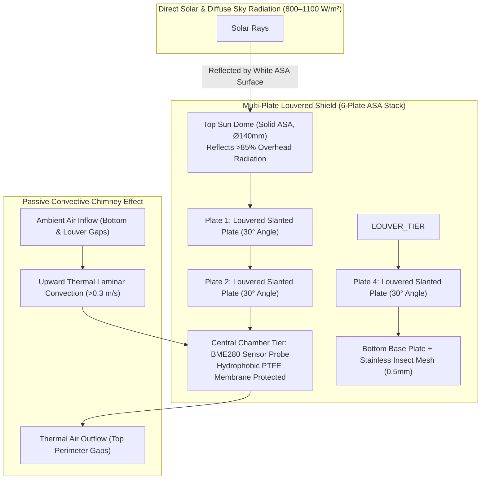

# Solar Radiation Shield & Stevenson Screen Mechanical Design

## 1. Overview & Meteorological Necessity

In tropical and subtropical tea plantations, daytime solar insolation reaches peak levels of **$800\text{–}1100\text{ W/m}^2$**. 

An unshielded or poorly ventilated temperature and humidity sensor exposed to direct sunlight absorbs radiant heat, causing a severe positive temperature bias of **$+3.0^\circ\text{C}$ to $+8.0^\circ\text{C}$** above true ambient air temperature.

### Impact on Microclimate Rainfall Nowcasting
Because saturation vapor pressure $e_s(T)$ grows exponentially with temperature:
- A $+4^\circ\text{C}$ solar heating error falsely deflates measured relative humidity from **$92\%$ (approaching rain saturation) down to $71\%$ (dry air)**.
- This creates massive false negative errors in the dew point depression and Zambretti prediction models.

To eliminate radiation errors, the **Bosch BME280** probe is housed within an engineered **Multi-Plate Passively Aspirated Solar Radiation Shield**.

---

## 2. Multi-Plate Shield Architecture & Convective Dynamics



---

## 3. Physical Specifications & Material Properties

### 3.1 Material Selection: UV-Stabilized ASA vs ABS / Polycarbonate
- **Selected Material**: **Acrylonitrile Styrene Acrylate (ASA)** or high-impact UV-stabilized Polycarbonate.
- **Solar Reflectivity**: Pure white high-albedo formulation with solar reflectance index **$\text{SRI} > 85\%$** in the visible spectrum ($400–700\text{ nm}$).
- **Thermal Infrared Emissivity**: High thermal emissivity **$\epsilon > 0.90$** in the thermal infrared band ($8–14\,\mu\text{m}$), allowing the plates to efficiently radiate absorbed heat into the sky rather than conducting it inward.
- **Degradation Resistance**: Resists yellowing, brittleness, high humidity, and acidic pesticide mists over a **$10+\text{ year}$ field life**.

---

### 3.2 Mechanical Dimensions & Louver Geometry

| Shield Component | Dimension / Specification | Engineering Purpose |
| :--- | :--- | :--- |
| **Top Dome Plate** | $\varnothing 140\text{ mm} \times 3.0\text{ mm}$ thickness | Shingles the entire stack from overhead noon solar radiation. |
| **Louvered Plates (6x)**| $\varnothing 130\text{ mm}$ outer diameter, $\varnothing 60\text{ mm}$ central opening | $30^\circ$ downward conical slope blocks line-of-sight sunlight from all solar azimuths. |
| **Vertical Plate Pitch** | $14.0\text{ mm}$ gap between adjacent plates | Optimizes airflow intake while preventing direct horizontal solar penetration. |
| **Central Chamber** | $\varnothing 50\text{ mm} \times 80\text{ mm}$ vertical cylinder | Provides an unobstructed laminar convection channel for the BME280 probe. |
| **Tie Rods** | 3x M4 Stainless Steel (SS304) threaded rods with nylon locknuts | Clamps the multi-plate stack rigidly against high estate wind gusts ($> 120\text{ km/h}$). |
| **Insect Screen** | SS304 woven wire mesh ($0.5\text{ mm}$ aperture) | Prevents spiders, ants, and wasps from nesting inside the sensor chamber. |

---

## 4. Passive Aspiration & Rain Splash Protection

### 4.1 Chimney Effect (Convective Aspiration)
Even during dead-calm atmospheric conditions (wind speed $< 0.3\text{ m/s}$), natural thermal convection creates a steady upward draft:
1. Solar rays warm the exterior surface of the upper louvered plates.
2. The warmed air at the top of the chamber becomes buoyant and exhausts through the upper perimeter gaps.
3. Cooler ambient air from below is pulled continuously upward through the bottom mesh and across the BME280 probe at a rate of **$0.2\text{–}0.5\text{ m/s}$**, ensuring continuous ambient thermodynamic coupling.

### 4.2 Rain Splash & Fog Baffle
Highland tea plantations experience intense torrential monsoon rains ($> 50\text{ mm/hr}$):
- **Overlapping Conical Lips**: Each plate's outer lip extends $15\text{ mm}$ past the lower plate's intake gap, shedding dripping water away from the central aspiration column.
- **Inverted Internal Cup**: An internal secondary splash shield deflects rebounding water droplets, ensuring the BME280 PTFE sensor membrane remains free of liquid water deposition.

---

## 5. Mounting & Sensor Probe Placement

```
                  [Top Sun Dome Plate]
              ┌───────────────────────────┐
              │                           │
          ════╪═══════════════════════════╪════  (Plate 1)
              │                           │
          ════╪═══════════════════════════╪════  (Plate 2)
              │    ┌─────────────────┐    │
          ════╪════│  BME280 PROBE   │════╪════  (Plate 3 - SENSOR CORE)
              │    │  (Vertical)     │    │
          ════╪════│                 │════╪════  (Plate 4)
              │    └────────┬────────┘    │
          ════╪═════════════╪═════════════╪════  (Plate 5)
              │      [Shielded Cable]     │
          ════╧═══════════════════════════╧════  (Bottom Plate + Insect Mesh)
                     │             │
                     └──[SS304 M4]─┘
```

- **Optimal Probe Positioning**: The BME280 sensor IC must be positioned vertically in the exact geometric center of **Plate Tier 3** (third plate from the top). This ensures maximal distance from both the sun-warmed top dome and the bottom ground-reflected radiation.
- **Mast Clearance**: The shield assembly must be mounted on a horizontal extension arm at least **$0.5\text{m}$ away from the vertical mast pole** to prevent thermal conduction or wake turbulence from the mast itself.
