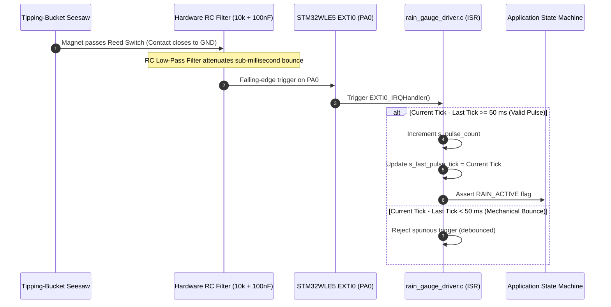

# Tipping-Bucket Rain Gauge & Pulse Counter Driver

## 1. Overview & Sensor Role

The **Tipping-Bucket Rain Gauge** serves as the **ground-truth validation instrument** and immediate precipitation recorder in the **Tea Plantation Rain Prediction System**.

### Primary Meteorological Functions
1. **Precipitation Accumulation**: Measures continuous rainfall rate ($\text{mm/hr}$) and cumulative daily volume ($\text{mm}$) across estate management zones.
2. **Ground-Truth Calibration**: Provides factual verification data to evaluate the accuracy of the on-chip predictive algorithms (Zambretti heuristics and pressure/humidity trend models).
3. **Rain-in-Progress State Latching**: Immediately transitions the node into the `RAIN_ACTIVE` telemetry state upon detecting the first physical bucket tip.

---

## 2. Mechanical Physics & Calibration Constant

### 2.1 Tipping Mechanism
The gauge funnel channels collected rainwater into a precision balanced dual-chamber seesaw bucket:
- **Calibrated Volume**: Each bucket chamber fills to exactly $0.20\text{ mm}$ (or $0.10\text{ mm}$ depending on funnel diameter) of equivalent precipitation before tipping.
- **Tip Event**: The seesaw swings, dumping the water through the drainage base and sweeping an internal neodymium magnet past a sealed magnetic reed switch.

$$\text{Rainfall Depth } (\text{mm}) = N_{\text{tips}} \times K_{\text{gauge}}$$

$$\text{Standard Metric Calibration: } K_{\text{gauge}} = 0.20\text{ mm per tip}$$

---

## 3. Hardware Interfacing & Debouncing Circuit



### 3.1 Dual-Stage Noise Rejection
Mechanical reed switches exhibit contact chatter lasting $1\text{–}15\text{ ms}$ on impact:
1. **Stage 1 (Hardware RC Filter)**: A $10\,\text{k}\Omega$ pull-up resistor and $100\,\text{nF}$ ceramic capacitor filter out high-frequency contact bounce spikes ($\tau = 1.0\text{ ms}$).
2. **Stage 2 (Software ISR Lockout)**: A non-blocking $50\text{ ms}$ software window rejects any secondary triggers occurring within $50\text{ ms}$ of a valid tip.

---

## 4. Firmware Driver Architecture & Data Structures

Implemented in [`firmware/drivers/src/rain_gauge_driver.c`](file:///C:/Users/ENERGY%20SAVER/Documents/Learning/Job%20Projects/rain-predict/firmware/drivers/src/rain_gauge_driver.c):

```c
#include "rain_gauge_driver.h"

#define RAIN_BUCKET_CALIB_MM        0.20f   /* mm of rain per tip */
#define RAIN_DEBOUNCE_MIN_MS        50      /* Minimum ms between valid tips */

static volatile uint32_t s_interval_tips = 0;
static volatile uint32_t s_hourly_tips = 0;
static volatile uint32_t s_daily_tips = 0;
static volatile uint32_t s_last_pulse_tick = 0;

/**
 * @brief EXTI0 Interrupt Service Routine (called from stm32wlxx_it.c).
 */
void rain_gauge_isr_handler(uint32_t current_tick_ms)
{
    /* Enforce 50 ms software lockout */
    if ((current_tick_ms - s_last_pulse_tick) >= RAIN_DEBOUNCE_MIN_MS) {
        s_interval_tips++;
        s_hourly_tips++;
        s_daily_tips++;
        s_last_pulse_tick = current_tick_ms;
    }
}

/**
 * @brief Reads and clears the interval rainfall accumulation.
 * @param[out] p_rain_mm Pointer to output float in mm.
 * @return Number of tips registered during the interval.
 */
uint32_t rain_gauge_read_interval(float *p_rain_mm)
{
    uint32_t tips;
    
    /* Atomic read-and-clear */
    __disable_irq();
    tips = s_interval_tips;
    s_interval_tips = 0;
    __enable_irq();

    if (p_rain_mm != NULL) {
        *p_rain_mm = ((float)tips) * RAIN_BUCKET_CALIB_MM;
    }
    return tips;
}
```

---

## 5. Ground Truth Verification & Model Performance Metrics

Rain gauge accumulation data is compared against earlier heuristic forecast predictions to generate formal confusion matrix scores:

```
                      Physical Rain Event (Ground Truth)
                       Rain Recorded         No Rain
Predicted    Rain     [True Positive (TP)]  [False Positive (FP)]
Forecast     No Rain  [False Negative (FN)] [True Negative (TN)]
```

### Key Performance Indices
1. **Probability of Detection ($\text{POD}$)**:
   $$\text{POD} = \frac{\text{TP}}{\text{TP} + \text{FN}} \ge 85\% \quad (\text{Target: Detect } >85\% \text{ of actual rain events})$$
2. **False Alarm Ratio ($\text{FAR}$)**:
   $$\text{FAR} = \frac{\text{FP}}{\text{TP} + \text{FP}} \le 20\% \quad (\text{Target: Less than } 20\% \text{ false alarms})$$
3. **Critical Success Index ($\text{CSI}$)**:
   $$\text{CSI} = \frac{\text{TP}}{\text{TP} + \text{FP} + \text{FN}}$$

---

## 6. Field Water Calibration & Maintenance Protocol

For full field operational procedures, see the comprehensive standard operating procedure:
[`docs/calibration/tipping_bucket_calibration_sop.md`](file:///C:/Users/ENERGY%20SAVER/Documents/Learning/Job%20Projects/rain-predict/docs/calibration/tipping_bucket_calibration_sop.md).

### 6.1 Volumetric Calibration Mathematics
For the standard $D = 200.0\text{ mm}$ collector funnel:
- Catch area: $A_{\text{funnel}} = \frac{\pi D^2}{4} = 314.1593\text{ cm}^2$.
- Theoretical water volume per tip ($0.20\text{ mm}$ nominal depth):
  $$V_{\text{tip}} = A_{\text{funnel}} \times 0.020\text{ cm} = \mathbf{6.2832\text{ mL}}\text{ (or grams @ }20^\circ\text{C)}$$
- Expected tips for $500.0\text{ mL}$ water test: $N_{\text{expected}} = \frac{500.0}{6.2832} = \mathbf{79.58\text{ tips}}$.
- Target field tolerance: Volumetric error $|E_{\text{cal}}| \le \pm 2.0\%$ ($78\text{ to }81\text{ tips}$), chamber balance $\le 1\text{ tip}$.

### 6.2 Mechanical Stop Screw Fine Adjustment
- Thread specification: $\text{M3} \times 0.5\text{ mm pitch}$ ($0.50\text{ mm/turn}$).
- $1/8\text{ turn } (45^\circ) \approx \mathbf{0.0075\text{ mm/tip}}$ ($\approx 3.75\%$ adjustment).
- **Clockwise (CW)** raises stop screw $\implies$ tips earlier $\implies$ **decreases volume per tip**.
- **Counter-Clockwise (CCW)** lowers stop screw $\implies$ tips later $\implies$ **increases volume per tip**.

### 6.3 Flash NVM & LoRaWAN Downlink (FPort 10, Cmd `0x05`)
- Persisted in Flash Sector 7 (`0x0803F800`) as `uint16_t calib_factor_um` (e.g. $199\,\mu\text{m} = 0.199\text{ mm/tip}$).
- Re-configurable remotely via 3-byte LoRaWAN Downlink Command `0x05`:
  `[0x05, K_MSB, K_LSB]` (clamped to $[150, 250]\,\mu\text{m/tip}$).
