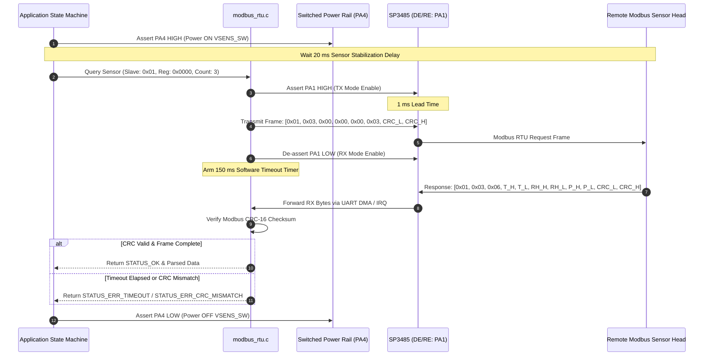
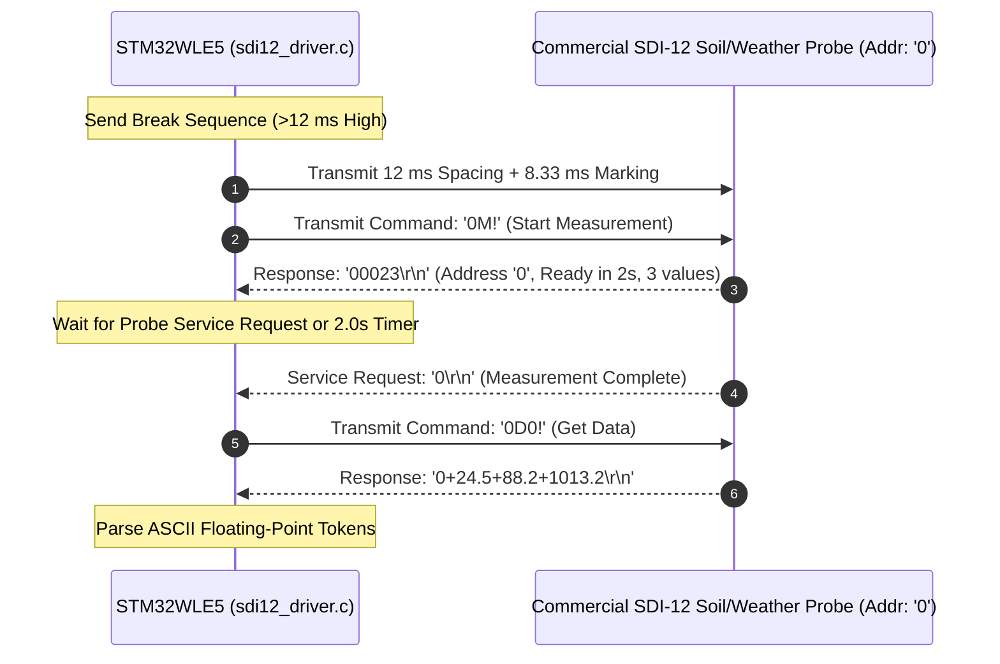

# Remote Field Bus Protocols: RS-485 Modbus RTU & SDI-12

## 1. Overview & Field Deployment Context

In tea estate deployments, the **microclimate sensor probe mast** (installed at crop canopy height in a central clearing) is frequently separated by **$10\text{m}–100\text{m}+$** from the **main controller & LoRa telemetry node** (installed at high elevation for RF line-of-sight and solar exposure).

Standard single-ended buses (such as standard I2C or single-ended UART) cannot tolerate the capacitance, voltage drops, and electromagnetic interference (EMI) typical of long outdoor cables in mountainous tea plantations.

This document details the three remote bus solutions supported by the firmware:
1. **RS-485 Modbus RTU Master** (Primary long-range industrial protocol).
2. **SDI-12 Bus Interface** (Standard 1200-baud agricultural multi-parameter probe bus).
3. **Differential I2C (PCA9615)** (Point-to-point extended I2C over twisted pair up to $30\text{m}$).

---

## 2. RS-485 Modbus RTU Protocol Specification

### 2.1 Physical & Electrical Characteristics
- **Signaling**: Half-duplex differential signaling ($A$ and $B$ lines).
- **Baud Rate**: $9600\text{ bps}$ (Default) or $19200\text{ bps}$, 8 data bits, No parity, 1 stop bit (8-N-1).
- **Direction Control (`RS485_DE_RE`, Pin PA1)**:
  - `PA1 = HIGH`: Transmitter enabled (`DE=1`, `/RE=1`).
  - `PA1 = LOW`: Receiver enabled (`DE=0`, `/RE=0`).
- **Cable Requirement**: Shielded twisted pair (STP, $120\,\Omega$ characteristic impedance) with drain wire grounded at the controller node.

---

### 2.2 Modbus RTU Master Transaction Flow



---

### 2.3 Modbus Request & Response Packet Format

#### Master Query Frame (Read Holding Registers: `0x03`)
$$\begin{array}{|c|c|c|c|c|c|c|c|}
\hline
\text{Slave Addr} & \text{Func Code} & \text{Start Reg Hi} & \text{Start Reg Lo} & \text{Count Hi} & \text{Count Lo} & \text{CRC-16 Lo} & \text{CRC-16 Hi} \\
\hline
\text{0x01} & \text{0x03} & \text{0x00} & \text{0x00} & \text{0x00} & \text{0x03} & \text{0x05} & \text{0xCB} \\
\hline
\end{array}$$

#### Slave Normal Response Frame
$$\begin{array}{|c|c|c|c|c|c|c|c|c|c|c|}
\hline
\text{Slave} & \text{Func} & \text{Byte Count} & \text{T Hi} & \text{T Lo} & \text{RH Hi} & \text{RH Lo} & \text{P Hi} & \text{P Lo} & \text{CRC Lo} & \text{CRC Hi} \\
\hline
\text{0x01} & \text{0x03} & \text{0x06} & \text{0x09} & \text{0x94} & \text{0x22} & \text{0x92} & \text{0x27} & \text{0x94} & \text{0xXX} & \text{0xXX} \\
\hline
\end{array}$$

- $T = \text{0x0994} = 2452 \implies 24.52^\circ\text{C}$
- $RH = \text{0x2292} = 8850 \implies 88.50\%$
- $P = \text{0x2794} = 10132 \implies 1013.2\text{ hPa}$

---

### 2.4 Modbus CRC-16 Calculation Algorithm

Implemented in [`firmware/drivers/src/modbus_rtu.c`](file:///C:/Users/ENERGY%20SAVER/Documents/Learning/Job%20Projects/rain-predict/firmware/drivers/src/modbus_rtu.c):

```c
#include "modbus_rtu.h"

/**
 * @brief Computes standard Modbus RTU CRC-16 (Polynomial: 0xA001, Init: 0xFFFF).
 */
uint16_t modbus_crc16(const uint8_t *p_buffer, uint16_t length)
{
    uint16_t crc = 0xFFFF;

    for (uint16_t pos = 0; pos < length; pos++) {
        crc ^= (uint16_t)p_buffer[pos];

        for (uint8_t i = 8; i != 0; i--) {
            if ((crc & 0x0001) != 0) {
                crc >>= 1;
                crc ^= 0xA001;
            } else {
                crc >>= 1;
            }
        }
    }
    return crc; /* Low-byte sent first in Modbus stream */
}
```

---

## 3. SDI-12 Agricultural Bus Protocol

### 3.1 Overview & Electrical Characteristics
**SDI-12 (Serial Digital Interface at 1200 baud)** is an asynchronous, half-duplex single-wire serial communications protocol widely utilized in commercial agricultural probes:
- **Baud Rate**: $1200\text{ bps}$, 7 data bits, Even parity, 1 stop bit (7-E-1).
- **Signaling Levels**: Inverted NRZ (High $= +5\text{V}$, Low $= 0\text{V}$, Idle $= 0\text{V}$).
- **Bus Lines**: 3-wire cable (12V Power, Ground, Bidirectional Data).

---

### 3.2 SDI-12 Command Transaction Sequence



---

## 4. Differential I2C (PCA9615) Extended Bus

For direct connection of BME280 / OPT3001 sensor heads over intermediate distances ($5\text{m}–30\text{m}$):
- **Transceiver IC**: **NXP PCA9615** differential I2C buffer.
- **Conversion**: Converts single-ended $SCL/SDA$ into two differential twisted pairs ($DSCL+/DSCL-$ and $DSDA+/DSDA-$) using standard Cat5/Cat6 UTP cable.
- **Advantage**: Requires **zero software protocol overhead**; the STM32WLE5 I2C1 peripheral talks directly to remote I2C sensors at up to $400\text{ kHz}$.

---

## 5. Fault Tolerance & Timeout Enforcement

To guarantee that field cable issues (such as tea plucker damage, animal chewing, or water ingress) never crash or hang the microcontroller:

1. **Guaranteed Bounded Timeouts**:
   - Every Modbus query enforces a hard **$150\text{ ms}$** response timer.
   - Every SDI-12 transaction enforces a hard **$1000\text{ ms}$** response timer.
2. **Defensive Status Return**:
   - If a cable is severed, the driver cleanly returns `STATUS_ERR_TIMEOUT`. The application logs a sensor fault bit in Byte 11 of the telemetry payload and proceeds normally into sleep.
3. **Power Isolation**:
   - When a sensor timeout or bus fault occurs, `PA4` is immediately de-asserted, cutting power to the damaged line to prevent battery drain from shorted wires.
